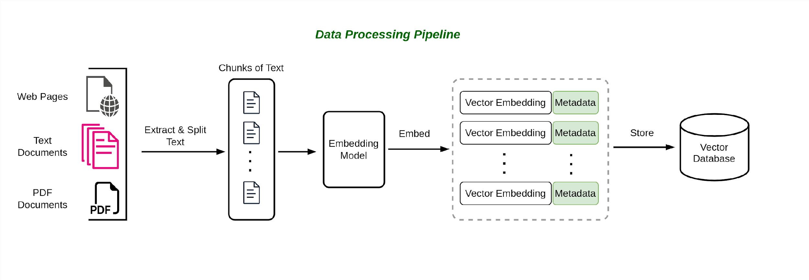

#  Retrieval Augmented Generation (RAG)

> Generative AI, a subset of artificial intelligence, has revolutionized
> the field of text generation. It has paved the way for machines to
> generate human-like text, offering a myriad of benefits in various
> applications. From content creation and chatbots to language
> translation and natural language understanding, generative AI has
> proven to be a powerful tool in the world of natural language
> processing. However, it is essential to recognize that despite its
> remarkable capabilities, generative AI systems have limitations, one
> of which is their reliance on the data they have been trained on to
> generate responses.

## 2.1 The Limitation of Generative AI

> Generative AI models, such as GPT3 (Generative Pre-trained
> Transformer), have been trained on vast datasets containing text from
> the internet. While this training process equips them with a broad
> understanding of language and context, it also introduces limitations.
> These models can only generate text that aligns with the patterns and
> information present in their training data. As a result, their
> responses may not always be accurate or contextually relevant,
> especially when dealing with niche topics or recent developments that
> may not be adequately represented in their training data.

### 2.1.1 Example: Transforming Customer Support with RAG

> Imagine you're the owner of a thriving e-commerce platform, selling a
> wide range of products from electronics to fashion. You've recently
> integrated a chatbot to assist your customers with inquiries, but
> you're starting to see its limitations. Let's explore how
> Retrieval-Augmented Generation (RAG) can help overcome these
> limitations and enhance the customer support experience.
>
> **Limitations of a Traditional Large Language Model (LLM)**
>
> Your existing chatbot is built around a traditional Large Language
> Model (LLM). While it's knowledgeable about general product
> information, your customers are increasingly seeking more specific and
> real-time assistance. Here are some challenges you've encountered:
>
> **Product Availability:** Customers often inquire about the
> availability of specific items, especially during sales or promotions.
> The LLM can provide information based on its training data, but it
> doesn't have access to real-time inventory data.
>
> **Shipping and Delivery:** Customers frequently ask about shipping
> times, tracking information, and potential delays. The LLM can provide
> standard shipping policies, but it can't offer real-time updates on
> the status of an individual order.
>
> **Product Reviews:** Shoppers want to know about recent product
> reviews and ratings to make informed decisions. The LLM lacks access
> to the latest customer reviews and sentiment analysis.

**Promotions and Discounts:** Customers seek information about ongoing
promotions, discounts, and special offers. The LLM can only provide
details based on the data it was trained on, missing out on
time-sensitive deals.

2.2IntroducingRetrievalAugmentedGeneration(RAG)

### 2.1.2 How RAG Transforms Customer Support

> Now, let's introduce RAG into your e-commerce customer support system:
>
> Retrieval of Real-Time Data: With RAG, your chatbot can connect to
> your ecommerce platform's databases and data warehouses in real-time.
> It can retrieve the latest information about product availability,
> stock levels, and shipping status.
>
> **Incorporating User Reviews:** RAG can scrape and analyze customer
> reviews and ratings from your website, social media, and other
> sources. It can then generate responses that include recent reviews,
> helping customers make informed choices.

**Dynamic Promotions:** RAG can access your promotion database and
provide up-to-the-minute details about ongoing discounts, flash sales,
and limited-time offers. It can even suggest personalized promotions
based on a user's browsing history.

> **Order Tracking:** RAG can query your logistics system to provide
> customers with real-time tracking information for their orders. It can
> also proactively notify customers of any delays or issues.

## 2.2 Introducing Retrieval Augmented Generation (RAG)

> To address the limitation of generative AI, researchers and engineers
> have developed innovative approaches, one of which is the Retrieval
> Augmented Generation (RAG) approach. RAG initially caught the interest
> of generative AI developers following the release of a seminal paper
> titled "*Retrieval-Augmented Generation for Knowledge-Intensive NLP
> Tasks*" (Lewis et al. 2020) at Facebook AI Research. RAG combines the
> strengths of generative AI with retrieval techniques to enhance the
> quality and relevance of generated text. Unlike traditional generative
> models that rely solely on their internal knowledge, RAG incorporates
> an additional step where it retrieves information from external
> sources, such as databases, documents, or the web, before generating a
> response. This integration of retrieval mechanisms empowers RAG to
> access up-to-date information and context, making it particularly
> valuable for applications where accurate and current information is
> critical.
>
> In this chapter, we will delve deeper into the Retrieval Augmented
> Generation (RAG) approach, exploring its architecture, advantages, and
> real-world applications. By doing so, we will gain a better
> understanding of how RAG represents a significant step forward in
> improving the capabilities of generative AI and overcoming the
> limitations posed by reliance on static training data. Understanding
> the key concepts and components of this approach is essential for
> building an effective chat-to-PDF app.

### 2.2.1 Key Concepts and Components

> To grasp the essence of Retrieval-Augmented Generation, let's explore
> its key concepts and components:

1.  **Retrieval Component:** The retrieval component is responsible for
    searching and selecting relevant information from a database or
    corpus of documents. This component utilizes techniques like
    document indexing, query expansion, and ranking to identify the most
    suitable documents based on the user's query.

2.  **Generation Component:** Once the relevant documents are retrieved,
    the generation component takes over. It leverages Large Language
    Models (LLMs) such as GPT-3 to process the retrieved information and
    generate coherent and contextually accurate responses. This
    component is responsible for converting retrieved facts into
    human-readable answers.

3.  **Interaction Loop:** Retrieval-Augmented Generation often involves
    an interaction loop between the retrieval and generation components.
    The

2.2IntroducingRetrievalAugmentedGeneration(RAG)

> initial retrieval may not always return the perfect answer, so the
> generation component can refine and enhance the response iteratively
> by referring back to the retrieval results.

4.  **Fine-Tuning:** Successful implementation of this approach often
    requires fine-tuning LLMs on domain-specific data. Fine-tuning
    adapts the model to understand and generate content relevant to the
    specific knowledge domain, improving the quality of responses.

5.  **Latent Space Representations:** Retrieval models often convert
    documents and queries into latent space representations, making it
    easier to compare and rank documents based on their relevance to a
    query. These representations are crucial for efficient retrieval.

6.  **Attention Mechanisms:** Both the retrieval and generation
    components typically employ attention mechanisms. Attention
    mechanisms help the model focus on the most relevant parts of the
    input documents and queries, improving the accuracy of responses.

### 2.2.2 How It Improves Question Answering

> The Retrieval-Augmented Generation approach offers several advantages
> for question answering:

1.  **Access to a Wide Knowledge Base:** By integrating retrieval, the
    system can access a vast knowledge base, including large document
    collections. This enables the model to provide answers that may not
    be present in its pre-training data, making it highly informative.

2.  **Contextual Understanding:** The generation component uses the
    context provided by the retrieval results to generate answers that
    are not only factually accurate but also contextually relevant. This
    contextual understanding leads to more coherent and precise
    responses.

3.  **Iterative Refinement:** The interaction loop between retrieval and
    generation allows the system to iteratively refine its responses. If
    the initial response is incomplete or incorrect, the generation
    component can make further inquiries or clarifications based on the
    retrieval results, leading to improved answers.

4.  **Adaptability to Diverse Queries:** Retrieval-Augmented Generation
    can handle a wide range of user queries, including complex and
    multifaceted questions. It excels in scenarios where simple
    keyword-based search engines may fall short.

5.  **Fine-Tuning for Specific Domains:** By fine-tuning the model on
    domain-specific data, you can tailor it to excel in particular
    knowledge domains. This makes it a valuable tool for specialized
    question answering tasks, such as legal or medical consultations.

> In summary, Retrieval-Augmented Generation is a dynamic approach that
> combines the strengths of retrieval and generation to provide
> accurate, contextually relevant, and informative answers to user
> queries. Understanding its key components and advantages is essential
> as we move forward in building our chatto-PDF app, which will leverage
> this approach to enhance question answering over PDF documents.

## 2.3 RAG Architecture

> At its core, RAG is a framework that synergizes two vital components:
>
> **Retrieval Model:** This component specializes in searching and
> retrieving relevant information from extensive datasets, such as
> documents, articles, or databases. It identifies passages or documents
> that contain information related to a user's query.
>
> **Generation Model:** On the other hand, the generation model excels
> in crafting coherent and contextually rich responses to user queries.
> It's often based on large language models (LLMs) like GPT-3, which can
> generate human-like text.
>
> Figure 2.1 shows the RAG architecture.

2.3RAGArchitecture

{width="5.08923665791776in"
height="3.4895833333333335in"}

> Figure 2.1: RAG architechture

## 2.4 Building the Retrieval System

> In this section, we will focus on building the retrieval system, a
> critical component of the chat-to-PDF app that enables the extraction
> of relevant information from PDF documents. This section is essential
> for implementing the RetrievalAugmented Generation approach
> effectively.

### 2.4.1 Choosing a Retrieval Model

> Choosing the right retrieval model is a crucial decision when building
> your chat-to-PDF app. Retrieval models determine how efficiently and
> accurately the system can find and rank relevant documents in response
> to user queries. Here are some considerations when selecting a
> retrieval model:

-   **TF-IDF (Term Frequency-Inverse Document Frequency):** TF-IDF is a
    classical retrieval model that calculates the importance of terms in
    a document relative to a corpus. It's simple to implement and
    effective for certain tasks.

-   **BM25:** BM25 is an improved version of TF-IDF that accounts for
    document length and term saturation. It's often more effective in
    modern retrieval tasks.

-   **Vector Space Models:** These models represent documents and
    queries as vectors in a high-dimensional space. Cosine similarity or
    other distance metrics are used to rank documents. Implementations
    like Latent Semantic Analysis (LSA) and Word Embeddings (e.g.,
    Word2Vec) can be used.

-   **Neural Ranking Models:** Modern neural models, such as BERT-based
    models, are increasingly popular for retrieval tasks due to their
    ability to capture complex semantic relationships. They can be
    fine-tuned for specific tasks and domains.

-   **Hybrid Models:** Combining multiple retrieval models, such as a
    combination of TF-IDF and neural models, can offer the benefits of
    both approaches.

2.5EmbeddingsandVectorDatabasesforRetrievalinRAG

-   **Domain and Data Size:** Consider the specific requirements of your
    chatto-PDF app. Some retrieval models may be more suitable for small
    or specialized document collections, while others excel in handling
    large, diverse corpora.

-   **Scalability:** Ensure that the chosen retrieval model can scale to
    meet the needs of your application, especially if you anticipate
    handling a substantial volume of PDF documents.

## 2.5 Embeddings and Vector Databases for Retrieval in RAG

> In addition to selecting an appropriate retrieval model, leveraging
> embeddings and vector databases can significantly enhance the
> performance and efficiency of the retrieval component within your
> chat-to-PDF app. Vector embeddings are a fundamental concept in modern
> information retrieval and natural language processing. They transform
> textual data into numerical vectors, enabling computers to understand
> and manipulate text data in a mathematical, geometric space. These
> embeddings capture semantic and contextual relationships between
> words, documents, or other textual entities, making them highly
> valuable in various applications, including the retrieval component of
> Retrieval Augmented Generation (RAG).

### 2.5.1 Vector Embeddings: An Overview

> Vector embeddings represent words, phrases, sentences, or even entire
> documents as points in a high-dimensional vector space. The key idea
> is to map each textual element into a vector in such a way that
> semantically similar elements are located close to each other in this
> space, while dissimilar elements are further apart. This geometric
> representation facilitates similarity calculations, clustering, and
> other operations.
>
> Examples of Vector Embeddings:

1.  **Word Embeddings (Word2Vec, GloVe):** Word embeddings represent
    individual words as vectors. For example, "king" and "queen" may be
    represented as vectors that are close together in the vector space
    because they share similar semantic properties.

2.  **Document Embeddings (Doc2Vec, BERT):** Document embeddings map
    entire documents (such as PDFs) into vectors. Two documents
    discussing similar topics will have embeddings that are close in the
    vector space.

> There are abundent of tutorials and resources that can help you learn
> more about vector embeddings. Here are some resources that can help
> you get started:

-   Vector Embeddings Explained

-   Google Vector embeddings

-   What are vector embeddings

### 2.5.2 Vector Databases and Their Role in Enhancing Retrieval

> Vector databases, also known as similarity search engines or vector
> index databases, play a crucial role in the retrieval component of RAG
> by efficiently storing and retrieving these vector embeddings. They
> are specialized databases designed for retrieving vectors based on
> similarity, making them well-suited for scenarios where similarity
> between data points needs to be calculated quickly and accurately.
>
> How Vector Databases Enhance Retrieval in RAG:

1.  **Fast Retrieval:** Vector databases employ indexing structures
    optimized for similarity search. They use algorithms like
    approximate nearest neighbor (ANN) search to quickly locate the most
    similar vectors, even in large datasets containing numerous
    documents.

2.5EmbeddingsandVectorDatabasesforRetrievalinRAG

2.  **Scalability:** Vector databases can efficiently scale as the
    corpus of documents grows. This ensures that retrieval performance
    remains consistent, regardless of the dataset's size.

3.  **Advanced Similarity Scoring:** These databases offer a range of
    similarity metrics, such as cosine similarity or Jaccard index,
    allowing you to fine-tune the relevance ranking of retrieved
    documents based on your specific requirements.

4.  **Integration with Retrieval Models:** Vector databases can be
    seamlessly integrated into your retrieval system. They complement
    retrieval models like TF-IDF, BM25, or neural ranking models by
    providing an efficient means of candidate document selection based
    on vector similarity.

> All of these factors has resulted in numerous new vector databases.
> Selecting and depending on one of these databases can have
> long-lasting consequences and dependencies within your system.
> Ideally, we opt for a vector database that exhibits strong
> scalability, all while maintaining cost-efficiency and minimizing
> latency. Some of these vector databases are: Qdrant, Weaviate,
> Pinecone, pgvector, Milvus, and Chroma.
>
> {width="4.8567322834645665in"
> height="2.1673359580052494in"}
>
> Figure 2.2: Vector databases comparison. Image source

6.  **RAG Data Ingestion Pipeline**

> Before your Chat-to-PDF app can effectively retrieve information from
> a vector database, it's imperative to preprocess the PDF documents and
> create a structured and searchable index for the preprocessed data.
> This searchable index serves as the cornerstone of your application,
> akin to a meticulously organized library catalog. It empowers your
> system to swiftly and accurately locate relevant information within
> PDF documents, enhancing the efficiency and precision of the retrieval
> process.
>
> Figure 2.3 illustrates the RAG data ingestion pipeline. in Chapter 3,
> we will fully discuss how to prepare, index, and store the documents
> in a vector database.
>
> {width="4.857162073490814in"
> height="1.6858803587051618in"}
>
> Figure 2.3: RAG data ingestion pipeline

7.  **Challenges of Retrieval-Augmented Generation**

> The adoption of Retrieval-Augmented Generation (RAG) represents a
> significant advancement in natural language processing and information
> retrieval. However, like any complex AI system, RAG presents a set of
> challenges that must be addressed to fully harness its potential. In
> this section, we explore some of the key challenges associated with
> RAG.
>
> 2.7ChallengesofRetrieval-AugmentedGeneration
>
> **2.7.1 Data Quality and Relevance**
>
> RAG heavily relies on the availability of high-quality and relevant
> data for both retrieval and generation tasks. Challenges in this area
> include:

-   **Noisy Data:** Incomplete, outdated, or inaccurate data sources can
    lead to retrieval of irrelevant information, impacting the quality
    of generated responses.

-   **Bias and Fairness:** Biases present in training data may lead to
    biased retrieval and generation, perpetuating stereotypes or
    misinformation.

#### 2.7.2 Integration Complexity

> Integrating retrieval and generation components seamlessly is
> non-trivial, as it involves bridging different architectures and
> models. Challenges include:

-   **Model Compatibility:** Ensuring that the retrieval and generation
    models work harmoniously, especially when combining traditional
    methods (e.g., TF-IDF) with neural models (e.g., GPT-3).

-   **Latency and Efficiency:** Balancing the need for real-time
    responsiveness with the computational resources required for
    retrieval and generation.

#### 2.7.3 Scalability

> Scaling RAG systems to handle large volumes of data and user requests
> can be challenging:

-   **Indexing Efficiency:** As the document corpus grows, maintaining
    an efficient and up-to-date index becomes crucial for retrieval
    speed.

-   **Model Scaling:** Deploying large-scale neural models for both
    retrieval and generation may require substantial computational
    resources.

#### 2.7.4 Evaluation Metrics

> Evaluating the performance of RAG systems presents difficulties:

-   **Lack of Gold Standards:** In some cases, there may be no clear
    gold standard for evaluating the relevance and quality of retrieved
    documents.

-   **Diverse User Needs:** Users have diverse information needs, making
    it challenging to develop universal evaluation metrics.

#### 2.7.5 Domain Adaptation

> Adapting RAG systems to specific domains or industries can be complex:

-   **Domain-Specific Knowledge:** Incorporating domain-specific
    knowledge and jargon into retrieval and generation.

-   **Training Data Availability:** The availability of domain-specific
    training data for fine-tuning models.

> Addressing these challenges is essential to unlock the full potential
> of RAG in various applications, from question answering to content
> generation. As research and development in this field continue,
> finding innovative solutions to these challenges will be critical for
> building robust and reliable RAG systems that deliver accurate,
> relevant, and trustworthy information to users.
>
> As we conclude our exploration of the foundations and the retrieval
> component of Retrieval-Augmented Generation (RAG) systems in this
> Chapter, we now turn our attention to the practical implementation of
> RAG pipelines in Chapter 3. In this next chapter, we'll delve into the
> nitty-gritty details of how these systems come to life, starting with
> the preprocessing of PDF documents and the data ingestion pipeline.
> We'll also discuss the generation components that make RAG systems
> work. Further, Chapter 3 explores the impact of text splitting methods
> on RAG quality and the crucial role of metadata in enhancing the
> overall RAG experience.