# From Simple to Advanced RAG

> **4.1 Introduction**
>
> As we traverse the path from development to production, the world of
> Retrieval Augmented Generation (RAG) applications unveils its
> potential to transform the way we interact with vast collections of
> information. In the preceding chapters, we've laid the groundwork for
> building RAG systems that can answer questions, provide insights, and
> deliver valuable content. However, the journey is far from over.
>
> *Please note that LlamaIndex framework has been used for several of
> the code implementations in this chapter. This framework also contains
> a lot of advanced tutorials about RAG that inspired the content of
> this chapter.*
>
> The transition from a well-crafted RAG system in the development
> environment to a real-world production application is a monumental
> step, one that demands careful consideration of a myriad of factors
> and deals with limitations of existing approaches. These
> considerations ensure your RAG application operates seamlessly in a
> real-world production environment. There are so many challenges and
> consideration for building *production-ready* RAG. Nevertheless, we
> will discuss some of the primary ones.
>
> RAG pipeline consists of two components: i) Retrieval and, ii)
> response generation (synthesis). Each component has its own
> challenges.

#### Retrieval Challenges

-   **Low precision:** When retrieving the top-k chunks, there's a risk
    of including irrelevant content, potentially leading to issues like
    hallucination and generating inaccurate responses.

-   **Low recall:** In certain cases, even when all the relevant chunks
    are retrieved, the text chunks might lack the necessary global
    context beyond the retrieved chunks to generate a coherent response.

-   **Obsolete information:** Ensuring the data remains up-to-date is
    critical to avoid reliance on obsolete information. Regular updates
    are essential to maintain data relevance and accuracy.

#### Generation Challenges

-   **Hallucination:** The model generates responses that include
    information not present in the context, potentially leading to
    inaccuracies or fictional details.

-   **Irrelevance:** The model produces answers that do not directly
    address the user's question, resulting in responses that lack
    relevance or coherence.

-   **Bias:** The model generates answers that contai n harmful or
    offensive content, potentially reflecting biases and undermining
    user trust and safety.

#### What Can be done

> In order to effectively tackle the challenges in Retrieval Augmented
> Generation (RAG) systems, several key strategies can be employed:

1.  **Data Augmentation:** Can we enrich our dataset by storing
    supplementary information beyond raw text chunks, such as metadata
    or structured data, to provide richer context for retrieval and
    generation processes?

2.  **Optimized Embeddings:** Can we refine and enhance our embedding
    representations to capture context more effectively, improve the
    relevance of retrieved information, and enable more coherent
    response generation?

3.  **Advanced Retrieval Techniques:** Can we go beyond basic top-k
    embedding lookup and implement advanced retrieval methods, such as
    semantic search, or hybrid search (keyword search + semantic search)
    to enhance the precision and recall of information retrieval?

4.  **Multi-Purpose Use of LLMs:** Can we leverage Large Language Models
    (LLMs) for tasks beyond text generation, such as question answering,
    summarization, or knowledge graph construction, to augment the
    capabilities of RAG systems and provide more comprehensive responses
    to user queries?

> Let's dive in a bit more deeply into aforementioned challenges and
> propose how to alleiviate each one.
>
> **4.2 Optimal Chunk Size for Efficient Retrieval**
>
> The chunk size in a RAG system is the size of the text passages that
> are extracted from the source text and used to generate the retrieval
> index. The chunk size has a significant impact on the system's
> efficiency and performance in several ways:

#### 4.2.1 Balance Between Context and Efficiency

> The chunk size should strike a balance between providing sufficient
> context for generating coherent responses (i.e. Relevance and
> Granularity) and ensuring efficient retrieval and processing (i.e
> Performance).
>
> A smaller chunk size results in more granular chunks, which can
> improve the relevance of the retrieved chunks. However, it is
> important to note that the most relevant information may not be
> contained in the top retrieved chunks, especially if the
> *similarity_top_k* setting is low (e.g. k=2). A smaller chunk size
> also results in more chunks, which can increase the system's memory
> and processing requirements.
>
> A larger chunk size can improve the system's performance by reducing
> the number of chunks that need to be processed. However, it is
> important to note that a larger chunk size can also reduce the
> relevance of the retrieved chunks.
>
> The optimal chunk size for a RAG system depends on a number of
> factors, including the size and complexity of the source text, the
> desired retrieval performance, and the available system resources.
> However, it is important to experiment with different chunk sizes to
> find the one that works best for your specific system. But, how do we
> know what works and what doesn't?
>
> **Question:** *How can we measure the performance of RAG?*
>
> **Answer:** We have to define evaluation metrics and then use
> evaluation tools to measure how the RAG performs considering the
> metrics. There are several tools to evaluate the RAG including
> LlamaIndex **Response Evaluation** module to test, evaluate and choose
> the right *chunk size*. It contains a few components, particularly:

1.  **Faithfulness Evaluator:** This tool assesses whether the response
    includes fabricated information and determines if the response
    aligns with any source nodes from the query engine.

2.  **Relevancy Evaluator:** This tool gauges whether the response
    effectively addresses the query and evaluates if the combined
    information from the response and source nodes corresponds to the
    query.

> The code below shows how to use *Evaluation module* and determine the
> optimal *chunk size* for retrieval. To read the full article, see this
> link.
>
> Figure 4.1 shows the data preparation for evaluation module.

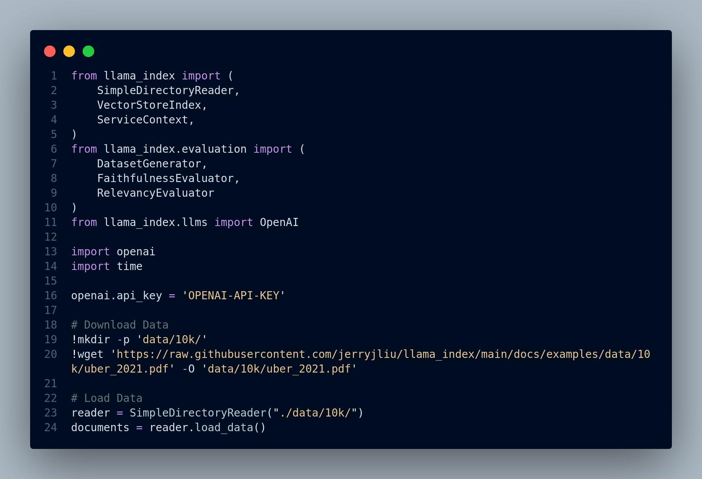{width="4.856896325459317in"
height="3.318076334208224in"}

> Figure 4.1: data preparation for response evaluation
>
> Figure 4.2 displays the criteria to set for evaluation.
>
> 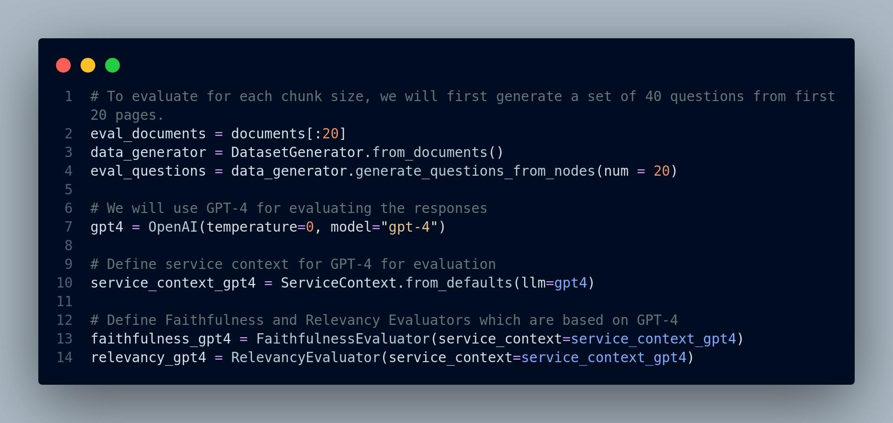{width="4.856896325459317in"
> height="2.302884951881015in"}
>
> Figure 4.2: Define criteria for evaluation
>
> Figure 4.3 shows the evaluation function definition.
>
> And Figure 4.4 demonstrates testing the evaluation function with
> different chunk sizes.
>
> They test across different chunk sizes and conclude (in this
> experiment) that chunk_size = 1024 results in peaking of *Average
> Faithfulness* and *Average Relevancy*.
>
> Here are summary of the tips for choosing the optimal chunk size for a
> RAG system:

-   Consider the size and complexity of the source text. Larger and more
    complex texts will require larger chunk sizes to ensure that all of
    the relevant information is captured.

-   Consider the desired retrieval performance. If you need to retrieve
    the most relevant chunks possible, you may want to use a smaller
    chunk size.

{width="4.856896325459317in"
height="4.536307961504812in"}

> Figure 4.3: Define a function to perform evaluation

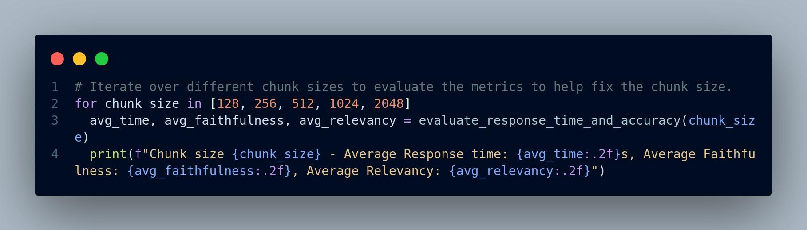{width="4.856896325459317in"
height="1.3892115048118985in"}

> Figure 4.4: Run the evaluation function with different parameters
>
> However, if you need to retrieve chunks quickly, you may want to use a
> larger chunk size.

-   Consider the available system resources. If you are limited on
    system resources, you may want to use a smaller chunk size. However,
    if you have ample system resources, you may want to use a larger
    chunk size. You can evaluate the optimal chunk size for your RAG
    system by using a variety of metrics, such as:

-   **Relevance:** The percentage of retrieved chunks that are relevant
    to the query.

-   **Faithfulness:** The percentage of retrieved chunks that are
    faithful to the source text.

-   **Response time:** The time it takes to retrieve chunks for a query.
    Once you have evaluated the performance of your RAG system for
    different chunk sizes, you can choose the chunk size that strikes
    the best balance between relevance, faithfulness, and response time.

#### 4.2.2 Additional Resources for RAG Evaluation

> Evaluation of RAG applications remains an unsolved problem today and
> is an active research area. Here are just a few references for
> practical evaluation of
>
> RAG: 1. This blog from Databricks has some best practices to evaluate
> RAG applications. Figure 4.5 illustrates what their experiment setup
> looks like.
>
> 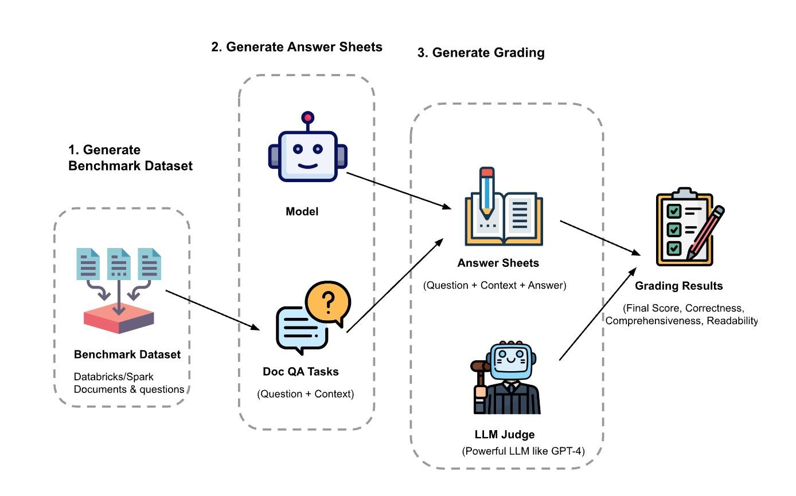{width="4.857096456692913in"
> height="3.0304363517060366in"}
>
> Figure 4.5: Databricks evaluation experiment setup. Image source

2.  Zheng et al. (2023) propose a strong LLMs as judges to evaluate
    these models on more open-ended questions.

3.  RAG Evaluation is another interesting blog that discuss how to use
    Langchain for evaluating RAG applications.

> **4.3 Retrieval Chunks vs. Synthesis Chunks**
>
> Another fundamental technique for enhancing retrieval in Retrieval
> Augmented Generation (RAG) systems is the *decoupling of chunks* used
> for retrieval from those used for synthesis (i.e. response
> generation). The main idea is optimal chunk representation for
> retrieval may not necessarily align with the requirements for
> effective synthesis. While a raw text chunk could contain essential
> details for the LLM to generate a comprehensive response, it might
> also contain filler words or information that could introduce biases
> into the embedding representation. Furthermore, it might lack the
> necessary global context, making it challenging to retrieve the chunk
> when a relevant query is received. To give an example, think about
> having a question answering system on emails. Emails often contain so
> much *fluff* (a big portion of the email is "looking forward", "great
> to hear from you", etc.) and so little information. Thus, retaining
> semantics in this context for better and more accurate question
> answering is very important.
>
> There are a few ways to implement this technique including:

1.  Embed references to text chunks

2.  Expand sentence-level context window

#### 4.3.1 Embed References to Text Chunks

> The main idea here is that, we create an index in the vector database
> for storing document summaries. When a query comes in, we first fetch
> relevant document(s) at the high-level (i.e. summaries) before
> retrieving smaller text chunks directly, because it might retrieve
> irrelavant chunks. Then we can retrieve smaller chunks from the
> fetched document(s). In other words, we store the data in a
> hierarchical fashion: summaries of documents and chunks for each
> document. We can consider this approach as *Dense Hierarchical
> Retrieval*, in which a document-level retriever (i.e. summary index)
> first identifies the relevant documents, and then a passage-level
> retriever finds the relevant passages/chunks. Y. Liu et al. (2021) and
> Zhao et al. (2022) gives you a deep understanding of this approach.
> Figure 4.6 shows how this technique works.
>
> We can choose different strategies based on the type of documents we
> are dealing with. For example, if we have a list of web pages, we can
> consider each page as a *document* that we summarize, and also we
> split each document into a set of

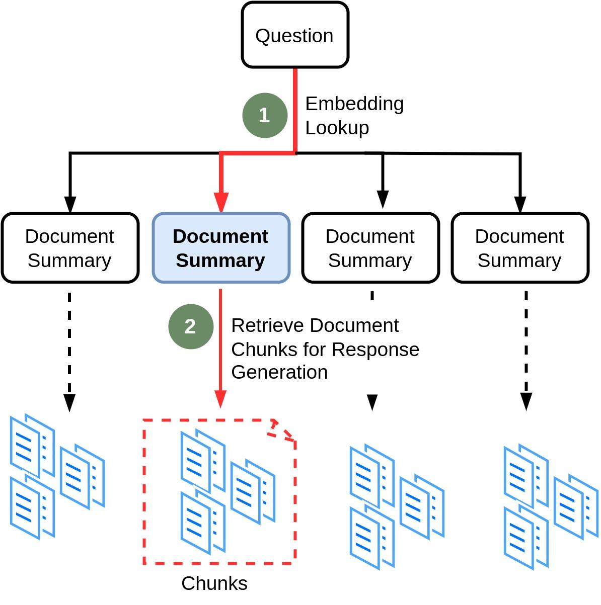{width="3.980129046369204in"
height="4.010131233595801in"}

> Figure 4.6: Document summary index
>
> smaller chunks as the second level of our data store strategy. When
> user asks a question, we first find the relevant page using the
> summary embeddings, and then we can retrieve the relevant chunks from
> that particular page.
>
> If we have a pdf document, we can consider each page of the pdf as a
> separate document, and then split each page into smaller chunks. If we
> have a list of pdf files, we can choose the entire content of each pdf
> to be a document and split the it into smaller chunks.
>
> Let's code it up for our pdf file.

#### Step 1: Read the PDF file

> We read the pdf file, Figure 4.7, and create a list of pages as later
> we will view each page as a separate document.
>
> 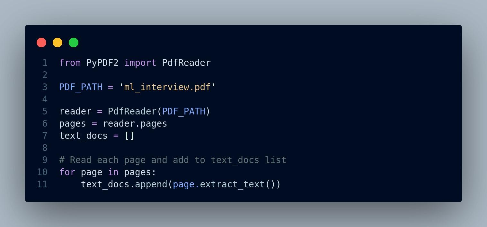{width="4.8571467629046365in"
> height="2.2747845581802273in"}
>
> Figure 4.7: Read a list of documents from each page of the pdf

#### Step 2: Create Document Summary Index

> In order to create an *index*, first we have to convert a list of
> texts into a list of *Document* that is compatible with LlamaIndex.
>
> **Definition:** A Document is a generic container around any data
> source, for instance, a PDF, an API output, or retrieved data from a
> database. It stores text along with some other properties such as
> *metadata* and *relationships (Links to other Documents/Nodes)*
>
> Figure 4.8 shows the code.
>
> We can use the summary index to get the summary of each page/document
> using the document id, for instanc, Figure 4.9 shows the output of a
> summary of a document.

#### Step 3: Retrieve and Generate Response using Document Summary Index

> In this step, when a query comes, we run a retrieval from the document
> summary index to find the relevant pages. Retrieved document has links
> to its corresponding chunks, that are used to generate the final
> response to the query.
>
> There are multiple ways to that in LlamaIndex:

-   High-level query execution

-   LLM based retrieval

-   Embedding based retrieval

> The high-level approach is depicted in Figure 4.10
>
> **LLM based retrieval:** This approach is low-level so we can view and
> change the parameters. Figure 4.11 below displays the code snippet:

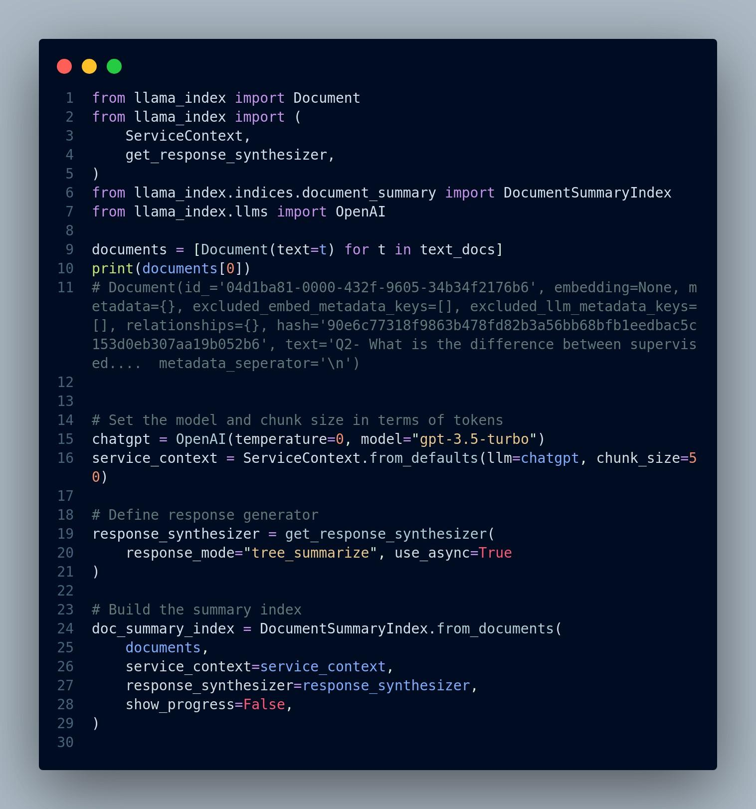{width="4.8571467629046365in"
height="5.196761811023622in"}

> Figure 4.8: Build a document summary index

{width="4.857145669291339in"
height="3.127027559055118in"}

> Figure 4.9: Example of a document summary

{width="4.8571467629046365in"
height="3.24877624671916in"}

> Figure 4.10: High-level query execution approach (default approach)

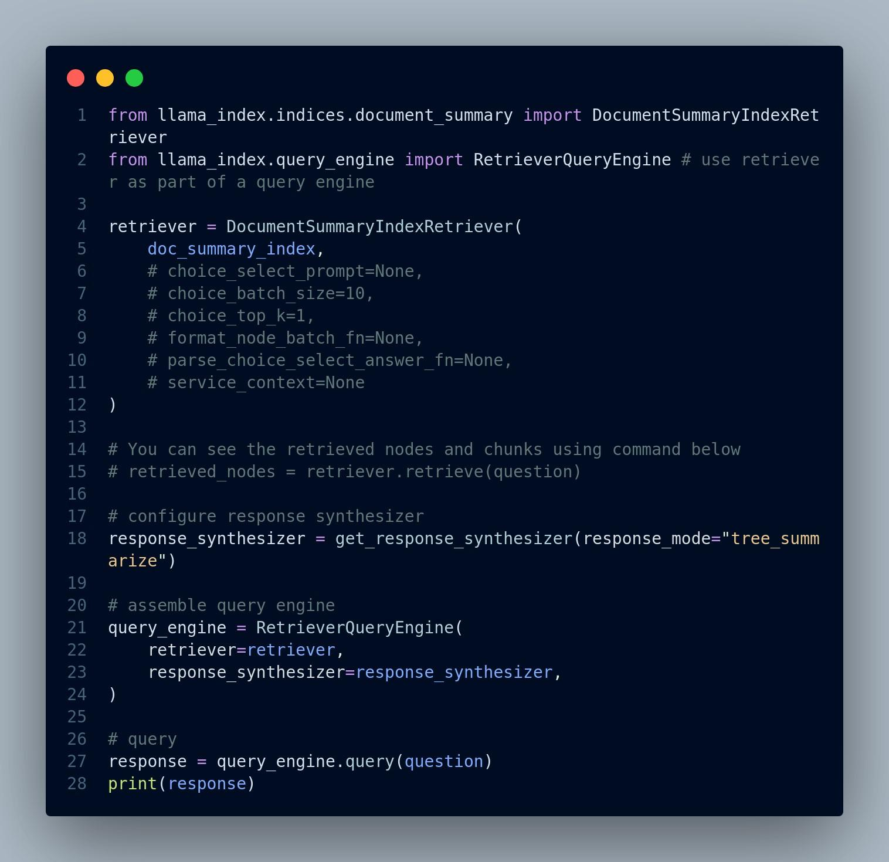{width="4.857145669291339in"
height="4.709764873140857in"}

> Figure 4.11: LLM based retrieval approach
>
> **Embedding based retrieval:** In this technique, we first define
> DocumentSummaryIndexEmbeddingRetriever retriever, and configure the
> response generator to use this retriever. We then, integrate these two
> components into a RetrieverQueryEngine and run that for the query.
> Figure 4.12 shows the code snippet for this approach.

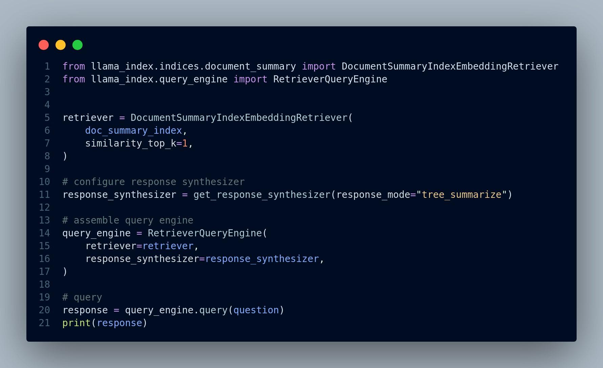{width="4.857020997375328in"
height="2.9709055118110235in"}

> Figure 4.12: Embedding based retrieval

#### 4.3.2 Expand sentence-level context window

> In this approach, we have split the text into sentence level chunks to
> be able to perform fine-grained retrieval. However, before passing the
> fetched sentences to LLM response generator, we include the sentences
> surrounding the retrieved sentence, to enlarge the context window for
> better accuaracy. Please be mindful of *lost in the middle* problem
> when splitting large textual content at a very finegrained level, such
> as sentence-level.
>
> Figure 4.13 illustrates this technique.
>
> {width="4.857282370953631in"
> height="3.0153171478565177in"}
>
> Figure 4.13: Expanding the sentence level context, so LLM has a bigger
> context to use to generate the response

#### Implementation

> Again, we rely on LlamaIndex to implement this technique. We use
> SentenceWindowNodeParser to split document into sentences and save
> each sentence in a node. Node contains a *window* property where we
> can adjust. During the retrieval step, each fetched sentence will be
> replaced with surrounding sentences depending on the window size via
> MetadataReplacementNodePostProcessor function.
>
> Figure 4.14 shows the basic setup such as importing necessary modules,
> reading the pdf file and initializing the LLM and embedding models.

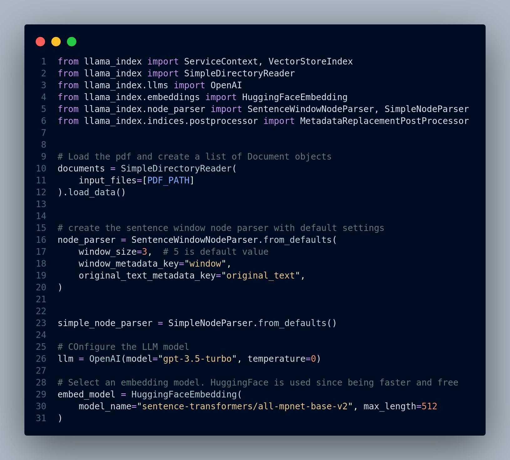{width="4.856916010498687in"
height="4.380162948381452in"}

> Figure 4.14: Basic setup for sentence window implementation Next, we
> have to define nodes that are going to be stored in the VectorIndex as
> well as sentence index. Then, we create a query engine and run the
> query. Figure 4.15 shows the steps.
>
> 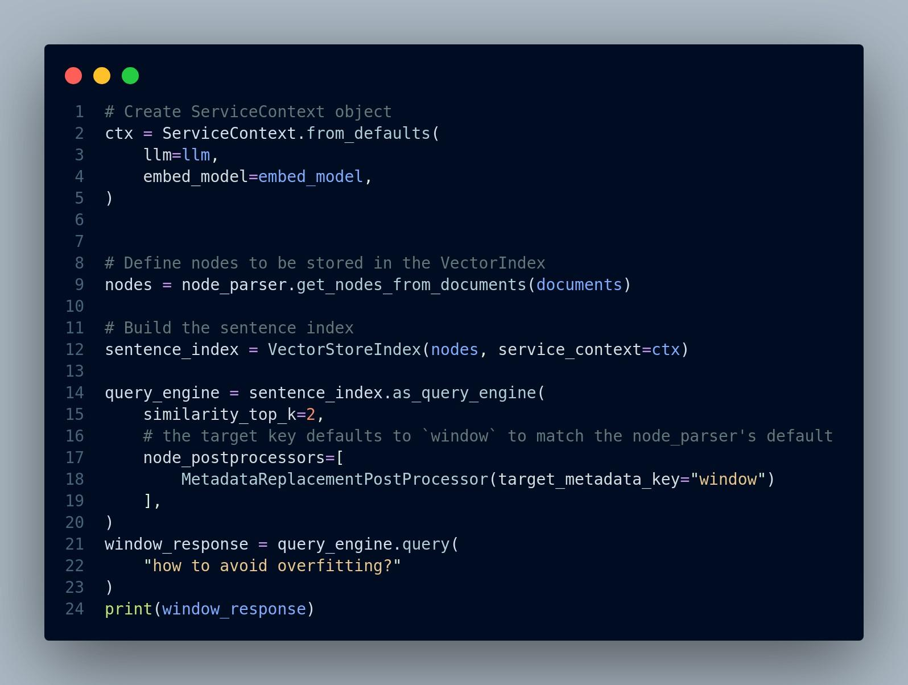{width="4.857076771653543in"
> height="3.664109798775153in"}
>
> Figure 4.15: Build the sentence index, and run the query
>
> Figure 4.16 displays the response output.
>
> We can see the original sentence that is retrieved for each node (we
> show the first node below) and also the actual window of sentences in
> the Figure 4.17.
>
> {width="4.857071303587052in"
> height="2.07992782152231in"}
>
> Figure 4.16: Output of the window response

#### 4.3.3 Lost in the Middle Problem

> Retrieval process in a RAG based application is all about retrieving
> the right and most relevant documents for a given user's query. The
> way we find these documents is that retrieval method assigns a
> relevance score to each document based on their similarity to the
> query. Then, sorts them descendingly and returns them. Nevertheless,
> this approach might not work well when we are returning many documents
> such as top-k \>= 10. The reason is when we pass a very long context
> to LLM, it tend to ignore or overlook the documents in the middle.
> Consequently, putting the least relevant document to the bottom of the
> fetch documents is not the best strategy. A better way is to place the
> least relevant documents in the middle.
>
> N. F. Liu et al. (2023) in Lost in the Middle: How Language Models Use
> Long Contexts demonstrated interesting findings about LLMs behavior.
> They realized that performance of LLMs is typically at its peak when
> relevant information is located at the beginning or end of the input
> context. However, it notably deteriorates when models are required to
> access relevant information buried within the middle of lengthy
> contexts. Figure 4.18 demonstrates the results.

{width="4.8568864829396325in"
height="3.9800349956255467in"}

> Figure 4.17: Original sentence that was retrieved for each node, as
> well as the actual window of sentences

{width="4.857240813648294in"
height="4.51416447944007in"}

> Figure 4.18: Accuracy of the RAG based on the postions of the
> retrieved documents. Image source
>
> They also show that LLMs with longer context windows still face this
> problem and increasing the context window doesn't solve this issue.
> The following demonstrates this experiment.
>
> 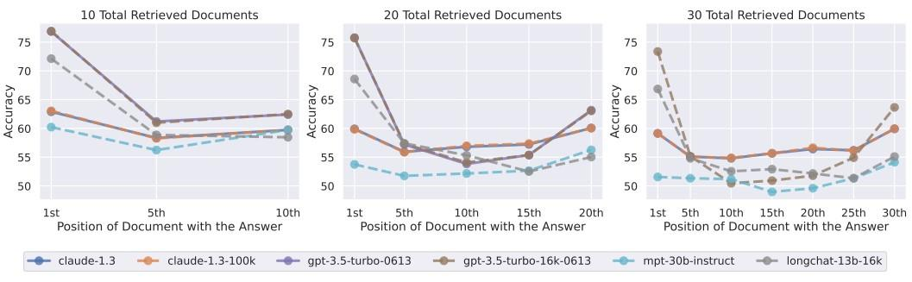{width="4.857154418197725in"
> height="1.5026388888888889in"}
>
> Figure 4.19: Comparing LLM models with various context size and the
> impact of changing the position of relevant documents

**How can we alleviate this problem?** The answer is to reorder the
retrieved documents in such a way that most similar documents to the
query are placed at the top, the less similar documents at the bottom,
and the least similar documents in the middle.

> For implementation, we need a function to get the retrieved documents
> from the retriever and reorder them, i.e. place most relevant
> documents at the beginning and end. Figure 4.20 shows our code.
>
> We can instead utilize Langchain solution: LongContextReorder. It
> essentially implements a similar approach to Figure 4.20 function. You
> can read the documentation for more details.
>
> Figure 4.21 shows how to use Langchain solution to deal with this
> problem.
>
> We can also use Haystack to deal with this problem. Haystack is the
> open source framework for building custom NLP apps with large language
> models (LLMs) in an end-to-end fashion. It offers a few components
> that are building blocks for performing various tasks like document
> retrieval, and summarization. We can connect these components and
> create an end-to-end *pipeline*. The two very

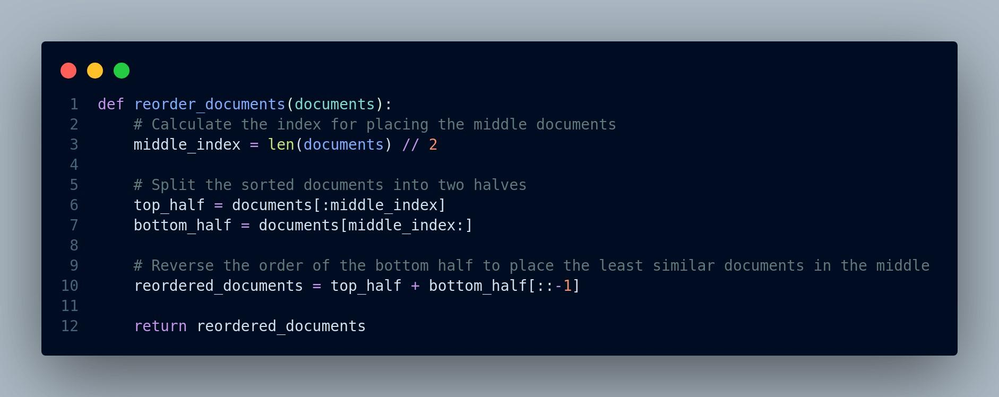{width="4.857168635170604in"
height="1.9304790026246719in"}

> Figure 4.20: Pseudocode of a function to solve lost in the middle
> problem

{width="4.857057086614173in"
height="2.619251968503937in"}

> Figure 4.21: Langchain approach for solving lost in the middle problem
> useful components that we can utilize are *DiversityRanker* and
> *LostInTheMiddleRanker*.
>
> "**DiversityRanker** is designed to maximize the variety of given
> documents. It does so by selecting the most semantically similar
> document to the query, then selecting the least similar one, and
> continuing this process with the remaining documents until a diverse
> set is formed. It operates on the principle that a diverse set of
> documents can increase the LLM's ability to generate answers with more
> breadth and depth."
>
> "**LostInTheMiddleRanker** sorts the documents based on the
>
> "Lost in the Middle" order. The ranker positions the most relevant
> documents at the beginning and at the end of the resulting list while
> placing the least relevant documents in the middle."
>
> Please check their documentation for more details.

#### 4.3.4 Embedding Optimization

> Optimizing embeddings can have a significant impact on the results of
> your use cases. There are various APIs and providers of embedding
> models, each catering to different objectives:

-   Some are best suited for coding tasks.

-   Others are designed specifically for the English language.

-   And there are also embedding models that excel in handling
    multilingual datasets (e.g., Multilingual BERT/mBERT).

> However, determining which embedding model is the best fit for your
> dataset requires an effective evaluation method.

**So which embedding models should we use?**

> One approach is to rely on existing academic benchmarks. However, it's
> important to note that these benchmarks may not fully capture the
> real-world usage of retrieval systems in AI use cases. They are often
> synthetic benchmarks specifically designed for information retrieval
> problems.
>
> For example, there is a benchmark called MTEB (Massive Text Embedding
> Benchmark). MTEB's leaderboard showcases embedding models across 8
> tasks, including multilingual tasks, and currently features 132
> models. You can compare the performance, speed, or both for these
> models (refer to the graph below: Figure 4.22).

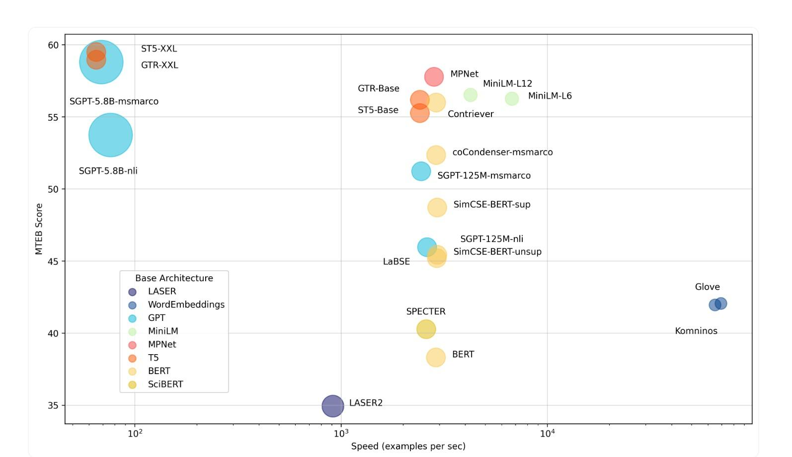{width="4.857319553805774in"
height="2.803472222222222in"}

> Figure 4.22: Models by average English MTEB score (y) vs speed (x) vs
> embedding size (circle size). Image source
>
> For better results, you can still utilize open-source tools by
> applying them to your specific data and use case. Additionally, you
> can enhance relevance by incorporating human feedback through a simple
> relevance feedback endpoint.
>
> Constructing your own datasets is also important as you have a deep
> understanding of your production data, relevant metrics, and what
> truly matters to you. This allows you to tailor the training and
> evaluation process to your specific needs.
>
> In terms of evaluating the performance of embedding models, there are
> excellent evaluation tools available in the market. These tools can
> help you assess the effectiveness of different models and make
> informed decisions.
>
> It is worth noting that recent research and experiments have shown
> that embedding models with the same training objective and similar
> data tend to learn very similar representations, up to an affine
> linear transform. This means that it is possible to project one
> model's embedding space into another model's embedding space using a
> simple linear transform.
>
> By understanding and leveraging linear identifiability, you can
> explore ways to transfer knowledge between embedding models and
> potentially improve their performance in specific tasks."
>
> This is called linear identifiability, and it was discussed in the
> 2020 paper by Roeder and Kingma (2021) On Linear Identifiability of
> Learned Representations from Google Brain. The paper states,
>
> *"We demonstrate that as one increases the representational capacity
> of the model and dataset size, learned representations indeed tend
> towards solutions that are equal up to only a linear transformation."*
>
> See an example below:
>
> Therefore, the selection of a particular embedding model may not be
> that important if you are able to discover and implement a suitable
> transformation from your own dataset.
>
> {width="4.857165354330709in"
> height="2.475216535433071in"}
>
> Figure 4.23: Linear Identifiability. Image source
>
> **4.4 Rethinking Retrieval Methods for Heterogeneous**
>
> **Document Corpora**
>
> Retrieval-augmented generation (RAG) applications, especially when
> dealing with a substantial volume of documents (e.g. having many pdf
> files), often face challenges related to performance, relevance, and
> latency.
>
> **Example:** Assume a user asks a question and the answer to user's
> question only involves two pdf files, we would rather first get those
> two relevant pdf documents and then find the actual answer from their
> chunks, instead of searching through thusands of text chunks. But how
> to do that?
>
> There are multiple ways to achieve that goal:

-   Have multi-level embeddings, i.e. embed document summaries, where
    each document summary is related to its text chunks. This approach
    is implemented in Section 4.3.1.

-   Add metadata about each document and store that along with the
    document in the vector database.

#### 4.4.1 How metadata can help

> Including metadata in the indexing process can be a powerful strategy
> to address these challenges and significantly enhance the overall
> system's efficiency. By narrowing down the search scope using metadata
> filters, the system can reduce the number of documents to be
> considered, resulting in faster retrieval times.
>
> Figure 4.24 shows how metadata filtering can help the retrieval
> process. *When user asks a question, they can explicitly give metadata
> for instance by specifying filters such as dropdown list, etc., or we
> can use LLM to determine the metadata filters from the query and
> search the vector database using the filters. Vector database utilizes
> the filters to narrow down search to the documents that match with the
> filters, and then finds the most similar chunks from documents and
> returns the top-k chunks.*
>
> Please note that although we can add metadata to the text chunks after
> they are stored in the vector database, we should do that in the
> preprocessing step while we are splitting and embedding the documents,
> because if the vector database index becomes very large (i.e. we
> already have a great deal of embeddings in vector database), updating
> it will be significantly time consuming.
>
> **Use Langchain for Metadata Filtering**
>
> Figure 4.25 shows how to define new metadata for text chunks, and how
> to use filters to perform retrieval.
>
> In this example, we load two pdf files, one file is about machine
> learning interview questions, and the other file is a research paper.
> We would like to add a topic or category of each file as metadata, so
> later we can restrict our search to

{width="4.857317366579178in"
height="2.5449617235345583in"}

> Figure 4.24: How metadata filtering can improve retrieval process
>
> the category. Therefore, we update the initial metadata field by
> adding a category property to each text chunk and then store them in
> the vector database.
>
> If we print out the metadata of documents, we can see the category
> property has been added, shown in Figure 4.26.
>
> Now, we define the index and use it to perform search and retrieval,
> which is shown in Figure 4.27.
>
> **Use LlamaIndex for Metadata Filtering**
>
> Figure 4.28 shows how to use LlamaIndex for metadata filtering.
>
> **How to let LLM infer the metadata from user question**
>
> In both of the previous techniques, we have to explicitly define the
> metadata/filters while doing the retrieval. However, the questions is:
> *Can we ask*

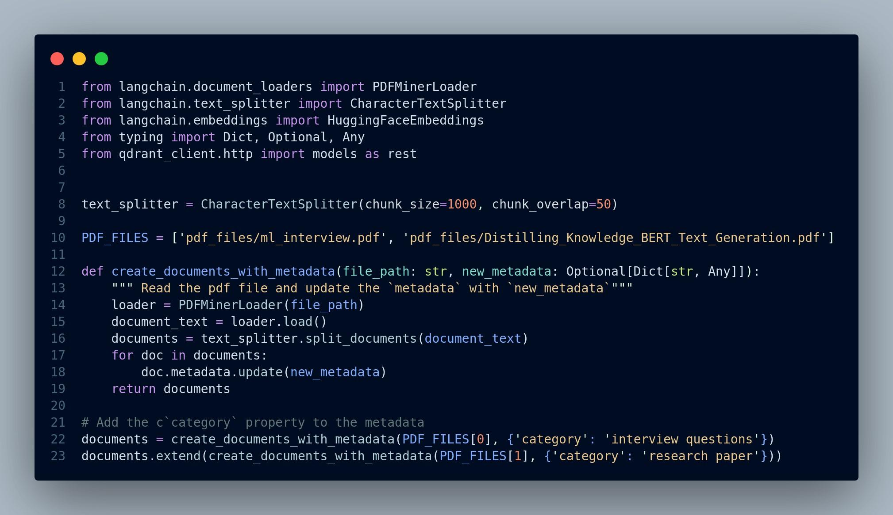{width="4.857047244094488in"
height="2.8064020122484687in"}

> Figure 4.25: Read the files and update the metadata property

{width="4.857147856517935in"
height="1.261596675415573in"}

> Figure 4.26: Output example of metadata for text chunks
>
> 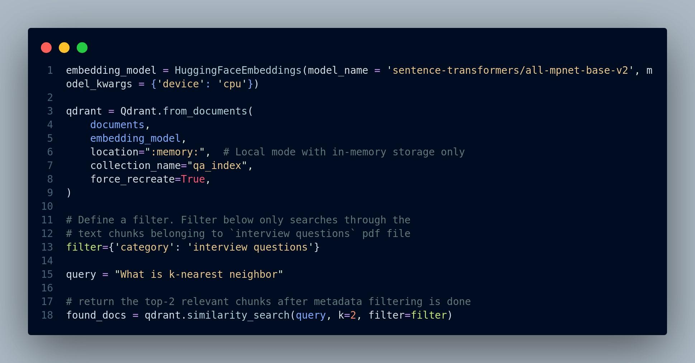{width="4.857123797025372in"
> height="2.5413429571303587in"}
>
> Figure 4.27: Insert text chunks into the vector database and perform
> retrieval *LLM to infer the metadata from user query?* The short
> answer is: *Yes*.
>
> Therefore, the general approach is we need to define a particular
> prompt for LLM, so it can use that to extract entities or metadata
> from the user query, map them to the existing metadata stored with
> text chunks in the vector database, and then perform the retrieval.
>
> That said, LlamaIndex provides us an implemented version of this
> approach.
>
> The following code is from the LlamaIndex documentation here. For this
> technique, we define the metadata (in this example category and
> country) along with each text chunk. Figure 4.29 shows the code
> snippet for this step.
>
> Figure 4.30 shows the retrieval process including how to define vector
> index, vector store, and VectorIndexAutoRetriever object.

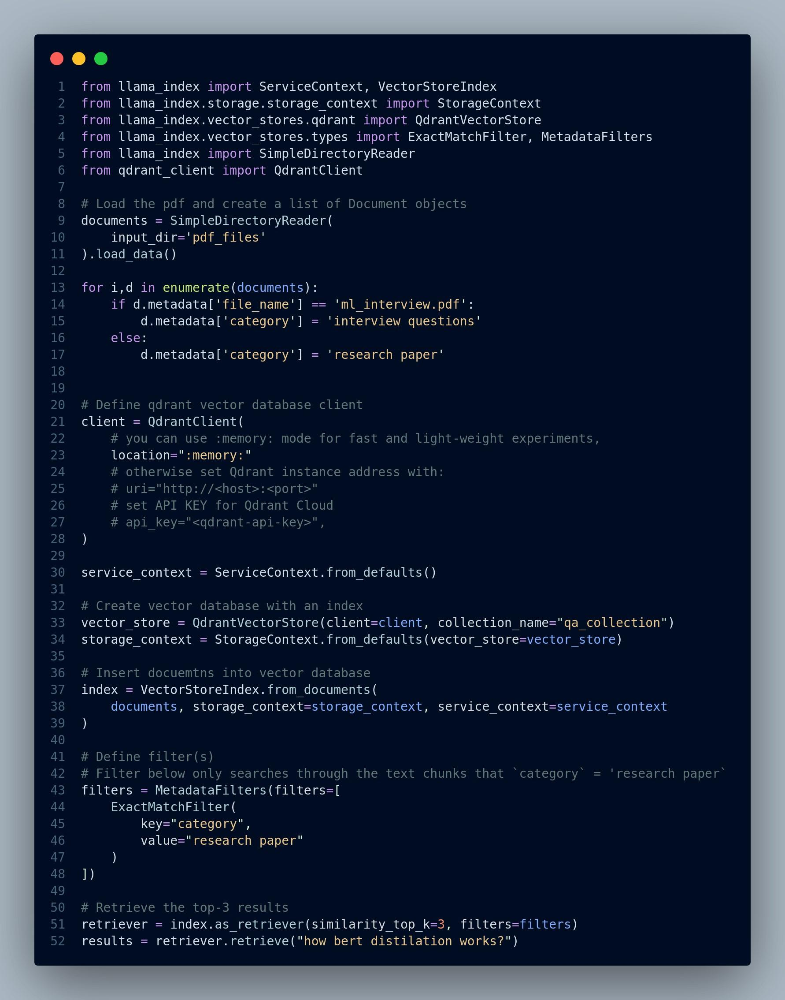{width="4.857020997375328in"
height="6.18166447944007in"}

> Figure 4.28: Metadata filtering in LlamaIndex for document retrieval

{width="4.857147856517935in"
height="4.225661636045494in"}

> Figure 4.29: Define text node and metadata for auto retrieval

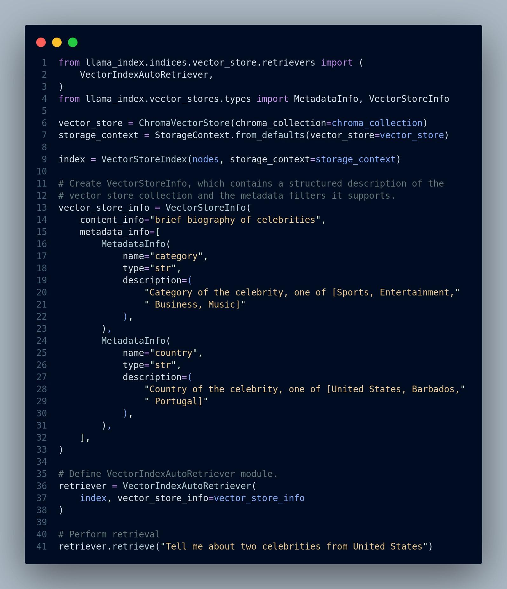{width="4.857076771653543in"
height="5.630069991251093in"}

> Figure 4.30: Define VectorIndexAutoRetriever retriever and
> VectorStoreInfo, which contains a structured description of the vector
> store collection and the metadata filters it supports.
>
> **4.5 Hybrid Document Retrieval**
>
> Hybrid document retrieval is an approach that combines traditional
> keywordbased search like BM25 with semantic (dense) search using
> embeddings, such as BERT or word2vec. Integrating this technique to
> Retrieval-Augmented Generation (RAG) applications can significantly
> enhance the effectiveness of document retrieval. It addresses
> scenarios where a basic keyword-based approach can outperform semantic
> search and demonstrates how combining these methods improves retrieval
> in RAG applications.
>
> In addition, often times a complete migration to a semantic-based
> search using RAG is challenging for most companies. They might already
> have a keywordbased search system and have been using it for quite a
> long time. Performing an overhaul to the company's information
> architecture, and migrating to a vector database is just infeasible.

**Scenarios Favoring Keyword-Based Search:**

1.  **Highly Specific Queries:** In cases where a user's query is highly
    specific and focuses on precise terms or phrases, a keyword-based
    approach can outperform semantic search. Keyword matching excels at
    finding exact matches within documents.

2.  **Niche Domains:** In specialized domains with industry-specific
    jargon or acronyms, keyword search can be more effective as it
    directly matches terminology without requiring extensive semantic
    understanding.

3.  **Short Documents:** When dealing with very short documents, such as
    tweets or headlines, keyword-based search can be more efficient.
    Semantic models often require longer text to derive meaningful
    embeddings.

4.  **Low Resource Usage:** Keyword search typically requires fewer
    computational resources compared to semantic search. This can be
    advantageous when resource efficiency is a critical concern.

4.5HybridDocumentRetrieval

> **Combining Keyword and Semantic Approaches for Improved Retrieval:**
>
> To harness the strengths of both keyword-based and semantic (dense)
> retrievers effectively, a pragmatic approach is to integrate two
> retrievers into the pipeline and merge their outputs. This two-pronged
> strategy capitalizes on the unique advantages of each retriever,
> resulting in more comprehensive and accurate retrieval in
> Retrieval-Augmented Generation (RAG) applications.
>
> The process begins by employing both **keyword-based** as well as
> **dense** retrievers within the RAG pipeline. However, the challenge
> lies in merging the results obtained from these two retrievers, each
> of which returns ranked lists of results with relevance scores
> assigned to each document. Figure 4.31 illustrates the hybrid
> retrieval pipeline.
>
> {width="4.857107392825896in"
> height="2.7311526684164478in"}
>
> Figure 4.31: Hybrid retrieval pipeline
>
> Merging the results from keyword-based and semantic retrievers can be
> approached in several ways, depending on the nature of the RAG
> application:

1.  **Concatenation:** This method involves simply appending all
    documents from both retrievers (excluding duplicates) to create the
    final list of results. Concatenation is suitable when you intend to
    use all retrieved documents and the order of the results is not
    crucial. This approach can be valuable in extractive
    question-answering pipelines, where you aim to extract information
    from multiple sources and are less concerned about ranking.

2.  **Reciprocal Rank Fusion (RRF):** RRF operates with a formula that
    reranks documents from both retrievers, giving priority to those
    that appear in both results lists. Its purpose is to elevate the
    most relevant documents to the top of the list, thereby enhancing
    the overall relevance of the results. RRF is particularly useful
    when the order of the results is important or when you intend to
    pass on only a subset of results to the subsequent processing
    stages.

3.  **Merging by Scoring:** In this approach, documents are ranked based
    on the scores assigned by the individual retrievers. This method is
    suitable when you aim to prioritize results from one retriever over
    the other. If the relevance scores assigned by the two retrievers
    are comparable and you wish to emphasize results from a particular
    retriever, this method can be employed. For instance, if you're
    using dense retrievers from different sources that return documents
    from various document stores, this method allows you to choose one
    retriever's output over another.

**Advantages of Hybrid Retrieval:**

-   **Enhanced Relevance:** Hybrid retrieval leverages the strengths of
    both keyword and semantic approaches, increasing the chances of
    returning highly relevant documents.

-   **Coverage:** It addresses scenarios where purely keyword or purely
    semantic approaches might fail, providing a broader scope of
    relevant documents.

-   **Resource Efficiency:** By initially narrowing the search with
    keywordbased filtering, the system conserves computational
    resources, making the retrieval process more efficient.

-   **Adaptability:** Hybrid retrieval allows for adaptability to
    different user queries and document types, striking a balance
    between precision and recall.

> There are frameworks which support hybrid retrieval out of the box
> such as ElasticSearch, Haystack, Weaviate, and Cohere Rerank. Let's
> find out how to implement this approach using Haystack. The following
> code is from Haystack documentation, you can see all the
> implementation details here. The documents that are used for this
> example are abstracts of papers from PubMed. You can find and download
> the dataset here.
>
> pip install datasets\>=2.6.1 pip install farm-haystack\[inference\]
>
> **Step 1:** We load the dataset and initialize the document store
> (i.e. vector database). Figure 4.32 shows this step.
>
> **Step 2:** Define the retrievers, insert the documents and embeddings
> into the document store and choose the *join document* strategy. You
> can see this step in Figure 4.33.
>
> **Step 3:** Create an end-to-end pipeline in Haystack and perform the
> hybrid retrieval for a query. This step is depicted in Figure 4.34.
>
> **4.6 Query Rewriting for Retrieval-Augmented Large**
>
> **Language Models**
>
> Query rewriting is a sophisticated technique that plays a pivotal role
> in enhancing the performance of Retrieval-Augmented Large Language
> Models (RAG). The fundamental idea behind query rewriting is to
> optimize and fine-tune the

{width="4.857020997375328in"
height="4.213779527559055in"}

> Figure 4.32: Load documents and initialize document store
>
> {width="4.85691491688539in"
> height="2.6891972878390202in"}
>
> Figure 4.33: Define keyword and embedding based retrievers
>
> queries presented to the retrieval component of RAG systems,
> ultimately leading to more accurate and contextually relevant results.
>
> The core concept is to transform the initial user query into an
> improved form that effectively captures the user's intent and aligns
> with the document retrieval phase. This often involves various steps
> and considerations, including:

1.  **Expanding User Queries**: Query rewriting can involve expanding
    the initial user query by adding synonyms, related terms, or
    concepts that might improve the retrieval of relevant documents.
    This expansion can be based on linguistic analysis or external
    knowledge sources.

2.  **Rephrasing for Clarity**: Queries are often rewritten to improve
    their clarity and conciseness. Ambiguous or complex phrasings can be
    simplified to make the user's intent more explicit.

3.  **Contextual Adaptation**: The rewriting process may take into
    account the specific context of the documents available for
    retrieval. It can adapt

{width="4.856963035870516in"
height="3.0972583114610672in"}

> Figure 4.34: Create end-to-end pipeline and run the retrievers the
> query to the characteristics of the document corpus, which is
> particularly valuable in domain-specific applications.
>
> Query rewriting is closely tied to the document retrieval phase in RAG
> systems. It contributes to better retrieval rankings, which, in turn,
> leads to more informative and contextually relevant answers generated
> by the language model. The goal is to ensure that the retrieved
> documents align closely with the user's intent and cover a wide
> spectrum of relevant information.

**4.6.1 Leveraging Large Language Models (LLMs) for Query**

#### Rewriting in RAGs

> **Question:** *With the advent of Large Language Models (LLMs) that
> have revolutionized natural language understanding and generation
> tasks, can we use them for query rewriting?* The answer is: *Yes*.
> They can help in two primary ways: query expansion and generating
> better prompts. Figure 4.36 shows how query rewriting works. We can
> use LLM to either expand (enhance) a query or generate multiple
> (sub)queries for better retreival process.

{width="4.857413604549431in"
height="1.1704615048118985in"}

> Figure 4.35: Query re-writing using LLMs. LLM can expand the query or
> create multiple sub-queries.
>
> **4.6.1.1 Query Expansion with LLMs**
>
> LLMs possess an extensive understanding of language and vast knowledge
> repositories, which makes them ideal for query expansion. Here's how
> LLMs can aid in query expansion:
>
> **Synonym Generation:** LLMs can identify synonyms and related terms
> for words in the user's query. By expanding the query with synonyms,
> it increases the chances of retrieving documents that may use
> different terminology but are contextually relevant.
>
> **Example:** *User Query:* "Renewable energy sources". *LLM Query
> Expansion:* "Renewable energy sources" -\> "Green energy sources,"
> "Sustainable energy sources," "Eco-friendly energy sources".
>
> By suggesting synonyms for "renewable," the LLM broadens the query's
> scope to retrieve documents that may use alternative terminology.
>
> **Conceptual Expansion:** LLMs can identify concepts and entities
> related to the query. They can suggest adding relevant concepts,
> entities, or phrases that can lead to more comprehensive results. For
> instance, if a user queries about "climate change," the LLM might
> suggest adding "global warming" to ensure a broader document
> retrieval.
>
> **Example:** *User Query:* "Mars exploration". *LLM Query Expansion:*
> "Mars exploration" -\> "Mars mission," "Red planet research," "Space
> exploration of Mars".
>
> **Multilingual Query Expansion:** For multilingual queries, LLMs can
> assist in translating and expanding the query into multiple languages,
> broadening the search scope and retrieving documents in various
> languages.
>
> **4.6.1.2 Generating Better Prompts with LLMs**
>
> LLMs can assist in generating more effective prompts for retrieval,
> especially when a prompt-based retrieval mechanism is employed. Here's
> how LLMs contribute to prompt generation.
>
> **Query Refinement:** LLMs can refine a user query by making it more
> concise, unambiguous, and contextually relevant. The refined query can
> then serve as a prompt for the retrieval component, ensuring a more
> focused search.
>
> **Example:** *User Query:* "How does photosynthesis work?"
> *LLM-Generated Prompt:* "Explain the process of photosynthesis."
>
> **Multi-step Prompts:** In complex queries, LLMs can generate
> multi-step prompts that guide the retrieval component through a series
> of sub-queries. This can help break down intricate requests into more
> manageable retrieval tasks.
>
> **Example:** *User Query:* "Market trends for electric cars in 2021".
> *LLM-Generated Multi-Step Prompts:*

-   "Retrieve market trends for electric cars."

-   "Filter results to focus on trends in 2021."

> The LLM generates sequential prompts to guide the retrieval component
> in finding documents related to market trends for electric cars in
> 2021.
>
> **Context-Aware Prompts:** LLMs can consider the context of the
> available document corpus and generate prompts that align with the
> characteristics of the documents. They can adapt prompts for specific
> domains or industries, ensuring that the retrieval phase retrieves
> contextually relevant documents.
>
> **Example:** *User Query:* "Legal documents for the healthcare
> industry". *LLMGenerated Domain-Specific Prompt:* "Retrieve legal
> documents relevant to the healthcare industry."
>
> Understanding the context, the LLM generates a prompt tailored to the
> healthcare industry, ensuring documents retrieved are pertinent to
> that domain.
>
> Query rerwriting for RAGs is an active research area, and new
> approaches are suggested regularly. One recent research is Ma et al.
> (2023), where they propose a new framework for query generation. See
> here to learn more about their method.
>
> **4.7 Query Routing in RAG**
>
> Query routing in RAG, often facilitated by a router, is the process of
> automatically selecting and invoking the most suitable retrieval
> technique or tool for a given user query. It enables a dynamic,
> adaptive approach to choose how to retrieve information based on the
> specific requirements of each query.
>
> Rather than relying on a fixed retrieval method, query routing
> empowers the system to intelligently assess the user's query and
> select the appropriate retrieval mechanism. This approach is
> particularly powerful in scenarios where a diverse range of retrieval
> techniques or tools can be employed to answer different types of
> queries. The following shows the generate architecture of this
> approach.

**How Query Routing Works:**

1.  **User Query Input**:

> A user enters a query into the RAG system. This query could encompass
> various types of information needs, such as fact-based lookup,
> summarization, translation, question answering, etc.

2.  **Query Analysis**:

> The router or the query routing component first performs an analysis
> of the user's query. This analysis involves understanding the nature
> of the query, its intent, and the type of information required.

3.  **Detection of Retrieval Technique Requirement**:

> Based on the analysis, the router detects the retrieval technique or
> tool that best matches the query's requirements. This detection is
> often driven by heuristics, pre-defined rules, machine learning
> models, or a combination of these methods.

4.7QueryRoutinginRAG

{width="3.1388495188101486in"
height="6.362533902012249in"}

> Figure 4.36: Query router architecture

4.  **Selection of Retrieval Technique**:

> The router selects the most appropriate retrieval technique from a
> predefined set, which can include methods like fact-based lookup in a
> vector store, summarization, document retrieval, question answering,
> or translation, among others.

5.  **Invoke the Retrieval Component**:

> The router then calls the relevant retrieval component or "tool" that
> specializes in the chosen retrieval technique. This component may be a
> vector store interface, a summarization tool, a translation service,
> or any other retrieval method.

6.  **Information Retrieval**:

> The selected retrieval component performs the necessary information
> retrieval or processing based on the chosen technique. For example, if
> factbased lookup is required, it retrieves facts from a vector store.
> If summarization is needed, it generates a concise summary. If
> translation is the goal, it translates the content.

7.  **Generation of Output**:

> The retrieved or processed information is then used by the generation
> component in the RAG system to compose a response, which is presented
> to the user.
>
> There are multiple ways to implement query routing in
> Retrieval-Augmented Generation (RAG) systems:

1.  **Intent Classification Model:**

    -   **Use a Classifier**: Employ a pre-trained classifier model that
        can categorize user queries based on their intent. This
        classifier can have predefined categories such as fact-based
        lookup, summarization, translation, question answering, etc. The
        selected category then dictates the retrieval method to be used.

4.7QueryRoutinginRAG

-   **Machine Learning**: Train a custom intent classification model on
    labeled query data to predict the query's intent. This model can be
    fine-tuned on specific intent detection tasks relevant to the RAG
    system.

> Figure 4.37 shows how to use a zero-shot classifer to categorize user
> queries.

{width="4.857191601049869in"
height="3.4578444881889765in"}

> Figure 4.37: Using a zero-shot classifier to categorize and route user
> queries

2.  **Prompt-Based Routing**:

    -   **Leverage LLMs**: Utilize Large Language Models (LLMs), such as
        GPT-4 or similar models, to perform query classification. A
        prompt can be designed to guide the LLM in classifying the query
        based on its intent.

    -   **Template Prompts**: Create a set of template prompts that are
        specifically designed to categorize queries. These templates can
        include leading questions or cues to elicit the intent of the
        query.

> The code in Figure 4.38 shows how to use a LLM text-davinci-002 for
> query routing.
>
> {width="4.8570352143482065in"
> height="3.592600612423447in"}
>
> Figure 4.38: Using a LLM to categorize and route user queries

3.  **Rule-Based Routing**:

    -   **Rule-Based System**: Develop a rule-based system that consists
        of predefined rules or conditions to categorize queries. For
        example, if a query starts with "Translate," it is routed to a
        translation retrieval method.

    -   **Regular Expressions**: Use regular expressions to match query
        patterns and automatically route queries based on predefined
        patterns, keywords, or structures.

> The choice of implementation depends on the complexity of the RAG
> system, the available resources, and the specific requirements of the
> application. Implementing a combination of these methods can provide a
> robust and adaptive query routing mechanism that enhances the overall
> performance of RAG systems.
>
> Let's take a look at an example where we use LlamaIndex framework for
> routing queries between a *summarization route* and *fact-based
> route*. LlamaIndex has a concept called RouterQueryEngine which
> accepts a set of query engines QueryEngineTool objects as input. A
> QueryEngineTool is essentially an index used for retrieving documents
> from vector database. First step is to load the documents and define
> the summary index and fact-based index, which is displayed in Figure
> 4.39.
>
> Then, we create QueryEngine objects for each index and add them to the
> RouterQueryEngine object. Figure 4.40 shows this step.
>
> By dynamically routing queries to the most suitable retrieval
> techniques, query routing enhances RAG by ensuring that the system
> adapts to the specific requirements of each user query, providing more
> accurate and context-aware responses. It overcomes the challenge of
> needing to know in advance which retrieval technique to apply and
> optimizes the retrieval process for different types of information
> needs.
>
> **4.8 Leveraging User History to Enhance RAG Performance**
>
> Retrieval-Augmented Generation (RAG) systems have gained prominence in
> natural language processing applications due to their ability to
> combine the

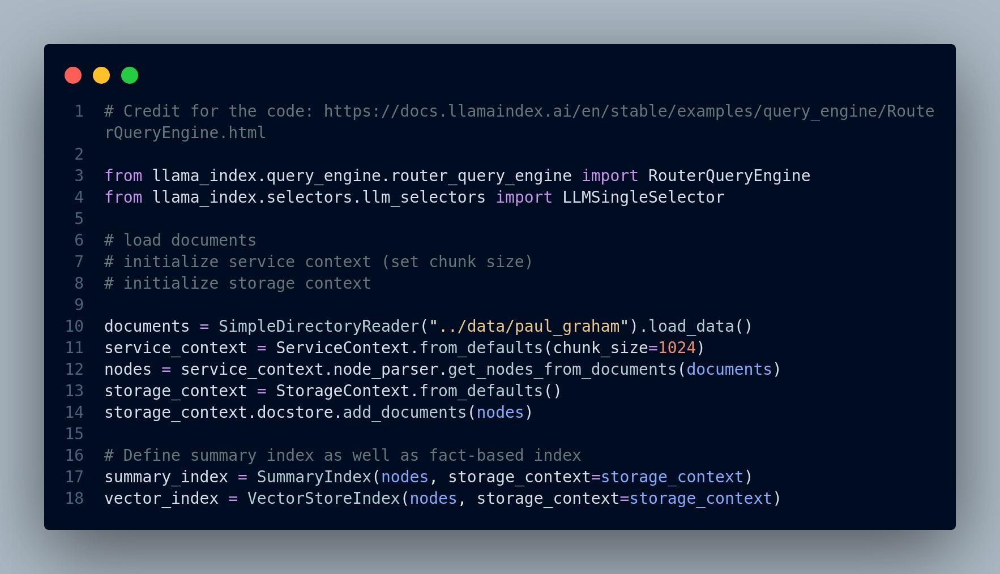{width="4.857200349956256in"
height="2.7889031058617673in"}

> Figure 4.39: Query routing example in LlamaIndex. First we load
> documents and create different indecies.

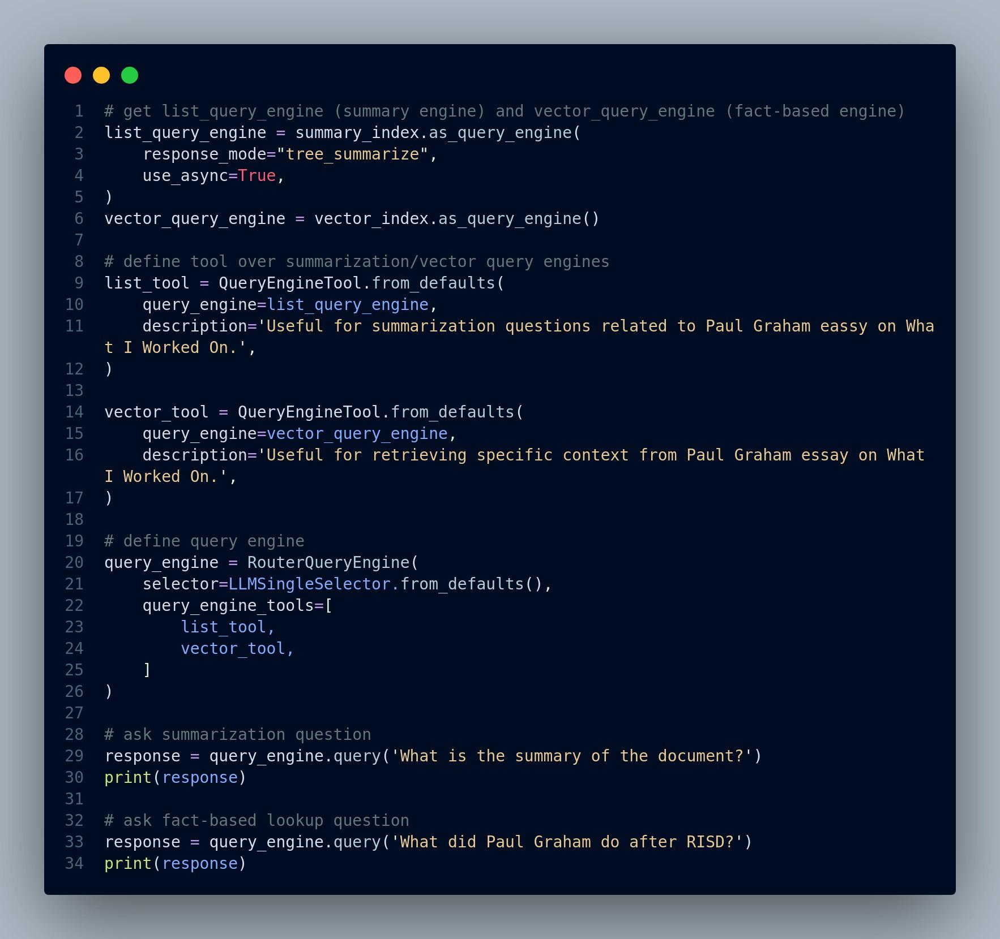{width="4.857200349956256in"
height="4.565658355205599in"}

> Figure 4.40: Define QueryEngine and RouterQueryEngine objects, and run
> the engine for user queries.
>
> strengths of information retrieval and language generation. However,
> RAG applications often involve significant computational and financial
> costs due to the necessity of embeddings, retrievals and even response
> generation. When dealing with recurrent user queries or similar
> questions, these costs can be optimized by leveraging the memory of
> previously asked questions.

#### 4.8.1 Challenge

> In many real-world applications, users tend to ask similar or nearly
> identical questions repeatedly. For instance, in a customer support
> chatbot, users may have common queries related to product information
> or troubleshooting procedures. While the RAG framework excels at
> generating relevant responses based on retrieval, it may not be
> efficient to re-embed and retrieve information for the same questions
> each time they are asked. This is where the concept of leveraging user
> history comes into play.

#### 4.8.2 How User History Enhances RAG Performance

> Leveraging user history to enhance RAG performance involves building a
> memory or cache of previously asked questions and their corresponding
> responses. When a user query is received, instead of immediately
> triggering an embedding and retrieval process, the system can check
> the user history to see if it has encountered a similar or identical
> query before. This approach offers several advantages:

1.  **Faster Response Times (i.e. reduced latency):** By comparing the
    new query to the user history, the system can identify duplicate or
    closely related questions. In such cases, it can bypass the
    embedding and retrieval steps, significantly reducing response
    times.

2.  **Cost Reduction:** Skipping the resource-intensive retrieval
    process for recurrent queries leads to a notable reduction in
    computational and financial costs, as the need for additional API
    calls or data processing diminishes.

3.  **Consistency and Accuracy:** Responses to repeated questions can
    remain consistent and accurate over time. The use of cached
    responses from the user history ensures that users receive reliable
    information without relying on new retrievals. Additionally, by
    keeping track of user history, RAG can learn to better understand
    the user's intent and context. This can lead to more accurate
    answers to questions, even if the questions are not perfectly
    phrased.

#### 4.8.3 How Memory/User History Works

> A simple RAG memory can be implemented as follows: We need to maintain
> a log of user queries and their corresponding answers. Therefore, we
> can define the memory as a key-value store, where the keys are
> questions and the values are answers. When a user asks a question, RAG
> first checks its memory to see if it has already answered a similar
> question. If it has, then it simply retrieves the answer from its
> memory and returns it to the user. If it has not already answered a
> similar question, then it performs the embedding and retrieval process
> as usual.
>
> We need to have a mechanism that constantly updates the RAG's memory
> with new questions and answers. As a user asks more questions, RAG's
> memory grows and it becomes better able to answer future questions
> accurately and efficiently.
>
> **Implementation:** The snippet code in Figure 4.41 shows a very basic
> implementation of memory for RAG.
>
> While a simple in-memory dictionary, as shown in the previous example,
> can be effective for maintaining recent user history, it might not be
> sufficient for handling a large-scale conversation history or
> long-term memory. To address

{width="4.857076771653543in"
height="4.521554024496938in"}

> Figure 4.41: A basic key-value implementation of memory for RAG. these
> challenges, RAG systems can benefit from using a vector database for
> memory.
>
> The implementation of a vector database for memory in a RAG system
> involves several key steps:

1.  **Data Ingestion:** Store historical question-answer pairs along
    with their corresponding embeddings in the vector database. This
    process typically involves a batch or incremental data ingestion
    pipeline.

2.  **Retrieval:** When a user poses a question, retrieve the most
    relevant historical answers by calculating the similarity between
    the question's embedding and the embeddings in the vector database.

3.  **Updating Memory:** Periodically update the vector database with
    new question-answer pairs and their embeddings to keep the memory up
    to date.

4.  **Caching:** Implement a caching mechanism to enhance retrieval
    speed by temporarily storing frequently accessed data in memory.

5.  **Query Optimization:** Use efficient indexing and search algorithms
    to optimize the retrieval process, reducing query response times.

> Incorporating a vector database for memory in a RAG system enhances
> its ability to provide contextually relevant and coherent responses by
> efficiently managing and retrieving historical information. This
> approach is particularly valuable in scenarios where extensive
> conversation histories or long-term memory are essential for the
> application's success.
>
> As we wrap up our exploration of advanced RAG systems in this Chapter,
> we are on the cusp of a new frontier. In Chapter 5 - "Observability
> Tools for RAG," we will discuss various observability tools tailored
> for RAG systems. We will explore their integration with LlamaIndex,
> including Weights & Biases, Phoenix, and HoneyHive. These tools will
> not only help us monitor and evaluate the performance of our RAG
> systems but also provide valuable insights for continuous improvement.