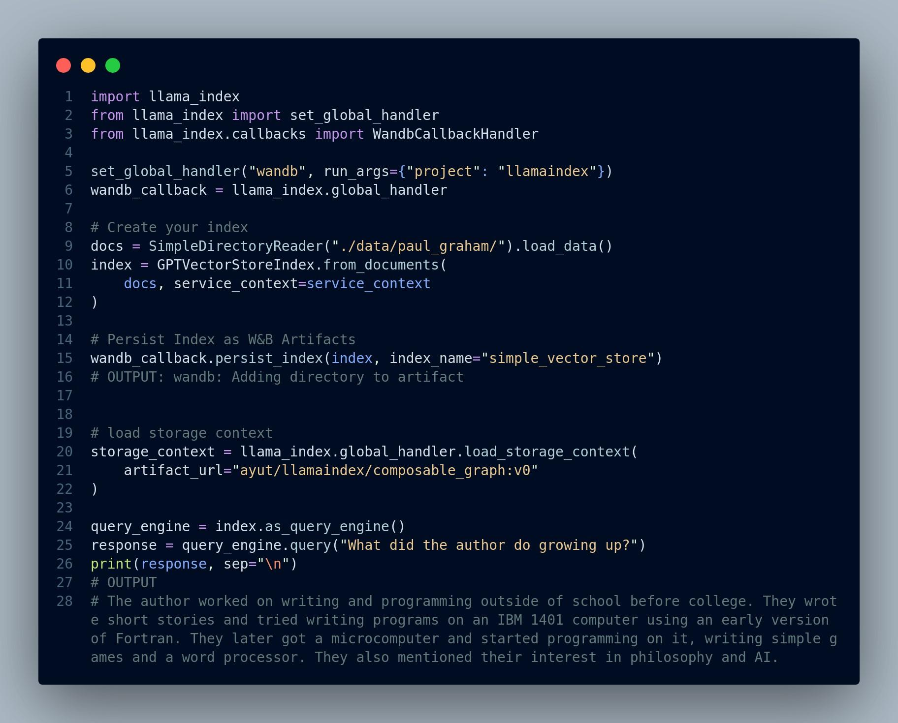
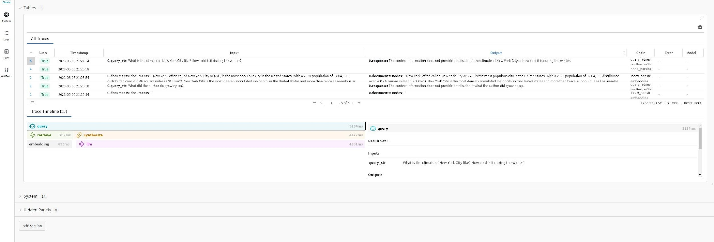
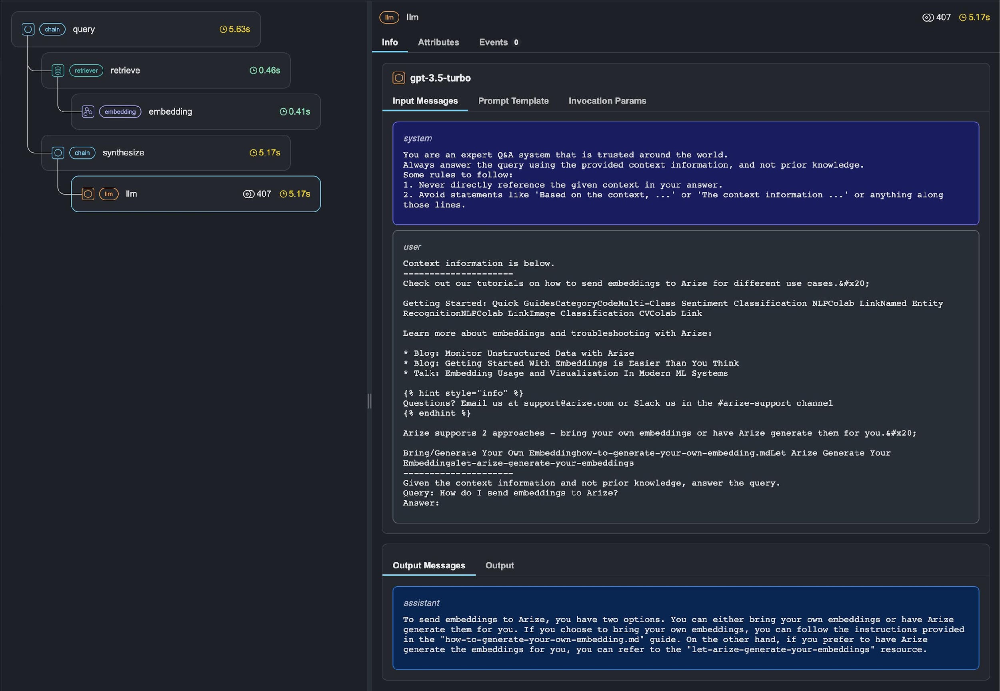
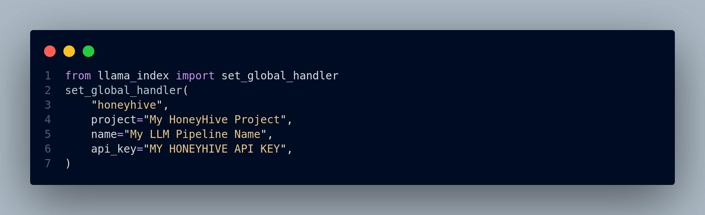
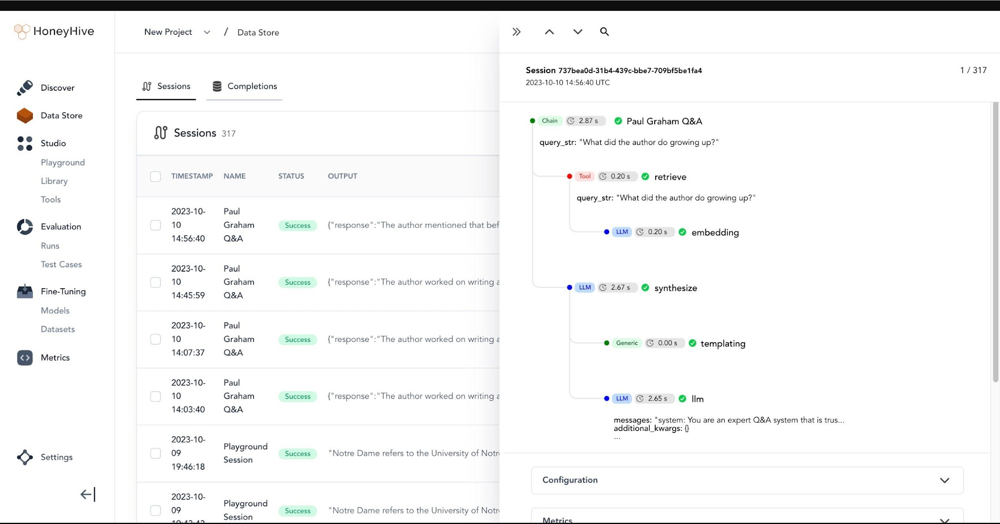

# Observability Tools for RAG

> An observability tool is a software or platform designed to help
> monitor, analyze, and gain insights into the performance, behavior,
> and health of a complex system, such as a machine learning model, a
> RAG system, or a software application. These tools provide visibility
> into various aspects of a system, allowing operators, administrators,
> and developers to understand how the system operates and to detect and
> troubleshoot issues.
>
> Key components and features of an observability tool typically
> include:

1.  **Data Collection:** Observability tools collect data from various
    sources within the system. This data can include metrics (e.g., CPU
    usage, memory usage), logs, traces, events, and more. The broader
    the range of data collected, the more comprehensive the
    observability.

2.  **Storage:** Data collected by the tool is stored for analysis and
    historical reference. The storage can be in the form of time-series
    databases, log repositories, or other storage solutions designed to
    handle large volumes of data.

3.  **Analysis:** Observability tools provide analytical capabilities to
    process and make sense of the collected data. This includes querying
    data, aggregating metrics, and identifying patterns or anomalies.

4.  **Visualization:** The tools offer visualization capabilities to
    create graphs, charts, dashboards, and reports that make it easier
    for users to interpret data. Visualizations help spot trends,
    issues, and performance bottlenecks.

5.  **Alerting:** Many observability tools allow users to define
    alerting rules. When certain conditions are met, the tool sends
    notifications, enabling operators to respond to issues promptly.

6.  **Tracing:** For distributed systems, tracing is important.
    Observability tools often provide tracing features to track requests
    as they move through various services or components of a system.
    This helps pinpoint performance bottlenecks and issues.

7.  **User Interface:** A user-friendly interface is essential for
    interacting with the data and insights generated by the
    observability tool. It should allow users to explore data, set up
    alerts, and visualize information.

8.  **Integration:** Observability tools should integrate with various
    components of the system, such as applications, databases,
    containers, and cloud services, to capture relevant data.

9.  **Scalability:** The tool should be able to scale with the system it
    monitors. It needs to handle growing data volumes and provide
    insights without compromising performance.

10. **Customization:** Users should be able to customize the tool to
    meet the specific needs of their system. This includes defining
    custom dashboards, alerts, and data collection methods.

> There are several observability tools for RAG based systems.
> Frameworks like LlamaIndex also provides an easy way to integrate some
> of these tools with RAG application. This enable us to:

-   View LLM prompt inputs and outputs

-   Make sure that all the components such as embedding models, LLMs and
    vector databases are working as expected • View indexing and
    querying traces

> In order to integrate observability tools with LlamaIndex, we simply
> need to do the following, Figure 5.1:

5.1Weights&BiasesIntegrationwithLlamaIndex

> {width="4.857076771653543in"
> height="1.1823140857392826in"}
>
> Figure 5.1: General pattern for integrating observability tools into
> LlamaIndex

1.  **Weights & Biases Integration with LlamaIndex**

> Weights & Biases is a machine learning platform that empowers
> developers to enhance their models efficiently. It provides versatile
> tools for experiment tracking, dataset versioning, model evaluation,
> result visualization, regression identification, and seamless
> collaboration with peers.
>
> The code depicted in Figure 5.2 shows how to integrate W&B with
> LlamaIndex. For complete example, please see here.
>
> We can even see the logs as shown in Figure 5.3.
>
> If we go the W&B website and login, we can see all the details, Figure
> 5.4 displays our project including charts, artifacts, logs, and
> traces.

2.  **Phoenix Integration with LlamaIndex**

> Phoenix is an observability tool designed for LLM applications,
> offering insight into their inner workings. It provides a visual
> representation of query engine calls and highlights problematic
> execution spans based on factors like latency and token count, aiding
> in performance evaluation and optimization.
>
> Figure 5.5 shows the general usage pattern to use Phoenix.

{width="4.857076771653543in"
height="3.9144192913385827in"}

> Figure 5.2: W&B integration with LlamaIndex

{width="4.857156605424322in"
height="0.8855588363954505in"}

> Figure 5.3: W&B logs at different steps

5.2PhoenixIntegrationwithLlamaIndex

{width="4.8569378827646545in"
height="1.6475831146106736in"}

> Figure 5.4: W&B dashboard

{width="4.857076771653543in"
height="2.093017279090114in"}

> Figure 5.5: Phoenix integration with LlamaIndex RAG applications
>
> When we run queries, we can see the traces in real time in the Phoenix
> UI. Figure 5.6 illustrates the Phoenix UI for a RAG application.
>
> {width="4.856912729658792in"
> height="3.359212598425197in"}
>
> Figure 5.6: Phoenix UI that shows traces of queries in real time.
>
> A complete example of tracing a LlamaIndex RAG application using
> Phoenix is available at this link.
>
> **5.3 HoneyHive Integration with LlamaIndex**
>
> HoneyHive is a framework that can be used to test and evaluate,
> monitor and debug LLM applications. It can be seamlessly integrated as
> displayed in Figure 5.7 into LlamaIndex applications.
>
> The HoneyHive dashaboard looks like Figure 5.8 below:

5.3HoneyHiveIntegrationwithLlamaIndex

{width="4.857076771653543in"
height="1.4858814523184602in"}

> Figure 5.7: HoneyHive integration with LlamaIndex

{width="4.857031933508312in"
height="2.549229002624672in"}

> Figure 5.8: HoneyHive dashboard
>
> For a complete guide, see this tutorial.
>
> Other observability tools we can use include Truera, databricks, and
> Elastic observability among many other tools that are available.

6.  **Ending Note**

> In concluding our journey through the pages of "**A Practical Approach
> to Retrieval Augmented Generation Systems**," we hope you have gained
> valuable insights into the world of Retrieval-Augmented Generation. As
> the landscape of AI continues to evolve, RAG systems present an
> exciting intersection of retrieval and generation technologies, with
> immense potential across a multitude of industries and applications.
> With each chapter, we've delved deeper into the core principles,
> strategies, and techniques that underpin the development and
> implementation of RAG systems.
>
> Remember that the field of AI is dynamic and ever-changing. While this
> book has aimed to provide a comprehensive understanding of RAG, new
> developments and possibilities are always on the horizon. We encourage
> you to continue exploring, experimenting, and innovating in the realm
> of Retrieval-Augmented Generation. Your journey doesn't end here; it's
> just the beginning.
>
> Thank you for joining us on this transformative adventure into the
> heart of AI's future.
>
> **6.1 Acknowledgements**
>
> We would like to express our gratitude to the teams behind LlamaIndex,
>
> LangChain, and Haystack for their invaluable contributions to the
> field of Retrieval-Augmented Generation (RAG). Their comprehensive
> documentations and tutorials have been instrumental in our journey,
> allowing us to learn from their expertise and leverage the fascinating
> tools they have built.
>
> **References**

Lewis, Patrick, Ethan Perez, Aleksandra Piktus, Fabio Petroni, Vladimir

Karpukhin, Naman Goyal, Heinrich Küttler, et al. 2020. "Retrieval-

> Augmented Generation for Knowledge-Intensive Nlp Tasks." *Advances in
> Neural Information Processing Systems* 33: 9459--74.
>
> Liu, Nelson F, Kevin Lin, John Hewitt, Ashwin Paranjape, Michele
> Bevilacqua, Fabio Petroni, and Percy Liang. 2023. "Lost in the Middle:
> How Language Models Use Long Contexts." *arXiv Preprint
> arXiv:2307.03172*.
>
> Liu, Ye, Kazuma Hashimoto, Yingbo Zhou, Semih Yavuz, Caiming Xiong,
> and
>
> Philip S Yu. 2021. "Dense Hierarchical Retrieval for Open-Domain
> Question Answering." *arXiv Preprint arXiv:2110.15439*.
>
> Ma, Xinbei, Yeyun Gong, Pengcheng He, Hai Zhao, and Nan Duan. 2023.
> "Query Rewriting for Retrieval-Augmented Large Language Models."
> *arXiv Preprint arXiv:2305.14283*.
>
> Roeder, Luke Metz, Geoffrey, and Durk Kingma. 2021. "On Linear
> Identifiability of Learned Representations." *arXiv Preprint
> arXiv:2007.00810*.

Zhao, Wayne Xin, Jing Liu, Ruiyang Ren, and Ji-Rong Wen. 2022. "Dense
Text Retrieval Based on Pretrained Language Models: A Survey." *arXiv
Preprint arXiv:2211.14876*.

> Zheng, Lianmin, Wei-Lin Chiang, Ying Sheng, Siyuan Zhuang, Zhanghao
> Wu, Yonghao Zhuang, Zi Lin, et al. 2023. "Judging LLM-as-a-Judge with
> MTBench and Chatbot Arena." *arXiv Preprint arXiv:2306.05685*.

121
