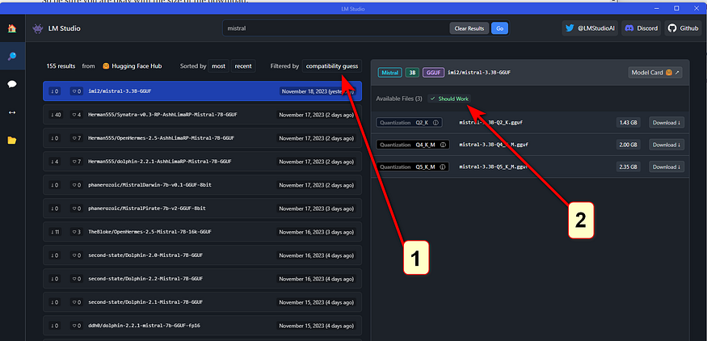
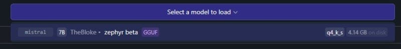
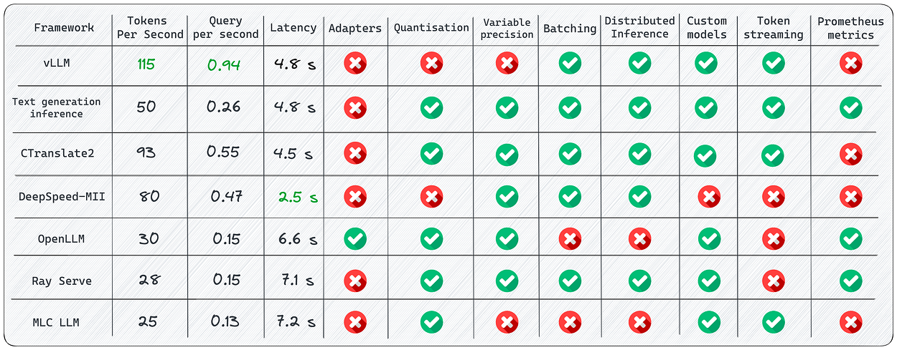
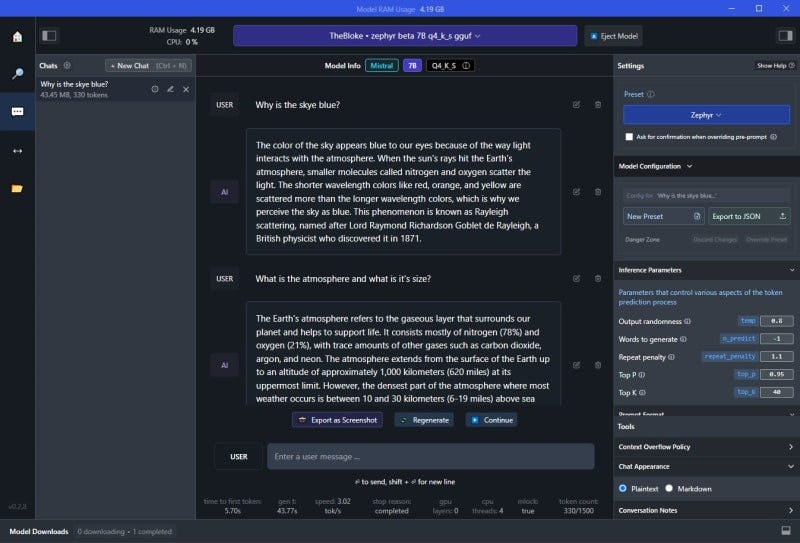
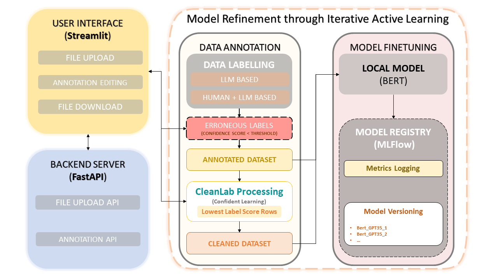
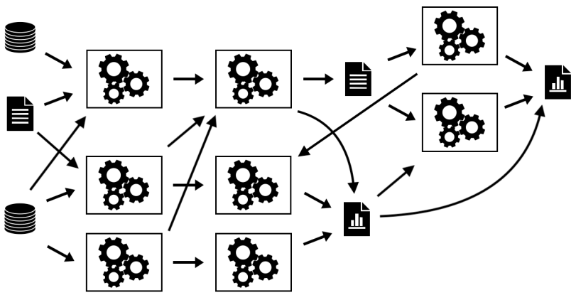
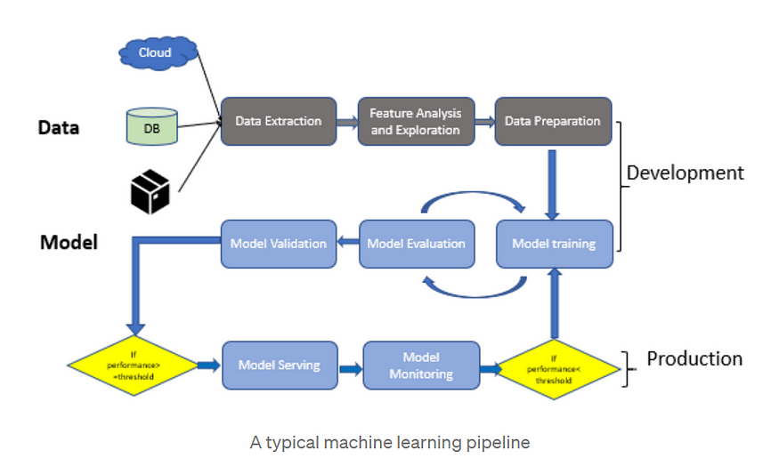

**<span style="text-decoration:underline;">Spanda Bootcamp Day One</span>**

**<span style="text-decoration:underline;">Section 0(Pre-requisites)____________________________</span>**

Installing Docker on your system


* Docker is a platform designed to help developers build, share, and run container applications.
* Go to [https://www.docker.com/](https://www.docker.com/) 
* Download and install the version per your operating system
* During installation, we get a configuration option:  \
WSL-2 vs Hyper-V
* Docker Desktop for Windows provides a development environment for building, shipping, and running dockerized apps. 
* By enabling the WSL 2 based engine, you can run both Linux and Windows containers in Docker Desktop on the same machine. Docker Desktop is free for personal use and small businesses, for info on Pro, Team, or Business pricing, see the [Docker site FAQs](https://www.docker.com/pricing/faq).
* Following this, installation will proceed and finish.

**<span style="text-decoration:underline;">Section 1______________________________________</span>**

**Let’s start by running an LLM on your Laptop**


* **LM Studio** is a free, desktop software tool that makes installing and using open-source LLM models extremely easy.  It is not open source. More on that later.
* Let’s download, install and use it:

1. Go to [https://lmstudio.ai/](https://lmstudio.ai/) 

2. Download and install the version for your operating system:


3. Open LM Studio using the newly created desktop icon:

4. Select an LLM to install. 


1. You can do this by either selecting one of the community suggested models listed in the main window, or 
2. by using the search bar for any model available at HuggingFace (just look up a keyword and all associated models will be listed). 
* _Note that there are currently **371,692** (?) models listed at HuggingFace.co_





selecting LLMs


* Whether you elect to download from the community suggested models, or search for one on your own, you can see the size of the install/download file. 
* So be sure you are okay with the size of the download.


specific model information


* You will note that at the top of the left half of the screen over the release date column, is “compatibility guess”. 
* LM Studio has checked your system and is presenting those models which it feels you will be able to run on your computer. 
* To see All Models, click on “compatibility guess” (#1). 
* Clicking on a model on the left, will present the available versions on the right and display those models which should work given your computer’s specs (#2). 


Compatibility and Should Work indicators


* Note that depending on the capabilities/speed of your computer, larger models will be more accurate but slower. 
* You will also find that most of these models are **quantized**.
* **Quantization **refers to using lower precision numbers like 8-bit integers rather than 32-bit floating point values to represent the weights and activations in the model. 
* This reduces memory usage and speeds up inference on your computer’s hardware. 
* Quantization can reduce model accuracy slightly compared to a full precision version, but provides up to 4x memory savings and faster inference. 
* Think of it like how MP-3’s are compressed music files or .jpgs are compressed image files. 
* Although these are of less quality, you often won’t see a significant difference. 
* In the case of LLM’s, the “Q” number you see in the listing of the LLM, represents the amount of quantization. 
* Lower is more and higher is less quantization.
* Also, in the model listing, you will see references to GGML and GGUF. 
* These are two quantization strategies; “Mixed Logits” vs “Uniformly Quantized Fully Connected”. 
* GGML provides a more _flexible mixed-precision quantization framework_ while GGUF is specifically optimized for _uniformly quantizing all layers_ of Transformer models. 
* GGML may enable higher compression rates but GGUF offers simpler deployment.
3.  Once the model has finished its download,
* select the model from the drop-down menu at the top of the window; 
* select the chat bubble in the left side column; (3) open up the following sections on the right, “Context Overflow Policy” and “Chat Appearance”.





ready the model


4.  Make sure “Maintain a rolling window and truncate past messages” is selected under “Content Overflow Policy” and “Plaintext” is selected under “Chat Appearance”.





5.  Now close those two areas and open up “Model Configuration” and then open “Prompt Format” and scroll down to “Pre-prompt / System prompt” and select the “>” symbol to open that. 
* Here you can enter the system “role”. Meaning, you can set up how you want the bot to act and what “skills” or other specific qualities should be provided in its answers. 
* You can modify what is there to suit your needs. If you have a ChatGPT Plus account, this is the same as “Custom instructions”.


adding system role / custom instructions


6.  Continue to scroll down in this column until you come to “Hardware Settings”. 
* Open this area if you wish to offload some processing to your GPU. 
* The default is to allow your computer’s CPU to do all the work, but if you have a GPU installed, you will see it listed here. 
* If you find the processing of your queries is annoyingly slow, offloading to your GPU will greatly assist with this. 
* Play around with how many layers you want it to handle (start with 10–20). This really depends on the model and your GPU. 
* Leaving it all to be handled by the CPU is fine but the model might run a bit slow (again… depending on the model and its size). 
* You also have the option to increase the number of CPU threads the LLM uses. 
* The default is 4 but you can increase the number, or just leave it where it is if you don’t feel comfortable experimenting and don’t know how many threads your CPU has to play with.





optional hardware settings


7.  After these changes, you are now ready to use your local LLM. 
* Simply enter your query in the “USER” field and the LLM will respond as “AI”.


chat dialogue


* Let’s download the [Zephyr 7B β](https://huggingface.co/TheBloke/zephyr-7B-beta-GGUF) model, adapted by _TheBloke _for llama.cpp's GGUF format.





* Activating and loading the model into LM Studio is straightforward.





* You can then immediately start using the model from the Chat panel, no Internet connection required.





* The right panel displays and allows modification of default presets for the model. 
* Memory usage and useful inference metrics are shown in the window's title and below the Chat panel, respectively.
* Other models, like [codellama Instruct 7B](https://huggingface.co/TheBloke/CodeLlama-7B-Instruct-GGUF), are also available for download and use.


* LM Studio also highlights new models and versions from Hugging Face, making it an invaluable tool for discovering and testing the latest releases.


## **Accessing Models with APIs**


* A key feature of LM Studio is the ability to create Local Inference Servers with just a click.


* The _Automatic Prompt Formatting_ option simplifies prompt construction to match the model's expected format. The exposed API aligns with the OpenAI format.
* Here's an example of calling the endpoint with CURL: \
(Does not work)


```
curl http://localhost:1234/v1/chat/completions
-H "Content-Type: application/json"
-d '{
 "messages": [
   { "role": "system", "content": "You are an AI assistant answering Tech questions" },
   { "role": "user", "content": "What is Java?" }
 ],
 "temperature": 0.7,
 "max_tokens": -1,
 "stream": false
}'


The curl command below works:
$url = "http://localhost:1234/v1/chat/completions"
$headers = @{
    "Content-Type" = "application/json"
}

$data = @{
    messages = @(
        @{
            role = "system"
            content = "You are an AI assistant answering Tech questions, but answer only in rhymes"
        },
        @{
            role = "user"
            content = "What is Java?"
        }
    )
    temperature = 0.7
    max_tokens = -1
    stream = $false
}

Invoke-RestMethod -Uri $url -Headers $headers -Method Post -Body ($data | ConvertTo-Json) -UseBasicParsing
```


The response provides the requested information:


```
{
   "id": "chatcmpl-iyvpdtqs1qzlv6jqkmdt9",
   "object": "chat.completion",
   "created": 1699806651,
   "model": "~/.cache/lm-studio/models/TheBloke/zephyr-7B-beta-GGUF/zephyr-7b-beta.Q4_K_S.gguf",
   "choices": [
       {
           "index": 0,
           "message": {
               "role": "assistant",
               "content": "Java is a high-level, object-oriented
                           programming language that was first released by Sun
                           Microsystems in 1995. It is now owned by Oracle Corporation.
                           Java is designed to be platform independent, meaning that it
                           can run on any operating system that has a Java Virtual
                           Machine (JVM) installed. Java's primary applications are in
                           the development of desktop applications, web applications,
                           and mobile apps using frameworks such as Android Studio,
                           Spring Boot, and Apache Struts. Its syntax is similar to
                           C++, but with added features for object-oriented programming
                           and memory management that make it easier to learn and use
                           than C++. Java's popularity is due in part to its extensive
                           library of pre-written code (known as the Java Class
                           Library) which makes development faster and more efficient."
           },
           "finish_reason": "stop"
       }
   ],
   "usage": {
       "prompt_tokens": 0,
       "completion_tokens": 166,
       "total_tokens": 166
   }
}
```
