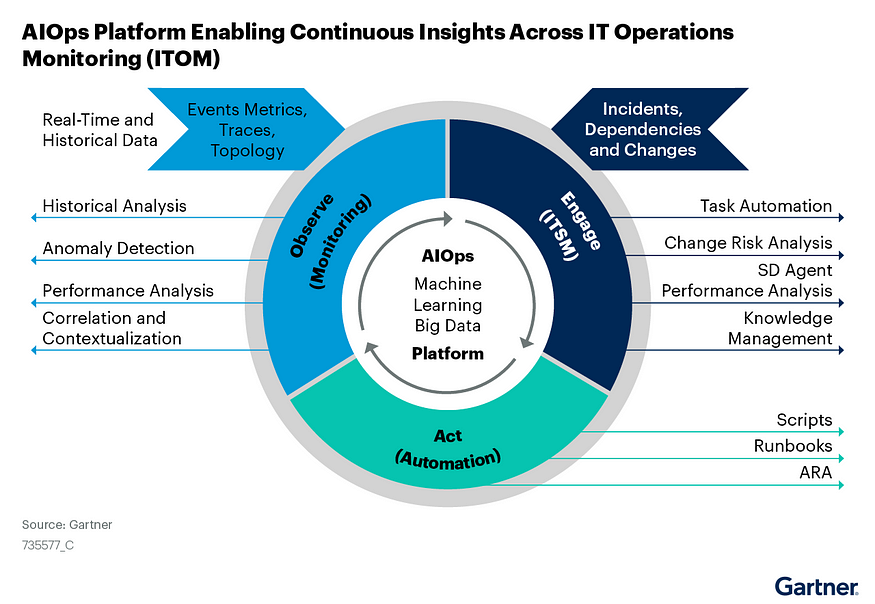

## **Section 3**

**The ML Process and DevOps vs MLOps vs AIOps**

    

### **DevOps: The Confluence of Development, Operations, and Quality Assurance**

* DevOps brings together development, quality assurance, and operations  involving people, processes, and technology to streamline software development and release throughput using a cycle of Continuous Integration(CI) and Continuous Deployment(CD).

* In DevOps, 
    * developers merge their code changes to a central repository like GitHub. 
    * These incremental code changes can be done frequently and reliably. 
    * Once the code is committed this initiates an automated build that performs automated unit, integration, and system tests. 
    * The process of committing code that initiates automated build is Continuous Integration(CI). 
    * CI makes it easier for developers to develop and commit the code. 
    * When the code is committed, an automated build is initiated to provide developers instant feedback on if the build has issues or is successful.
* Continuous Deployment(CD) allows the newly built code to be tested and deployed in different environments: Test, Stage, UAT, and Production. 
* CD enables automated deployment and testing in different environments, increasing the quality of the releases to production.
* How does Dev Ops help? DevOps helps with
    * Collaboration: Enhances collaboration between the Development team, QA Team, and Operations team as it encourages them to work together to deliver one common objective of generating business value.
    * Faster Mean Time To Resolution(MTTR): DevOps enable faster, more frequent, and reliable deployments to production, reducing the duration from feedback to releases, thus increasing responsiveness.
    * Reliability: The complexity of the change is low as there are regular updates to the code and frequent releases to production using the automated DevOps workflow; hence releases are more reliable and of higher quality.
    * Customer Satisfaction: Customers/Business raises issues/enhancements that go into the feedback cycle. Faster resolution of the issues/enhancements leads to greater customer satisfaction.

    **MLOps**

* Now, these applications are available, are running reliably and are generating voluminous amounts of data. 
* You would like to analyze and interpret data patterns to efficiently and accurately predict and prescribe data-driven decisions.
* This is where Machine Learning Algorithms come into play
* 

* Machine learning algorithms take the data and the results as an input to identify the patterns using machine learning algorithms to build analytical models.
* For example, Financial institutions use their customer’s transactional data and machine learning algorithms like clustering to identify patterns of fraud or legitimate transactions.
* In machine learning, you need to deal with lots of experimentation and ensure model traceability and compare model metrics and hyperparameters for all the different experiments.
* What if you could automate and monitor all steps of an ML system?
* [MLOps ](https://medium.com/swlh/a-basic-understanding-of-ml-ops-a9f289afaf27)is an ML engineering culture and practice to unify ML system development (Dev) and ML system operation (Ops) where Data scientists, data Engineers, and Operations teams collaborate.
* 

* ML Ops build the ML pipeline to encompass all stages of Machine Learning:
    * Data extraction
    * Data exploration and validation
    * Data curation or data preprocessing
    * Feature analysis
    * Model training and evaluation
    * Model validation
    * Model deployment or model serving 
    * Model monitoring for data drift and concept drift

    

* How does ML Ops help?
    * To leverage machine learning models, you need to curate the data by applying data preprocessing techniques, perform feature analysis to identify the best features for the model prediction, train the model on the selected features, perform error analysis on the model, deploy the model and then monitor the model for any data drift or concept drift. If the model degrades performance, retrain the model again by repeating the steps from data curation to deployment and monitoring.
    * ML Ops helps with Continuous Integration(CI) for data and models, Continuous Training(CT) of models, and then Continuous Deployment(CD) of the models to Production at different locations.
    * ML Ops helps to
        * Effectively manage the full ML lifecycle.
        * Creates a Repeatable and Reusable ML Workflow for consistent model training, deployment, and maintenance.
        * Innovation can be made easy and faster by building repeatable workflows to train, evaluate, deploy, and monitor different models.
        * Track different versions of model and data to enable auditing
        * Easy Deployment to production with high precision

    **AIOps**

    * AIOps is understood in general to be defined as  **_Artificial Intelligence for IT Operations (it should be AI4ITOps)_**
    * The term originally was much broader than that
    * Data from different systems are digitized, and organizations are going through digital  transformation and striving to have a data-driven culture. 
    * IT Operations teams now need to monitor these voluminous, complex, and relatively opaque datasets to troubleshoot issues and complete routine operational tasks much faster than before.
    * Due to the complexity and constant changes to IT Systems, platforms are needed to derive insights from the operational data throughout the application life cycle.
    * AIOps applies analytics and machine learning capabilities to IT operations data 
        * to separate significant events from noise in the operation data 
        * to identify root causes  
        * to prescribe resolutions
    * Per Gartner
        * _AI Ops platform ingest, index and normalize events or telemetry data from multiple domains, vendors, and sources, including infrastructure, networks, apps, the cloud, or existing monitoring tools._
* AI Ops platforms enable data analytics using machine learning methods, including real-time analysis at the point of ingestion and historical analysis of stored operational data like system logs, metrics, network data, incident-related data, etc.
* How does AIOps help? Well, It helps by focusing businesses on
    * Increasing IT operations efficiency by uncovering IT incidents insights, measuring the effectiveness of the IT applications serving business needs, and performing cause-and-effect analysis of peak usage traffic patterns.
    * Promoting innovation: Fosters innovation by removing manual monitoring of production systems by providing high-quality application diagnostics.
    * Lowering the operational cost as it decreases mean time to resolution(MTTR) and drastically reduces costly downtime, increasing overall productivity and efficiency.
    * Accelerating the return on investment by enabling teams to collaborate towards a faster resolution

    

* Per Gartner
    * There is no future of IT operations that does not include AIOps. This is due to the rapid growth in data volumes and pace of change exemplified by rate of application delivery and event-driven business models that cannot wait on humans to derive insights.
* Future of AI-Assisted IT Operations
    * The Future of AI-assisted IT Operations is to have prescriptive advice from the platform, triggering action.

    

* So in summary,
    * DevOps co-opts development, quality assurance, and operations  involving people, processes, and technology to streamline the software development lifecycle and reduced mean time to resolution
    * MLOps is a discipline that combines Machine Learning, Data Engineering, and Dev Ops to build automated ML pipelines for Continuous Training and CI/CD to manage the full ML lifecycle effectively
    * AIOps is a platform to monitor and automate the data and information flowing from IT applications that utilizes big data, machine learning, and other advanced analytics technologies