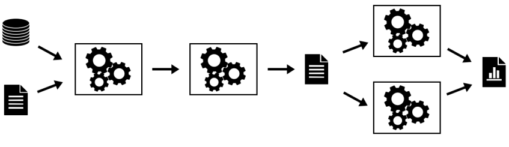
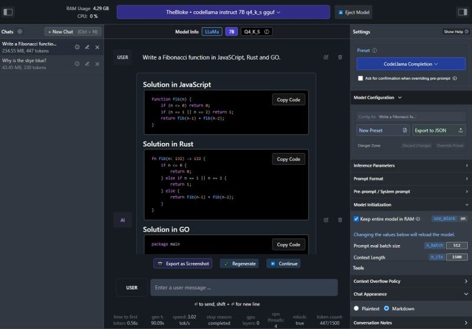

**Section 4________________________________________**

**Back to the Basics: Data Collection and Data Management**

* MLOps requires highly disciplined data collection and management. 
* It is particularly needed when the outcomes could affect people’s careers, students' lives and educational organization’s reputations.
* Towards that,  let us take a look at framework used as the basis to make some very important decisions:

[https://github.com/keshavaspanda/openneuro](https://github.com/keshavaspanda/openneuro)

The Data Submission Process

**Let’s consider our context and ask ourselves the following questions:**

* Could Modalities be equivalent to Disciplines? 
* What are the Discipline independent metadata and discipline dependent metadata
* For each discipline, what metadata can we standardize on? 
* What could be our equivalent to the BIDS validator? 
* Are there existing standards that we can leverage to this data? 

### **Understanding Responsible and FAIR Data Collection in this context**

* There is growing recognition of the importance of data sharing for scientific progress 
* However, not all shared data is equally useful. 
* The FAIR principles have formalized the notion that in order for shared data to be maximally useful, they need to be **findable**, **accessible**, **interoperable**, and **reusable**. 
* An essential necessity for achieving these goals is that the data and associated metadata follow a common standard for organization, so that data users can easily understand and **reuse **the shared data. 
* The AI4Edu data archive will enable FAIR-compliant data sharing for a growing range of education data types through the use of a common community standard, the Educational Data Structure (EDS)  .
* Data sharing has become well established in education and Datasets collected about education and educational processes have provided immense value to the field and have strongly demonstrated the utility of shared data. 
* However, their scientific scope is necessarily limited, given that each dataset includes only a limited number of tasks and measurement types. 
* Beyond these large focused data sharing projects, there is a ‘long tail’ of smaller datasets that have been collected in service of specific research questions in education. 
* Making these available is essential to ensure **reproducibility **as well as to allow aggregation across many different types of measurements in service of novel scientific questions. 
* The AI4Edu archive will address this challenge by providing researchers with the ability to easily share a broad range of education data types in a way that adheres to the FAIR principles.

**Core principles of the Data Archive**

**_Sharing only upon gaining permissions_**

* There is a range of restrictiveness across data archives with regard to their data use agreements. 
* At one end of the spectrum are highly restricted databases which require researchers to submit their scientific question for review and requires the consortium to be included as a corporate author on any publications. 
* The other pole of restrictiveness  releases data (by default) under a Creative Commons Zero (CC0) Public Domain Dedication which places no restrictions on who can use the data or what can be done with them. 
* While not legally required, researchers using the data are expected to abide by community norms and cite the data following the guidelines included within each dataset. 
* The primary motivation for this policy is that it makes the data maximally accessible to the largest possible number of researchers and citizen-scientists.
* In the AI4Edu data archive effort we will strike a balance and provide ABAC over the data. 
* Subsequently we will create DIDs and ensure that personal data is always in the control of the individual who owns that data. 

**_Standards-focused data sharing_**

* To ensure the utility of shared data for the purposes of efficient discovery, reuse, and reproducibility, standards are required for data and metadata organization. 
* These standards make the structure of the data clear to users and thus reduce the need for support by data owners and curation by repository owners, as well as enabling automated QA, preprocessing, and analytics. 
* Unfortunately, most prior data sharing projects in this space have relied upon custom organizational schemes, which can lead to misunderstanding and can also require substantial reorganization to adapt to common analysis workflows. 
* The need for a clearly defined standard for data emerged from experiences in the other projects where the repository had developed a custom scheme for data organization and file naming, this scheme was ad hoc and limited in its coverage, and datasets often required substantial manual curation (involving laborious interaction with data owners). 
* In addition, there was no built in mechanism to **_directly validate whether a particular dataset met the standard_**.
* For these reasons, we focus at the outset of the AI4Edu project on developing a robust data organization standard that could be implemented in an automated validator. 
* We will engage representatives from the education community to establish a standard as a community standard for a broad and growing range of education data types. 
* EDS will define a set of schemas for file and folder organization and naming, along with a schema for metadata organization. 
* The framework was inspired by the existing data organization frameworks used in many organizations, so that transitioning to the standard is relatively easy for most researchers. 
* One of the important features of EDS is its extensibility; using a scheme inspired by open-source software projects, community members can propose extensions to EDS that encompass new data types. 
* All data uploaded to OpenEdu must first pass an EDS validation step, such that all data in OpenEdu are compliant with the EDS specifications at upload time. 
* Conversely, the Edu4AI  team will make substantial contributions to the EDS standard and validator. 
* As a consequence, this model maximizes compatibility with processing and analysis tools but more importantly, it effectively minimizes the potential for data misinterpretation (e.g., when owner and reuser have slightly different definitions of a critical acquisition parameter). Through the adoption of EDS, OpenEdu can move away from project- or database-specific data structures designed by the owner or the distributor (as used in earlier projects) and toward a uniform and unambiguous representation model agreed upon by the research community prior to sharing and reuse.

#### **FAIR sharing**

* The FAIR principles have provided an important framework to guide the development and assessment of open data resources. 
* AI4Edu will implement these principles.
* Findable: 
    * Each dataset within AI4Edu is associated with metadata, both directly from the dataset along with additional dataset-level metadata provided by the submitter at time of submission. 
    * Both data and metadata are assigned a persistent unique identifier (Digital Object Identifier [DOI]). 
    * Within the repository, a machine-readable summary of the metadata is collected by the  validator and indexed with an ElasticSearch mapping. 
    * In addition, dataset-level metadata are exposed according to the [schema.org](https://schema.org/) standard, which allows indexing by external resources such as Google Dataset Search.
    * Accessible: Data and metadata can be retrieved using a number of access methods (directly from Amazon S3, using the command line tool, or using DataLad) via standard protocols (http/https). 
    * Metadata are also accessible programmatically via a web API. Metadata remains available even in the case that data must be removed (e.g., in cases of human subjects concerns). 
    * Authentication is necessary to access the data.
* Interoperable: 
    * The data and metadata use the EDS standard to ensure accessible representation and interoperation with analysis workflows. 
    * 
* Reusable: 
    * The data are released with a clear data use agreement. 
    * Through use of the standard, the data and metadata are consistent with community standards in the field.
* **Data versioning and preservation**
    * AI4Edu will keep track of all changes in stored datasets and allows researchers to unambiguously report the exact version of the data used for any analysis. 
    * AI4Edu will preserve all versions of the data through the creation of ‘snapshots’ that unequivocally point to one specific point in the lifetime of a dataset. 
    * Data management and snapshots are supported by DataLad, a free and open-source distributed data management system.
* **Protecting privacy and confidentiality of data**
    * There is a direct relationship in data sharing between the openness of the data and their reuse potential; all else being equal, data that are more easily or openly available will be more easily and readily reused. 
    * However, all else is not equal, as openness raises concern regarding risks to subject privacy and confidentiality of data in human subjects research. 
    * Researchers are ethically bound to both minimize the risks to their research participants (including risks to confidentiality) and to maximize the benefits of their participation. 
    * Because sharing of data will necessarily increase the potential utility of the data, researchers are ethically bound to share human subject data unless the benefits of sharing are outweighed by risks to the participant.
    * In general, risks to data privacy and confidentiality are addressed through deidentification of the data to be shared. 
    * De-identification can be achieved through the removal of any of 18 personal identifiers, unless the researcher has knowledge that the remaining data could be re-identified (known as the ‘safe harbor’ method). 
    * All data shared through OpenEdu must have the 18 personal identifiers outlined by HIPAA unless an exception is provided in cases where an investigator has explicit permission to openly share the data, usually when the data are collected by the investigator themself. 
    * At present, data are examined by a human curator to ensure that this requirement has been met. 
    * Truly informed consent requires that subjects be made aware that their data may be shared. 
    * Researchers planning to share their data via the data sharing portal use a consent form (could be based on the Open Brain Consent form), which includes language that ensures subject awareness of the intent to share and its potential impact on the risk of participating. 

#### **Open source**

* The entirety of the code for AI4Edu will be available under a permissive open-source software license (MIT License) at github.
* This enables any researcher who wishes to reuse part or all of the code or to run their own instance of the platform.

**Section 5________________________________________**

**Data Analysis, Data Visualization, Data Lake Houses and Analytics Dashboards **

* Once data is “FAIR” ly collected and placed in an archive, it needs to be checked for quality, analyzed, visualized profiled and then models need to be selected, trained (on the curated data), tested and served up for use.
* That requires data management and analytics capabilities that can deal with structured, semi-structured and unstructured data with the data lake capturing all of the data. 
* The data warehouse dealing with structured data and the analytical dashboards surfacing both structured and unstructured content and visualization. 
* This is where the data lake house architecture has become popular.  
* As the name suggests, a data lake house architecture combines a [data lake](https://www.dremio.com/wiki/data-lake/) and a [data warehouse](https://www.dremio.com/wiki/data-warehouse/). 
* Although it is not just a mere integration between the two, the idea is to bring the best out of the two architectures: the reliable transactions of a data warehouse and the scalability and low cost of a data lake.
* Over the last decade, businesses have been heavily investing in their data strategy to be able to deduce relevant insights and use them for critical decision-making. 
* This has helped them reduce operational costs, predict future sales, and take strategic actions.
* A lake house is a new type of data platform architecture that:
* Provides the data management capabilities of a data warehouse and takes advantage of the scalability and agility of data lakes
* Helps reduce data duplication by serving as the single platform for all types of workloads (e.g., BI, ML)
* Is cost-efficient
* Prevents vendor lock-in and lock-out by leveraging open standards

### **Evolution of the Data Lakehouse**

* [Data Lake House](https://www.dremio.com/resources/guides/what-is-a-data-lakehouse/) is a relatively new term in big data architecture and has evolved rapidly in recent years. It combines the best of both worlds: the scalability and flexibility of data lakes, and the reliability and performance of data warehouses. 
* Data lakes, which were first introduced in the early 2010s, provide a centralized repository for storing large amounts of raw, unstructured data. 
* Data warehouses, on the other hand, have been around for much longer and are designed to store structured data for quick and efficient querying and analysis. 
* However, data warehouses can be expensive and complex to set up, and they often require extensive data transformation and cleaning before data can be loaded and analyzed. 
* Data lake houses were created to address these challenges and provide a more cost-effective and scalable solution for big data management.
* With the increasing amount of data generated by businesses and the need for fast and efficient [data processing](https://www.dremio.com/wiki/data-processing/), the demand for a data lake house has grown considerably. As a result, many companies have adopted this new approach, which has evolved into a central repository for all types of data in an organization.

---

### **What Does a Data Lake House Do?**

There are four key problems in the world of data architecture that data lake houses address: 

* Solves the issues related to data silos by providing a centralized repository for storing and managing large amounts of structured and unstructured data. 
* Eliminates the need for complex and time-consuming data movements, reducing the latency associated with shifting data between systems.
* Enables organizations to perform fast and efficient data processing, making it possible to quickly analyze and make decisions based on the data. 
* Finally, a data lake house provides a scalable and flexible solution for storing large amounts of data, making it possible for organizations to easily manage and access their data as their needs grow.

Data warehouses are designed to help organizations manage and analyze large volumes of structured data.

---

### **How Does a Data Lake House Work?**

* A data lakehouse operates by utilizing a multi-layer architecture that integrates the benefits of data lakes and data warehouses. 
* It starts with ingesting large amounts of raw data, including both structured and unstructured formats, into the data lake component. 
* This raw data is stored in its original format, allowing organizations to retain all of the information without any loss of detail. 
* From there, advanced data processing and transformation can occur using tools such as [Apache Spark](https://spark.apache.org/) and Apache Hive. 
* The processed data is then organized and optimized for efficient querying in the data warehouse component, where it can be easily analyzed using SQL-based tools. 
* The result is a centralized repository for big data management that supports fast and flexible data exploration, analysis, and reporting. 
* The data lakehouse's scalable infrastructure and ability to handle diverse data types make it a valuable asset for organizations seeking to unlock the full potential of their big data.

---

### **Elements of a Data Lakehouse**

Data lake houses have a range of elements to support organizations’ data management and analysis needs. 

* A key element is the ability to store and process a variety of data types including [structured, semi-structured, and unstructured data](https://www.dremio.com/wiki/structured-vs-unstructured-data/). 
* They provide a centralized repository for storing data, allowing organizations to store all of their data in one place, making it easier to manage and analyze. 
* The data management layer enables data to be governed, secured, and transformed as needed. 
* The data processing layer provides analytics and machine learning capabilities, allowing organizations to quickly and effectively analyze their data and make data-driven decisions. 
* Another important element of a data lakehouse is the ability to provide real-time processing and analysis, which enables organizations to respond quickly to changing business conditions. 

---

### **Cloud Data Lake**

* Data lake houses are often spoken in tandem with [cloud data lakes](https://www.dremio.com/resources/guides/cloud-data-lakes/) and cloud data warehouses. With the increasing adoption of cloud-based solutions, many organizations have turned to cloud data lakes to build their data platforms. 
* Cloud data lakes provide organizations with the flexibility to scale storage and compute components independently, thereby optimizing their resources and improving their overall cost efficiency. 
* By separating storage and computing, organizations can store any amount of data in open file formats like [Apache Parquet](https://www.dremio.com/resources/guides/intro-apache-parquet/) and then use a computing engine to process the data. 
* Additionally, the elastic nature of cloud data lakes enables workloads – like machine learning – to run directly on the data without needing to move data out of the data lake.

Despite the many benefits of cloud data lakes, there are also some potential drawbacks: 

* One challenge is ensuring the quality and governance of data in the lake, particularly as the volume and diversity of data stored in the lake increases.
* Another challenge is the need to move data from the data lake to downstream applications – such as business intelligence tools – which often require additional data copies and can lead to job failures and other downstream issues. 
* Additionally, because data is stored in raw formats and written by many different tools and jobs, files may not always be optimized for query engines and low-latency analytical applications.+

**Lets start up a Dremio DataLakehouse with MinIO and Apache Superset Dashboards **

First create a Dremio cloud account:

[https://www.dremio.com/resources/tutorials/from-signup-to-subsecond-dashboards-in-minutes-with-dremio-cloud/](https://www.dremio.com/resources/tutorials/from-signup-to-subsecond-dashboards-in-minutes-with-dremio-cloud/)

** Then let’s try out this: [https://github.com/developer-advocacy-dremio/quick-guides-from-dremio/blob/main/guides/superset-dremio.md](https://github.com/developer-advocacy-dremio/quick-guides-from-dremio/blob/main/guides/superset-dremio.md)**

---

### **Cloud Data Warehouse**

* The first generation of on-premises data warehouses provide businesses with the ability to derive historical insights from multiple data sources. 
* However, this solution required significant investments in terms of both cost and infrastructure management. In response to these challenges, the next generation of data warehouses leveraged cloud-based solutions to address these limitations.
* One of the primary advantages of cloud data warehouses is the ability to separate storage and computing, allowing each component to scale independently. This feature helps to optimize resources and reduce costs associated with on-premises physical servers. 
* However, there are also some potential drawbacks to using cloud data warehouses: 
* While they do reduce some costs, they can still be relatively expensive.
* Additionally, running any workload where performance matters often requires copying data into the data warehouse before processing, which can lead to additional costs and complexity. 
* Moreover, data in cloud data warehouses is often stored in a vendor-specific format, leading to lock-in/lock-out issues, although some cloud data warehouses do offer the option to store data in external storage. 
* Finally, support for multiple analytical workloads, particularly those related to unstructured data like machine learning, is still unavailable in some cloud data warehouses.

---

### **Future of the Data Lakehouse**

* Upon discussion of data lake houses, their elements, and what they do, it’s only natural to look at the implications of this technology moving forward. 
* The future looks very promising, as more and more organizations are embracing big data and the need for flexible, scalable, and cost-effective solutions for managing it continues to grow. 
* In the coming years, expect to see increased adoption of data lake houses, with organizations of all sizes and across all industries recognizing their value in providing a unified platform for managing and analyzing big data. 
* Additionally, expect to see continued innovation and advancements in data lakehouse technology, such as improved data processing and transformation capabilities, enhanced security and governance features, and expanded integration with other data management tools and technologies.
* The rise of machine learning and artificial intelligence will drive the need for flexible and scalable big data platforms that can support the development and deployment of these advanced analytics models. 
* The future of data lake houses will also be influenced by the increasing importance of data privacy and security, and we can expect to see data lake houses evolving to meet these new requirements, including better data masking and data encryption capabilities. 
* Overall, the future of data lake houses looks bright, and they are likely to play an increasingly critical role in helping organizations extract value from their big data.

**Section 5________________________________________**

**Data Analysis, Data Visualization, Data Lake Houses and Analytics Dashboards**

* Once data is “FAIR” ly collected and placed in an archive, it needs to be checked for quality, analyzed, visualized profiled and then models need to be selected, trained (on the curated data), tested and served up for use.
* That requires data management and analytics capabilities that can deal with structured, semi-structured and unstructured data with the data lake capturing all of the data. 
* The data warehouse dealing with structured data and the analytical dashboards surfacing both structured and unstructured content and visualization. 
* This is where the data lake house architecture has become popular.  
* As the name suggests, a data lake house architecture combines a [data lake](https://www.dremio.com/wiki/data-lake/) and a [data warehouse](https://www.dremio.com/wiki/data-warehouse/). 
* Although it is not just a mere integration between the two, the idea is to bring the best out of the two architectures: the reliable transactions of a data warehouse and the scalability and low cost of a data lake.
* Over the last decade, businesses have been heavily investing in their data strategy to be able to deduce relevant insights and use them for critical decision-making. 
* This has helped them reduce operational costs, predict future sales, and take strategic actions.
* A lake house is a new type of data platform architecture that:
* Provides the data management capabilities of a data warehouse and takes advantage of the scalability and agility of data lakes
* Helps reduce data duplication by serving as the single platform for all types of workloads (e.g., BI, ML)
* Is cost-efficient
* Prevents vendor lock-in and lock-out by leveraging open standards

### **Evolution of the Data Lakehouse**

* [Data Lake House](https://www.dremio.com/resources/guides/what-is-a-data-lakehouse/) is a relatively new term in big data architecture and has evolved rapidly in recent years. It combines the best of both worlds: the scalability and flexibility of data lakes, and the reliability and performance of data warehouses. 
* Data lakes, which were first introduced in the early 2010s, provide a centralized repository for storing large amounts of raw, unstructured data. 
* Data warehouses, on the other hand, have been around for much longer and are designed to store structured data for quick and efficient querying and analysis. 
* However, data warehouses can be expensive and complex to set up, and they often require extensive data transformation and cleaning before data can be loaded and analyzed. 
* Data lake houses were created to address these challenges and provide a more cost-effective and scalable solution for big data management.
* With the increasing amount of data generated by businesses and the need for fast and efficient [data processing](https://www.dremio.com/wiki/data-processing/), the demand for a data lake house has grown considerably. As a result, many companies have adopted this new approach, which has evolved into a central repository for all types of data in an organization.

---

### **What Does a Data Lake House Do?**

There are four key problems in the world of data architecture that data lake houses address: 

* Solves the issues related to data silos by providing a centralized repository for storing and managing large amounts of structured and unstructured data. 
* Eliminates the need for complex and time-consuming data movements, reducing the latency associated with shifting data between systems.
* Enables organizations to perform fast and efficient data processing, making it possible to quickly analyze and make decisions based on the data. 
* Finally, a data lake house provides a scalable and flexible solution for storing large amounts of data, making it possible for organizations to easily manage and access their data as their needs grow.

Data warehouses are designed to help organizations manage and analyze large volumes of structured data.

---

### **How Does a Data Lake House Work?**

* A data lakehouse operates by utilizing a multi-layer architecture that integrates the benefits of data lakes and data warehouses. 
* It starts with ingesting large amounts of raw data, including both structured and unstructured formats, into the data lake component. 
* This raw data is stored in its original format, allowing organizations to retain all of the information without any loss of detail. 
* From there, advanced data processing and transformation can occur using tools such as [Apache Spark](https://spark.apache.org/) and Apache Hive. 
* The processed data is then organized and optimized for efficient querying in the data warehouse component, where it can be easily analyzed using SQL-based tools. 
* The result is a centralized repository for big data management that supports fast and flexible data exploration, analysis, and reporting. 
* The data lakehouse's scalable infrastructure and ability to handle diverse data types make it a valuable asset for organizations seeking to unlock the full potential of their big data.

---

### **Elements of a Data Lakehouse**

Data lake houses have a range of elements to support organizations’ data management and analysis needs. 

* A key element is the ability to store and process a variety of data types including [structured, semi-structured, and unstructured data](https://www.dremio.com/wiki/structured-vs-unstructured-data/). 
* They provide a centralized repository for storing data, allowing organizations to store all of their data in one place, making it easier to manage and analyze. 
* The data management layer enables data to be governed, secured, and transformed as needed. 
* The data processing layer provides analytics and machine learning capabilities, allowing organizations to quickly and effectively analyze their data and make data-driven decisions. 
* Another important element of a data lakehouse is the ability to provide real-time processing and analysis, which enables organizations to respond quickly to changing business conditions. 

---

### **Cloud Data Lake**

* Data lake houses are often spoken in tandem with [cloud data lakes](https://www.dremio.com/resources/guides/cloud-data-lakes/) and cloud data warehouses. With the increasing adoption of cloud-based solutions, many organizations have turned to cloud data lakes to build their data platforms. 
* Cloud data lakes provide organizations with the flexibility to scale storage and compute components independently, thereby optimizing their resources and improving their overall cost efficiency. 
* By separating storage and computing, organizations can store any amount of data in open file formats like [Apache Parquet](https://www.dremio.com/resources/guides/intro-apache-parquet/) and then use a computing engine to process the data. 
* Additionally, the elastic nature of cloud data lakes enables workloads – like machine learning – to run directly on the data without needing to move data out of the data lake.

Despite the many benefits of cloud data lakes, there are also some potential drawbacks: 

* One challenge is ensuring the quality and governance of data in the lake, particularly as the volume and diversity of data stored in the lake increases.
* Another challenge is the need to move data from the data lake to downstream applications – such as business intelligence tools – which often require additional data copies and can lead to job failures and other downstream issues. 
* Additionally, because data is stored in raw formats and written by many different tools and jobs, files may not always be optimized for query engines and low-latency analytical applications.+

**Lets start up a Dremio DataLakehouse with MinIO and Apache Superset Dashboards **

First create a Dremio cloud account:

[https://www.dremio.com/resources/tutorials/from-signup-to-subsecond-dashboards-in-minutes-with-dremio-cloud/](https://www.dremio.com/resources/tutorials/from-signup-to-subsecond-dashboards-in-minutes-with-dremio-cloud/)

** Then let’s try out this: [https://github.com/developer-advocacy-dremio/quick-guides-from-dremio/blob/main/guides/superset-dremio.md](https://github.com/developer-advocacy-dremio/quick-guides-from-dremio/blob/main/guides/superset-dremio.md)**

---

### **Cloud Data Warehouse**

* The first generation of on-premises data warehouses provide businesses with the ability to derive historical insights from multiple data sources. 
* However, this solution required significant investments in terms of both cost and infrastructure management. In response to these challenges, the next generation of data warehouses leveraged cloud-based solutions to address these limitations.
* One of the primary advantages of cloud data warehouses is the ability to separate storage and computing, allowing each component to scale independently. This feature helps to optimize resources and reduce costs associated with on-premises physical servers. 
* However, there are also some potential drawbacks to using cloud data warehouses: 
* While they do reduce some costs, they can still be relatively expensive.
* Additionally, running any workload where performance matters often requires copying data into the data warehouse before processing, which can lead to additional costs and complexity. 
* Moreover, data in cloud data warehouses is often stored in a vendor-specific format, leading to lock-in/lock-out issues, although some cloud data warehouses do offer the option to store data in external storage. 
* Finally, support for multiple analytical workloads, particularly those related to unstructured data like machine learning, is still unavailable in some cloud data warehouses.

---

### **Future of the Data Lakehouse**

* Upon discussion of data lake houses, their elements, and what they do, it’s only natural to look at the implications of this technology moving forward. 
* The future looks very promising, as more and more organizations are embracing big data and the need for flexible, scalable, and cost-effective solutions for managing it continues to grow. 
* In the coming years, expect to see increased adoption of data lake houses, with organizations of all sizes and across all industries recognizing their value in providing a unified platform for managing and analyzing big data. 
* Additionally, expect to see continued innovation and advancements in data lakehouse technology, such as improved data processing and transformation capabilities, enhanced security and governance features, and expanded integration with other data management tools and technologies.
* The rise of machine learning and artificial intelligence will drive the need for flexible and scalable big data platforms that can support the development and deployment of these advanced analytics models. 
* The future of data lake houses will also be influenced by the increasing importance of data privacy and security, and we can expect to see data lake houses evolving to meet these new requirements, including better data masking and data encryption capabilities. 
* Overall, the future of data lake houses looks bright, and they are likely to play an increasingly critical role in helping organizations extract value from their big data.
