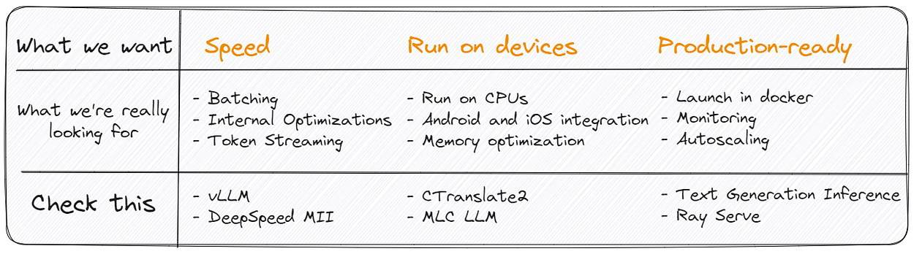
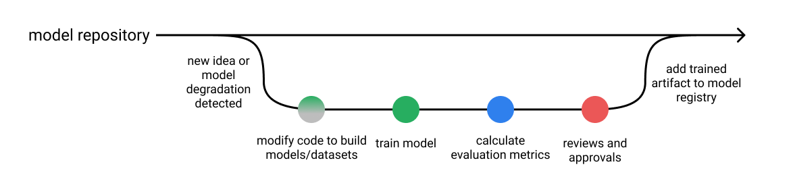
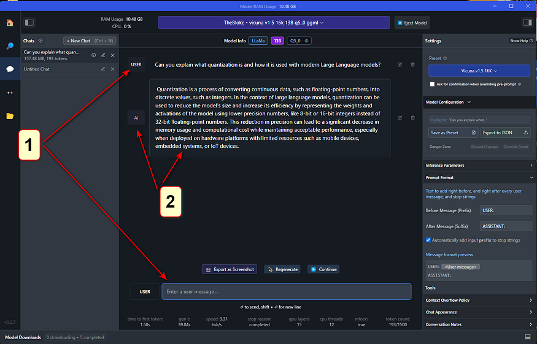
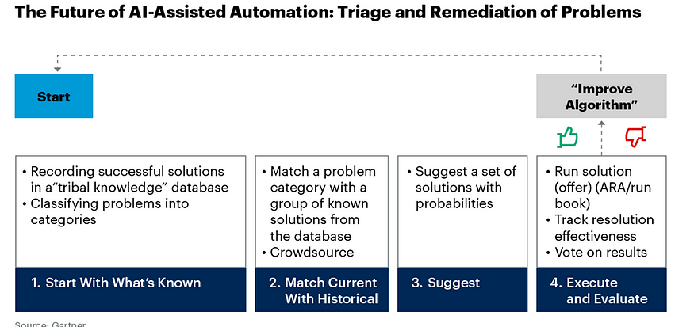
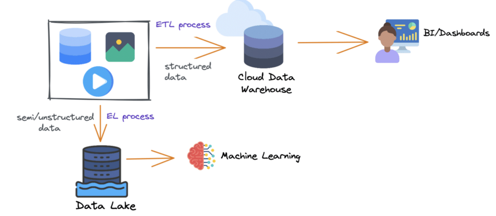

**Section 7________________________________________**

** Pipeline Debt, Data Testing, Model Testing in MLOps **

* You are now part of a data science team at your organization 
* Your team has a number of machine learning models in place
* Their outputs guide critical business decisions, as well as dashboards displaying important financial KPIs 
* These KPIs are closely watched by your executives day/night 
* Early AM, as you are navigating traffic to your office, you suddenly start receiving multiple messages, calls and emails (simultaneously) 
* These are from your manager as well as other teams and from senior management 
* They are all complaining about the same thing: The high visibility business metrics dashboard that you and your team had built the pipelines & dashboards for and deployed as well as many of the dashboards  that many other teams were using (which you did not know until today) were displaying what seemed to be random numbers (except every full hour, when the KPIs look okay for a short time) 
* The financial models that are part of the pipelines are predicting the company’s insolvency looming fast.
* Once you get in and hurriedly try to put in some quick fixes in the pipeline (excluding predictions beyond thresholds etc.) you find out that every fix results in your data engineering and research teams reporting new broken services and models in the pipelines.
* This is the **_Debt Collection Day scenario_** we are trying to avoid desperately here. 
* Of all debts in data engineering the most vengeful unpaid debt is Pipeline Debt. 

**The roots of  Pipeline Debt _(aka The road to hell is paved with good intentions)_**

* A few months ago You were just about to start that new exciting machine learning project. 
* You had located useful data scattered around your company’s databases, [feature stores](https://neptune.ai/blog/feature-stores-components-of-a-data-science-factory-guide), documents, videos, audios and spreadsheets belonging to employees which they (reluctantly) gave you access to (cross silo collaboration is hard). 
* To make the data usable, you constructed a data pipeline: a set of jobs and Python functions that ingest, process, clean and combine all these data. 
* The pipeline feeds the data into a machine learning model. 
* The entire process is depicted schematically below.

    

Simple manageable data pipelines 

The first data pipelines worked well, consistently populating the downstream machine learning model with data, which turned it into accurate predictions. 

However, the model deployed as a service in the cloud was not very actionable.To make it more useful, you built a set of dashboards for presenting the model’s output as well as important KPIs to the business stakeholders, The pipeline deepened

    

Extended pipelines

* You were telling a colleague from the research team about your project over lunch who decided to do something similar with their data, making the company’s data pipeline wider and cross-team-border.

    

    More pipelines, more complexity 

* A few weeks later the two of you who were informally collaborating on these dashboards got together and talked about each of your pipelines and dashboards. 
* As you’ve learned more about what the research team was up to, both of you noticed how useful and valuable it would be if your two teams used each other’s data for powering your respective models and analyses. 
* Upon implementing this idea, the company’s data pipeline was looking like this.

    

If multiple pipelines exist, they will inevitably blend

* This diagram should have made you flinch – what they show is **_accumulating pipeline debt_** which is technical debt in data pipelines 
* It arises when your data pipelines are triple-U: **_Undocumented, Untested, Unstable_**
* It comes in many flavors but all share some characteristics. 
* The system is entangled; so, a change in one place can derail a different process elsewhere. 
* This makes code refactoring and debugging exceptionally hard. 
* For a software engineer, this will sound like a solved problem 
* The solution is called automated testing. 
* However, testing software is very different from testing data in two major ways:
    * First, while you have full control over your code and can change it when it doesn’t work, you can’t always change your data; in many cases, you are merely an observer watching data as it comes, generated by some real-world process.
    * Second, software code is always right or wrong: either it does what it is designed to do, or it doesn’t. Data is never right or wrong. It can only be suitable or not for a particular purpose. 
* This is why automated testing needs a special approach when data is involved.

**Testing machine learning models**

* Fundamentally when testing ML Models, we are asking the question: “Do we know if the model actually works?” 
* We want to be sure that the learned model will behave consistently and produce the results expected of it **_per expectation. _**

    

**_A typical workflow for software development._**

* In traditional software development, when we run our testing suite against the code, we'll get a report of the specific behaviors that we've written tests around and verify that our code changes don't affect the expected behavior of the system. 
* If a test fails, we'll know which specific behavior is no longer aligned with our expected output. 
* We can also look at this testing report to get an understanding of how extensive our tests are by looking at metrics such as [code coverage](https://en.wikipedia.org/wiki/Code_coverage?ref=jeremyjordan.me).

    

* Unlike traditional software applications, it is not as straightforward to establish a standard for testing ML applications 
* This is because the tests do not just depend on the software, they also rely on
    * the business context
    * problem domain
    * the dataset used
    * the model selected. 
* Most teams are comfortable using model [evaluation metrics](https://neptune.ai/blog/performance-metrics-in-machine-learning-complete-guide) to quantify a model’s performance before deploying it, but [these metrics are just not enough](https://www.jeremyjordan.me/testing-ml#what-s-the-difference-between-model-testing-and-model-evaluation) to ensure ML models are ready for production deployment and use. 
* Contrast a typical software development workflow with one for developing machine learning systems. 
    * After training a new model, we'll typically produce an evaluation report including:
    * performance of an established metric on a validation dataset,
    * plots such as precision-recall curves,
    * operational statistics such as inference speed,
    * examples where the model was most confidently incorrect,

**We will rigorously follow practices such as:**

* Save all of the hyper-parameters used to train the model along with the model,
* Only promote models which offer an **_improvement _**over the existing model (or baseline) when evaluated on the same dataset.

    

A typical workflow for model development.

* When reviewing a new machine learning model, we'll inspect metrics and plots which summarize model performance over a validation dataset. 
* We're able to compare performance between multiple models and make relative judgements, but we're not immediately able to characterize specific model behaviors. 
* For example, figuring out **_where_ **the model is failing usually requires additional investigative work 
* One common practice here is to look through a list of the top most egregious model errors on the validation dataset and manually categorize these failure modes.
* Assuming we write behavioral tests for our models (discussed below), there's also the question of whether or not we have **_enough _**tests! 
* While traditional software tests have metrics such as the lines of code covered when running tests, this becomes harder to quantify when you shift your application logic from lines of code to **_parameters of a machine learning model_**. 
* Do we want to quantify our test coverage with respect to the input data distribution? Or perhaps the possible **_activations _**inside the model?
* _[Odena et al](http://proceedings.mlr.press/v97/odena19a/odena19a.pdf?ref=jeremyjordan.me). introduce one possible metric for coverage where we track the model logits for all of the test examples and quantify the area covered by radial neighborhoods around these activation vectors. _
* _As an industry we **don't **have well-established standards here _
* _Testing for machine learning systems is in early days _
* _The question of ML Model Test coverage isn't really being asked by most people (certainly not in industry)._

### **Difference between model testing and model evaluation**

* While reporting evaluation metrics is certainly a good practice for quality assurance during model development, it is insufficient. 
* Without a **granular report of specific behaviors**, we won't be able to immediately understand the nuances of how behavior may change if we switch over to the new model. 
* Additionally, we won't be able to track (and prevent) **_behavioral regressions_** for specific failure modes that had been previously addressed.
* This can be especially dangerous for machine learning systems since oftentimes failures happen silently. 
* For example, 
    * you might improve the overall evaluation metric but introduce a regression on a critical subset of data. 
    * Or you could unknowingly add a gender bias to the model through the inclusion of a new dataset during training. 
* We need more nuanced reports of model behavior to identify such cases, which is exactly where model testing can help.
* For machine learning systems, we should be running model evaluation and model tests in parallel.
* **Model evaluation** covers metrics and plots which summarize performance on a validation or test dataset.
* **Model testing** involves explicit checks for behaviors that we expect our model to follow.
* Both of these perspectives are instrumental in building high-quality models.
* In practice, most people are doing a combination of the two where evaluation metrics are calculated automatically and some level of model "testing" is done [manually through error analysis](https://www.coursera.org/learn/machine-learning-projects/lecture/GwViP/carrying-out-error-analysis?ref=jeremyjordan.me) (i.e. classifying failure modes). 
* Developing model tests for machine learning systems can offer a systematic approach towards error analysis.

### **How do you write model tests?**

There are two types of model tests needed.

* **Pre-train** **tests** allow us to identify some bugs early on and short-circuit a training job.
* **Post-train tests** use the trained model artifact to inspect behaviors for a variety of important scenarios that we define.

#### **Pre-train tests**

There are some tests that we can run without needing trained parameters. These tests include:

* check the shape of your model output and ensure it aligns with the labels in your dataset
* check the output ranges and ensure it aligns with our expectations (eg. the output of a classification model should be a distribution with class probabilities that sum to 1)
* make sure a single gradient step on a batch of data yields a decrease in your loss
* make [assertions about your datasets](https://greatexpectations.io/?ref=jeremyjordan.me)
* check for label leakage between your training and validation datasets

The main goal here is to identify some errors early so we can avoid a wasted training job.

#### **Post-train tests**

* However, in order for us to be able to understand model behaviors we'll need to test against trained model artifacts. 
* These tests aim to **interrogate the logic learned during training** and provide us with a behavioral report of model performance.

**_Reference: [Beyond Accuracy: Behavioral Testing of NLP Models with CheckList](https://homes.cs.washington.edu/~marcotcr/acl20_checklist.pdf?ref=jeremyjordan.me)_**

* Three different types of model tests can be used to understand behavioral attributes.
* **Invariance Tests**
* Invariance tests allow us to describe a set of perturbations we should be able to make to the input without affecting the model's output. 
* We can use these perturbations to produce pairs of input examples (original and perturbed) and check for consistency in the model predictions. 
* This is closely related to the concept of data augmentation, where we apply perturbations to inputs during training and preserve the original label.
* For example, imagine running a sentiment analysis model on the following two sentences:
    * Mark was a great instructor.
    * Samantha was a great instructor.
* We would expect that simply changing the name of the subject doesn't affect the model predictions.
* **Directional Expectation Tests**
* Directional expectation tests, on the other hand, allow us to define a set of perturbations to the input which _should_ have a _predictable_ effect on the model output.
* For example, if we had a housing price prediction model we might assert:
* Increasing the number of bathrooms (holding all other features constant) should not cause a drop in price.
* Lowering the square footage of the house (holding all other features constant) should not cause an increase in price.
* Let's consider a scenario where a model fails the second test - taking a random row from our validation dataset and decreasing the feature `house_sq_ft` yields a higher predicted price than the original label. 
    * This is surprising as it doesn't match our intuition, so we decide to look further into it 
    * We realize that,_ without having a feature for the house's neighborhood/location, our model has learned that smaller units tend to be more expensive; this is due to the fact that smaller units from our dataset are more prevalent in cities where prices are generally higher. _
* In this case, the _selection_ of our dataset has influenced the model's logic in unintended ways - this isn't something we would have been able to identify simply by examining performance on a validation dataset.
* **Minimum Functionality Tests (aka data unit tests)**
* Just as software unit tests aim to isolate and test atomic components in your codebase, data unit tests allow us to quantify model performance for specific cases found in your data.
* This allows you to identify critical scenarios where prediction errors lead to high consequences. 
* You may also decide to write data unit tests for failure modes that you uncover during error analysis; this allows you to "automate" searching for such errors in future models.
* Take a look at Snorkel ([https://www.snorkel.org/](https://www.snorkel.org/)) who have introduced a very similar approach through their concept of _[slicing functions](https://www.snorkel.org/use-cases/03-spam-data-slicing-tutorial?ref=jeremyjordan.me). _
* These are programmatic functions which allow us to identify subsets of a dataset which meet certain criteria. 
* For example, you might write a slicing function to identify sentences less than 5 words to evaluate how the model performs on short pieces of text.

#### **Organizing tests**

* In traditional software tests, we typically organize our tests to mirror the structure of the code repository. 
* However, this approach doesn't translate well to machine learning models since our logic is structured by the parameters of the model.
* The authors of the CheckList paper linked above recommend structuring your tests around the "skills" we expect the model to acquire while learning to perform a given task.

For example, a sentiment analysis model might be expected to gain some understanding of:

* vocabulary and parts of speech,
* robustness to noise,
* identifying named entities,
* temporal relationships,
* and negation of words.

For an image recognition model, we might expect the model to learn concepts such as:

* object rotation,
* partial occlusion,
* perspective shift,
* lighting conditions,
* weather artifacts (rain, snow, fog),
* and camera artifacts (ISO noise, motion blur).
* 

#### 
    **Model development pipeline**

    

* We also need to perform thorough testing of the **_models _**to ensure they are robust enough for real-world use.
* Let's go through some of the ways we can perform testing for different scenarios.ML testing is problem-dependent. 
* This is **_not _**a template approach but rather a guide to what types of test suites you might want to establish for your application based on your use case.

**Developing, testing, and deploying machine learning models **

**Combining automated tests and manual validation for effective model testing**

* To perform ML testing in their projects, this approach involves having a few levels of tests suites, as well as validation:
* Automated tests for model verification
* Manual model evaluation and validation.
* To implement automated tests in their workflow, [GitOps](https://www.gitops.tech/) can be used. 
* [Jenkins](https://www.jenkins.io/) runs code quality checks and [smoke tests](https://en.wikipedia.org/wiki/Smoke_testing_(software)) using production-like runs in the test environment. 
* A single pipeline for model code is created where every pull request goes through code reviews and automated unit tests.
* The [pull requests](https://www.atlassian.com/git/tutorials/making-a-pull-request) also go through automated smoke tests. 
* The automated test suites’ goal was to make sure tests flagged erroneous code early in the development process.
* After the automation tests are run and passed by the model pipeline, a domain expert manually reviewed the evaluation metrics to make sure that they made sense, validated them, and marked them ready for deployment.

**Automated tests for model verification**

The workflow for the automated tests will be that whenever someone on the team made a commit, 

* the smoke test would run to ensure the code worked, 
* then the unit tests would run, making sure that the assertions in the code and data were met. 
* Finally, the integration tests would run to ensure the model works well with other components in the pipeline.

**Automated smoke test**

* Every pull request goes through automated smoke tests where the team trained models and made predictions, running the entire end-to-end pipeline on some **_small chunk of actual data_** to ensure the pipeline worked as expected and nothing broke. 
* The right kind of testing for the smoke suite can give any team a chance to understand the quality of their pipeline before deploying it. 
* Running the smoke test suite does not mean the entire pipeline is guaranteed to be fully working because the code passed. 
* The team has to consider the unit test suite to test data and model assumptions.

**Automated unit and integration tests**

* The unit and integration tests the team run will check assertions about the dataset to prevent low-quality data from entering the training pipeline and prevent problems with the data preprocessing code. 
* You could think of these assertions as assumptions the team made about the data. 
* For example, they would expect to see some kind of correlation in the data or see that the model’s prediction bounds are non-negative.
* Unit testing machine learning code is more challenging than typical software code. 
* Unit testing several aspects of the model code is very difficult for a team. 
* For example, to test accurately, teams would have to train the model, and even with a modest data set, a unit test could take a long time.
* Furthermore, some of the tests could be erratic and flaky (failed at random). 
* One of the challenges of running the unit tests to assert the data quality is that running these tests on sample datasets was more complex and took way less time than running them on the entire dataset. 
* It was difficult to fix for the team but to address the issues. 
* Some teams opt to eliminate part of the unit tests in favor of smoke tests. 
* The team defines acceptance criteria and their test suite continuously evolves as they experiment by adding new tests, and removing others, gaining more knowledge on what works and what doesn't.
* The model is trained in a production-like environment on a complete dataset for each new pull request, except that they would adjust the hyperparameters at values that resulted in quick results. Finally, they would monitor the pipeline’s health for any issues and catch them early.

The MLOps toolstack **including testing tools**

**Manual model evaluation and validation**

* Have a human-in-the-loop framework where after training the model, reports are  created with different plots showing results based on the dataset, so the domain experts could review them before the model could be shipped.
* After training the model, a domain expert generated and reviewed a model quality report. 
* The expert would approve (or deny) the model through a manual auditing process before it could eventually be shipped to production by the team after getting validation and passing all previous tests.

**Stress Tests and A/B Tests**

* Once the pipeline generates the build (a container image), the models are stress-tested in a production-like environment through the [release pipelines](https://docs.microsoft.com/en-in/azure/devops/pipelines/build/triggers?view=azure-devops#classic-release-pipelines). 
* Depending on the use case, the team also carried out [A/B tests](https://www.seldon.io/a-b-testing-for-machine-learning/) to understand how their models performed in varying conditions before they deployed them, rather than relying purely on offline evaluation metrics. 
* With what they learned from the A/B tests, they knew whether a new model improved a current model and tuned their model to optimize the business metrics better.

**Stress testing machine learning models**

* Testing the model’s performance under extreme workloads is crucial for business applications that typically expect high traffic from users. 
* Therefore, the team performed [stress tests](https://en.wikipedia.org/wiki/Stress_testing_(software)) to see how responsive and stable the model would be under an increased number of prediction requests at a given time scale. 
* This way, they benchmarked the model’s scalability under load and identified the breaking point of the model. In addition, the test helped them determine if the model’s prediction service meets the required service-level objective (SLO) with uptime or response time metrics.
* It is worth noting that the point of stress testing the model**_ isn’t so much to see how many inference requests the model could handle as to see what would happen when users exceed such traffic._** 
* This way, you can understand the model’s performance problems, including the load time, response time, and other bottlenecks.

**Testing model quality after deployment**

* The goal of the testing production models is to ensure that the deployment of the model is successful and the model works correctly in production together with other services. For this team, testing the inference performance of the model in production was a crucial process for continuously providing business value. 
* In addition, the team tested for data and model drift to make sure models could be monitored and perhaps retrained when such drift was detected. On another note, testing production models can enable teams to perform error analysis on their mission-critical models through manual inspection from domain experts.

- An example of a dashboard showing information on data drift for a machine learning project in Azure ML Studio | [Source](https://docs.microsoft.com/en-us/azure/machine-learning/how-to-monitor-datasets?tabs=azure-studio#understand-data-drift-results)

**Drift MonitoringExample:**

[https://github.com/keshavaspanda/drift-monitoring](https://github.com/keshavaspanda/drift-monitoring)

** Behavioral tests for ML (Natural language processing (NLP) and classification tasks)**

* Business use case: The transaction metadata product at MonoHQ uses machine learning to classify transaction statements that are helpful for a variety of corporate customer applications such as credit application, asset planning/management, BNPL (buy now pay later), and payment. Based on the narration, the product classifies transactions for thousands of customers into different categories.
* Before deploying the model, the team conducts a behavioral test. This test consists of 3 elements:
* Prediction distribution,
* Failure rate,
* Latency.
* If the model passes the three tests, the team lists it for deployment. If the model does not pass the tests, they would have to re-work it until it passes the test. They always ensure that they set a performance threshold as a metric for these tests.
* They also perform A/B tests on their models to learn what version is better to put into the production environment.

**Behavioral tests to check for prediction quality**

* This test shows how the model responds to inference data, especially NLP models. 
* First, the team runs an [invariance test](https://deepchecks.com/how-to-test-machine-learning-models/#Invariance), introducing perturbability to the input data.
* Next, they check if the slight change in the input affects the model response—its ability to correctly classify the narration for a customer transaction. 
* Essentially, they are trying to answer here: does a minor tweak in the dataset with a similar context produce consistent output?

**Performance testing for machine learning models**

* To test the response time of the model under load, the team configures a testing environment where they would send a lot of traffic to the model service. Here’s their process:
* They take a large amount of transaction dataset,
* Create a table, 
* Stream the data to the model service,
* Record the inference latency,
* And finally, calculate the average response time for the entire transaction data.
* If the response time passes a specified latency threshold, it is up for deployment. If it doesn’t, the team would have to rework it to improve it or devise another strategy to deploy the model to reduce the latency. 

**A/B testing machine learning models**

* For this test, the team containerizes two models to deploy to the production system for upstream services to consume to the production system. 
* They deploy one of the models to serve traffic from a random sample of users and another to a different sample of users so they can measure the real impact of the model’s results on their users. 
* In addition, they can tune their models using their real customers and measure how they react to the model predictions. 
* This test also helps the team avoid introducing complexity from newly trained that are difficult to maintain and add no value to their users.

** Performing  model engineering and statistical tests for machine learning applications**

* This team performed two types of tests on their machine learning projects:
* Engineering-based tests (unit and integration tests),
* Statistical-based tests (model validation and evaluation metrics). 
* The engineering team ran the unit tests and checked whether the model threw errors. 
* Then, the data team would hand off (to the engineering team) a mock model with the same input-output relationship as the model they were building. 
* Also, the engineering team would test this model to ensure it does not break the production system and then serve it until the correct model from the data team is ready.
* Once the data team and stakeholders evaluate and validate that the model is ready for deployment, the engineering team will run an integration test with the original model. 
* Finally, they will swap the mock model with the original model in production if it works.

**Engineering-based test for machine learning models**

* Unit and integration tests
* To run an initial test to check if the model will integrate well with other services in production, the data team will send a mock (or dummy) model to the engineering team. 
* The mock model has the same structure as the real model, but it only returns the random output. 
* The engineering team will write the service for the mock model and prepare it for testing.
* The data team will provide data and input structures to the engineering team to test whether the input-output relationships match with what they expect, if they are coming in the correct format, and do not throw any errors. 
* The engineering team does not check whether that model is the correct model; they only check if it works from an engineering perspective. 
* They do this to ensure that when the model goes into production, it will not break the product pipeline.
* When the data team trains and evaluates the correct model and stakeholders validate it, the data team will package it and hand it off to the engineering team. 
* The engineering team will swap the mock model with the correct model and then run integration tests to ensure that it works as expected and does not throw any errors.

**Statistical-based test for machine learning models**

* The data team would train, test, and validate their model on real-world data and [statistical evaluation metrics](https://neptune.ai/blog/performance-metrics-in-machine-learning-complete-guide). 
* The head of data science audits the results and approves (or denies) the model. If there is evidence that the model is the correct model, the head of data science will report the results to the necessary stakeholders. 
* He will explain the results and inner workings of the model, the risks of the model, and the errors it makes, and confirm if they are comfortable with the results or the model still needs to be re-worked. 
* If the model is approved, the engineering team swaps the mock model with the original model, reruns an integration test to confirm that it does not throw any error, and then deploy it.
* Model evaluation metrics are **not** enough to ensure your models are ready for production. 
* You also need to perform thorough testing of your models to ensure they are robust enough for real-world encounters.
* Developing tests for ML models can help teams systematically analyze model errors and detect failure modes, so resolution plans are made and implemented before deploying the models to production.

**Automated testing with Great Expectations **

Automated testing tailored for data pipelines is the premise of Great Expectations, a widely used open-source Python package for data validation.

[https://medium.com/dataroots/great-expectations-tutorial-by-paolo-l%C3%A9onard-95e689d73702](https://medium.com/dataroots/great-expectations-tutorial-by-paolo-l%C3%A9onard-95e689d73702)

* The package is built around the concept of an expectation. 
* The expectation can be thought of as a unit test for data. It is a declarative statement that describes the property of a dataset and does so in a simple, human-readable language.
* For example, to assert that the values of the column “num_complaints” in some table in between one and five, you can write:

expect_column_values_to_be_between(

    column="num_complaints",

    min_value=1,

    max_value=5,

)

* This statement will validate your data and return a success or a failure result. 
* As we have already mentioned, you do not always control your data but rather passively observe it flowing. It is often the case that an atypical value pops up in your data from time to time without necessarily being a reason for distress. Great - Expectations accommodate this via the “mostly” keyword which allows for describing how often should the expectation be matched.

expect_column_values_to_be_between(

    column="num_complaints",

    min_value=1,

    max_value=5,

    mostly=0.95,

)

* The above statement will return success if at least 95% of “num_complaints” values are between one and five.
* In order to understand the data well, it is crucial to have some context about why we expect certain properties from it. 
* We can simply add it by passing the “meta”  parameter to the expectation with any relevant information about how it came to be. Our colleagues or even our future selves will thank us for it.

expect_column_values_to_be_between(

    column="num_complaints",

    min_value=1,

    max_value=5,

    mostly=0.95,

    meta={

        “created_by”: “Michal”,

        “craeted_on”: “28.03.2022”,

        “notes”: “number of client complaints; more than 5 is unusual”

                 “and likely means something broke”,

    }

)

* These metadata notes will also form a basis for the data documentation which Great Expectations can just generate out of thin air – but more on this later!
* The package contains several dozen expectations to use out of the box, all of them with wordy, human-readable names such as “expect_column_distinct_values_to_be_in_set”, “expect_column_sum_to_be_between”, or “expect_column_kl_divergence_to_be_less_than”. This syntax allows one to clearly state what is expected of the data and why. 
* Some expectations are applicable to column values, others to their aggregate functions or entire density distributions. Naturally, the package also makes it possible to easily create custom expectations for when a tailored solution is needed.
* Great Expectations works with many different backends. 
* You can evaluate your expectations locally on a Pandas data frame just as easily as on a SQL database (via SQLAlchemy) or on an Apache Spark cluster.
* So, how do the expectations help to reduce pipeline debt? The answer to this is multifold. 
1. 1. The process of crafting the expectations forces us to sit and ponder about our data: its nature, sources, and what can go wrong with it. This creates a deeper understanding and improves data-related communication within the team.
2. 2. By clearly stating what we expect from the data, we can detect any unusual situations such as system outages early on.
3. 3. By validating new data against a set of pre-existing expectations we can be sure we don’t feed our machine learning models garbage.
4. 4. Having the expectations defined brings us very close to having well-maintained data documentation in place. The list goes on and on.

A few specific use cases in which investing time in GE pays back a great deal are:

**Detecting data drift**

* A notorious danger to machine learning models deployed in production is [data drift](https://towardsdatascience.com/dont-let-your-model-s-quality-drift-away-53d2f7899c09). Data drift is a situation when the distribution of model inputs changes. This can happen for a multitude of reasons: data-collecting devices tend to break or have their software updated, which impacts the way data is being recorded. If the data is produced by humans, it is even more volatile as fashions and demographics evolve quickly.
* [Data drift constitutes a serious problem for machine learning models](https://neptune.ai/blog/concept-drift-best-practices). It can make the decision boundaries learned by the algorithm invalid for the new-regime data, which has a detrimental impact on the model’s performance.
* Data drift may impact the model’s performance
* You have collected and cleaned your data, experimented with various machine learning models and data preprocessing variants and fine-tuned your model’s hyperparameters to finally come up with a solution good enough for your problem. 
* Then, you’ve built a robust, automatic data pipeline, wrote an API for the model, put it in a container, and deployed it to the production environment. 
* You even made sure to check that the model runs smoothly and correctly in production. Finally, you're done! Or are you? 
* Not even close. In fact, this is just the beginning of the journey.
* There are so many things that could go wrong with a machine learning system after it has been deployed to production! 
* Broadly speaking, we can divide all these potential concerns into two buckets: statistical issues and infrastructure issues. 
* The latter comprise things like computing resources and memory (are there enough?), latency (is the model responding quickly enough?), throughput (can we answer all the incoming requests?), and so on. 
* Here, we’ll focus on the former: the statistical issues, which come in two main flavors: data drift and concept drift.
* Enters data validation. 
* In situations where data drift could be of concern, just create expectations about the model input features that validate their long-term trend, average values, or historic range and volatility. 
* As soon as the world changes and your incoming data starts to look differently, GE will alert you by spitting out an array of failed tests!

**Preventing outliers from distorting model outputs**

* Another threat to models deployed in production, slightly similar to the data drift, are outliers. 
* What happens to a model’s output when it gets an unusual value as input, typically very high or very low? 
* If the model has not seen such an extreme value during training, an honest answer for it would be to say: I don’t know what the prediction should be!
* Unfortunately, machine learning models are not this honest. Much to the contrary: the model will likely produce some output that will be highly unreliable without any warning.
* Fortunately, one can easily prevent it with a proper expectations suite! Just set allowed ranges for the model’s input features based on what it has seen in training to make sure you are not making predictions based on outliers.

**Preventing pipeline failures from spilling over**

* Data pipelines do fail sometimes. You might have missed a corner case. Or the power might have gone off for a moment in your server room. 
* Whatever the reason, it happens that a data processing job expecting new files to appear somewhere suddenly finds none.
* If this makes the code fail, that’s not necessarily bad.  
* But often it doesn’t: the job succeeds, announcing happily to the downstream systems that your website had 0 visits on the previous day. 
* These data points are then shown on KPI dashboards or even worse, are fed into models that automatically retrain. 
* Q: How do we prevent such a scenario? Expect recent data – for instance, with a fresh enough timestamp – to be there.

**Detecting harmful biases**

* Bias in machine learning models is a topic that has seen increasing awareness and interest recently. 
* This is crucial, considering how profoundly the models can impact people’s lives. The open question is how to detect and prevent these biases from doing charm.
* While by no means do they provide an ultimate answer, Great Expectations can at least help us in detecting dangerous biases. 

**Fairness**

* Fairness in machine learning is a vast and complex topic, so let us focus on two small parts of the big picture: the training data that goes into the model, and the predictions produced by it for different test inputs.
* When it comes to the training data, we want it to be fair and unbiased, whatever that means in our particular case. 
* If the data is about users, for instance, you might want to include users from various geographies in appropriate proportions, matching their global population. Whether or not this is the case can be checked by validating each batch of training data against an appropriate expectations suite before the data is allowed to be used for training.
* As for the model’s output, we might want it, for instance, to produce the same predictions for both women and men if their remaining characteristics are the same. To ensure this, just test the model on a hold-out test set and run the results against a pre-crafted suite of expectations.

**Improving team communication and data understanding.**

* Finally, we could start off by creating an empty expectations suite, that is: list all the columns, but don’t impose any checks on their values yet. 
* Then, get together people who own the data or the business processes involved and ask them:
* What is the maximal monthly churn rate that is worrisome? 
* How low does the website stickiness have to fall to trigger an alert? Such conversations can improve the data-related communication between the teams and the understanding of the data themselves in the company

**Resources**

* Great Expectations [official documentation](https://docs.greatexpectations.io/docs/). 

**Testing LLMs**

## **Testing Large Language Models with W&B and Giskard**

* Combining W&B with Giskard to deeply understand LLM behavior and avoid common pitfalls like hallucinations and injection attacks
* According to the[ Open Worldwide Application Security Project](https://www.giskard.ai/knowledge/owasp-top-10-for-llm-2023-understanding-the-risks-of-large-language-models), some of the most critical vulnerabilities that affect LLMs are prompt injection (when LLMs are manipulated to behave as the attacker wishes), sensitive information disclosure (when LLMs inadvertently leak confidential information), and hallucination (when LLMs generate inaccurate or inappropriate content).
* Giskard's scan feature ensures the identification of these vulnerabilities—and many others. 
* The library generates a comprehensive report which quantifies these into interpretable metrics. The Giskard/W&B integration allows the logging of both the report and metrics into W&B, which in conjunction with the tracing, creates the ideal combination for building and debugging LLM apps.

#### **Giskard's vulnerability scanning for LLMs**

* [Giskard](https://www.giskard.ai/) is an open-source testing framework dedicated to ML models, covering any Python model, from tabular to LLMs.
* Testing machine learning applications can be tedious: Where to start testing? Which tests to implement? What issues to cover? How do we implement the tests?
* With Giskard, data scientists can scan their model to find dozens of hidden vulnerabilities, instantaneously generate domain-specific tests, and leverage the Quality Assurance best practices of the open-source community.
* For more information, you can check Giskard's documentation following this[ link](https://docs.giskard.ai/en/latest/).
* Watch: [https://www.youtube.com/watch?v=KeY6qPAvyq0](https://www.youtube.com/watch?v=KeY6qPAvyq0)
* The better developer version: [https://www.youtube.com/watch?v=rkjFFx_nXhU](https://www.youtube.com/watch?v=rkjFFx_nXhU)

#### **W&B Traces for Debugging LLMs: **

* [Weights & Biases](https://wandb.ai/), often referred to as wandb or even simply W&B, is an MLOps platform that helps AI developers streamline their ML workflow from end to end.
* With W&B, developers can monitor the progress of training their models in real-time, log key metrics and hyperparameters, and visualize results through interactive dashboards. It[ simplifies collaboration by enabling team members to share experiments and compare model performance](https://wandb.ai/site/solutions/wb-for-teams). For more information, you can check W&B's documentation following this[ link](https://docs.wandb.ai/).
* In the context of LLMs, earlier this year, W&B introduced a new debugging tool “W&B Traces” designed to support ML practitioners working on prompt engineering for LLMs. 
* It lets users visualize and drill down into every component and activity throughout the trace of the LLM pipeline execution. In addition, it enables the review of past results, identification and debugging of errors, gathering insights about the LLM’s behavior, and sharing insights.
* Tracing is invaluable, but how do we measure the quality of the outputs throughout the pipeline? 
* Could there be hidden vulnerabilities that our carefully-crafted prompts may have inadvertently failed to counter? Is there a way to detect such vulnerabilities automatically? Would it be possible to log these issues into W&B to complement the tracing?
* In a nutshell, the answer to all these questions is "yes." That's precisely the capability that Giskard brings to the table.
* Combining Weights & Biases and Giskard, makes it possible to overcome this very challenge with this example available as a[ Google Colab notebook](https://colab.research.google.com/github/giskard-ai/giskard/blob/main/docs/integrations/wandb/wandb-llm-example.ipynb)!

**Using LLMs to perform Data Quality:**

* BirdiDQ [https://github.com/keshavaspanda/BirdiDQ](https://github.com/keshavaspanda/BirdiDQ)  is a simple, intuitive and user-friendly data quality application that allows you to run data quality checks on top of python based great expectation open source library using natural language queries. 
* The idea is to type in your requests, and BirdiDQ will generate the appropriate GE method, run the quality control and return the results along with data docs you need. [Demo](https://youtu.be/iPLSUL4SjBk)

**Using Large Language Models for Efficient Data Annotation and Model Fine-Tuning with Iterative Active Learning**

[https://github.com/keshavaspanda/llm-data-annotation](https://github.com/keshavaspanda/llm-data-annotation)

Additional Resource for us to try out:

#### **[https://github.com/keshavaspanda/llama-in-a-container](https://github.com/keshavaspanda/llama-in-a-container)**