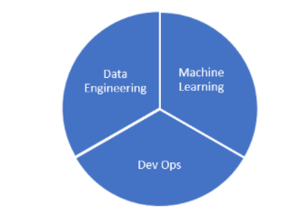
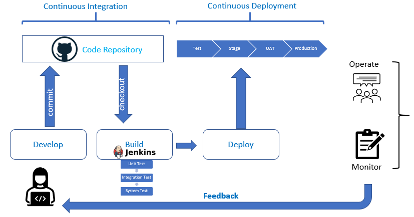

## **<span style="text-decoration:underline;">Section 8</span>**


#### **Training, Tuning and Serving up LLMs in production:**


#### **Serving up LLMs in production:**


* OpenLLM is an open-source platform designed to facilitate the deployment and operation of large language models (LLMs) in real-world applications. 
* With OpenLLM, you can run inference on any open-source LLM, deploy them on the cloud or on-premises, and build powerful AI applications.
* [https://github.com/bentoml/OpenLLM?tab=readme-ov-file](https://github.com/bentoml/OpenLLM?tab=readme-ov-file)


#### **Training/Fine-Tuning Large Language Models (LLMs) - The First Pass**


    


    Comparison of the number of parameters of models. Just look at how big GPT-3 is. And nobody knows about GPT-4…





    LLMs capabilities


* Creating a local large language model (LLM) is a significant undertaking.
* It requires substantial computational resources and expertise in machine learning. 
* It was not feasible to run local LLMs on your own local system because of the computational costs involved. 
* However, with the advent of new software, GPT4All and LM-Studio can be used to create complete software packages that work locally. 
* But let’s start with a HuggingFace Transformers source code example that shows you how to use the HuggingFace Libraries and PyTorch for LLMs (cloud-based, not local in this case):


## **Consider the HuggingFace Transformers Example**


* This is a complete program that uses the GPT-2 model, GPT-2 tokenizer, and is fine-tuned on the AG NEWS dataset (a small dataset used for utility purposes) is given below and explained in code snippets. 
* We can leverage the power of pre-trained models and fine-tune them on specific tasks.
* Importing necessary libraries and modules: 
    * The script starts by importing the necessary libraries and modules. AG_NEWS is a news classification dataset from the “torchtext.datasets” package. AutoModelWithLMHead and AdamW are imported from the transformers library. 
    * AutoModelWithLMHead is a class that provides automatic access to pre-trained models with a language modeling head, and AdamW is a class that implements the AdamW optimizer, a variant of the Adam optimizer with weight decay.

    ```


##     from torchtext.datasets import AG_NEWS


##     from transformers import AutoModelWithLMHead, AdamW


##     from transformers import AutoTokenizer
    ```


    * **Setting up the tokenizer:** The script uses the AutoTokenizer class from the transformers library to load the tokenizer associated with the “gpt2” model. The tokenizer is responsible for converting input text into a format that the model can understand. This includes splitting the text into tokens (words, subwords, or characters), mapping the tokens to their corresponding IDs in the model’s vocabulary, and creating the necessary inputs for the model (like attention masks).
    * tokenizer = AutoTokenizer.from_pretrained("gpt2")
    * **Setting the number of epochs:** The script sets the number of epochs for training to 50. An epoch is one complete pass through the entire training dataset. The number of epochs is a hyperparameter that you can tune. Training for more epochs can lead to better results, but it also increases the risk of overfitting and requires more computational resources.

    ```


##     EPOCHS = 50
    ```


    * **Preprocessing the data: **The preprocess_data function is defined to preprocess the data. It takes an iterator over the data and encodes the text in each item using the tokenizer. The AG_NEWS dataset is then loaded and preprocessed. The dataset is split into ‘train’ and the text from each item is encoded. Encoding the text involves splitting it into tokens, mapping the tokens to their IDs in the model’s vocabulary, and creating the necessary inputs for the model.

    ```


##     def preprocess_data(data_iter):


##        data = [tokenizer.encode(text) for _, text in data_iter]


##        return data


##     train_iter = AG_NEWS(split='train')


##     train_data = preprocess_data(train_iter)
    ```


* **Setting up the model and optimizer:** 
    * The script loads the pre-trained “gpt2” model using the AutoModelWithLMHead class and sets up the AdamW optimizer with the model’s parameters. The model is a transformer-based model with a language modeling head, which means it’s designed to generate text. The AdamW optimizer is a variant of the Adam optimizer with weight decay, which can help prevent overfitting.

    ```


##     model = AutoModelWithLMHead.from_pretrained("gpt2")


##     optimizer = AdamW(model.parameters())


##     model.train()


##     for epoch in range(EPOCHS):


##        for batch in train_data:


##            outputs = model(batch)


##            loss = outputs.loss


##            loss.backward()


##            optimizer.step()


##            optimizer.zero_grad()
    ```


* **Training the model:** The script trains the model for the specified number of epochs. In each epoch, it iterates over the batches of training data, feeds each batch to the model, computes the loss, performs backpropagation with loss.backward(), and updates the model’s parameters with optimizer.step(). It also resets the gradients with optimizer.zero_grad(). This is a standard training loop for PyTorch models.
* **Generating text:** After training, the script uses the model to generate text. It starts by encoding a prompt using the tokenizer, then feeds this encoded prompt to the model’s generate method. The output of the generate() method is a sequence of token IDs, which is then decoded back into text using the tokenizer.

    ```


##     prompt = tokenizer.encode("Write a summary of the new features in the latest release of the Julia Programming Language", return_tensors="pt")


##     generated = model.generate(prompt)


##     generated_text = tokenizer.decode(generated[0])
    ```


* **Saving the generated text: **Finally, the script saves the generated text to a file named “generated.txt”. This is done using Python’s built-in file handling functions.

    ```


##     with open("generated.txt", "w") as f:


##        f.write(generated_text)
    ```


* This script is a good example of how to fine-tune a pre-trained language model on a specific task. 
* Fine-tuning a large model like GPT-2 can be computationally intensive and may require a powerful machine or cloud-based resources. 
* _This script doesn’t include some important steps like splitting the data into training and validation sets, shuffling the data, and batching the data._ _These steps are crucial for training a robust model. _
* The entire program is given below:

    ```


##     from torchtext.datasets import AG_NEWS
##     from transformers import AutoModelWithLMHead, AdamW
##     from transformers import AutoTokenizer
##     tokenizer = AutoTokenizer.from_pretrained("gpt2")
##     EPOCHS = 50
##     def preprocess_data(data_iter):
##        data = [tokenizer.encode(text) for _, text in data_iter]
##        return data
##     train_iter = AG_NEWS(split='train')
##     train_data = preprocess_data(train_iter)
##     model = AutoModelWithLMHead.from_pretrained("gpt2")
##     optimizer = AdamW(model.parameters())
##     model.train()
##     for epoch in range(EPOCHS):
##        for batch in train_data:
##            outputs = model(batch)
##            loss = outputs.loss
##            loss.backward()
##            optimizer.step()
##            optimizer.zero_grad()
##     prompt = tokenizer.encode("Write a summary of the new features in the latest release of the Julia Programming Language", return_tensors="pt")
##     generated = model.generate(prompt)
##     generated_text = tokenizer.decode(generated[0])
##     with open("generated.txt", "w") as f:
##        f.write(generated_text)

    ```


## There are two packaged solutions for Local LLMs (and many more popping up, everyday). Two of them are the best. One is LM-Studio. The other is [https://gpt4all.io/index.html](https://gpt4all.io/index.html)


* _This is the best for those if you want a completely open-source on-premises system. But you need to have at least 32 GB of local RAM, 16 GB GPU RAM, a 3+ Ghz multicore(the more, the better) processor, and a local SSD.  LLMs are computationally, extremely expensive!_
* There’s a lot more to LLM models than just chat
* Given the expensive;y daunting computational requirements for fine-tuning musical and pictures and audio for LLMs we are not going to run them. 
* Some popular, already built and ready-to-go solutions as well as some interesting source material are:


## **Audio LLMs**


* [https://www.assemblyai.com/docs/guides/processing-audio-with-llms-using-lemur](https://www.assemblyai.com/docs/guides/processing-audio-with-llms-using-lemur)
* AudioGPT Research Paper — [https://arxiv.org/abs/2304.12995](https://arxiv.org/abs/2304.12995)
* Tango [https://tango-web.github.io/](https://tango-web.github.io/)
* [https://blog.google/technology/ai/musiclm-google-ai-test-kitchen/](https://blog.google/technology/ai/musiclm-google-ai-test-kitchen/)


## **Image LLMs**


* [https://www.linkedin.com/pulse/generating-images-large-language-model-gill-arun-krishnan](https://www.linkedin.com/pulse/generating-images-large-language-model-gill-arun-krishnan)
* **Stable Diffusion**
* **DALL E-1,2,3**
* **MidJourney**
* Bing Image Creator


## **Multimodal LLMs**


* [https://arxiv.org/abs/2306.09093](https://arxiv.org/abs/2306.09093) Macaw-LLM research paper. 
* [https://github.com/BradyFU/Awesome-Multimodal-Large-Language-Models](https://github.com/BradyFU/Awesome-Multimodal-Large-Language-Models)
* [https://openai.com/research/gpt-4](https://openai.com/research/gpt-4) 


## **General LLM Resources**


* [https://beebom.com/best-large-language-models-llms/](https://beebom.com/best-large-language-models-llms/)
* [https://roadmap.sh/guides/free-resources-to-learn-llms](https://roadmap.sh/guides/free-resources-to-learn-llms)
* [https://github.com/Hannibal046/Awesome-LLM](https://github.com/Hannibal046/Awesome-LLM)
* [https://medium.com/@abonia/best-llm-and-llmops-resources-for-2023-75e96ac37feb](https://medium.com/@abonia/best-llm-and-llmops-resources-for-2023-75e96ac37feb)
* [https://learn.deeplearning.ai/](https://learn.deeplearning.ai/) 

## 
    **Fine-Tuning Your LLM - A Revisit**

* Again. fine-tuning is the process of continuing the training of a pre-trained LLM on a specific dataset. 
* You might ask why we need to train the model further if we can already add data using RAG. 
* The simple answer is that only fine-tuning can tailor your model to understand a specific domain or define its “style”. 

    :





    Classical approach of fine-tuning on domain specific data (all icons from [flaticon](http://flaticon.com/))

1. Take a trained LLM, sometimes called Base LLM. You can download them from [HuggingFace](https://huggingface.co/spaces/HuggingFaceH4/open_llm_leaderboard).
2. Prepare your training data. You only need to compile instructions and responses. [Here’s an example](https://huggingface.co/datasets/databricks/databricks-dolly-15k) of such a dataset. You can also [generate synthetic data](https://www.promptingguide.ai/applications/generating) using GPT-4.
3. Choose a suitable fine-tuning method. [LoRA](https://github.com/microsoft/LoRA) and [QLoRA](https://github.com/artidoro/qlora) are currently popular.
4. Fine-tune the model on new data.

### 
    **When to Use**

* **Niche Applications:** When the application deals with specialized or unconventional topics. For example, legal document applications that need to understand and handle legal jargon.
* **Custom Language Styles:** For applications requiring a specific tone or style. For example, creating an [AI character](https://beta.character.ai/) whether it’s a celebrity or a character from a book.

### 
    **When NOT to Use**

* **Broad Applications:** Where the scope of the application is general and doesn’t require specialized knowledge.
* **Limited Data:** Fine-tuning requires a significant amount of relevant data. However, you can always [generate them with another LLM](https://www.confident-ai.com/blog/how-to-generate-synthetic-data-using-llms-part-1). For example, the [Alpaca dataset](https://github.com/gururise/AlpacaDataCleaned) of 52k LLM-generated instruction-response pairs was used to create the first finetuning [Llama v1](https://arxiv.org/abs/2302.13971) model earlier this year.

### 
    **Fine-tuning LLM**


    Let us look at a high-level library, [Lit-GPT](https://github.com/Lightning-AI/lit-gpt), which hides all complexities, hence doesn’t allow for much customization of the training process, but one can quickly conduct experiments and get initial results. 


    You’ll need just a few lines of code:


    ```
    # 1. Download the model:
    python scripts/download.py --repo_id meta-llama/Llama-2-7b

    # 2. Convert the checkpoint to the lit-gpt format:
    python scripts/convert_hf_checkpoint.py --checkpoint_dir checkpoints/llama

    # 3. Generate an instruction tuning dataset:
    python scripts/prepare_alpaca.py  # it should be your dataset

    # 4. Run the finetuning script
    python finetune/lora.py \
       --checkpoint_dir checkpoints/llama/
       --data_dir your_data_folder/
       --out_dir my_finetuned_model/
    ```


    And that’s it! Your training process will start:


    


    _This  takes approximately **10 hours** and **30 GB** memory to fine-tune Falcon-7B on a single A100 GPU._

* The fine-tuning process is quite complex and to get better results, you’ll need to understand various adapters, their parameters, and much more. 
* However, even after such a simple iteration, you will have a new model that follows your instructions.

### 
    **Some References to chase down:**

* [Create a Clone of Yourself With a Fine-tuned LLM](https://medium.com/better-programming/unleash-your-digital-twin-how-fine-tuning-llm-can-create-your-perfect-doppelganger-b5913e7dda2e) — an article about collecting datasets, using parameters, and  useful tips on fine-tuning.
* [Understanding Parameter-Efficient Fine-tuning of Large Language Models](https://lightning.ai/pages/community/article/understanding-llama-adapters/) — an excellent tutorial to get into the details of the concept of fine-tuning and popular parameter-efficient alternatives.
* [Fine-tuning LLMs with LoRA and QLoRA: Insights from Hundreds of Experiments](https://lightning.ai/pages/community/lora-insights/) — one of my favorite articles for understanding the capabilities of LoRA.
* [OpenAI Fine-tuning](https://platform.openai.com/docs/guides/fine-tuning) — if you want to fine-tune GPT-3.5 with minimal effort.

## 
    **Deploying Your LLM Application in Production**


    


* There are a huge number of frameworks that specialize in deploying large language models with
* Lots of pre-built wrappers and integrations.
* A vast selection of available models.
* A multitude of internal optimizations.
* Rapid prototyping.

### 
    **Choosing the Right Framework**

* The choice of framework for deploying an LLM application depends on various factors, including the size of the model, the scalability requirements of the application, and the deployment environment. 
* Heres a  cheat sheet:

        


    You can get a more detailed overview of the existing solutions here [7 Frameworks for Serving LLMs](https://medium.com/better-programming/frameworks-for-serving-llms-60b7f7b23407)  


        Comparison of frameworks for LLMs inference


### 
    **Example Code for Deployment**

* Let’s move from theory to practice and try to deploy LLaMA-2 using [Text Generation Inference](https://github.com/huggingface/text-generation-inference). 
* And, as you might have guessed, you’ll need just a few lines of code:

    ```
    # 1. Create a folder where your model will be stored:
    mkdir data

    # 2. Run Docker container (launch RestAPI service):
    docker run --gpus all --shm-size 1g -p 8080:80 \
       -v $volume:/data \
       ghcr.io/huggingface/text-generation-inference:1.1.0
       --model-id meta-llama/Llama-2-7b

    # 3. And now you can make requests:
    curl 127.0.0.1:8080/generate \
       -X POST \
       -d '{"inputs":"Tell me a joke!","parameters":{"max_new_tokens":20}}' \
       -H 'Content-Type: application/json'
    ```


    - That’s it! You’ve set up a RestAPI service with built-in logging, Prometheus endpoint for monitoring, token streaming, and your model is fully optimized. 


    API Documentation


### 
    **References:**

* [7 Frameworks for Serving LLMs ](https://medium.com/better-programming/frameworks-for-serving-llms-60b7f7b23407)— comprehensive guide into LLMs inference and serving with detailed comparison.
* [Inference Endpoints](https://huggingface.co/inference-endpoints) — a product from HuggingFace that will allow you to deploy any LLMs in a few clicks. A good choice when you need rapid prototyping.

## 
    **To get in a little deeper**

* We’ve covered the basic concepts needed for developing LLM-based applications, there are still some aspects you’ll likely encounter in the future. Here are  a few useful reference:

### 
    **Optimization**

* When you launch your first model, you inevitably find it’s not as fast as you’d like and consumes a lot of resources and you’ll need to understand how it can be optimized.
* [7 Ways To Speed Up Inference of Your Hosted LLMs](https://medium.com/better-programming/speed-up-llm-inference-83653aa24c47) — techniques to speed up inference of LLMs to increase token generation speed and reduce memory consumption.
* [Optimizing Memory Usage for Training LLMs in PyTorch](https://lightning.ai/pages/community/tutorial/pytorch-memory-vit-llm/) — article provides a series of techniques that can reduce memory consumption in PyTorch by approximately 20x without sacrificing modeling performance and prediction accuracy.

### 
    **Evaluating**

* Suppose you have a fine-tuned model you need to be sure that its quality has improved.  What metrics should we use to check quality?
* [All about evaluating Large language models](https://explodinggradients.com/all-about-evaluating-large-language-models) — a good overview article about benchmarks and metrics.
* [evals](https://github.com/openai/evals) — the most popular framework for evaluating LLMs and LLM systems.

### 
    **Vector Databases**

* If you work with RAG, at some point, you’ll move from storing vectors in memory to a database. 
* For this, it’s important to understand what’s currently on the market and its limitations.
* [All You Need to Know about Vector Databases](https://towardsdatascience.com/all-you-need-to-know-about-vector-databases-and-how-to-use-them-to-augment-your-llm-apps-596f39adfedb) — a step-by-step guide by  \
[Dominik Polzer \
](https://medium.com/u/3ab8d3143e32?source=post_page-----5c45708156bc--------------------------------) to discover and harness the power of vector databases.
* [Picking a vector database: a comparison and guide for 2023](https://benchmark.vectorview.ai/vectordbs.html) — comparison of Pinecone, Weviate, Milvus, Qdrant, Chroma, Elasticsearch and PGvector databases.

### 
    **LLM Agents**

* One of  the most promising developments in LLMs are LLM Agents i f you want multiple models to work together. 
* The following links are worth going through
* [A Survey on LLM-based Autonomous Agents](https://github.com/paitesanshi/llm-agent-survey#-more-comprehensive-summarization) — this is probably the most comprehensive overview of LLM based agents.
* [autogen](https://github.com/microsoft/autogen) — is a framework that enables the development of LLM applications using multiple agents that can converse with each other to solve tasks.
* [OpenAgents ](https://github.com/xlang-ai/OpenAgents)— an open platform for using and hosting language agents in the wild.

### 
    **Reinforcement Learning from Human Feedback (RLHF)**

* As soon as you allow users access to your model, you start taking responsibility. 
* What if it responds rudely? Or reveals bomb-making ingredients? To avoid this, check out these articles:
* [Illustrating Reinforcement Learning from Human Feedback (RLHF)](https://huggingface.co/blog/rlhf) — an overview article that details the RLHF technology.
* [RL4LMs](https://github.com/allenai/RL4LMs) — a modular RL library to fine-tune language models to human preferences.
* [TRL ](https://github.com/huggingface/trl)— a set of tools to train transformer language models with Reinforcement Learning, from the Supervised Fine-tuning step (SFT), Reward Modeling step (RM) to the Proximal Policy Optimization (PPO) step.

**Summary:**


* The material covered today is broad but is the technology of the future. 
* Junior Programmers, Artists, ML Engineers, Data Processing Analysts, Beginner Data Scientists, and practically every other digital job should be learning this technology. There is a lot of scope and opportunity. 
* Generative AI is the future of the Digital Media World. Artists are feeling the impact today. A similar situation is looming for junior-level software engineers. 
* But the solution is simple: Skill up! Help someone else Skill up! Regain Control!