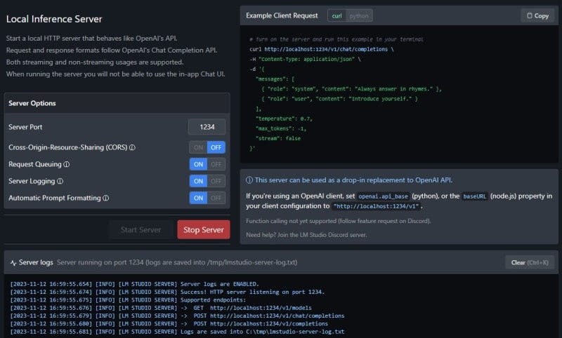
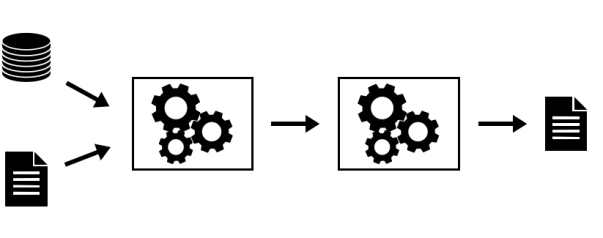

## **Section 6**

**Model Training, Model Serving and ML Ops**

**MLOps vs LLMOps**

* While LLMOps borrows heavily from MLOps, the differences are notable.
*  The model training approach in LLMs leans more towards fine-tuning or prompt engineering rather than the frequent retraining typical of traditional Machine Learning (ML).
*  In LLMOps, human feedback becomes a pivotal data source that needs to be incorporated from development to production, often requiring a constant human feedback loop in contrast to traditional automated monitoring.
* Automated quality testing faces challenges and may often require human evaluation, particularly during the continuous deployment stage. Incremental rollouts for new models or LLM pipelines have become the norm.
*  This transition might also necessitate changes in production tooling, with the need to shift serving from CPUs to GPUs, and the introduction of a new object like a vector and graph databases  into the data layer.
* Lastly, managing cost, latency, and performance trade-offs becomes a delicate balancing act, especially when comparing self-tuned models versus paid third-party LLM APIs.

    **Continuities With Traditional MLOps**

* Despite these differences, certain foundational principles remain intact.
* The dev-staging-production separation, enforcement of access controls, usage of Git and model registries for shipping pipelines and models, and the Data Lake architecture for managing data continue to hold ground. 
* Also, the Continuous Integration (CI) infrastructure can be reused, and the modular structure of MLOps, focusing on the development of modular data pipelines and services, remains valid.
* Exploring LLMOps Changes
* As we delve deeper into the changes brought by LLMOps, we will explore the operational aspects of Language Learning Models (LLMs), creating and deploying LLM pipelines, fine-tuning models, and managing cost-performance trade-offs.
* Differentiating between ML and Ops becomes crucial, and tools like MLflow, LangChain, LlamaIndex, and others play key roles in tracking, templating, and automation. 
* Packaging models or pipelines for deployment, scaling out for larger data and models, managing cost-performance trade-offs, and gathering human feedback become critical factors for assessing model performance. 
* Moreover, the choice between deploying models versus deploying code, and considering service architecture, become essential considerations, especially when deploying multiple pipelines or fine-tuning multiple models.

**A Minimal LLMOps pipeline**

[https://github.com/keshavaspanda/BigBertha](https://github.com/keshavaspanda/BigBertha)** **

### 
**LLMOps Capabilities**

#### 
**1. LLM Monitoring**

The framework utilizes Prometheus to monitor LLM (Large Language Model) serving modules. For demo purposes, a Streamlit app is used to serve the LLM, and Prometheus scrapes metrics from it. Alerts are set up to detect performance degradation.

#### 
**2. Auto-triggering LLM Retraining/Fine-tuning**

 Prometheus triggers alerts when the model performance degrades. These alerts are managed by AlertManager, which uses Argo Events to trigger a retraining pipeline to fine-tune the model.

#### 
**3. Training, Evaluating, and Logging the Retrained LLM**

The retraining pipeline is orchestrated using Argo Workflows. This pipeline can be tailored to perform LLM-specific retraining, fine-tuning, and metrics tracking. MLflow is used for logging the retrained LLM.

#### 
**4. Triggering the Generation of New Vectors for Fresh Data**

 MinIO is used for unstructured data storage. Argo Events is set up to listen for upload events on MinIO, triggering a vector ingestion workflow when new data is uploaded.

#### 
**5. Ingesting New Vectors into the Knowledge Base**

Argo Workflows is used to run a vector ingestion pipeline that utilizes LlamaIndex for generating and ingesting vectors. These vectors are stored in Milvus, which serves as the knowledge base for retrieval-augmented generation.

### 
**Stack Overview**

This stack relies on several key components:

* ArgoCD: A Kubernetes-native continuous delivery tool that manages all components in the BigBertha stack.
* Argo Workflows: A Kubernetes-native workflow engine used for running vector ingestion and model retraining pipelines.
* Argo Events: A Kubernetes-native event-based dependency manager that connects various applications and components, triggering workflows based on events.
* Prometheus + AlertManager: Used for monitoring and alerting related to model performance.
* LlamaIndex: A framework for connecting LLMs and data sources, used for data ingestion and indexing.
* Milvus: A Kubernetes-native vector database for storing and querying vectors.
* MinIO: An open-source object storage system used for storing unstructured data.
* MLflow: An open-source platform for managing the machine learning lifecycle, including experiment tracking and model management.
* Kubernetes: The container orchestration platform that automates the deployment, scaling, and management of containerized applications.
* Docker Containers: Docker containers are used for packaging and running applications in a consistent and reproducible manner.

### 
**Demo Chatbot**

As a demonstration, the framework includes a Streamlit-based chatbot that serves a Llama2 7B quantized chatbot model. 

A simple Flask app is used to expose metrics, and Redis acts as an intermediary between Streamlit and Flask processes.