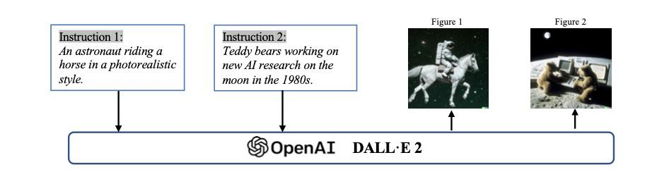
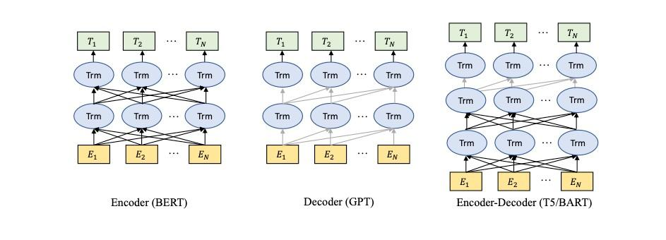
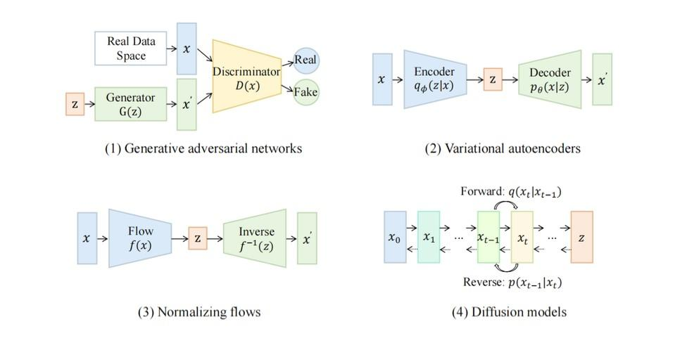
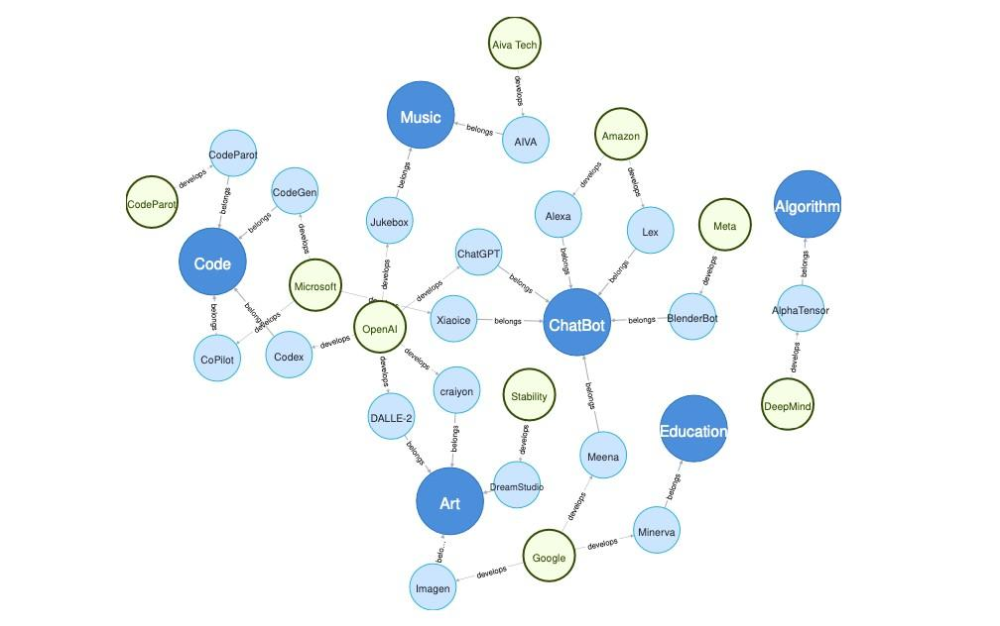
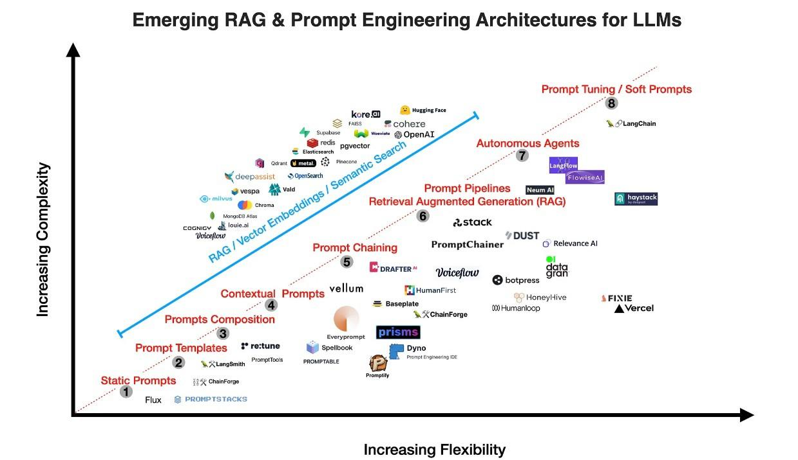

## **Section 21**

## LLM's & NLP Introduction
## 1 Introduction

> In this chapter, we will lay the foundation for building a chat-to-PDF
> app using Large Language Models (LLMs) with a focus on the
> Retrieval-Augmented Generation approach. We'll explore the fundamental
> concepts and technologies that underpin this project.

## 1.1 The Role of LLMs in NLP

> Large Language Models (LLMs) play a crucial role in Natural Language
> Processing (NLP). These models have revolutionized the field of NLP by
> their ability to understand and generate human-like text. With
> advances in deep learning and neural networks, LLMs have become
> valuable assets in various NLP tasks, including language translation,
> text summarization, and chatbot development.
>
> One of the key strengths of LLMs lies in their capacity to learn from
> vast amounts of text data. By training on massive datasets, LLMs can
> capture complex linguistic patterns and generate coherent and
> contextually appropriate responses. This enables them to produce
> high-quality outputs that are indistinguishable from human-generated
> text.
>
> LLMs are trained using a two-step process: pre-training and
> fine-tuning. During pre-training, models are exposed to a large corpus
> of text data and learn to predict the next word in a sentence. This
> helps them develop a strong understanding of language structure and
> semantics. In the fine-tuning phase, the models are further trained on
> task-specific data to adapt their knowledge to specific domains or
> tasks. The versatility and effectiveness of LLMs make them a powerful
> tool in advancing the field of NLP. They have not only improved the
> performance of existing NLP systems but have also opened up new
> possibilities for developing innovative applications. With continued
> research and development, LLMs are expected to further push the
> boundaries of what is possible in natural language understanding and
> generation.
>
> Large Language Models (LLMs) represent a breakthrough in NLP, allowing
> machines to understand and generate human-like text at an
> unprecedented level of accuracy and fluency. Some of the key roles of
> LLMs in NLP include:

1.  **Natural Language Understanding (NLU):** LLMs can comprehend the
    nuances of human language, making them adept at tasks such as
    sentiment analysis, entity recognition, and language translation.

2.  **Text Generation:** LLMs excel at generating coherent and
    contextually relevant text. This capability is invaluable for
    content generation, chatbots, and automated writing.

3.  **Question Answering:** LLMs are particularly powerful in question
    answering tasks. They can read a given text and provide accurate
    answers to questions posed in natural language.

4.  **Summarization:** LLMs can summarize lengthy documents or articles,
    distilling the most important information into a concise form.

5.  **Conversational AI:** They serve as the backbone of conversational
    AI systems, enabling chatbots and virtual assistants to engage in
    meaningful and context-aware conversations.

6.  **Information Retrieval:** LLMs can be used to retrieve relevant
    information from vast corpora of text, which is crucial for
    applications like search engines and document retrieval.

7.  **Customization:** LLMs can be fine-tuned for specific tasks or
    domains, making them adaptable to a wide range of applications.

## 1.2 The Importance of Question Answering over PDFs

> *Question answering over PDF documents addresses a critical need in
> information retrieval and document processing. Here, we'll explore why
> it is important and how LLMs can play a pivotal role:*
>
> The Importance of Question Answering over PDFs:

1.  **Document Accessibility:** PDF is a widely used format for storing
    and sharing documents. However, extracting information from PDFs,
    especially in response to specific questions, can be challenging for
    users. Question answering over PDFs enhances document accessibility.

2.  **Efficient Information Retrieval:** For researchers, students, and
    professionals, finding answers within lengthy PDF documents can be
    time-consuming. Question-answering systems streamline this process,
    enabling users to quickly locate the information they need.

3.  **Enhanced User Experience:** In various domains, including legal,
    medical, and educational, users often need precise answers from PDF
    documents. Implementing question answering improves the user
    experience by providing direct and accurate responses.

4.  **Automation and Productivity:** By automating the process of
    extracting answers from PDFs, organizations can save time and
    resources. This automation can be particularly beneficial in
    scenarios where large volumes of documents need to be processed.

5.  **Scalability:** As the volume of digital documents continues to
    grow, scalable solutions for question answering over PDFs become
    increasingly important. LLMs can handle large datasets and diverse
    document types.

> In various industries, there is a growing demand for efficient
> information retrieval from extensive collections of PDF documents.
> Take, for example, a legal firm or department collaborating with the
> Federal Trade Commission (FTC) to process updated information about
> legal cases and proceedings. Their task often involves processing a
> substantial volume of documents, sifting through them, and extracting
> relevant case information---a labour intensive process.
>
> *Background: Every year the FTC brings hundreds of cases against
> individuals and companies for violating consumer protection and
> competition laws that the agency enforces. These cases can involve
> fraud, scams, identity theft, false advertising, privacy violations,
> anti-competitive behaviour and more.*
>
> The advent of the Retrieval-Augmented Generation (RAG) approach marks
> a new era in question and answering that promises to revolutionize
> workflows within these industries.

## 1.3 The Retrieval-Augmented Generation Approach

> *The Retrieval-Augmented Generation approach is a cutting-edge
> technique that combines the strengths of information retrieval and
> text generation. Let's explore this approach in detail:*
>
> The Retrieval-Augmented Generation Approach:
>
> The Retrieval-Augmented Generation approach combines two fundamental
> components, retrieval and generation, to create a powerful system for
> question answering and content generation. Here's an overview of this
> approach:

1.  **Retrieval Component:** This part of the system is responsible for
    searching and retrieving relevant information from a database of
    documents. It uses techniques such as indexing, ranking, and query
    expansion to find the most pertinent documents.

2.  **Generation Component:** Once the relevant documents are retrieved,
    the generation component takes over. It uses LLMs to process the
    retrieved information and generate coherent and contextually
    accurate responses to user queries.

3.  **Benefits:** The key advantage of this approach is its ability to
    provide answers based on existing knowledge (retrieval) while also
    generating contextually rich responses (generation). It combines the
    strengths of both worlds to deliver high-quality answers.

4.  **Use Cases:** Retrieval-Augmented Generation is particularly useful
    for question answering over large document collections, where
    traditional search engines may fall short in providing concise and
    informative answers.

5.  **Fine-Tuning:** Successful implementation of this approach often
    involves fine-tuning LLMs on domain-specific data to improve the
    quality of generated responses.

> By understanding the role of LLMs in NLP, the importance of question
> answering over PDFs, and the principles behind the Retrieval-Augmented
> Generation approach, you have now laid the groundwork for building
> your chat-to-PDF app using these advanced technologies. In the
> following chapters, we will delve deeper into the technical aspects
> and practical implementation of this innovative solution.

## 1.4 A Brief History of LLMs

> Lately, ChatGPT, as well as DALL-E-2 and Codex, have been getting a
> lot of attention. This has sparked curiosity in many who want to know
> more about what's behind their impressive performance. ChatGPT and
> other Generative AI (GAI) technologies fall into a category called
> Artificial Intelligence Generated Content (AIGC). This means they're
> all about using AI models to create content like images, music, and
> written language. The whole idea behind AIGC is to make creating
> conetent faster and easier.
>
> *AIGC is achieved by extracting and understanding intent information
> from instructions provided by human, and generating the content
> according to its knowledge and the intent information. In recent
> years, large-scale models have become increasingly important in AIGC
> as they provide better intent extraction and thus, improved generation
> results.*

With more data and bigger models, these AI systems can make things that
look and sound quite realistic and high-quality. The following shows an
example of text prompting that generates images according to the
instructions, leveraging the OpenAI DALL-E-2 model.

> {width="4.857113954505687in"
> height="1.3914140419947507in"}
>
> Figure 1.1: Examples of AIGC in image generation. Image source
>
> In the realm of Generative AI (GAI), models can typically be divided
> into two categories: unimodal models and multimodal models. Unimodal
> models operate by taking instructions from the same type of data as
> the content they generate, while multimodal models are capable of
> receiving instructions from one type of data and generating content in
> another type. The following figure illustrates these two categories of
> models.
>
> These models have found applications across diverse industries, such
> as art and design, marketing, and education. It's evident that in the
> foreseeable future, AIGC will remain a prominent and continually
> evolving research area with artificial intelligence.

### 1.4.1 Foundation Models

> Speaking of LLMs and GenAI, we cannot overlook the significant role
> played by Transformer models.
>
> {width="4.857123797025372in"
> height="1.893879046369204in"}
>
> Figure 1.2: Overview of AIGC model types. Image source
>
> *Transformer is the backbone architecture for many state-of-the-art
> models, such as GPT, DALL-E, Codex, and so on.*
>
> Transformer started out to address the limitations of traditional
> models like RNNs when dealing with variable-length sequences and
> context. The heart of the Transformer is its self-attention mechanism,
> allowing the model to focus on different parts of an input sequence.
> It comprises an encoder and a decoder. The encoder processes the input
> sequence to create hidden representations, while the decoder generates
> an output sequence. Each encoder and decoder layer includes multi-head
> attention and feed-forward neural networks. Multi-head attention, a
> key component, assigns weights to tokens based on relevance, enhancing
> the model's performance in various NLP tasks. The Transformer's
> inherent parallelizability minimizes inductive biases, making it ideal
> for large-scale pretraining and adaptability to different downstream
> tasks.
>
> Transformer architecture has dominated natural language processing,
> with two main types of pre-trained language models based on training
> tasks: masked language modeling (e.g., BERT) and autoregressive
> language modeling (e.g., GPT3). Masked language models predict masked
> tokens within a sentence, while autoregressive models focus on
> predicting the next token given previous ones, making them more
> suitable for generative tasks. RoBERTa and XL-Net are classic examples
> of masked language models and have further improved upon the BERT
> architecture with additional training data and techniques.
>
> {width="4.857099737532808in"
> height="1.7512346894138233in"}
>
> Figure 1.3: Categories of pre-trained LLMs. Image source
>
> In this graph, you can see two types of information flow indicated by
> lines: the black line represents bidirectional information flow, while
> the gray line represents left-to-right information flow. There are
> three main model categories:

1.  Encoder models like BERT, which are trained with context-aware
    objectives.

2.  Decoder models like GPT, which are trained with autoregressive
    objectives.

3.  Encoder-decoder models like T5 and BART, which merge both
    approaches. These models use context-aware structures as encoders
    and left-to-right structures as decoders.

### 1.4.2 Reinforcement Learning from Human Feedback

> To improve AI-generated content (AIGC) alignment with user intent,
> i.e., considerations in *usefulness* and *truthfulness*, reinforcement
> learning from human feedback (RLHF) has been applied in models like
> Sparrow, InstructGPT, and ChatGPT.
>
> The RLHF pipeline involves three steps: *pre-training*, *reward
> learning*, and *finetuning with reinforcement learning*. In reward
> learning, human feedback on diverse responses is used to create reward
> scalars. Fine-tuning is done through reinforcement learning with
> Proximal Policy Optimization (PPO), aiming to maximize the learned
> reward.
>
> However, the field lacks benchmarks and resources for RL, which is
> seen as a challenge. But this is changing day-by day. For example, an
> open-source library called RL4LMs was introduced to address this gap.
> Claude, a dialogue agent, uses *Constitutional AI*, where the reward
> model is learned via RL from AI feedback. The focus is on reducing
> harmful outputs, with guidance from a set of principles provided by
> humans. See more about the topic of *Constitutional AI* in one of our
> blog post here.

### 1.4.3 GAN

> Generative Adversarial Networks (GANs) are widely used for image
> generation. GANs consist of a generator and a discriminator. The
> generator creates new data, while the discriminator decides if the
> input is real or not.
>
> The design of the generator and discriminator influences GAN training
> and performance. Various GAN variants have been developed, including
> LAPGAN, DCGAN, Progressive GAN, SAGAN, BigGAN, StyleGAN, and methods
> addressing mode collapse like D2GAN and GMAN.
>
> The following graph illustrates some of the categories of vision
> generative models.
>
> Although GAN models are not the focus of our book, they are essential
> in powering multi-modality applications such as the diffusion models.

### 1.4.4 Applications

> Chatbots are probably one of the most popular applications for LLMs.
>
> {width="4.857048337707787in"
> height="2.4782884951881017in"}
>
> Figure 1.4: Categories of vision generative models. Image source
>
> Chatbots are computer programs that mimic human conversation through
> textbased interfaces. They use language models to understand and
> respond to user input. Chatbots have various use cases, like customer
> support and answering common questions. Our "*chat with your PDF
> documents*" is a up-and-coming use case!
>
> Other notable examples include Xiaoice, developed by Microsoft, which
> expresses empathy, and Google's Meena, an advanced chatbot.
> Microsoft's Bing now incorporates ChatGPT, opening up new
> possibilities for chatbot development.
>
> This graph illustrates the relationships among current research areas,
> applications, and related companies. Research areas are denoted by
> dark blue circles, applications by light blue circles, and companies
> by green circles.
>
> In addition, we have previously written about chatbots and now they
> are part of history, but still worth reviewing:

-   Blog post: What Does A Chatbot Look Like Under the Hood?

{width="4.857147856517935in"
height="3.0453543307086615in"}

> Figure 1.5: Knowlege Graph for Applications. Image source

-   Blogpost: What Is Behind the Scene of A Chatbot NLU?

-   Blogpost: What More Can You Do with Chatbots?

> Of course, chatbots are not the only application. There are vast
> possibilities in arts and design, music generation, education
> technology, coding and beyond your imagination doesn't need to stop
> here.

### 1.4.5 Prompt Learning

Prompt learning is a new concept in language models. Instead of
predicting𝑥 𝑥^′^ 𝑃(𝑦\|𝑥^′^) 𝑦

given , it aims to find a template that predicts .

> *Normally, prompt learning will freeze the language model and directly
> perform few-shot or zero- shot learning on it. This enables the
> language models to be pre-trained on large amount of raw text data and
> be adapted to new domains without tuning it again. Hence, prompt
> learning could help save much time and efforts.*
>
> Traditionally, prompt learning involves prompting the model with a
> task, and it can be done in two stages: prompt engineering and answer
> engineering.
>
> **Prompt engineering:** This involves creating prompts, which can be
> either discrete (manually designed) or continuous (added to input
> embeddings) to convey task-specific information.
>
> **Answer engineering:** After reformulating the task, the generated
> answer must be mapped to the correct answer space.
>
> Besides single-prompt, *multi-prompt methods* combine multiple prompts
> for better predictions, and *prompt augmentation* basically beefs up
> the prompt to generate better results.
>
> Moreover, in-context learning, a subset of prompt learning, has gained
> popularity. It enhances model performance by incorporating a
> pre-trained language model and supplying input-label pairs and
> task-specific instructions to improve alignment with the task.
>
> Overall, in the dynamic landscape of language models, tooling and
> applications, the graph below illustrates to the evolution of language
> model engineering. With increasing flexibility along the x-axis and
> rising complexity along the yaxis, this graph offers a bird's-eye view
> of the choices and challenges faced by developers, researchers and
> companies.
>
> {width="4.857174103237095in"
> height="2.8068908573928257in"}
>
> Figure 1.6: Emerging RAG & Prompt Engineering Architecture for LLMs.
> Image
>
> source
>
> In the top-right corner, you can see the complex, yet powerful tools
> like OpenAI, Cohere, and Anthropic (to-be-added), which have pushed
> the boundaries of what language models can achieve. Along the
> diagonal, the evolution of prompt engineering is displayed, from
> static prompts to templates, prompt chaining, RAG pipelines,
> autonomous agents, and prompt tuning. On the more flexible side,
> options like Haystack and LangChain have excelled, presenting broader
> horizons for those seeking to harness the versatility of language
> models.
>
> This graph serves as a snapshot of the ever-evolving landscape of
> toolings in the realm of language model and prompt engineering today,
> providing a roadmap for those navigating the exciting possibilities
> and complexities of this field. It is likely going to be changing
> every day, reflecting the continuous innovation and dynamism in the
> space.
>
> In the next Chapter we'll turn our focus to more details of Retrieval
> Augmented Generation (RAG) pipelines. We will break down their key
> components, architecture, and the key steps involved in building an
> efficient retrieval system.