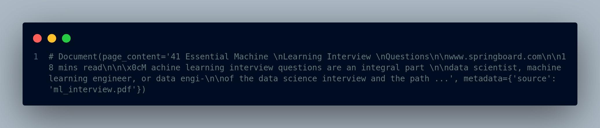
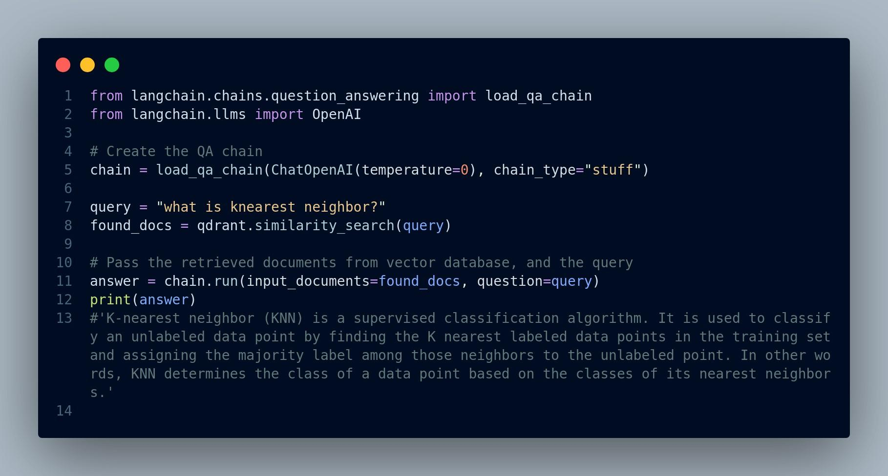

## **Section 23**
# RAG Pipeline Implementation

> **3.1 Preprocessing PDF documents**
>
> Before we can harness the power of Large Language Models (LLMs) and
> particularly RAG method for question answering over PDF documents,
> it's essential to prepare our data. PDFs, while a common format for
> documents, pose unique challenges for text extraction and analysis. In
> this section, we'll explore the critical steps involved in
> preprocessing PDF documents to make them suitable for our Chat-to-PDF
> app. These steps are not only essential for PDFs but are also
> applicable to other types of files. However, our primary focus is on
> PDF documents due to their prevalence in various industries and
> applications.

#### 3.1.1 PDF Text Extraction

> PDFs may contain a mix of text, images, tables, and other elements. To
> enable text-based analysis and question answering, we need to extract
> the textual content from PDFs. Here's how you can accomplish this:

-   **TextExtraction Tools:** Explore available tools and libraries like
    PyPDF2, pdf2txt, or PDFMiner to extract text from PDF files
    programmatically.

-   **Handling Scanned Documents:** If your PDFs contain scanned images
    instead of selectable text, you may need Optical Character
    Recognition (OCR) software to convert images into machine-readable
    text.

-   **Quality Control:** Check the quality of extracted text and perform
    any necessary cleanup, such as removing extraneous characters or
    fixing formatting issues.

#### 3.1.2 Handling Multiple Pages

> PDF documents can span multiple pages, and maintaining context across
> pages is crucial for question answering. Here's how you can address
> this challenge:

-   **Page Segmentation:** Segment the document into logical units, such
    as paragraphs or sections, to ensure that context is preserved.

-   **Metadata Extraction:** Extract metadata such as document titles,
    authors, page numbers, and creation dates. This metadata can aid in
    improving searchability and answering user queries.

#### 3.1.3 Text Cleanup and Normalization

> PDFs may introduce artifacts or inconsistencies that can affect the
> quality of the extracted text. To ensure the accuracy of question
> answering, perform text cleanup and normalization:

-   **Whitespace and Punctuation:** Remove or replace excessive
    whitespace and special characters to enhance text readability.

-   **Formatting Removal:** Eliminate unnecessary formatting, such as
    font styles, sizes, and colors, which may not be relevant for
    question answering.

-   **Spellchecking:** Check and correct spelling errors that might
    occur during the extraction process.

#### 3.1.4 Language Detection

> If your PDF documents include text in multiple languages, it is a good
> idea to implement language detection algorithms to identify the
> language used in each section. This information can be useful when
> selecting appropriate LLM models for question answering.
>
> **3.2 Data Ingestion Pipeline Implementation**
>
> As it has been depicted in Figure 2.3 the first step of the data
> ingestion pipeline is *extracting and spliting text from the pdf
> documents*. There are several packages for this goal including:

-   PyPDF2

-   pdfminer.six

-   unstructured

> Additionally, there are data loaders hub like llamahub that contains
> tens of data loaders for reading and connecting a wide variety data
> sources to a Large Language Model (LLM).
>
> Finally, there are packages like llamaindex, and langchain. These are
> frameworks that faciliates developing applications powered by LLMs.
> Therefore, they have implemented many of these data loaders including
> extracting and spliting text from pdf files.
>
> **Step 1: Install necessary libraries**
>
> pip install llama-index pip install langchain
>
> **Step 2: Load the pdf file and extract the text from it**
>
> Code below will iterate over the pages of the pdf file, extract the
> text and add it to the documents list object, see Figure 3.1.
>
> {width="4.857147856517935in"
> height="2.36549321959755in"}
>
> Figure 3.1: Load pdf files
>
> Now every page has become a separate document that we can later *embed
> (vectorize)* and *store* in the vector database. However, some pages
> could be very lengthy and other ones could be very short as page
> length varies. This could signaficantly impact the quality of the
> document search and retrieval.
>
> Additionally, LLMs have a limited context window (token limit), i.e.
> they can handle certain number of tokens (a token roughly equals to a
> word). Therefore, we instead first concatenate all the pages into a
> long text document and then split that document into smaller
> reletively equal size chunks. We then embed each chunk of text and
> insert into the vector database.
>
> Nevertheless, since we are going to use llamaindex and langchain
> frameworks for the RAG pipeline, Let's utilize the features and
> functions these frameworks offer. They have data loaders and splitters
> that we can use to read and split pdf files. You can see the code in
> Figure 3.2.
>
> pdf_content\[0\] contains the entire content of pdf, and has s special
> structure. It is a Document object with some properties including
> page_content and metadata. page_content is the textual content and
> metadata contains some meta-
>
> {width="4.8570811461067365in"
> height="1.9640212160979877in"}
>
> Figure 3.2: Langchain data loader
>
> data about the pdf. Here's the partial output the Document object of
> our pdf in Figure 3.3.
>
> {width="4.8570406824146986in"
> height="1.0407939632545933in"}
>
> Figure 3.3: Langchain data loader output
>
> A Document object is a generic class for storing a piece of
> unstructured text and its associated metadata. See here for more
> information. **Step 3: Split the text into smaller chunks**
>
> There are several different text splitters. For more information see
> langchain API, or llamaIndex documentation. Two common ones are:

i.  CharacterTextSplitter: Split text based on a certain number
    characters.

ii. TokenTextSplitter: Split text to tokens using model tokenizer.

> The following code in Figure 3.4 chunks the pdf content into sizes no
> greater than 1000, with a bit of overlap to allow for some continued
> context.
>
> {width="4.856896325459317in"
> height="1.5922495625546806in"}
>
> Figure 3.4: Langchain text split method
>
> Here's the number of chunks created from splitting the pdf file.
>
> \# Print the number of chunks (list of Document objects)
>
> print(len(docs))
>
> \# 30
>
> **Step 4: Embed and store the documents in the vector database**
>
> In this step we need to convert chunks of text into embedding vectors.
> There are plenty of embedding models we can use including OpenAI
> models, Huggingface models, and Cohere models. You can even define
> your own custom embedding model. Selecting an embedding model depnds
> on several factors:

-   **Cost:** Providers such as OpenAI or Cohere charge for embeddings,
    albeit it's cheap, when you scale to thusands of pdf files, it will
    become prohibitive.

-   **Latency and speed:** Hosting an embedding model on your server
    reduce the latency, whereas using vendors' API increases the
    latency.

-   **Convenience:** Using your own embedding model needs more compute
    resource and maintainance whereas using vendors APIs like OpenAI
    gives you a hassle-free experience.

> Similar to having several choices for embedding models, there are so
> many options for choosing a vector database, which is out the scope of
> this book.
>
> Figure 3.5 shows some of the most popular vector database vendors and
> some of the features of their hosting. This blog fully examines these
> vector databases from different perspective.
>
> {width="4.856864610673666in"
> height="3.24830927384077in"}
>
> Figure 3.5: Various vector databases. Image source
>
> We are going to use OpenAI models, particularly text-embedding-ada-002
> for embedding. Furthermore, we choose Qdrant as our vector database.
> It's open source, fast, very flexible, and offers a free clould-based
> tier.
>
> We first install the openai and qdrant package.
>
> pip install openai pip install qdrant-client
>
> We also require an API key that we can get it from here.
>
> If we set OPENAI_API_KEY environment variable to our API key, we can
> easily call the functions that needs it without getting any error.
> Otherwise we can pass the API key parameter to functions requiring it.
> Figure 3.6 shows how to do it.
>
> {width="4.856896325459317in"
> height="3.0135192475940507in"}
>
> Figure 3.6: Qdrant vector database setup via Langchain
>
> Please note that there are several different ways to achieve the same
> goal
>
> (embedding and storing in the vector database). You can use Qdrant
> client library directly instead of using the langchain wrapper for it.
> Also, you can first create embeddings separately and then store them
> in the Qdrant vector database. Here, we embedded the documents and
> stored them all by calling Qdrant.from_documents().
>
> In addition, you can use Qdrant cloud vector database to store the
> embeddings and use their REST API to interact with it, unlike this
> example where the index is stored locally in the /tmp/local_qdrant
> directory. This approach is suitable for testing and POC
> (Proof-Of-Concept), not for production environment.
>
> We can try and see how we can search and retrieve relevant documents
> from the vector database. For instance, let's see what the answer to
> the question *"what is knearest neighbor?"*. See the output in Figure
> 3.7.
>
> {width="4.856896325459317in"
> height="2.7089610673665794in"}
>
> Figure 3.7: Question answering example with output
>
> Awesome! The retrieved answer seems quite relevant.
>
> The entire code is displayed in Figure 3.8.

{width="4.856896325459317in"
height="4.43478893263342in"}

> Figure 3.8: The entire code for retrieval component

3.3GenerationComponentImplementation

> **3.3 Generation Component Implementation**
>
> Figure 3.9 illustrates a simplified version of the RAG pipeline we saw
> in Chapter 2. So far our **Retrieval** component of the RAG is
> implemented. In the next section we will implement the **Generation**
> component.
>
> {width="4.85706583552056in"
> height="2.0912357830271215in"}
>
> Figure 3.9: RAG pipeline
>
> The steps for generating a response for a user's question are:

-   **Step 1:** Embed the user's query using the same model used for
    embedding documents

-   **Step 2:** Pass the query embedding to vector database, search and
    retrieve the top-k documents (i.e. context) from the vector database

-   **Step 3:** Create a "prompt" and include the user's query and
    context in it

-   **Step 4:** Call the LLM and pass the the prompt

-   **Step 5:** Get the generated response from LLM and display it to
    the user

> Again, we can follow each step one by one, or utilize the features
> langchain or llamaIndex provide. We are going to use langchain in this
> case.
>
> Langchain includes several kinds of built-in question-answering
> chains. A *chain* in LangChain refers to a sequence of calls to
> components, which can include other chains or external tools. In order
> to create a question answering chain, we use:

1.  **load_qa_chain:** load_qa_chain() is a function in Langchain that
    loads a pre-configured question answering chain. It takes in a
    language model like OpenAI, a chain type (e.g. "stuff" for
    extracting answers from text), and optionally a prompt template and
    memory object. The function returns a QuestionAnsweringChain
    instance that is ready to take in documents and questions to
    generate answers.

2.  **load_qa_with_sources_chain:** This is very similar to
    load_qa_chain except it contains sources/metadata along with the
    returned response.

3.  **RetrievalQA:** RetrievalQA is a class in Langchain that creates a
    question answering chain using retrieval. It combines a retriever,
    prompt template, and LLM together into an end-to-end QA pipeline.
    The prompt template formats the question and retrieved documents
    into a prompt for the LLM. This chain retrieves relevant documents
    from a vector database for a given query, and then generates an
    answer using those documents.

4.  **RetrievalQAWithSourcesChain:** It is a variant of RetrievalQA that
    returns relevant source documents used to generate the answer. This
    chain returns an AnswerWithSources object containing the answer
    string and a list of source IDs.

> Here's the code demonstraing the implementation, Figure 3.10:
>
> Figure 3.11 shows how to use load_qa_with_sources_chain:
>
> Similarly, if we use RetrievalQA, we will have Figure 3.12:
>
> And here's the code when we use RetrievalQAWithSourcesChain, Figure
> 3.13:
>
> As you can see, it's fairly straight forward to implement RAG (or say
> a prototype RAG application) using frameworks like langchain or
> llamaIndex. However, when it comes to deploying RAG to production and
> scaling the system, it becomes notoriously challenging. There are a
> lot of nuances that will affect

3.3GenerationComponentImplementation

{width="4.856896325459317in"
height="2.607442038495188in"}

> Figure 3.10: Response generation using Langchain chain

{width="4.856896325459317in"
height="2.302884951881015in"}

> Figure 3.11: Using load_qa_with_sources_chain chain for response
> generation

{width="4.856896325459317in"
height="1.9983267716535433in"}

> Figure 3.12: The usage of RetrievalQA chain

{width="4.856896325459317in"
height="2.0998458005249345in"}

Figure 3.13: Code snippet for using Langchain RetrievalQAWith-

> SourcesChain for response generation
>
> 3.4ImpactofTextSplittingonRetrievalAugmentedGeneration(RAG)Quality

the quality of the RAG, and we need to take them into consideration. We
will discuss some of the main challenges and how to address them in the
next few sections.

> **3.4 Impact of Text Splitting on Retrieval Augmented**
>
> **Generation (RAG) Quality**
>
> In the context of building a Chat-to-PDF app using Large Language
> Models (LLMs), one critical aspect that significantly influences the
> quality of your Retrieval Augmented Generation (RAG) system is how you
> split text from PDF documents. Text splitting can be done at two
> levels: *splitting by character* and *splitting by token*. The choice
> you make between these methods can have a profound impact on the
> effectiveness of your RAG system. Let's delve into the implications of
> each approach.

#### 3.4.1 Splitting by Character

> **Advantages:**
>
> **Fine-Grained Context:** Splitting text by character retains the
> finest granularity of context within a document. Each character
> becomes a unit of input, allowing the model to capture minute details.
>
> **Challenges:**

-   **Long Sequences:** PDF documents often contain long paragraphs or
    sentences. Splitting by character can result in extremely long input
    sequences, which may surpass the model's maximum token limit, making
    it challenging to process and generate responses.

-   **Token Limitations:** Most LLMs, such as GPT-3, have token limits,
    often around 4,000 tokens. If a document exceeds this limit, you'll
    need to truncate or omit sections, potentially losing valuable
    context.

-   **Increased Inference Time:** Longer sequences require more
    inference time, which can lead to slower response times and
    increased computational costs.

#### 3.4.2 Splitting by Token

> **Advantages:**

-   **Token Efficiency:** Splitting text by token ensures that each
    input sequence remains within the model's token limit, allowing for
    efficient processing.

-   **Balanced Context:** Each token represents a meaningful unit,
    striking a balance between granularity and manageability.

-   **Scalability:** Splitting by token accommodates documents of
    varying lengths, making the system more scalable and adaptable.

> **Challenges:**

-   **Contextual Information:** Token-based splitting may not capture
    extremely fine-grained context, potentially missing nuances present
    in character-level splitting.

#### 3.4.3 Finding the Right Balance

> The choice between character-level and token-level splitting is not
> always straightforward and may depend on several factors:
>
> 3.5ImpactofMetadataintheVectorDatabaseonRetrievalAugmentedGeneration(RAG)

-   **Document Types:** Consider the types of PDF documents in your
    collection. Technical manuals with precise details may benefit from
    characterlevel splitting, while general documents could work well
    with token-level splitting.

-   **Model Limitations:** Take into account the token limits of your
    chosen LLM. If the model's limit is a significant constraint,
    token-level splitting becomes a necessity.

-   **User Experience:** Assess the trade-off between detailed context
    and response time. Character-level splitting might provide richer
    context but at the cost of slower responses.

#### 3.4.4 Hybrid Approaches

> In practice, you can also explore hybrid approaches to text splitting.
> For instance, you might use token-level splitting for most of the
> document and switch to character-level splitting when a specific
> question requires fine-grained context.
>
> The impact of text splitting on RAG quality cannot be overstated. It's
> a critical design consideration that requires a balance between
> capturing detailed context and ensuring system efficiency. Carefully
> assess the nature of your PDF documents, the capabilities of your
> chosen LLM, and user expectations to determine the most suitable text
> splitting strategy for your Chat-to-PDF app. Regular testing and user
> feedback can help refine this choice and optimize the overall quality
> of your RAG system.
>
> **3.5 Impact of Metadata in the Vector Database on Retrieval Augmented
> Generation (RAG)**
>
> The inclusion of metadata about the data stored in the vector database
> is another factor that can significantly enhance the quality and
> effectiveness of your

Retrieval Augmented Generation (RAG) system. Metadata provides valuable
contextual information about the PDF documents, making it easier for the
RAG model to retrieve relevant documents and generate accurate
responses. Here, we explore the ways in which metadata can enhance your
RAG system.

#### 3.5.1 Contextual Clues

> Metadata acts as contextual clues that help the RAG model better
> understand the content and context of each PDF document. Typical
> metadata includes information such as:

-   **Document Title:** The title often provides a high-level summary of
    the document's content.

-   **Author:** Knowing the author can offer insights into the
    document's perspective and expertise.

-   **Keywords and Tags:** Keywords and tags can highlight the main
    topics or themes of the document.

-   **Publication Date:** The date of publication provides a temporal
    context, which is crucial for understanding the relevance of the
    document.

-   **Document Type:** Differentiating between research papers, user
    manuals, and other types of documents can aid in tailoring responses
    appropriately.

#### 3.5.2 Improved Document Retrieval

> With metadata available in the vector database, the retrieval
> component of your RAG system can become more precise and efficient.
> Here's how metadata impacts document retrieval:

-   **Relevance Ranking:** Metadata, such as document titles, keywords,
    and tags, can be used to rank the documents based on relevance to a
    user query. Documents with metadata matching the query can be given
    higher priority during retrieval. For example, if a user asks a
    question related

> 3.5ImpactofMetadataintheVectorDatabaseonRetrievalAugmentedGeneration(RAG)
>
> to "machine learning," documents with "machine learning" in their
> keywords or tags might be given priority during retrieval.

-   **Filtering:** Metadata can be used to filter out irrelevant
    documents early in the retrieval process, reducing the computational
    load and improving response times. For instance, if a user asks
    about "biology," documents with metadata indicating they are
    engineering manuals can be excluded from consideration.

-   **Enhanced Query Understanding:** Metadata provides additional
    context for the user's query, allowing the RAG model to better
    understand the user's intent and retrieve documents that align with
    that intent. For example, if the metadata includes the publication
    date, the RAG model can consider the temporal context when
    retrieving documents.

#### 3.5.3 Contextual Response Generation

> Metadata can also play a crucial role in the generation component of
> your RAG system. Here's how metadata impacts response generation:

-   **Context Integration:** Metadata can be incorporated into the
    response generation process to provide more contextually relevant
    answers. For example, including the publication date when answering
    a historical question.

-   **Customization:** Metadata can enable response customization. For
    instance, the tone and style of responses can be adjusted based on
    the author's information.

-   **Enhanced Summarization:** Metadata can aid in the summarization of
    retrieved documents, allowing the RAG model to provide concise and
    informative responses. For instance, if the metadata includes the
    document type as "research paper," the RAG system can generate a
    summary that highlights the key findings or contributions of the
    paper.

#### 3.5.4 User Experience and Trust

> Including metadata in the RAG system not only enhances its technical
> capabilities but also improves the overall user experience. Users are
> more likely to trust and find value in a system that provides
> contextually relevant responses. Metadata can help build this trust by
> demonstrating that the system understands and respects the nuances of
> the user's queries.
>
> Overall, incorporating metadata about data in the vector database of
> your Chatto-PDF app's RAG system can significantly elevate its
> performance and user experience. Metadata acts as a bridge between the
> user's queries and the content of PDF documents, facilitating more
> accurate retrieval and generation of responses.
>
> As we conclude our exploration of the nuts and bolts of RAG pipelines
> in this Chapter, it's time to move on to more complex topics. In
> Chapter 4, we'll take a deep dive and try to address some of the
> retrieval and generation challenges that come with implementing
> advanced RAG systems.
>
> We'll discuss the optimal chunk size for efficient retrieval, consider
> the balance between context and efficiency, and introduce additional
> resources for evaluating RAG performance. Furthermore, we'll explore
> retrieval chunks versus synthesis chunks and ways to embed references
> to text chunks for better understanding.
>
> We'll also investigate how to rethink retrieval methods for
> heterogeneous document corpora, delve into hybrid document retrieval,
> and examine the role of query rewriting in enhancing RAG capabilities.