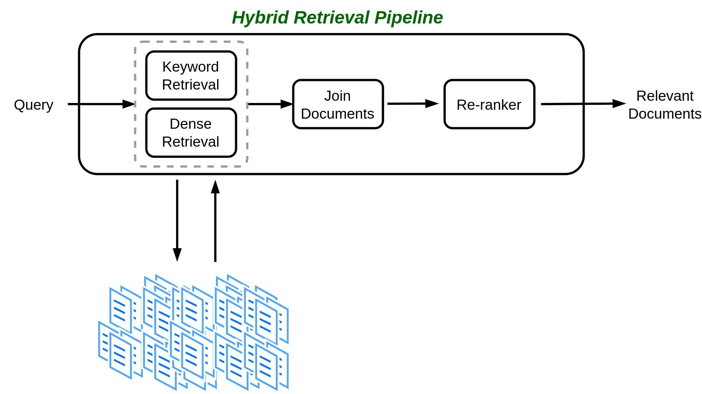
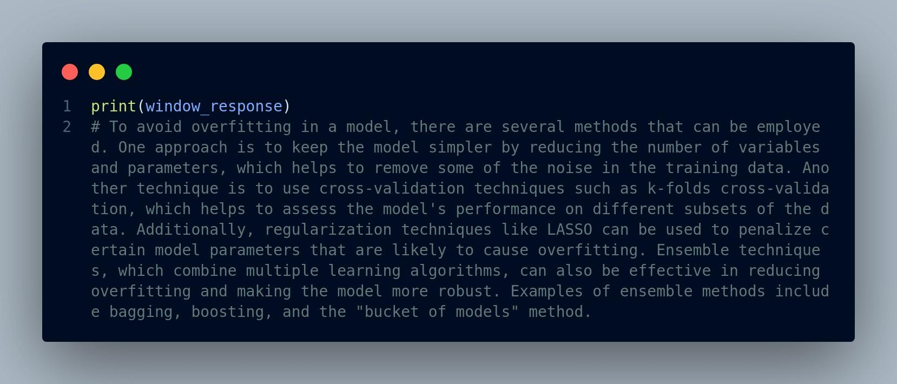

## Spanda Boot Camp Day 2 {#spanda-boot-camp-day-2 .unnumbered}

[**Part
1**\_\_\_\_\_\_\_\_\_\_\_\_\_\_\_\_\_\_\_\_\_\_\_\_\_\_\_\_\_\_\_\_\_\_\_\_\_\_\_\_\_\_\_\_\_\_\_\_\_\_\_\_\_\_\_\_\_\_\_\_\_\_\_\_\_\_\_\_]{.underline}

**We will cover:**

-   How to handle the growing scale in large-scale machine learning
    applications

-   We will identify patterns needed to build scalable and reliable
    distributed systems

-   We will outline the use of these patterns in distributed systems and
    building reusable patterns

**Part 1 Outcome:**

-   You will be able to choose and apply the correct patterns for
    building and deploying distributed machine learning systems; use
    common tooling viz.,

    -   TensorFlow
        ([https://www.tensorflow.org)](https://www.tensorflow.org/),

    -   Kubernetes [(https://kubernetes.io)](https://kubernetes.io/),

    -   Kubeflow
        ([https://www.kubeflow.org)](https://www.kubeflow.org/),

    -   Argo Workflows

-   appropriately within a machine learning workflow; and gain practical
    experience in managing and automating machine learning tasks in
    Kubernetes.

-   The project we will explore later will help us learn to build a
    real-life distributed machine learning system using the patterns we
    study.

**ML Scale**

-   The scale of machine learning applications has become
    unprecedentedly large. Case in point: LLMs

-   Users are demanding faster responses to meet real-life requirements,
    and machine learning pipelines and model architectures are getting
    more complex.

-   Due to the growing demand and complexity, machine learning systems
    have to be built with the ability to handle the growing scale,
    including the increasing volume of historical data; frequent batches
    of incoming data; complex machine learning architectures; heavy
    model serving traffic; and complicated end-to-end machine learning
    pipelines.

**What should be done?**

-   When the dataset is too large to fit in a single machine, we need to
    store different parts of the dataset on different machines and then
    train the machine learning model by sequentially looping through the
    various parts of the dataset on different machines.

```{=html}
<!-- -->
```
-   If we have a 30 GB dataset, we can divide it into three partitions
    (fig 1.1).

Figure 1.1 Dividing a large dataset into three partitions on three
separate machines that have sufficient disk storage

-   The question to ask here is "what happens if looping through
    different parts of the dataset is quite time-consuming?".

-   Assume that the dataset at hand has been divided into three
    partitions. As in figure 1.2, we initialize the machine learning
    model on the first machine, and then we train it, using all the data
    in the first data partition. Next, we transfer the trained model to
    the second machine, which continues training by using the second
    data partition.

-   If each partition is large and time-consuming, we'll spend a
    significant amount of time waiting.

```{=html}
<!-- -->
```
-   We now need to think about adding workers and parallelism

-   Each worker is ***responsible*** for consuming each of the data
    partitions, and all workers ***train the same model in parallel***
    without waiting for others.

-   This approach is good for speeding up the model training process
    but..

    -   What if some workers finish consuming the data partitions that
        they are responsible for and want to update the model at the
        same time?

    -   Which of the worker's results (gradients) should we use to
        update the model first?

```{=html}
<!-- -->
```
-   *What about the conflicts and tradeoffs between performance and
    model quality?*

```{=html}
<!-- -->
```
-   If the data partition that the first worker uses has better quality
    due to a more rigorous data collection process than the one that the
    second worker uses, using the first worker's results first would
    produce a more accurate model.

    -   On the other hand, if the second worker has a smaller partition,
        it could finish training faster, so we could start using that
        worker's computational resources to train a new data partition.

```{=html}
<!-- -->
```
-   When more workers are added, the conflicts in completion time for
    data consumption by different workers become even more obvious.

-   Q: if the application that uses the trained machine learning model
    to make predictions observes much heavier traffic, can we simply add
    servers, with each new server handling a certain percentage of the
    traffic?

-   A: Not really. This solution would need to take other things into
    consideration, such as deciding the best load balancer strategy and
    processing duplicate requests in different servers.

-   The main takeaway for now is that we have established patterns and
    best practices to deal with certain situations, and we will use
    those patterns to make the most of our limited computational
    resources.

-   

**Distributed systems**

-   A *distributed system* is one in which components are located on
    different networked computers and can communicate with one another
    to coordinate workloads and work together via message passing.

-   Figure 1.3 below illustrates a small distributed system consisting
    of two machines communicating with each other via message passing.
    One machine contains two CPUs, and the other machine contains three
    CPUs. Obviously, a machine contains computational resources other
    than the CPUs; we use only CPUs here for illustration purposes.

-   In real-world distributed systems, the number of machines can be
    extremely large--- tens of thousands, depending on the use case.

-   Machines with more computational resources can handle larger
    workloads and share the results with other machines.

```{=html}
<!-- -->
```
-   Many patterns and reusable components are available for distributed
    systems.

-   The *work-queue pattern* in a batch processing system, for example,
    makes sure that each piece of work is independent of the others and
    can be processed without any interventions within a certain amount
    of time.

-   In addition, workers can be scaled up and down to ensure that the
    workload can be handled properly.

-   Figure 1.4 depicts seven work items, each of which might be an image
    that needs to be modified to grayscale by the system in the
    processing queue.

-   Each of the three existing workers takes two to three work items
    from the processing queue, ensuring that no worker is idle to avoid
    waste of computational resources and maximizing the performance by
    processing multiple images at the same time.

-   This performance is possible because each work item is independent
    of the others.

Figure 1.4 An example of a batch processing system using the work-queue
pattern to modify images to grayscale

**Distributed machine learning systems**

-   A *distributed machine learning system* is a distributed system
    consisting of a pipeline of steps and components that are
    responsible for different steps in machine learning applications,
    such as data ingestion, model training, and model serving.

-   It uses patterns and best practices similar to those of a
    distributed system, as well as patterns designed specifically to
    benefit machine learning applications.

-   With careful design, a distributed machine learning system is more
    scalable and reliable for handling large-scale problems, such as
    large datasets, large models, heavy model serving traffic, and
    complicated model selection or architecture optimization.

-   There are similar patterns in distributed machine learning systems.
    As an example, multiple workers can be used to train the machine
    learning model asynchronously, with each worker being responsible
    for consuming certain partitions of the dataset. This approach,
    which is similar to the work-queue pattern used in distributed
    systems, can speed up the model training process significantly.

-   Figure 1.5 illustrates how we can apply this pattern to distributed
    machine learning systems by replacing the work items with data
    partitions. Each worker takes some data partitions from the original
    data stored in a database and then uses them to train a centralized
    machine learning model.

Figure 1.5 Applying the work-queue pattern in distributed machine
learning systems

-   Another example pattern commonly used in machine learning systems
    instead of general distributed systems is the ***parameter server**
    pattern* for distributed model training.

-   As shown in figure 1.6, the parameter servers are responsible for
    storing and updating a particular part of the trained model.

-   Each worker node is responsible for taking a particular part of the
    dataset that will be used to update a certain part of the model
    parameters.

-   This pattern is useful when the model is too large to fit in a
    single server and dedicated parameter servers for storing model
    partitions without allocating unnecessary computational resources.

Figure 1.6 An example of applying the parameter server pattern in a
distributed machine learning system

**When do we use a distributed machine learning system?**

-   When any of the following scenarios occurs:

```{=html}
<!-- -->
```
-   The model is large, consisting of millions of parameters that a
    single machine cannot store and that must be partitioned on
    different machines.

-   The machine learning application needs to handle increasing amounts
    of heavy traffic that a single server can no longer manage.

-   The task at hand involves many parts of the model's life cycle, such
    as data ingestion, model serving, data/model versioning, and
    performance monitoring.

```{=html}
<!-- -->
```
-   We want to use many computing resources for acceleration, such as
    dozens of servers that have many GPUs each.

**When should we not use a distributed machine learning system?**

> If you encounter any of the following cases:

-   The dataset is small, such as a CSV file smaller than 10 GBs.

-   The model is simple and doesn't require heavy computation, such as
    linear regression.

-   Computing resources are limited but sufficient for the tasks at
    hand.

**What frameworks will we use?**

-   We'll use several popular frameworks and cutting-edge technologies
    to build components of a distributed machine learning workflow,
    including the following:

```{=html}
<!-- -->
```
-   TensorFlow
    ([https://www.tensorflow.org](https://www.tensorflow.org/))

-   Kubernetes ([https://kubernetes.io](https://kubernetes.io/))

-   Kubeflow ([https://www.kubeflow.org](https://www.kubeflow.org/))

-   Docker ([https://www.docker.com](https://www.docker.com/))

-   Argo Workflows (<https://argoproj.github.io/workflows/>)

> **Three model training**

**serving steps. to present to users.**

> Figure 1.7 End-to-end machine learning system that we will be building
>
> Table 1.1 shows the key technologies that will be covered in this
> course and example uses.

Table 1.1 The technologies covered in this course and their uses

+-------------+--------------------------------------------------------+
| Technology  | Use                                                    |
+=============+========================================================+
| TensorFlow  | Building machine learning and deep learning models     |
+-------------+--------------------------------------------------------+
| Kubernetes  | > Managing distributed environments and resources      |
+-------------+--------------------------------------------------------+
| Kubeflow    | > Submitting and managing distributed training jobs    |
|             | > easily on Kubernetes clusters                        |
+-------------+--------------------------------------------------------+
| Argo        | > Defining, orchestrating, and managing workflows      |
| Workflows   |                                                        |
+-------------+--------------------------------------------------------+
| Docker      | > Building and managing images to be used for starting |
|             | > containerized environments                           |
+-------------+--------------------------------------------------------+

https://www.linkedin.com/pulse/install-kubernetes-cluster-your-local-machine-andrea-de-rinaldis

[**Part
2**\_\_\_\_\_\_\_\_\_\_\_\_\_\_\_\_\_\_\_\_\_\_\_\_\_\_\_\_\_\_\_\_\_\_\_\_\_\_\_\_\_\_\_\_\_\_\_\_\_\_\_\_\_\_\_\_\_\_\_\_\_\_\_\_\_\_\_\_]{.underline}

**We will cover:**

-   Using model serving to generate predictions or make inferences on
    new data with previously trained machine learning models

-   Handling model serving requests and achieving horizontal scaling
    with replicated model serving services

-   Processing large model serving requests using the sharded services
    services patterns

-   Assess model serving systems and event driven design

**Outcome:**

-   Learn three key patterns used to achieve scaling and performance
    outcomes in distributed ML systems

-   Understand the tradeoffs involved

**Model Serving**

-   *Model serving* is the process of *loading a previously trained
    machine learning model to generate predictions or make inferences on
    new input data*.

-   It is done after successfully training a machine learning model.
    (Fig 4.2)

> **Model serving is the next step after we have successfully trained a
> machine learning model. We use the trained**

Figure 4.1 A diagram showing where model serving fits in the machine
learning pipeline

-   In traditional machine learning applications, model serving is
    usually a single program running on a local desktop or machine and
    generates predictions on new datasets that are not used for model
    training.

-   Both the dataset and the machine learning model used should be small
    enough to fit on a single machine for traditional model serving, and
    they are stored in the local disk of a single machine.

-   In contrast, distributed model serving usually happens in a cluster
    of machines. Both the dataset and the trained machine learning model
    used for model serving can be very large and must be stored in a
    remote distributed database or partitioned on disks of multiple
    machines.

-   The differences between traditional model serving and distributed
    model serving systems is summarized in table 4.1.

Table 4.1 Comparison between traditional model serving and distributed
model serving systems

+-------------------+------------------------+------------------------+
|                   | Traditional model      | Distributed model      |
|                   | serving                | serving                |
+===================+========================+========================+
| > Computational   | > Personal laptop or   | > Cluster of machines  |
| > resources       | > single remote server |                        |
+-------------------+------------------------+------------------------+
| > Dataset         | Local disk on a single | > Remote distributed   |
| > location        | laptop or machine      | > database or          |
|                   |                        | > partitioned on disks |
|                   |                        | > of multiple          |
|                   |                        | >                      |
|                   |                        | > machines             |
+-------------------+------------------------+------------------------+
| > Size of model   | > Small enough to fit  | > Medium to large      |
| > and dataset     | > on a single machine  |                        |
+-------------------+------------------------+------------------------+

**Pattern 1: Replicated services pattern**

-   Challenge: ***Building a machine learning model to* *tag the main
    themes of new videos that the model hasn't seen before***

-   We have used the YouTube8M dataset
    (<http://research.google.com/youtube8m/>)

-   This consists of millions of YouTube video IDs, with high-quality
    machine-generated annotations from a diverse vocabulary of 3,800+
    visual entities viz, Car, Music, etc. (fig. 4.2) for training. Hence
    we have a model

```{=html}
<!-- -->
```
-   We now need to build a ***model serving system*** that allows users
    to upload ***new*** videos.

-   The system would load the ***previously trained machine learning
    model*** to tag entities/themes that appear in the uploaded videos.

-   The model serving system is stateless, so users' requests won't
    affect the model serving results.

-   The system takes videos uploaded by users and sends requests to the
    model server.

-   The model server then retrieves the previously trained
    entity-tagging machine learning model from the model storage to
    process the videos and eventually generate possible entities that
    appear in the videos. (Fig. 4.3)

> {width="5.666666666666667in"
> height="2.9133333333333336in"}

Figure 4.2 A screenshot of what the videos in the YouTube-8M dataset
looks like. (Source: Sudheendra

> Vijayanarasimhan et al. Licensed under Nonexclusive License 1.0)

*Users upload videos and then submit requests to the model serving
system to tag the entities within the video*

> Dog,
>
> Swimmer
>
> Horse
>
> \...

Figure 4.3 The single-node model serving system

-   This first version of the model server runs on a single machine and
    responds to model serving requests from users on a first-come,
    first-served basis (figure 4.4) and will work if only very few users
    are testing the system.

-   As the number of users or model serving requests increases, users
    will experience huge delays while waiting for the system to finish
    processing any previous requests. In the real world, this bad user
    experience would immediately lose our users' interest in engaging
    with this system.

Figure 4.4 The model server only runs on a single machine and responds
to model serving requests from users on a first-come, first-served
basis.

#### **Challenge:** Find a better way to handle model serving requests {#challenge-find-a-better-way-to-handle-model-serving-requests .unnumbered}

-   This system can only effectively serve a limited number of model
    serving requests on a first-come, first-served basis.

-   As the number of requests grows in the real world, the user
    experience worsens when users must wait a long time to receive the
    model serving result.

-   All requests are waiting to be processed by the model serving
    system, but the computational resources are *bound to this single
    node*.

-   Is there a better way to handle model serving requests than
    sequentially?

#### **Solution:** {#solution .unnumbered}

-   The existing model server is stateless

-   The model serving results for each request aren't affected by other
    requests, and the machine learning model can only process a single
    request.

-   The model server doesn't require a saved state to operate correctly.

-   Since the model server is stateless, we can add more server
    instances to help handle additional user requests without the
    requests interfering with each other (figure 4.5).

-   These additional model server instances are exact copies of the
    original

> Figure 4.5 Additional server instances help handle additional user
> requests without the requests interfering with each other.

-   The server addresses are different, and each handles different model
    serving requests

-   In other words, they are *replicated services* for model serving or,
    in short, *model server replicas*.

-   Adding additional resources into our system with more machines is
    called *horizontal scaling*.

-   Horizontal scaling systems handle more and more users or traffic by
    adding more replicas.

-   The opposite of horizontal scaling is *vertical scaling*, which is
    usually implemented by adding computational resources to existing
    machines.

-   The system now has multiple model server replicas to process the
    model serving requests asynchronously.

-   Each model server replica takes a single request, retrieves the
    previously trained entity-tagging machine learning model from model
    storage, and then processes the videos in the request to tag
    possible entities in the videos.

-   As a result, we've successfully scaled up our model server by adding
    model server replicas to the existing model serving system (4.6) .

-   The model server replicas are capable of handling many requests at a
    time since each replica can process individual model serving
    requests independently.

> *Users upload videos and then submit requests to the model serving
> system to tag the entities within the videos.*
>
> Swimmer
>
> Horse
>
> \...

Figure 4.6 The system architecture after we've scaled up our model
server by adding model server replicas to the system

-   Here multiple model serving requests from users are sent to the
    model server replicas at the same time.

-   Q: How are they being distributed and processed? Which request is
    being processed by which model server replica?

    -   We haven't defined a clear mapping relationship between the
        requests and the model server replicas.

-   We need a *load balancer*, which handles the distribution of model
    serving requests among the replicas.

-   It takes multiple model serving requests from our users and then
    distributes the requests evenly to each of the model server
    replicas, which then are responsible for processing individual
    requests, including model retrieval and inference on the new data in
    the request. (Figure 4.7).

-   The load balancer can use different algorithms to decide which
    request goes to which model server replica.

-   They include round robin, the least connection method, hashing, etc.

-   The replicated services pattern provides a great way to scale our
    model serving system horizontally.

-   It can also be generalized for any systems that serve a large amount
    of traffic. Whenever a single instance cannot handle the traffic,
    introducing this pattern ensures that all traffic can be handled
    equivalently and efficiently.

> Figure 4.7 Loader balancer distributes the requests evenly across
> model server replicas

##### Points to note: {#points-to-note .unnumbered}

-   With load-balanced model server replicas in place, we should be able
    to support the growing number of user requests, and the entire model
    serving system achieves horizontal scaling.

-   The overall model serving system also becomes *highly available*
    ([https:// mng.bz/EQBd](https://mng.bz/EQBd)).

-   High availability is a characteristic of a system that maintains an
    agreed-on level of operational performance, usually uptime, for a
    longer-than-normal period expressed as a percentage of uptime in a
    given year.

-   For example, some organizations may require services to reach a
    highly available service-level agreement, which means the service is
    up and running 99.9% of the time (known as three-nines
    availability). In other words, the service can only get 1.4 minutes
    of downtime per day (24 hours × 60 minutes × 0.1%).

-   With the help of replicated model services, if any of the model
    server replicas crashes or gets preempted on a spot instance, the
    remaining model server replicas are still available and ready to
    process any incoming model serving requests from users, which
    provides a good user experience and makes the system reliable.

**Readiness Probes:**

-   Since our model server replicas will need to retrieve previously
    trained machine learning models from a remote model storage, they
    need to be *ready* in addition to being *alive*.

-   It's important to build and deploy *readiness probes* to inform the
    load balancer that the replicas are all successfully established
    connections to the remote model storage and are ready to serve model
    serving requests from users.

-   A readiness probe helps the system determine whether a particular
    replica is ready to serve.

-   With readiness probes, users do not experience unexpected behaviors
    when the system is not ready due to internal system problems.

**Issues:**

-   Not only the number of serving requests increases but also the size
    of each request, which can get extremely large if the data or the
    payload is large.

-   In that case, replicated services may not be able to handle the
    large requests.

##### Quiz: {#quiz .unnumbered}

1.  Are replicated model servers stateless or stateful?

2.  What happens when we don't have a load balancer as part of the model
    serving system?

3.  Can we achieve three-nines service-level agreements with only one
    model server instance?

**Pattern 2: Sharded services pattern**

-   The replicated services pattern efficiently resolves our horizontal
    scalability problem so that our model serving system can support a
    growing number of user requests. We achieve the additional benefit
    of high availability with the help of model server replicas and a
    load balancer.

-   Each model server replica has a limited and pre-allocated amount of
    computational resources.

-   More important, the amount of computational resources for each
    replica must be identical for the load balancer to distribute
    requests correctly and evenly.

-   Consider this scenario: A user wants to upload a high-resolution
    YouTube video that needs to be tagged with an entity using the model
    server application.

```{=html}
<!-- -->
```
-   The high-resolution video, though too large, may be uploaded
    successfully to the model server replica if it has sufficient disk
    storage.

-   Processing the request in any of the individual model server
    replicas themselves failed since processing this single large
    request would require a larger memory allocated in the model server
    replica.

-   This need for a large amount of memory is often due to the
    complexity of the trained machine learning model, as it may contain
    a lot of expensive matrix computations or mathematical operations.
    Eventually, we notify the user of this failure after they have
    waited a long time, which results in a bad user experience. A
    diagram for this situation is shown in figure 4.8.

> *User uploads a high-resolution video to the model serving system.*
>
> *This fails as the model server replica that's processing this large
> request does not have enough computational resources.*
>
> Figure 4.8 Model server fails to process the large data in the request
> as the model server replica responsible for processing this request
> does not have sufficient memory

### **Challenge:** Design the model serving system to handle large requests {#challenge-design-the-model-serving-system-to-handle-large-requests .unnumbered}

-   How do we design the model serving system to handle large requests
    of high resolution videos successfully?

### **Solution:** {#solution-1 .unnumbered}

-   Q: Can we scale vertically by increasing each replica's
    computational resources so it can handle large requests like
    high-resolution videos? Since we are vertically scaling all the
    replicas by the same amount, we will not affect our load balancer's
    work.

-   A: Unfortunately, we cannot simply scale the model server replicas
    vertically since we don't know how many such large requests there
    are. A couple of users could have high-resolution videos needing to
    be processed, and the remaining vast majority of the users only
    upload videos from their smartphones with much smaller resolutions.

-   As a result, most of the added computational resources on the model
    server replicas are idling, which results in very low resource
    utilization.

-   Note: We will examine the resource utilization perspective
    subsequently, but for now, we know that this approach is not
    practical due to usage economics (Architecture is money).

-   The parameter server pattern discussed earlier allows us to
    partition a very large model.

-   Figure 4.9 shows distributed model training with multiple parameter
    servers; the large model has been partitioned, and each partition is
    located on different parameter servers.

-   Each worker node takes a subset of the dataset, performs
    calculations required in each neural network layer, and then sends
    the calculated gradients to update one model partition stored in one
    of the parameter servers.

> Figure 4.9 Distributed model training with multiple parameter servers
> where the large model has been sharded and each partition is located
> on different parameter servers

#####  {#section .unnumbered}

-   To deal with the problem of large model serving requests, the same
    idea can be applied here

    -   Divide the original high-resolution video into multiple separate
        videos,

    -   Each video is processed by multiple *model server shards*
        independently.

    -   The model server shards are partitions from a single model
        server instance, and each is responsible for processing a subset
        of a large request.

*The high-resolution video is divided into two separate videos and sent
to each of the model server shards.*

> Figure 4.10 Sharded services pattern: High-resolution video gets
> divided into two separate videos. Each video represents a subset of
> the original large request and is processed by different model server
> shard independently.

-   After the model server shards receive the sub-requests where each
    contains part of the original large model serving request, each
    model server shard then retrieves the previously trained
    entity-tagging machine learning model from model storage and then
    processes the videos in the request to tag possible entities that
    appear in the videos, similar to the previous model serving system.

-   Once all the sub-requests have been processed by each of the model
    server shards, we merge the model inference result from two
    sub-requests to obtain a result for the original large model serving
    request with the high-resolution video.

**Sharding Function:**

-   Q: How do we distribute the two sub-requests to different model
    server shards?

-   A: We use a *sharding function*, which is very similar to a hashing
    function, to determine which shard in the list of model server
    shards should be responsible for processing each sub-request.

-   Usually, the sharding function is defined using a hashing function
    and the modulo (%) operator.

    -   *For example, hash(request) % 10 would return 10 shards even
        when the outputs of the hash function are significantly larger
        than the number of shards in a sharded service.*

    -   ***Characteristics of hashing functions for sharding***

        -   *The hashing function that defines the sharding function
            transforms an arbitrary object into an integer representing
            a particular shard index. It has two important
            characteristics:*

        -   *The output from hashing is always the same for a given
            input.*

        -   *The distribution of outputs is always uniform within the
            output space.*

        -   *These characteristics are important and can ensure that a
            particular request will always be processed by the same
            shard server and that the requests are evenly distributed
            among the shards.*

```{=html}
<!-- -->
```
-   When a distributed system has limited computational resources for a
    single machine, we can apply this pattern to offload the
    computational burden to multiple machines.

**Points to Consider:**

-   Unlike the replicated services pattern which is useful when building
    stateless services, the sharded services pattern is generally used
    for building stateful services.

-   In our case, we need to maintain the state or the results from
    serving the sub-requests from the original large request using
    sharded services and then merge the results into the final response
    so it includes all entities from the original high-resolution video.

-   In some cases, this approach may not work well because it depends on
    how we divide the original large request into smaller requests.

-   For example, if the original video has been divided into more than
    two sub-requests, some may not be meaningful since they don't
    contain any complete entities that are recognizable by the machine
    learning model we've trained.

-   For situations like that, we need additional handling and cleaning
    of the merged result to remove meaningless entities that are not
    useful to our application.

**Quiz:**

1.  Would vertical scaling be helpful when handling large requests?

2.  Are the model server shards stateful or stateless?

3.  

**Pattern 3: The event-driven processing pattern**

-   For cases in which we ***do not know how much model serving traffic
    the system will be receiving***, ***or if the demand traffic pattern
    is lumpy or shows up in spikes***, it's hard to allocate and use
    resources efficiently. (e.g. hotel room price prediction)

-   The problem with this traffic pattern is that it could cause very
    low resource utilization rates with static resource allocation
    schemes.

-   In our current architecture, the underlying computational resources
    allocated to the model remain unchanged at all times. This strategy
    is not an optimal one.

> *Users enter date range and location and then submit requests to the
> serving system.*

Figure 4.11 A diagram of the model serving system to predict hotel
prices

> Figure 4.12 The traffic changes of the model serving system over time
> with an equal amount of computational resources allocated all the
> time.

-   Since we know, more or less, when those holiday periods are, why
    don't we plan accordingly? Unfortunately, some events make it hard
    to predict surges in traffic.

Thanksgiving Christmas time

#### **unable to handle all requests within this time window** {#unable-to-handle-all-requests-within-this-time-window .unnumbered}

Figure 4.13 The traffic of our model serving system over time with an
optimal amount of computational resources allocated for different time
windows. In addition, an unexpected event happened before Christmas that
suddenly added traffic during that particular time window (solid line).

### **The challenge: Respond to model serving requests based on events** {#the-challenge-respond-to-model-serving-requests-based-on-events .unnumbered}

### **The solution** {#the-solution .unnumbered}

-   The solution is in maintaining a pool of computational resources
    (e.g., CPUs, memory, disk, etc.) allocated not only to this
    particular model serving system but also to model serving of other
    applications or other components of the distributed machine learning
    pipeline.

-   This shared resource pool gives us enough resources to handle peak
    traffic for the model serving system by pre-allocating resources
    required during historical peak traffic and autoscaling when the
    limit is reached.

-   Therefore, we only use resources when needed and only the specific
    amount of resources required for each particular model serving
    request.

-   Figure 4.15 shows the traffic of our model serving system over time
    with an unexpected bump. The unexpected bump is due to a new very
    large international conference that happens before Christmas.

> Figure 4.14 An architecture diagram in which a shared resource pool is
> being used by different components--- for example, data ingestion,
> model training, model selection, and model deployment---and two
> different model serving systems at the same time. The arrows with
> solid lines indicate resources, and the arrows with dashed lines
> indicate requests.

Thanksgiving Christmas days

> Figure 4.15 The traffic of our model serving system over time. An
> unexpected bump happened before Christmas that suddenly added traffic.
> The jump in requests is handled successfully by the model serving
> system by borrowing the necessary amount of resources from the shared
> resource pool. The resource utilization rate remains high during this
> unexpected event.

-   This event suddenly adds traffic, but the model serving system
    successfully handles the surge in traffic by borrowing a necessary
    amount of resources from the shared resource pool.

-   With the help of the shared resource pool, the resource utilization
    rate remains high during this unexpected event.

-   The shared resource pool monitors the current amount of available
    resources and autoscales when needed.

-   This approach, in which the system listens to the user requests and
    only responds and utilizes the computational resources when the user
    request is being made, is called *event-driven processing*.

**Event-driven processing vs. long-running serving systems**

-   Event-driven processing is different from the model serving systems
    that we've looked at in previous sections , where the servers that
    handle user requests are always up and running.

-   Those long-running serving systems work well for many applications
    that are under heavy load, keep a large amount of data in memory, or
    require some sort of background processing.

-   However, for applications that handle very few requests during non
    peak periods or respond to specific events, such as our hotel price
    prediction system, the event-driven processing pattern is more
    suitable.

-   This event-driven processing pattern has flourished in recent years
    as cloud providers have developed ***function-as-a-service***
    products.

-   Each model serving request made from our hotel price prediction
    system represents an *event*.

-   Our serving system listens for this type of event, utilizes
    necessary resources from the shared resource pool, and retrieves and
    loads the trained machine learning model from the distributed
    database to estimate the hotel prices for the specified
    time/location query (Figure 4.16)

-   Using this event-driven processing pattern for our serving system,
    we can make sure that our system is using only the resources
    necessary to process every request without concerning ourselves with
    resource utilization and idling.

-   As a result, the system has sufficient resources to deal with peak
    traffic and return the predicted prices without users experiencing
    noticeable delays or lags when using the system.

**Denial of Service and Rate Limiting**

-   Even though we now have a shared pool of sufficient computational
    resources where we can borrow computational resources from the
    shared resource pool to handle user requests on demand, we should
    also build a mechanism in our model serving system to defend
    *denial-of-service attacks*.

-   Denial-of-service attacks interrupt an authorized user's access to a
    computer network, typically caused with malicious intent and often
    seen in model serving systems.

-   These attacks can cause unexpected use of computational resources
    from the shared resource pool, which may eventually lead to resource
    scarcity for other services that rely on the shared resource pool.

-   Denial-of-service attacks may happen in various cases malicious and
    non-malicious.

Figure 4.16 A Event-driven model serving system to predict hotel prices

-   To deal with these situations, which often happen in real-world
    applications, it makes sense to introduce a defense mechanism for
    denial-of-service attacks

-   One approach to avoid these attacks is via *rate limiting*, which
    adds the model serving requests to a queue and limits the rate the
    system is processing the requests in the queue (Fig. 4.17).

-   Figure 4.17 is a flowchart showing four model serving requests sent
    to the model serving system. However, only two are under the current
    rate limit, which allows a maximum of two concurrent model serving
    requests. In this case, the rate-limiting queue for model serving
    requests first checks whether the requests received are under the
    current rate limit. Once the system has finished processing those
    two requests, it will proceed to the remaining two requests in the
    queue.

-   If we are deploying and exposing an API for a model serving service
    to our users, it's also generally a best practice to have a
    relatively small rate limit (e.g., only one request is allowed
    within 1 hour) for users with anonymous access and then ask users to
    log in to obtain a higher rate limit.

-   This system would allow the model serving system to better control
    and monitor the users' behavior and traffic so that we can take
    necessary actions to address any potential problems or
    denial-of-service attacks.

-   For example, requiring a login provides auditing to find out which
    users/events are responsible for the unexpectedly large number of
    model serving requests.

> Model serving requests

Ok to add to the queue?

> Model serving requests that are under rate limit:
>
> 2 maximum concurrent requests

Figure 4.17 A flowchart of four model serving requests sent to the model
serving system. However, only two are under the current rate limit,
which allows a maximum of two concurrent model serving requests. Once
the system has finished processing those two requests, it will proceed
to the remaining two requests in the queue

-   Figure 4.18 shows the previously described strategy.

-   In the diagram, the flowchart on the left side is the same as figure
    4.17 where four total model serving requests from unauthenticated
    users are sent to the model serving system.

Model serving requests from authenticated users Model serving requests
from **unauthenticated** users

Ok to add to the queue? Ok to add to the queue?

> Model serving requests that are Model serving requests that are under
> rate limit: under rate limit:
>
> 2 maximum concurrent requests 3 maximum concurrent requests for
> **unauthenticated** users for **authenticated** users

Figure 4.18 A comparison of behaviors from different rate limits applied
to authenticated and unauthenticated users

-   However, only two can be served by the system due to the current
    rate limit, which allows a maximum of two concurrent model serving
    requests for unauthenticated users.

```{=html}
<!-- -->
```
-   Conversely, the model serving requests in the flowchart on the right
    side all come from authenticated users. Thus, three requests can be
    processed by the model serving system since the limit of maximum
    concurrent requests for authenticated users is three.

```{=html}
<!-- -->
```
-   Rate limits differ depending on whether the user is authenticated.
    Rate limits thus effectively control the traffic of the model
    serving system and prevent malicious denial-of-service attacks,
    which could cause unexpected use of computational resources from the
    shared resource pool and eventually lead to resource scarcity of
    other services that rely on it.

##### Points to Note: {#points-to-note-1 .unnumbered}

-   This pattern is not a universal solution.

-   For machine learning applications with consistent traffic---for
    example, model predictions calculated regularly based on a
    schedule---an event-driven processing approach is unnecessary as the
    system already knows when to process the requests, and there will be
    too much overhead trying to monitor this regular traffic.

-   In addition, applications that can tolerate less-accurate
    predictions can work well without being driven by events; they can
    also recalculate and provide good-enough predictions to a particular
    granularity level, such as per day or per week.

-   Event-driven processing is more suitable for applications with
    different traffic patterns that are complicated for the system to
    prepare beforehand necessary computational resources. With
    event-driven processing, the model serving system only requests a
    necessary amount of computational resources on demand.

-   The applications can also provide more accurate and real-time
    predictions since they obtain the predictions right after the users
    send requests instead of relying on precalculated prediction results
    based on a schedule.

-   From developers' perspective, one benefit of the event-driven
    processing pattern is that it's very intuitive.

-   It greatly simplifies the process of deploying code to running
    services since there is no end artifact to create or push beyond the
    source code itself. The event-driven processing pattern makes it
    simple to deploy code from our laptops or web browser to run code in
    the cloud.

-   In our case, we only need to deploy the trained machine learning
    model that may be used as a *function* to be triggered based on user
    requests.

-   Once deployed, this model serving function is then managed and
    scaled automatically without the need to allocate resources manually
    by developers.

-   In other words, as more traffic is loaded onto the service, more
    instances of the model serving function are created to handle the
    increase in traffic using the shared resource pool.

-   If the model serving function fails due to machine failures, it will
    be restarted automatically on other machines in the shared resource
    pool.

-   Given the nature of the event-driven processing pattern, each
    function that's used to process the model serving requests needs to
    be *stateless* and independent from other model serving requests.

-   Each function instance cannot have local memory, which requires all
    states to be stored in a storage service. For example, if our
    machine learning models depend heavily on the results from previous
    predictions (e.g., a time-series model), in this case, the
    event-driven processing pattern may not be suitable.

##### Quiz {#quiz-1 .unnumbered}

1.  Suppose we allocate the same amount of computational resources over
    the lifetime of the model serving system for hotel price prediction.
    What would the resource utilization rate look like over time?

2.  Are the replicated services or sharded services long-running
    systems?

3.  Is event-driven processing stateless or stateful?

####  {#section-1 .unnumbered}

[**Part
3**\_\_\_\_\_\_\_\_\_\_\_\_\_\_\_\_\_\_\_\_\_\_\_\_\_\_\_\_\_\_\_\_\_\_\_\_\_\_\_\_\_\_\_\_\_\_\_\_\_\_\_\_\_\_\_\_\_\_\_\_\_\_\_\_\_\_\_]{.underline}

**What we will cover:**

-   Using workflows to connect machine learning system components

-   Composing complex but maintainable structures within machine
    learning workflows with the fan-in and fan-out patterns

-   Accelerating machine learning workloads with concurrent steps using
    synchronous and asynchronous patterns

-   Improving performance with the step memoization pattern

**Outcomes:**

-   Understand workflows and their use in ML systems

-   Understand step composition and workflow patterns

-   Understand how to improve scale and performance in workflows

```{=html}
<!-- -->
```
-   Model serving is a critical step after successfully training a
    machine learning model.

-   It is the final artifact produced by the entire machine learning
    workflow, and the results from model serving are presented to users.

-   A Workflow is an essential component in machine learning systems as
    it connects all other components in the system.

-   A machine learning workflow can be as easy as chaining data
    ingestion, model training, and model serving.

-   However, it can be very complex to handle real-world scenarios
    requiring additional steps and performance optimizations as part of
    the entire workflow.

-   We need to know what tradeoffs we may see when making design
    decisions to meet different business and performance requirements.

**What is a workflow?**

-   **A** *Workflow* is the process of connecting multiple components or
    steps in an end-to-end machine learning system.

-   A workflow consists of arbitrary combinations of the components
    commonly seen in real-world machine learning applications, such as
    data ingestion, distributed model training, and model serving, as
    discussed in the previous chapters.

-   Figure 5.1 shows a simple machine learning workflow. This workflow
    connects multiple components or steps in an end-to-end machine
    learning system that includes the following steps:

1.  Data ingestion---Consumes the Youtube-8M videos dataset

2.  Model training---Trains an entity-tagging model

3.  Model serving---Tags entities in unseen videos

-   Machine learning workflows are often referred to as *machine
    learning pipelines*.

-   A machine learning workflow may consist of any combination of the
    components

-   Machine learning workflows appear in different forms in different
    situations

-   Fig 5.2 shows a more complicated workflow where two separate model
    training steps are launched after a single data ingestion step, and
    then two separate model serving steps are used to serve different
    models trained via different model training steps

> Figure 5.1 A simple machine learning workflow, including data
> ingestion, model training, and model serving. The arrows indicate
> directions. For example, the arrow on the right-hand side denotes the
> order of the step execution (e.g., the workflow executes the model
> serving step after the model training step is completed).
>
> Figure 5.2 A more complicated workflow, where two separate model
> training steps are launched after a single data ingestion step, and
> then two separate model serving steps are used to serve different
> models trained via different model training steps

-   The complexity of machine learning workflows varies, which increases
    the difficulty of building and maintaining scalable machine learning
    systems.

**Sequential workflows and Directed Acyclic Graphs (DAGs)**

-   A *sequential workflow* is a series of steps performed one after
    another until the last step in the series is complete.

-   The exact order of execution varies, but steps will always be
    sequential. Figure 5.3 is a sequential workflow with three steps
    executed sequentially.

> **A sequential workflow represents a series of steps performed one
> after another until the last step in the series has completed. The
> exact order of execution varies, but steps will always be
> sequential.**
>
> **Step C executes after step B has completed.**
>
> Figure 5.3 An example sequential workflow with three steps that
> execute in the following order: A, B, and C.

-   A workflow can be seen as a DAG if it only consists of steps
    directed from one step to another but ***never form a closed
    loop***.

-   Figure 5.3 is a valid DAG, figure 5.4, however, is not a valid DAG

```{=html}
<!-- -->
```
-   ML Workflows, in order to meet the requirements of different use
    cases (e.g., batch retraining of the models, hyperparameter tuning
    experiments, etc.) can get really complicated.

> **A workflow where there's an additional step D that connects from
> step C and points to step A. These connections form a closed loop and
> thus the entire workflow is not a valid DAG.**

Figure 5.4 An example workflow where step D connects from step C and
points to step A. These connections form a closed loop and thus the
entire workflow is not a valid DAG.

> **The closed loop no longer exists since this arrow is crossed out.**

Figure 5.5 Workflow where the last step D does not point back to step A.
This workflow is a valid DAG since the closed loop no longer exists.
Instead, it is a simple sequential workflow similar to figure 5.3.

**Fan-in and Fan-out Patterns**

-   Q: What if the original YouTube-8M dataset has been updated, and
    we'd like to train a new model from scratch using the same model
    architecture?

-   In this case, it's pretty easy to containerize each of these
    components and chain them together in a machine learning workflow
    that can be reused by re-executing the end-to-end workflow when the
    data gets updated.

-   As shown in figure 5.6, new videos are regularly being added to the
    original YouTube-8M dataset, and the workflow is executed every time
    the dataset is updated. The next model training step trains the
    entity tagging model using the most recent dataset. Then, the last
    model serving step uses the trained model to tag entities in unseen
    videos.

> Figure 5.6 New videos are regularly added to the original YouTube-8M
> dataset, and the workflow is executed every time the dataset is
> updated.

**Challenge:** Build a machine learning workflow that trains different
models after the system has ingested data from the data source, selects
the top two models and uses the knowledge from both to provide model
serving that generates predictions for users.

-   Building a workflow that includes the end-to-end normal process of a
    machine learning system with only data ingestion, model training,
    and model serving, where each component only appears once as an
    individual step in the workflow, is pretty straightforward.

-   Here, the workflow is more complex as we need to include multiple
    model training steps as well as multiple model serving steps.

-   Q: How do we formalize and generalize the structure of this complex
    workflow so that it can be easily packaged, reused, and distributed?

#### **Solution** {#solution-2 .unnumbered}

-   Fig 5.7, a basic machine learning workflow that includes only data
    ingestion, model training, and model serving, where each of these
    components only appears once as an individual step in the workflow..

> **Baseline workflow that includes only data ingestion, model training,
> and model serving where each of these components only appears once as
> individual steps in the workflow**
>
> Figure 5.7 A baseline workflow including only data ingestion, model
> training, and model serving, where each of these components only
> appears once as an individual step in the workflow

-   We need a machine learning workflow that builds and selects the top
    two best-performing models that will be used for model serving to
    give better inference results.

-   What is the motivation here?

    -   Figure 5.8 shows two models: the first model has knowledge of
        four entities, and the second model has knowledge of three
        entities. Thus, each can tag the entities it knows from the
        videos.

    -   We can use both models to tag entities at the same time and then
        aggregate their results. The aggregated result is obviously more
        knowledgeable and is able to cover more entities.

    -   Thus two models can be more effective and produce more
        comprehensive entity-tagging results.

> Figure 5.8 The first model has knowledge of four entities and the
> second model has knowledge of three entities. Thus, each can tag the
> entities it knows from the videos. We can use both models to tag
> entities at the same time and then aggregate their results. The
> aggregated result covers more entities than each individual model.

-   Now that we understand the motivation behind building this complex
    workflow, let's look at an overview of the entire end-to-end
    workflow process.

-   We want to build a machine learning workflow that performs the
    following functions sequentially:

1.  Ingests data from the same data source

2.  Trains multiple different models, either different sets of
    hyperparameters of the same model architecture or various model
    architectures

3.  Picks the two top-performing models to be used for model serving for
    each of the trained models

4.  Aggregates the models' results of the two model serving systems to
    present to users

-   Let's add ***placeholders*** to the baseline workflow for multiple
    model training steps ***after*** data ingestion.

-   We can then add multiple model serving steps once the multiple model
    training steps finish.

-   A diagram of the enhanced baseline workflow is shown in figure 5.9.

-   The key difference from what we've dealt with before in the baseline
    is the presence of ***multiple model training and model serving
    components***.

-   The steps do not have direct, one-to-one relationships i.e., each
    model training step may be connected to a single model serving step
    or not connected to any steps at all.

Figure 5.9 A diagram of the enhanced baseline workflow where multiple
model training steps occur after data ingestion, followed by multiple
model serving steps

-   Figure 5.10 shows that the models trained from the first two model
    training steps outperform the model trained from the third model
    training step. Thus, only the first two model training steps are
    connected to the model serving steps.

> **The models trained from the first two model training steps
> outperform the model trained from the third model training step. Thus,
> only the first two model training steps are connected to model serving
> steps.**

Figure 5.10 The models trained from the first two model training steps
outperform the model trained from the third model training step. Thus,
only the first two model training steps are connected to the model
serving steps.

-   We can compose this workflow as follows:

-   On successful data ingestion, multiple model training steps are
    connected to the data ingestion step so that they can use the shared
    data that's ingested and cleaned from the original data source.

-   Next, a single step is connected to the model training steps to
    select the top two performing models. It produces two model serving
    steps that use the selected models to handle model serving requests
    from users.

-   A final step at the end of this machine learning workflow is
    connected to the two model serving steps to aggregate the model
    inference results that will be presented to the users.

-   In figure 5.11, the workflow trains different models via three model
    training steps resulting in varying accuracy when tagging entities.
    A model selection step picks the top two models with at least 90%
    accuracy trained from the first two model training steps that will
    be used in the following two separate model serving steps. The
    results from the two model serving steps are then aggregated to
    present to users via a result aggregation step.

> **Three model training steps train**
>
> Figure 5.11 A machine learning workflow that trains different models
> that result in varying accuracy when tagging entities and then selects
> the top two models with at least 90% accuracy to be used for model
> serving. The results from the two model serving steps are then
> aggregated to present to users.

-   We can pick out two patterns from this complex workflow. \\

-   The first one we observe is the *fan-out* pattern.

    -   Fan-out describes the process of starting multiple separate
        steps to handle input from the workflow. In our workflow, the
        fan-out pattern appears when multiple separate model training
        steps connect to the data ingestion step, as shown in figure
        5.12.

-   There's also the *fan-in* pattern in our workflow, where we have one
    single aggregation step that combines the results from the two model
    serving steps, as shown in 5.13

> Figure 5.12 A diagram of the fan-out pattern that appears when
> multiple separate model training steps are connected to the data
> ingestion step
>
> figure 5.13. Fan-in describes the process of combining results from
> multiple steps into one step.
>
> **Fanning in from two model serving steps to one result aggregation
> step.**
>
> Figure 5.13 A diagram of the fan-in pattern, where we have one single
> aggregation step that combines the results from the two model serving
> steps

-   Formalizing these patterns would help us build and organize more
    complex workflows by using different patterns for workflows based on
    real-world requirements.

####  **Points to note:** {#points-to-note-2 .unnumbered}

-   Using the fan-in and fan-out patterns, the system is able to execute
    complex workflows that train multiple machine learning models and
    pick the most performant ones to provide good entity-tagging results
    in the model serving system.

-   These patterns are great abstractions that can be incorporated into
    very complex workflows to meet the increasing demand for complex
    distributed machine learning workflows in the real world.

-   In general, if both of the following applies, we can consider
    incorporating these patterns:

```{=html}
<!-- -->
```
-   The multiple steps that we are fanning-in or fanning-out are
    independent of each other.

-   It takes a long time for these steps to run sequentially.

```{=html}
<!-- -->
```
-   The multiple steps need to be order-independent because we don't
    know the order in which concurrent copies of those steps will run or
    the order in which they will return.

-   For example, if the workflow also contains a step that trains an
    ensemble of other models (also known as *ensemble learning*;
    <http://mng.bz/N2vn>) to provide a better-aggregated model, this
    ensemble model depends on the completion of other model training
    steps.

-   Consequently, we cannot use the fan-in pattern because the ensemble
    model training step will need to wait for other model training to
    complete before it can start running, which would require some extra
    waiting and delay the entire workflow.

**Ensemble models**

-   An ensemble model uses multiple machine learning models to obtain
    better predictive performance than could be obtained from any of the
    constituent models alone.

-   It often consists of a number of alternative models that can learn
    the relationships in the dataset from different perspectives.

-   Ensemble models tend to yield better results when diversity among
    the constituent models is significant.

-   Therefore, many ensemble approaches try to increase the diversity of
    the models they combine.

**Workflow complexity and performance**

-   The fan-in and fan-out patterns can create very complex workflows
    that meet most of the requirements of machine learning systems.

-   However, to achieve good performance on those complex workflows, we
    need to determine which parts of the workflows to run first and
    which parts of the workflows can be executed in parallel.

-   The result of this optimization is that data science teams would
    spend less time waiting for workflows to complete, thus reducing
    infrastructure costs.

#####  {#section-2 .unnumbered}

##### Questions: {#questions .unnumbered}

1.  If the steps are not independent of each other, can we use the
    fan-in or fan-out patterns?

2.  What's the main problem when trying to build ensemble models with
    the fan-in pattern?

**Synchronous and asynchronous patterns: Accelerating workflows with
concurrency**

-   Each model training step in the system takes a long time to
    complete; however, their durations may vary across different model
    architectures or model parameters.

-   Imagine an extreme case (LLMs) where one of the model training steps
    takes two weeks to complete since it is training a complex machine
    learning model that requires a huge amount of computational
    resources.

-   All other model training steps only take one week to complete.

-   Many of the steps, such as model selection and model serving, in the
    machine learning workflow we built earlier that uses the fan-in and
    fan-out patterns will have to wait an additional week until this
    long-running model training step is completed.

-   Fig. 5.14 illustrates the duration differences among the three model
    training steps.

> **One of the model training steps takes two weeks to complete since it
> is training a complex machine learning model that requires a huge
> amount of computational resources, whereas each of the rest of the
> model training steps only takes one week to complete.**

Figure 5.14 A workflow that illustrates the duration differences for the
three model training steps

-   In this case, since the model selection step and the steps following
    it require all model training steps to finish, the model training
    step that takes two weeks to complete will slow down the workflow by
    an entire week.

-   We would rather use that additional week to re-execute all the model
    training steps that take one week to complete instead of wasting
    time waiting for one step!

####  {#section-3 .unnumbered}

**The Challenge:** Accelerate workflows so it will not be affected by
the duration of individual steps

-   We want to build a machine learning workflow that trains different
    models and then selects the top two models to use for model serving,
    which generates predictions based on the knowledge of both models.

-   Due to varying completion times for each model training step in the
    existing machine learning workflow, the start of the following
    steps, such as the model selection step and the model serving,
    depends on the completion of the previous steps.

-   However, a problem occurs when at least one of the model training
    steps takes much longer to complete than the remaining steps because
    the model selection step that follows can only start after this long
    model training step has completed.

-   As a result, the entire workflow is delayed by this particularly
    long-running step. Is there a way to accelerate this workflow so it
    will not be affected by the duration of individual steps?

####   {#section-4 .unnumbered}

**The solution:**

-   What if we can exclude the long-running model training step
    completely?

-   Once we do that, the rest of the model training steps will have
    consistent completion times.

-   Thus, the remaining steps in the workflow can be executed without
    waiting for a particular step that's still running. A diagram of the
    updated workflow is shown in figure 5.15.

-   This naive approach may resolve our problem of extra waiting time
    for long-running steps.

-   However, our original goal was to use this type of complex workflow
    to experiment with different machine learning model architectures
    and different sets of hyperparameters of those models to select the
    best-performing models to use for model serving.

-   If we simply exclude the long-running model training step, we are
    essentially throwing away the opportunity to experiment with
    advanced models that may better capture the entities in the videos.

-   Is there a better way to speed up the workflow so that it will not
    be affected by the duration of this individual step? Let's focus on
    the model training steps that only take one week to complete.

-   What can we do when those short-running model training steps are
    complete?

> **After the long-running model training step is excluded, the rest of
> the model training steps will have consistent completion time. Thus,
> the remaining steps in the workflow can be executed without having to
> wait for any particular step that's still running.**

Figure 5.15 The new workflow after the long-running model training step
has been removed

-   When a model training step finishes, we have successfully obtained a
    trained machine learning model.

-   In fact, we can use this trained model in our model serving system
    without waiting for the rest of the model training steps to
    complete.

-   As a result, the users can see the results of tagged entities from
    their model serving requests that contain videos as soon as we have
    trained one model from one of the steps in the workflow (figure
    5.16).

-   After a second model training step finishes, we can then pass the
    two trained models directly to model serving. The aggregated
    inference results are presented to users instead of the results from
    only the model we obtained initially, as shown in figure 5.17

**Uses the trained model from this short-running model training step
that finishes earlier directly in our model serving system without
waiting for the rest of the model training steps to complete**

> Figure 5.16 A workflow where the trained model from a short-running
> model training step is applied directly to our model serving system
> without waiting for the remaining model training steps to complete

#####  {#section-5 .unnumbered}

> **After a second model training step finishes, we can pass the two
> trained models directly to be used for model serving, and the
> aggregated inference results will be presented to users instead of the
> results from only the one model that we obtained initially.**
>
> Figure 5.17 After a second model training step finishes, we pass the
> two trained models directly to model serving. The aggregated inference
> results are presented to users instead of only the results from the
> model that we obtained initially.

-   Note that while we can continue to use the trained models for model
    selection and model serving, the long-running model training step is
    still running.

-   In other words, the steps are executed *asynchronously*---they don't
    depend on each other's completion.

-   The workflow starts executing the next step before the previous step
    finishes.

-   Sequential steps are performed one at a time, and only when one has
    completed does the following step become unblocked. In other words,
    you must wait for a step to finish to move to the next one.

-   For example, the data ingestion step must be completed before we
    start any of the model training steps.

-   Contrary to asynchronous steps, synchronous steps can start running
    at the same time once dependencies are met.

-   For example, the model training steps can run concurrently, as soon
    as the previous data ingestion step has finished. A different model
    training step does not have to wait for another to start.

-   The synchronous pattern is typically useful when you have multiple
    similar workloads that can run concurrently and finish near the same
    time.

-   By incorporating these patterns, the entire workflow will no longer
    be blocked by the long-running model training step. Instead, it can
    continue using the already trained models from the short-running
    model training steps in the model serving system, which can start
    handling users' model serving requests.

-   The synchronous and asynchronous patterns are also extremely useful
    in other distributed systems to optimize system performance and
    maximize the use of existing computational resources---especially
    when the amount of computational resources for heavy workloads is
    limited.

**Discussion**

-   By mixing synchronous and asynchronous patterns, we can create more
    efficient machine learning workflows and avoid any delays due to
    steps that prevent others from executing, such as a long-running
    model training step.

-   However, the models trained from the short-running model training
    steps may not be very accurate.

-   That is, the models with simpler architectures may not discover as
    many entities in the videos as the more complex model of the
    long-running model training step (figure 5.18).

> Figure 5.18 A model trained from two finished short-running model
> training steps with very simple models that serve as a baseline. They
> can only identify a small number of entities, whereas the model
> trained from the most time-consuming step can identify many more
> entities.

-   As a result, we should keep in mind that the models we get early on
    may not be the best and may only be able to tag a small number of
    entities, which may not be satisfactory to our users.

-   When we deploy this end-to-end workflow to real-world applications,
    we need to consider whether users seeing inference results faster or
    seeing better results is more important. If the goal is to allow
    users to see the inference results as soon as a new model is
    available, they may not see the results they were expecting.

-   However, if users can tolerate a certain period of delay, it's
    better to wait for more model training steps to finish.

-   Then, we can be selective about the models we've trained and pick
    the best performing models that provide very good entity-tagging
    results.

-   Whether a delay is acceptable is subject to the requirements of
    real-world applications.

-   By using synchronous and asynchronous patterns, we can organize the
    steps in machine learning workflows from structural and
    computational perspectives.

-   As a result, data science teams can spend less time waiting for
    workflows to complete to maximize performance, thus reducing
    infrastructure costs and idling computational resources.

**Quiz:**

1.  What causes each step of the model training steps to start?

2.  Are the steps blocking each other if they are running
    asynchronously?

3.  What do we need to consider when deciding whether we want to use any
    available trained model as early as possible?

**Step memoization pattern: Skipping redundant workloads via memoized
steps**

-   The dataset does not always remain unchanged (new YouTube videos are
    becoming available and are being added to the YouTube-8M dataset
    every week)

-   if, we would like to retrain the model so that it accounts for the
    additional videos that arrive on a regular basis, we need to run the
    entire workflow regularly from scratch---from the data ingestion
    step to the model serving step---as shown in figure 5.19.

-   Say the dataset does not change, but we want to experiment with new
    model architectures or new sets of hyperparameters, which is very
    common for machine learning practitioners (figure 5.20).

-   For example, we may change the model architecture from simple linear
    models to more complex models such as tree-based models or
    convolutional neural networks. We can also stick with the particular
    model architecture we've used and only change the set of model
    hyperparameters, such as the number of layers and hidden units in
    each of those layers for neural network models or the maximum depth
    of each tree for tree-based models. For cases like these, we still
    need to run the end-to-end workflow, which includes the data
    ingestion step to re-ingest the data from the original data source
    from scratch. Performing data ingestion again is very
    time-consuming.

Figure 5.19 A diagram of the entire workflow that is re-executed every
time the dataset is updated

> New model type?
>
> 1\. Linear model
>
> Figure 5.20 A diagram where the entire workflow is re-executed every
> time we experiment with a new model type or hyperparameter even though
> the dataset has not changed

**The problem**

-   If the dataset is not updated, but we want to experiment with new
    models, we still need to execute the entire workflow, including the
    data ingestion step. However, the data ingestion step can take a
    long time to complete depending on the size of the dataset. Is there
    a way to make this workflow more efficient?

####  **The solution** {#the-solution-1 .unnumbered}

-   We would like to execute the data ingestion step only when we know
    that the dataset has been updated, as shown in figure 5.21.

**The dataset has *not ***

**been updated yet.**

> Figure 5.21 A diagram where the data ingestion step is skipped when
> the dataset has not been updated

-   Once we have a way to identify that, we can conditionally
    reconstruct the machine learning workflow and control whether we
    want to include a data ingestion step to be re-executed (figure
    5.21).

-   One way to identify whether the dataset has been updated is through
    the use of cache. Since our dataset is being updated regularly on a
    fixed schedule (e.g., once a month), we can create a *time-based
    cache* that stores the location of the ingested and cleaned dataset
    (assuming the dataset is located in a remote database) and the
    timestamp of its last updated time. The data ingestion step in the
    workflow will then be constructed and executed dynamically based on
    whether the last updated timestamp is within a particular window.

-   For example, if the time window is set to two weeks, we consider the
    ingested data as fresh if it has been updated within the past two
    weeks. The data ingestion step will be skipped, and the following
    model training steps will use the already-ingested dataset from the
    location that's stored in the cache.

-   Figure 5.22 illustrates the case where a workflow has been
    triggered, and we check whether the data has been updated within the
    last two weeks by accessing the cache. If the data is fresh, we skip
    the execution of the unnecessary data ingestion step and execute the
    model training step directly.

Figure 5.22 The workflow has been triggered, and we check whether the
data has been updated within the last two weeks by accessing the cache.
If the data is fresh, we skip the execution of the unnecessary data
ingestion step and execute the model training step directly.

-   The time window can be used to control how old a cache can be before
    we consider the dataset fresh enough to be used directly for model
    training instead of re-ingesting the data again from scratch.

-   Alternatively, we can store some of the important metadata about the
    data source in the cache, such as the number of records in the
    original data source currently available.

-   This type of cache is called *content-based cache* since it stores
    information extracted from a particular step, such as the input and
    output information.

-   With this type of cache, we can identify whether the data source has
    significant changes (e.g., the number of original records has
    doubled in the data source). If there's a significant change, it's
    usually a signal to re-execute the data ingestion step since the
    current dataset is very old and outdated. A workflow that
    illustrates this approach is shown in figure 5.23.

> Figure 5.23 The workflow has been triggered, and we check whether the
> metadata collected from the dataset, such as the number of records in
> the dataset, has changed significantly. If it's not significant, we
> then skip the execution of the unnecessary data ingestion step and
> execute the model training step directly.

-   ***This pattern, which uses the cache to determine whether a step
    should be executed or skipped, is called step memoization.***

-   With the help of step memoization, a workflow can identify the steps
    with redundant workloads that can be skipped without being
    re-executed and thus greatly accelerate the execution of the
    end-to-end workflow. We'll apply this pattern in section 9.4.2.

#### **Points to Note:** {#points-to-note-3 .unnumbered}

-   In real-world machine learning applications, many workloads besides
    data ingestion are computationally heavy and time-consuming.

-   For example, the model training step uses a lot of computational
    resources to achieve high-performance model training and can
    sometimes take weeks to complete. If we are only experimenting with
    other components that do not require updating the trained model, it
    might make sense to avoid re-executing the expensive model training
    step. The step memoization pattern comes in handy when deciding
    whether you can skip heavy and redundant steps.

-   If we are creating content-based caches, the decision about the type
    of information to extract and store in the cache may not be trivial.

-   For example, if we are trying to cache the results from a model
    training step, we may want to consider using the trained model
    artifact that includes information such as the type of machine
    learning model and the set of hyperparameters of the model.

-   When the workflow is executed again, it will decide whether to
    re-execute the model training step based on whether we are trying
    the same model.

-   Alternatively, we may store information like the performance
    statistics (e.g., accuracy, mean-squared error, etc.) to identify
    whether it's beyond a threshold and worth training a more performant
    model.

-   Furthermore, when applying the step memoization pattern in practice,
    be aware that it requires a certain level of maintenance efforts to
    manage the life cycle of the created cache. For example, if 1,000
    machine learning workflows run every day with an average of 100
    steps for each workflow being memoized, 100,000 caches will be
    created every day.

-   Depending on the type of information they store, these caches
    require a certain amount of space that can accumulate rather
    quickly.

-   To apply this pattern at scale, ***a garbage collection mechanism
    must be in place*** to delete unnecessary caches automatically to
    prevent the accumulation of caches from taking up a huge amount of
    disk space.

-   For example, one simple strategy is to record the timestamp when the
    cache is last hit and used by a step in a workflow and then scan the
    existing caches periodically to clean up those that are not used or
    hit after a long time.

#### **Quiz:** {#quiz-2 .unnumbered}

1.  What type of steps can most benefit from step memoization?

2.  How do we tell whether a step's execution can be skipped if its
    workflow has been triggered to run again?

3.  What do we need to manage and maintain once we've used the pattern
    to apply the pattern at scale?

#### **Summary** {#summary .unnumbered}

-   Workflow is an essential component in machine learning systems as it
    connects all other components in a machine learning system. A
    machine learning workflow can be as easy as chaining data ingestion,
    model training, and model serving.

-   The fan-in and fan-out patterns can be incorporated into complex
    workflows to make them maintainable and composable.

-   The synchronous and asynchronous patterns accelerate the machine
    learning workloads with the help of concurrency.

-   The step memoization pattern improves the performance of workflows
    by skipping duplicate workloads.

[**Part
4**\_\_\_\_\_\_\_\_\_\_\_\_\_\_\_\_\_\_\_\_\_\_\_\_\_\_\_\_\_\_\_\_\_\_\_\_\_\_\_\_\_\_\_\_\_\_\_\_\_\_\_\_\_\_\_\_\_\_\_\_\_\_]{.underline}

**What is covered:**

4.  Recognizing the need for areas of improvement in machine learning
    systems, such as job scheduling and metadata

5.  /Preventing resource starvation and avoiding deadlocks using
    scheduling techniques, such as fair-share scheduling, priority
    scheduling, and gang scheduling

6.  Handling failures more effectively to reduce any negative effect on
    users via the metadata path

-   Real-world distributed machine learning workflows are extremely
    complex, and a huge amount of *operational* work is involved to help
    maintain and manage the various components of the systems, such as
    improvements to system efficiency, observability, monitoring,
    deployment, etc.

-   In this section we'll use scheduling techniques to prevent resource
    starvation and avoid deadlocks when many team members are working
    collaboratively in the same cluster with limited computational
    resources.

-   We will also discuss the benefits of the metadata pattern, which can
    provide insights into the individual steps in machine learning
    workflows and help us handle failures more appropriately to reduce
    any negative effects on users.

#### **Operations in machine learning systems** {#operations-in-machine-learning-systems .unnumbered}

-   The focus here is on operational techniques and patterns that are
    commonly seen in more than one component or step in a machine
    learning workflow, instead of patterns that are specific to each
    individual component.

-   For example, the workflow shown in figure 6.1 includes three failed
    steps in the multiple model training steps that occur after data
    ingestion and in the multiple model serving steps that occur after
    the multiple model training steps.

-   Unfortunately, each step is like a black box, and we don't know many
    details about any of them yet.

-   At this point, we only know whether they fail and whether the
    failures have affected the following steps. As a result, they are
    really hard to debug.

> **Three steps failed in this workflow, but we don't know what the root
> cause of the failures is just by looking at the workflow at a higher
> level.**
>
> **Perhaps it failed to connect to the database or the workers for
> model training ran out of memory.**

Figure 6.1 An example workflow where multiple model training steps occur
after data ingestion and multiple model serving steps occur after the
multiple model training steps. Note the three failed steps.

-   The operation patterns introduced here can increase the visibility
    of the entire workflow to help us understand the root cause of the
    failures and give us some ideas on how to handle the failures
    properly.

```{=html}
<!-- -->
```
-   In addition, the increased observability may help us develop
    improvements in system efficiency that are beneficial to future
    executions of similar workflows.

**MLOps**

-   MLOps, a term derived from machine learning and operations, refers
    to a collection of practices for managing machine learning life
    cycles in production, including practices from machine learning and
    DevOps, to efficiently and reliably deploy and manage machine
    learning models in production.

-   MLOps requires communication and collaboration between DevOps and
    data science teams as it focuses on improving the quality of
    production machine learning and embracing automation while
    maintaining business requirements.

-   The scope of MLOps can be extremely large and varies depending on
    the context.

-   Given how large the scope of MLOps can be, depending on the context,
    we will only focus on a selected set of mature patterns at the time.

**Scheduling patterns: Assigning resources effectively in a shared
cluster**

-   A scheduler is responsible for assigning computational resources to
    perform tasks requested by the system.

-   The scheduler is designed to keep computational resources busy and
    allow multiple users to collaborate with shared resources more
    easily.

-   Multiple users are trying to build models using the shared
    computational resources in the cluster for different scenarios.

-   For example, one user is working on a fraud detection model that
    tries to identify fraudulent financial behaviors such as
    international money laundering.

-   Another user is working on a condition monitoring model that can
    generate a health score to represent the current condition for
    industrial assets such as components on trains, airplanes, wind
    turbines, etc.

-   Our beginning infrastructure only provides a simple scheduler, which
    schedules jobs on a first-come, first-served basis, as shown in
    figure 6.2. For example, the third job is scheduled after the second
    job has been scheduled, and each job's computational resources are
    allocated on scheduling.

> **The current infrastructure uses a simple scheduler that schedules
> jobs on a first-come, first-served basis.**
>
> **Job 3 is scheduled after job 2 has been scheduled.**
>
> Figure 6.2 A diagram of an infrastructure that only provides a simple
> scheduler, which schedules jobs on a first-come, first-served basis

-   When users submit multiple model training jobs to experiment with
    different sets of models or hyperparameters, these multiple models
    block prevent users' model training jobs from executing since those
    previously submitted experiments are already utilizing all the
    available computational resources.

-   Users end up competing for resources (e.g., waking up in the middle
    of the night to submit model training jobs when fewer users are
    using the system) resulting in poor collaboration among team
    members.

-   Jobs involving training very large machine learning models, which
    consume a lot of computational resources increase the time other
    users have to wait for their jobs to execute.

-   In addition, if we schedule only some of the requested workers for a
    ***distributed model training job,*** the model training ***cannot
    execute until all of the requested workers are ready***; the nature
    of the distribution strategy is distributed training with the
    collective communication pattern.

-   If necessary computational resources are lacking, the distributed
    model training job will never start, and the already-allocated
    computational resources for the existing workers will be wasted.

**The Challenge: *Find alternative approaches to first come first served
scheduling so that computational resources can be utilized much more
effectively in a shared cluster***

**The context:**

-   We have set up a distributed infrastructure for users to submit
    distributed model training jobs scheduled to run by a default
    scheduler responsible for assigning computational resources to
    perform various tasks requested by the users.

-   However, the default scheduler only provides a simple scheduler that
    schedules jobs on a first-come, first served basis.

-   As a result, when multiple users attempt to use this cluster, they
    often need to wait a long time for available computational
    resources.

-   Additionally, distributed model training jobs cannot begin to
    execute until all of the requested workers are ready due to the
    nature of the distributed training strategy, such as a collective
    communication strategy.

-   Are there any alternatives to the existing default scheduler so we
    could assign the computational resources more effectively in a
    shared cluster?

#### **The solution approach** {#the-solution-approach .unnumbered}

-   An intuitive solution approach would be to limit how much of the
    total computational resources each user is allotted.

-   If there are four users (A, B, C, and D), once user A submits a job
    that uses 25% of the total available CPU cycles
    ([https://techterms.com/definition/clockcycle)](https://techterms.com/definition/clockcycle),
    they cannot submit another job until those allocated resources are
    released and ready to be allocated to new jobs, other users could
    submit jobs independent of how much resources user A is using.

-   If user B starts two processes that use the same amount of
    resources, those processes will be attributed 12.5% of the total CPU
    cycles each, giving user B 25% of total resources

-   Each of the other users still receives 25% of the total cycles.
    Figure 6.3 illustrates the resource allocations for these four
    users.

-   Finally, if a new user E starts a process on the system, the
    scheduler will reapportion the available CPU cycles so that each
    user gets 20% of the whole (100% / 5 = 20%).

-   The way we schedule our workloads to execute in our cluster in
    figure 6.3 is called ***fair-share scheduling***.

-   It is a scheduling algorithm for computer operating systems in which
    ***the CPU usage is equally distributed among system users or
    groups, as opposed to equal distribution among processes***.

-   

> **The resources are only split among the**

**total available CPU cycles for user A. User C's resources are
independent of A.**

Figure 6.3 The resource allocations for the four users (A, B, C, and D)

-   When multiple **teams** are using the system to train their machine
    learning models and each team has multiple members, we can partition
    users into different groups and then apply the fair-share scheduling
    algorithm to ***both the users and the groups***.

-   We first divide the available CPU cycles among the groups and then
    divide further among the users within each group. For example, if
    three groups contain three, two, and four users, respectively, each
    group will be able to use 33.3% (100% / 3) of the total available
    CPU cycles. We can then calculate the available CPU cycles for each
    user in each group as follows:

```{=html}
<!-- -->
```
-   *Group 1*---33.3% / 3 users = 11.1% per user

-   *Group 2*---33.3% / 2 users = 16.7% per user

-   *Group 3*---33.3% / 4 users = 8.3% per user

```{=html}
<!-- -->
```
-   Figure 6.4 summarizes the resource allocation we calculated for each
    individual user in the three groups.

-   Fair-share scheduling would help us resolve the problem of multiple
    users running distributed training jobs concurrently.

-   We can apply this scheduling strategy at each level of abstraction,
    such as processes, users, groups, etc. All users have their own pool
    of available resources without interfering with each other.

-   However, in some situations, certain jobs should be executed
    earlier. For example, a cluster administrator would like to submit
    jobs for cluster maintenance, such as deleting jobs that have been
    stuck and taking up resources for a long time.

-   Executing these cluster maintenance jobs earlier would help make
    more computational resources available and thus unblock others from
    submitting new jobs.

Figure 6.4 A summary of the resource allocation for each user in three
groups

**Assumptions:**

-   The cluster administrator is user 1 in group 1.

-   Two other non admin users are also in group 1.

-   User 2 is running job 1, which is using all of the 11.1% of the CPU
    cycles allocated to them based on the fair-share scheduling
    algorithm.

**Details:**

-   Even though user 2 has enough computational power to perform job 1,
    the job depends on the success of job 2 from user 3. For example,
    job 2 from user 3 produces a table in the database that job 1 needs
    to perform a distributed model training task. Figure 6.5 summarizes
    the resource allocations and usages for each user in the first
    group.

-   Job 2 is stuck due to an unstable database connection and keeps
    trying to reconnect to produce the data that job 1 needs. To fix the
    problem, the administrator needs to ***submit job 3 that kills and
    then restarts the stuck job 2***.

-   Now assume that the admin user 1 is already using 11.1% of the total
    CPU cycles available.

-   Since maintenance job 3 is submitted later than all previous jobs,
    it is added to the job queue and waits to be executed when resources
    are released, based on the first-come, first-served nature of our
    fair-share scheduling algorithm.

-   As a result, we will encounter a ***deadlock*** where no job can
    proceed, as illustrated in figure 6.6.

-   To fix this problem, we can allow users to assign *priorities* to
    each of the jobs so that jobs with ***higher priority*** are
    executed earlier, ***in contrast to the first-come, first-served
    nature of the fair-share scheduling algorithm***.

Figure 6.5 A summary of resource allocations and usages for each user in
the first group

> Figure 6.6 The admin user (user 1) in group 1 is trying to schedule a
> job to restart the stuck job (job 3) but encounters a deadlock where
> no job can proceed.

-   In addition, jobs that are already running can be ***preempted or
    evicted*** to make room for jobs with higher priorities if enough
    computational resources are not available. ***This approach to
    scheduling jobs based on priorities is called priority
    scheduling.***

-   Consider, four jobs (A, B, C, and D) have been submitted
    concurrently. Each job has been marked with priorities by the users.
    Jobs A and C are **high** priority, whereas job B is **low**
    priority, and job D is **medium** priority.

-   With priority scheduling, jobs A and C will be executed first since
    they have the highest priorities, followed by the execution of job D
    with medium priority and, eventually low-priority job B. Figure 6.7
    illustrates the order of execution for the four jobs (A, B, C,
    and D) when priority scheduling is used.

> Figure 6.7 The order of execution for the four concurrently submitted
> jobs (A, B, C, and D) when priority scheduling is used

-   Consider another example. Assume three jobs (B, C, and D) with
    different priorities are submitted concurrently and are executed
    based on their priorities. If another job (job A) with high priority
    is submitted after job B, which is low priority, has already started
    running, job B will be ***preempted***, and then job A will start.

-   The computational resources previously allocated to job B will be
    released and taken over by job A. Figure 6.8 summarizes the order of
    execution for the four jobs (A, B, C, and D) where the low-priority
    job B already running is preempted by a new job (job A) with higher
    priority.

-   With priority scheduling, we can effectively ***eliminate the
    problem we previously encountered,*** where jobs can only be
    executed sequentially on a first-come, first served basis. Jobs can
    now be preempted in favor of tasks with high priorities.

-   However, f***or distributed machine learning tasks---specifically,
    model training tasks---we want to ensure that all workers are ready
    before starting distributed training***. Otherwise, the ones that
    are ready would be waiting for the remaining workers before the
    training can proceed, which wastes resources.

-   For example, in figure 6.9, three worker processes in the same
    process group are performing an allreduce operation, however, ***two
    workers are not ready because the underlying distributed cluster is
    experiencing an unstable network***.

**1. These three jobs are executed based on their priorities (C → →D
B).**

> **2. Job A (high priority) is submitted after job B (low priority) has
> already started running.**
>
> **3. Job B will be preempted, and then job A will start.**
>
> Figure 6.8 The order of execution for the four jobs (A, B, C, and D)
> where the running low-priority job is preempted by a new job with
> higher priority

-   As a result, two of the processes (processes 1 and 3) that depend on
    those affected communications ***would not receive some of the
    calculated gradient values (v0 and v2) on time (denoted by question
    marks in figure 6.9), and the entire allreduce operation is stuck
    until everything is received.***

> Figure 6.9 An example of the allreduce process with an unstable
> network between the worker processes that blocks the entire model
> training process

-   ***Gang scheduling is usually used to run distributed model training
    tasks***.

-   *It ensures that if two or more workers communicate with each other,
    they will be ready to do so at the same time; i.e., gang scheduling
    only schedules workers when enough workers are available and ready
    to communicate.*

-   If they are not gang scheduled, one worker may wait to send or
    receive a message while the other worker is sleeping, and vice
    versa. When the workers are waiting for other workers to be ready
    for communication, we are wasting allocated resources on the workers
    that are ready, and the entire distributed model training task is
    stuck.

-   For example, for collective communication--based distributed model
    training tasks, ***all workers must be ready to communicate the
    calculated gradients and update the models on each worker to
    complete an allreduce operation.***

-   Assume that the machine learning framework does not support elastic
    scheduling yet.

-   As shown in figure 6.10, the gradients are all denoted by question
    marks since they have not yet arrived in any of those worker
    processes in the second worker group. All worker processes have not
    yet started sending the gradients, and they won't until they all
    move to the ready state after the network stabilizes.

> Figure 6.10 With gang scheduling, the worker processes will not start
> sending the gradients until they are all in the ready state after the
> network becomes stable.

-   With ***gang scheduling,*** we can make sure not to start any of the
    worker processes until all workers are ready, so none of them will
    be waiting for the remaining worker processes. As a result, we can
    avoid wasting computational resources.

-   Once the network becomes stable, all of the gradients (v0, v1, and
    v2) arrive on each worker process after a successful allreduce
    operation, as shown in figure 6.11.

-   The details of different types of gang scheduling are out of the
    scope of this course
    (https://www.geeksforgeeks.org/gang-scheduling-in-operating-system/).
    We will be using an existing open source framework to integrate gang
    scheduling into distributed training in the last part of this
    course.

> Figure 6.11 All of the gradients arrive on each of the worker
> processes after a successful allreduce operation once the network is
> stable.

-   By incorporating different scheduling patterns, we are able to
    address various problems that arise when multiple users are using
    the infrastructure to schedule different types of jobs.

-   Although we looked at a few specific use cases for these scheduling
    patterns, the patterns can be found in many systems that require
    careful management of computational resources, especially when
    resources are scarce.

-   Many scheduling techniques are applied to even lower-level operating
    systems to make sure the applications run efficiently and reasonably
    share resources.

####  **Points to Note** {#points-to-note-4 .unnumbered}

-   Fair-share scheduling can help solve the problem of multiple users
    running distributed training jobs concurrently.

-   Fair-share scheduling allows the application of a scheduling
    strategy at each level of abstraction, such as processes, users,
    groups, etc.

-   Priority scheduling can be used to effectively eliminate the problem
    we encounter when jobs can only be executed sequentially on a first
    come, first-served basis.

-   Priority scheduling allows jobs to be executed based on their
    priority levels, ***preempting*** low-priority jobs to make room for
    high-priority jobs.

-   With priority scheduling, if a cluster is used by a large number of
    users, a malicious user could create jobs at the highest possible
    priority, causing other jobs to be evicted or not get scheduled at
    all.

-   To deal with this potential problem, administrators of realworld
    clusters usually enforce certain rules and limits to prevent users
    from creating a huge number of jobs at high priorities.

-   Gang scheduling ensures that, if two or more workers communicate
    with each other, they will all be ready to communicate ***at the
    same time***.

-   Gang scheduling is especially helpful for collective
    communication--based distributed model training jobs where all
    workers need to be ready to communicate the calculated gradients to
    avoid wasting computational resources.

-   Some machine learning frameworks support ***elastic scheduling***
    (https://github.com/sql-machine-learning/elasticdl/), which allows
    distributed model training jobs to start with any number of workers
    available without waiting for all the requested workers to be ready;
    If this is available, gang scheduling would **not** be preferable

-   But, because the ***number of workers may change during model
    training***, the batch size (sum of the size of mini-batches on each
    worker) will affect the model training accuracy. In that case,
    additional modifications to the model training strategy are needed.
    For example, we can support a customized learning rate scheduler
    that will account for epoch or batch or ***adjust the batch size
    dynamically*** based on the number of workers. Together with these
    algorithmic improvements, we can allocate and utilize existing
    computational resources more wisely and improve the user experience.

-   In practice, distributed model training jobs greatly benefit from
    scheduling patterns like gang scheduling. As a result, we can avoid
    wasting computational resources (which represent costs).

-   One problem we need to address is that any of these worker processes
    scheduled by gang scheduling may ***fail***, leading to unexpected
    consequences.

-   Often it's hard to debug these types of failures. and we will
    discuss patterns that will make debugging and handling failures
    easier.

#### **Quiz:** {#quiz-3 .unnumbered}

1.  Can we only apply fair-share scheduling at the user level?

2.  Is gang scheduling suitable for all distributed model training jobs?

### **Metadata pattern:**  {#metadata-pattern .unnumbered}

### **Handle failures appropriately minimize negative effects** {#handle-failures-appropriately-minimize-negative-effects .unnumbered}

-   In simple ML workflows, we can retry the failed step and easily
    continue model training without rerunning the entire data ingestion
    process, (figure 6.12).

-   However, when workflows get more complicated, failures becomes
    non-trivial to handle

-   For example, consider the workflow from previous sections.

-   That workflow trains models via three model training steps that
    arrive at different accuracies when tagging entities. Then, a model
    selection step picks the top two models with at least 90% accuracy
    trained from the first two model training steps, which will be used
    in the following two separate model serving steps.

> **Baseline workflow that includes only data ingestion, model training,
> and model serving where each of these components only appears once as
> individual steps in the workflow**
>
> **If any of the steps fail, we can easily retry the failed step and
> pick up from what's left.**
>
> Figure 6.12 A baseline workflow where the model training step has
> failed to take the ingested data. We retry the failed step and pick up
> from the failed step to continue model training without rerunning the
> entire data ingestion process.

-   The results from the two model serving steps are then aggregated via
    a result aggregation step to present to users.

-   Consider the case where the second and the third model training
    steps have both failed during execution (e.g., some of the workers
    allocated for model training are preempted). These two model
    training steps would have provided both the most and the least
    accurate model if they had finished successfully, as shown in figure
    6.13.

-   At this point, one might think that we should rerun both steps to
    proceed to the model selection and model serving steps. However, in
    practice, since we already wasted some time training part of the
    models, we may not want to start everything from scratch. It would
    be much longer before our users can see the aggregated results from
    our best models.

-   ***Question: Is there a better way to handle such kinds of
    failures?***

####  {#section-6 .unnumbered}

####  **The Challenge: To find a way to handle these failures appropriately so the negative effect on users can be minimized.** {#the-challenge-to-find-a-way-to-handle-these-failures-appropriately-so-the-negative-effect-on-users-can-be-minimized. .unnumbered}

**The context:**

-   For complicated machine learning workflows, such as the one we
    discussed in earlier sections, where we want to train multiple
    models and then select the top-performing models for model serving,
    the decision on which strategy to use to handle failures of certain
    steps due to real-world requirements is not always trivial.

-   For example, when two out of three model training steps fail due to
    preempted workers, we don't want to start training those models from
    scratch, which greatly increases the time needed to complete the
    workflow.

-   How do we handle these failures appropriately so the negative effect
    on users can be minimized?

> **Three different model training steps train**
>
> **These two model training steps would have provided both the most and
> the least accurate model if they finished successfully.**

Figure 6.13 A machine learning workflow that trains models with
different accuracies when tagging entities.

> The model selection step identifies the top two models with at least
> 90% accuracy to be used for model serving. The accuracies are crossed
> out in these two steps because the steps failed without arriving at
> the expected accuracies. The results from the two model serving steps
> are then aggregated to present to users.

#### **The solution approach:** {#the-solution-approach-1 .unnumbered}

-   Whenever we encounter a failure in a machine learning workflow, we
    should first understand the ***root cause*** (e.g., loss of network
    connections, lack of computational resources, etc).

-   Knowing the root cause is important because we need to understand
    the nature of the failure to predict whether retrying the failed
    steps would help.

-   If failures are due to long-lasting shortages, that could lead to
    ***repetitive failures*** when retrying; In this case, we could
    better utilize the computational resources to run some other tasks.

-   Figure 6.14 illustrates the difference in the effectiveness of
    retrying for permanent and temporary failures. ***Retrying the model
    training step when encountering permanent failures makes the retries
    ineffective and leads to repetitive failures.***

-   Checking whether the ***dependencies of a model training step are
    met***, viz., whether the ingested data from the previous step is
    ***still available*** is essential.

-   If the data has been ***persisted*** to a local disk to a database,
    we can proceed to model training. However, if the data was located
    in memory and lost when the model training step failed, we cannot
    start model training without ingesting the data again.

-   Figure 6.15 shows the process of restarting the data ingestion step
    when there's a permanent failure during model training.

**Permanent failures: Temporary failures:**

1.  Disappeared training data 1. Lack of resources

2.  \... 2. Loss of network connections

3.  \...

> Figure 6.14 The difference in the effectiveness of retrying for
> permanent and temporary failures
>
> **If the data was located in memory and was lost when the model
> training step failed, then we cannot start model training without
> starting ingesting the data again.**
>
> Figure 6.15 The process of restarting the data ingestion step when a
> permanent failure occurs during model training

-   Similarly, if the model training step fails due to ***preempted
    training workers or out-of-memory problems***, we need to make sure
    we still have sufficient computational resources allocated to rerun
    the model training step.

-   However, *we won't know what information to analyze **to determine
    the root cause** unless we intentionally **record it as metadata**
    during the runtime of each step in the entire machine learning
    workflow*.

-   For example, for each model training step, we can ***record
    metadata** on the availability of the ingested data and whether
    different computational resources, such as memory and CPU usage,
    exceeded the limit before the step failed*.

-   Figure 6.16 is a workflow where the model training step failed.
    Metadata is collected every 5 minutes on memory usage (in megabytes)
    and the availability of the training data (yes/no) during the
    runtime of this step.

-   We can notice a sudden huge memory spike from 23 MB to 200 MB after
    30 minutes. In this case, we can retry this step with an increase in
    requested memory, and it would then successfully produce a trained
    model that will be used for the next model serving step.

Figure 6.16 An example workflow where the model training step failed,
with the metadata collected showing an unexpected memory spike during
runtime

-   In practice, for complex workflows like in figure 6.13, even when we
    know all the dependencies of model training steps are met (e.g., we
    have enough computational resources and a good database connection
    to access the data source), we should also think about whether we
    want to handle the failures and how we'd like to handle them.

-   We've spent a lot of time on the training steps already, but now,
    the steps have suddenly failed, and we've lost all the progress. In
    other words, we don't want to start re-training all the models from
    scratch, which may add considerable time before we can deliver the
    aggregated results from our best models to users.

-   Question: ***Is there a better way to handle this without a huge
    effect on our user experience?***

-   In addition to the metadata we've recorded for each of the model
    training steps, we could save more useful metadata that can be used
    to figure out whether ***it's worth rerunning all the model training
    steps***. For example, the model accuracy over time indicates
    whether the model is being trained effectively.

-   Model accuracy that remains steady or even decreases (from 30% to
    27%, as shown in figure 6.17) may indicate that the model already
    converges and continuing training would no longer improve model
    accuracy. In this example, even though two model training steps
    fail, it's not necessary to retry the third model training step from
    scratch since it would lead to a model that converges fast but with
    low accuracy. Another example of metadata that can be potentially
    useful is the percentage of completed model training (e.g., if we've
    iterated through all the requested number of batches and epochs, the
    completion is 100%).

> **The model accuracy decreases, which might indicate that the model
> already converges and continuing training would no longer improve the
> model accuracy.**
>
> Figure 6.17 An example workflow where two model training steps fail
> and one has decreasing model accuracy

-   Once we have this additional metadata about model training steps, we
    can tell how well each started model training step progresses.

-   For example, for the workflow in figure 6.18, we could potentially
    conclude ahead of time that the third model training step was
    progressing very slowly (only 1% of completion every 30 minutes) due
    to a smaller amount of allocated computational resources or more
    complex model architecture.

-   We know that it's highly likely that, given the limited time, we end
    up with a model with low accuracy. As a result, we can disregard
    this model training step in favor of allocating more computational
    resources to the other model training steps with more potential,
    which leads to more accurate models faster.

-   Recording these metadata may help us derive more insights specific
    to each of the failed steps in the end-to-end machine learning
    workflow. We can then decide on a strategy to handle the failed
    steps appropriately to avoid wasting computational resources and
    minimize the effect on existing users.

-   The metadata patterns provide great visibility into our machine
    learning pipelines. They can also be used to search, filter, and
    analyze the artifacts produced in each step in the future if we run
    a lot of pipelines on a regular basis. For example, we might want to
    know which models are performant or which datasets contribute the
    most to those models based on the historical training metrics.

-   

> **This model training step was progressing very slowly
> ^As\ a\ result,\ we\ can^ due to smaller amount of allocated
> computational ^disregard\ this\ model^ resources or more complex model
> architecture. ^training\ step\ in\ favor^**
>
> **of allocating more computational resources to the model training
> steps with more potential, which leads to more accurate models
> faster.**
>
> Figure 6.18 An example workflow where two model training steps fail.
> One is disregarded because it is progressing very slowly, and the
> model will likely have low accuracy given the limited time.

#### **Points To Note:** {#points-to-note-5 .unnumbered}

-   With the help of the metadata pattern, we can gain additional
    insights into the individual steps in machine learning workflows.
    Then, if any fail, we can respond based on what's beneficial to our
    users and thus reduce any negative effect due to the step failures.

-   One common type of metadata is the various network performance
    ([http://mng .bz/D4lR](http://mng.bz/D4lR)) metrics while the model
    is being trained (e.g., bandwidth, throughput, latency).

-   This type of information is very useful for detecting when certain
    workers experience poor network performance that blocks the entire
    training process. We can take down slow workers and start new
    workers to continue training, assuming the underlying machine
    learning frameworks support elastic scheduling and fault-tolerance
    (see chapter 3).

-   For example, in figure 6.19, based on the metadata, the worker on
    the right-hand side has extremely high latency (10 times the latency
    of the other workers), which slows down the entire model training
    process. Ideally, this worker would be taken down and restarted.

> **This worker node has extremely high latency (10 times the latency of
> the other workers) that slows down the entire model training
> process.**
>
> Figure 6.19 An example parameter server--based model training where
> the worker on the right-hand side has extremely high latency (10 times
> the latency of the other workers), which slows down the entire model
> training process

-   One additional benefit of introducing the metadata pattern to our
    machine learning workflows is to use the metadata recorded to
    establish relationships between the individual steps or across
    different workflows. For example, modern model management tools can
    use the recorded metadata to help users build the lineage of the
    trained models and visualize what individual steps/factors
    contributed to the model artifacts.

#### **Quiz**:  {#quiz-4 .unnumbered}

1.  If the training step failed due to the loss of training data source,
    what should we do?

2.  What type of metadata can be collected if we look at individual
    workers or parameter servers?

###  {#section-7 .unnumbered}

### **Summary** {#summary-1 .unnumbered}

-   There are different areas of improvement related to operations in
    machine learning systems, such as job scheduling and metadata.

-   Various scheduling patterns, such as fair-share scheduling, priority
    scheduling, and gang scheduling, can be used to prevent resource
    starvation and avoid deadlocks.

-   We can collect metadata to gain insights from machine learning
    workflows and handle failures more appropriately to reduce any
    negative effects on users.

[**Part
5**\_\_\_\_\_\_\_\_\_\_\_\_\_\_\_\_\_\_\_\_\_\_\_\_\_\_\_\_\_\_\_]{.underline}

**Distributed machine learning workflow (Overview & Architecture)**

**What is covered**

-   Providing a high-level overall design of our system

-   Optimizing the data ingestion component for multiple epochs of the
    dataset

-   Deciding which distributed model training strategy best minimizes
    overhead

-   Adding model server replicas for high performance model serving

-   Accelerating the end-to-end workflow of our machine learning system

####  {#section-8 .unnumbered}

### **Overview** {#overview .unnumbered}

-   For this project, we will build an image classification system that
    takes raw images downloaded from the data source, performs necessary
    data cleaning steps, builds a machine learning model in a
    distributed Kubernetes cluster, and then deploys the trained model
    to the model serving system for users to use.

-   We also want to establish an end-to-end workflow that is efficient
    and reusable. Next, I will introduce the project background and the
    overall system architecture and components.

### **Background** {#background .unnumbered}

-   We will build an end-to-end machine learning system to apply what we
    learned previously.

-   We'll build a data ingestion component that downloads the
    Fashion-MNIST dataset and a model training component to train and
    optimize the image classification model. Once the final model is
    trained, we'll build a high-performance model serving system to
    start making predictions using the trained model.

-   As previously mentioned, we will use several frameworks and
    technologies to build distributed machine learning workflow
    components. For example, we'll use TensorFlow with Python to build
    the classification model on the Fashion-MNIST dataset and make
    predictions.

-   We'll use Kubeflow to run distributed machine learning model
    training on a Kubernetes cluster. Furthermore, we'll use Argo
    Workflows to build a machine learning pipeline that consists of many
    important components of a distributed machine learning system.

-   The basics of these technologies will be introduced in the next
    chapter, and you'll gain hands-on experience with them before diving
    into the actual implementation of the project in chapter 9. In the
    next section, we'll examine the project's system components.

####  {#section-9 .unnumbered}

####  **System components** {#system-components .unnumbered}

-   Figure 7.1 is the architecture diagram of the system we will be
    building. First, we will build the data ingestion component
    responsible for ingesting data and storing the dataset in the cache
    using some of the patterns discussed in chapter 2.

-   Next, we will build three different model training steps that train
    different models and incorporate the collective communication
    pattern addressed in chapter 3. Once we finish the model training
    steps, we will build the model selection step that picks the top
    model. The selected optimal model will be used for model serving in
    the following two steps.

-   At the end of the model serving steps, we aggregate the predictions
    and present the result to users. Finally, we want to ensure all
    these steps are part of a reproducible workflow that can be executed
    at any time in any environment.

-   We'll build the system based on the architecture diagram in Figure
    7.1 and dive into the details of the individual components. We'll
    also discuss the patterns we can use to address the challenges in
    building those components.

> **Three model training**

**serving steps. to present to users.**

Figure 7.1 The architecture diagram of the end-to-end machine learning
system we will be building

#### **Data ingestion** {#data-ingestion .unnumbered}

-   For this project, we will use the Fashion-MNIST dataset, introduced
    in section 2.2, to build the data ingestion component, as shown in
    figure 7.2. This dataset consists of a training set of 60,000
    examples and a test set of 10,000 examples.

-   Each example is a 28 × 28 grayscale image that represents one
    Zalando's article image associated with a label from 10 classes.
    Recall that the Fashion-MNIST dataset is designed to serve as a
    direct drop-in replacement for the original MNIST dataset for
    benchmarking machine learning algorithms.

-   It shares the same image size and structure of training and testing
    splits.

Figure 7.2 The data ingestion component (dark box) in the end-to-end
machine learning system

-   Figure 7.3 is a screenshot of the collection of images for all 10
    classes (T-shirt/top, trouser, pullover, dress, coat, sandal, shirt,
    sneaker, bag, and ankle boot) from Fashion-MNIST, where each class
    takes three rows in the screenshot.

-   Figure 7.4 is a closer look at the first few example images in the
    training set together with their corresponding text labels.

-   The downloaded Fashion-MNIST dataset should only take 30 MBs on disk
    if compressed and can be fully loaded into memory.

####  {#section-10 .unnumbered}

#### **The Challenge: Reduce Sequential Training Inefficiency** {#the-challenge-reduce-sequential-training-inefficiency .unnumbered}

**Context:**

-   Although the Fashion-MNIST data is not large, we may want to perform
    additional computations before feeding the dataset into the model,
    which is common for tasks that require additional transformations
    and cleaning.

-   We may want to resize, normalize, or convert the images to
    grayscale. We also may want to perform complex mathematical
    operations such as convolution operations, which can require large
    additional memory space allocations. Our available computational
    resources may or

#####  7.2 Data ingestion {#data-ingestion-1 .unnumbered}

> Figure 7.3 A screenshot of the collection of images from the
> Fashion-MNIST dataset for all 10 classes (T-shirt/top, trouser,
> pullover, dress, coat, sandal, shirt, sneaker, bag, and ankle boot)
>
> {width="5.666666666666667in"
> height="1.3533333333333333in"}

Figure 7.4 A closer look at the first few example images in the training
set with their corresponding labels in text

> may not be sufficient after we load the entire dataset in memory,
> depending on the distributed cluster size.

-   In addition, the machine learning model we are training from this
    dataset requires multiple epochs on the training dataset. Suppose
    training one epoch on the entire training dataset takes 3 hours. If
    we want to train two epochs, the time needed for model training
    would double, as shown in figure 7.5.

Figure 7.5 A diagram of model training for multiple epochs at time t0,
t1, etc. where we spent 3 hours for each epoch

-   In real-world machine learning systems, a larger number of epochs is
    often needed, and training each epoch sequentially is inefficient.

> ***Question: How can we tackle that inefficiency?***

#### **The Solution Approach**  {#the-solution-approach-2 .unnumbered}

-   The first challenge we have: the mathematical operations in the
    machine learning algorithms may require a lot of additional memory
    space allocations while computational resources may or may not be
    sufficient.

-   Given that we don't have too much free memory, we should ***not***
    load the entire Fashion-MNIST dataset into memory directly.

-   Let's assume that the mathematical operations that we want to
    perform on the dataset can be performed on ***subsets*** of the
    entire dataset.

-   We can use the batching pattern introduced earlier, which would
    group a number of data records from the entire dataset into batches,
    which will be used to train the machine learning model sequentially
    on each batch.

-   To apply the batching pattern, we first divide the dataset into
    smaller subsets or mini-batches, load each individual mini-batch of
    example images, perform expensive mathematical operations on each
    batch, and then use only one mini-batch of images in each model
    training iteration.

-   For example, we can perform convolution or other heavy mathematical
    operations on the first mini-batch, which consists of only 20
    images, and then send the transformed images to the machine learning
    model for model training.

-   We then repeat the same process for the remaining mini-batches while
    continuing to perform model training.

-   Since we've divided the dataset into many small subsets
    (mini-batches), we can avoid any potential problems with running out
    of memory when performing various heavy mathematical operations on
    the entire dataset necessary for achieving an accurate
    classification model on the Fashion-MNIST dataset. We can then
    handle even larger datasets using this approach by reducing the size
    of the mini-batches.

-   With the help of the batching pattern, we are no longer concerned
    about potential out-of-memory problems when ingesting the dataset
    for model training. We don't have to load the entire dataset into
    memory at once, and instead, we are consuming the dataset batch by
    batch sequentially.\
    Fig. 7.6 illustrates this process, where the original dataset gets
    divided into two batches and processed sequentially. The first batch
    gets consumed to train the model at time t0, and the second batch
    gets consumed at time t1.

> **The two batches of the dataset are consumed sequentially for model
> training.**
>
> Figure 7.6 The dataset is divided into two batches and processed
> sequentially. The first batch is consumed to train the model at time
> t0, and the second batch is consumed at time t1.

-   The second challenge is that we want to avoid wasting time if we
    need to train a machine learning model that involves ***iterating on
    multiple epochs of the original dataset***.

-   The caching pattern can solve this type of problem. With the help of
    the caching pattern, we can greatly speed up the re-access to the
    dataset for the model training process that involves ***training on
    the same dataset for multiple epochs***.

-   We can't do anything special to the first epoch since it's the first
    time the machine learning model has seen the entire training
    dataset. We can store the cache of the training examples in memory,
    making it much faster to re-access when needed for the second and
    subsequent epochs.

-   Assuming that the single laptop we use to train the model has
    sufficient computational resources such as memory and disk space,
    once the machine learning model consumes each training example from
    the entire dataset, we can hold off recycling and instead keep the
    consumed training examples in memory.

-   In figure 7.7, after we have finished fitting the model for the
    first epoch, we can store a cache for both batches used for the
    first epoch of model training. Then, we can start training the model
    for the second epoch by feeding the stored in-memory cache to the
    model directly without repeatedly reading from the data source for
    future epochs.

Figure 7.7 A diagram of model training for multiple epochs at time t0,
t1, etc. using cache, making reading from the data source repeatedly
unnecessary

#### **Quiz** {#quiz-5 .unnumbered}

1.  Where do we store the cache?

2.  Can we use the batching pattern when the Fashion-MNIST dataset gets
    large?

### **Model training** {#model-training .unnumbered}

-   Figure 7.8 is a diagram of the model training component in the
    overall architecture.

> In the diagram, three different model training steps are followed by a
> model selection step. These model training steps can train three
> different models competing with each other for better statistical
> performance. The dedicated model selection step then picks the top
> model, which will be used in the subsequent components in the
> end-to-end machine learning workflow.
>
> In the next section, we will look more closely at the model training
> component in figure 7.8 and discuss potential problems when
> implementing this component.

####  {#section-11 .unnumbered}

> **Three model training steps**
>
> **This step picks the top two train different models. models that will
> be used in the following two separate model serving steps.**

Figure 7.8 The model training component (dark boxes) in the end-to-end
machine learning system

####  **The Challenge:**  {#the-challenge .unnumbered}

-   We discussed the parameter server and the collective communication
    patterns earlier.

-   The parameter server pattern is handy when the model is too large to
    fit in a single machine, such as the one for tagging entities in the
    8 million YouTube videos.

-   The collective communication pattern is useful to speed up the
    training process for medium-sized models when the communication
    overhead is significant.

***Question: Which pattern should we select for our model training
component?***

####  **The solution** {#the-solution-2 .unnumbered}

-   With the help of parameter servers, we can effectively resolve the
    challenge of building an extremely large machine learning model that
    may not fit a single machine.

-   Even when the model is too large to fit in a single machine, we can
    still successfully train the model efficiently with parameter
    servers.

-   Figure 7.9 is an architecture diagram of the parameter server
    pattern using multiple parameter servers.

-   Each worker node takes a subset of the dataset, performs
    calculations required in each neural network layer, and sends the
    calculated gradients to update ***one model partition stored in one
    of the parameter servers***.

-   Because all workers perform calculations in an asynchronous fashion,
    the model partitions each worker node uses to calculate the
    gradients may not be up to date.

-   For instance, two workers can block each other when sending
    gradients to the same parameter server, which makes it hard to
    gather the calculated gradients on time and requires a strategy to
    resolve the blocking problem.

-   Unfortunately, in real-world distributed training systems where
    parameter servers are incorporated, multiple workers may send the
    gradients at the same time, and thus many blocking communications
    must be resolved.

Figure 7.9 A machine learning training component with multiple parameter
servers

-   Another challenge comes when deciding the optimal ratio between the
    number of workers and the number of parameter servers.

-   For example, many workers are sending gradients to the same
    parameter server at the same time; the problem gets even worse, and
    eventually, the blocking communications between different workers or
    parameter servers become a bottleneck.

-   In the Fashion-MNIST classification model, the model we are building
    is not as large as large recommendation system models; it can easily
    fit in a single machine if we give the machine sufficient
    computational resources. It's only 30 MBs in compressed form.

-   Thus, the collective communication model is perfect for the system
    we are building.

-   Without parameter servers, ***each worker node stores a copy of the
    entire set of model parameters*** (figure 7.10).

-   Every worker consumes some portion of data and calculates the
    gradients needed to update the model parameters stored locally on
    this worker node.

-   We want to aggregate all the gradients as soon as all worker nodes
    have successfully completed their calculation of gradients.

-   We also want to make sure every worker's entire set of model
    parameters is updated based on the aggregated gradients i.e., each
    worker should ***store a copy of the exact same updated model***.

-   Referring to figure 7.8, each model training step uses the
    collective communication pattern, taking advantage of the underlying
    network infrastructure to perform allreduce operations to
    communicate gradients between multiple workers.

-   The collective communication pattern also allows us to train
    multiple medium-sized machine learning models in a distributed
    setting.

-   Once the model is trained, we can start a separate process to pick
    the top model to be used for model serving. This step is pretty
    intuitive,

#####  7.4 Model serving {#model-serving .unnumbered}

> **Each of these workers contains a copy of the entire set of model
> parameters and consumes partitions of data to calculate the
> gradients.**
>
> Figure 7.10 Distributed model training component with only worker
> nodes, where every worker stores a copy of the entire set of model
> parameters and consumes partitions of data to calculate the gradients
>
> **Quiz:**

1.  Why isn't the parameter server pattern a good fit for our model?

2.  Does each worker store different parts of the model when using the
    collective communication pattern?

###  **Model serving** {#model-serving-1 .unnumbered}

-   We've talked about both the data ingestion and model training
    components of the system we are building. Next, let's discuss the
    model server component, which is essential to the end-user
    experience. Figure 7.11 shows the serving training component in the
    overall architecture.

-   Next, let's take a look at a potential problem and its solution we
    will encounter when we begin building this component.

####  **The Challenge** {#the-challenge-1 .unnumbered}

-   The model serving system needs to take raw images uploaded by users
    and send the requests to the model server to make inferences using
    the trained model. These model serving requests are being queued and
    waiting to be processed by the model server.

-   If the model serving system is a single-node server, it can only
    serve a limited number of model serving requests on a first-come,
    first-served basis. As the number of requests grows in the real
    world, the user experience suffers when users must wait a long time
    to receive the model serving result. In other words, all requests
    are waiting to be processed by the model serving system, but the
    computational resources are limited to this single node.

**Question: How do we build a more efficient model serving system?**

> **The results from the two model serving steps are then aggregated via
> a result aggregation step to present to users.**

Figure 7.11 The model serving component (dark boxes) in the end-to-end
machine learning system

**The solution**

-   The previous section lays a perfect use case for the replicated
    services pattern discussed earlier.

-   Our model serving system takes the images uploaded by users and
    sends requests to the model server.

-   In addition, unlike the simple single-server design, the system has
    multiple model server replicas to process the model serving requests
    asynchronously.

-   Each model server replica takes a single request, retrieves the
    previously trained classification model from the model training
    component, and classifies the images that don't exist in the
    Fashion-MNIST dataset.

-   With the help of the replicated services pattern, we can easily
    scale up our model server by adding model server replicas to the
    single-server model serving system. The new architecture is shown in
    figure 7.12.

-   The model server replicas can handle many requests at a time since
    each replica can process individual model serving requests
    independently.

-   Multiple model serving requests from users are sent to the model
    server replicas at the same time after we've introduced them. We
    also need to define a clear mapping relationship between the
    requests and the model server replicas, which determines which
    requests are processed by which of the model server replicas.

-   To distribute the model server requests among the replicas, we need
    to add an additional load balancer layer. For example, the load
    balancer takes multiple model serving requests from our users.

-   It then distributes the requests evenly among the model server
    replicas, which are responsible for processing individual requests,
    including model retrieval and inference on the new data in the
    request. Figure 7.13 illustrates this process.

> **Users upload images and then submit requests to the model serving
> system for classification.**

Figure 7.12 The system architecture of the replicated model serving
services

> Figure 7.13 Load balancer distributes requests evenly across the model
> server replicas

-   The load balancer uses different algorithms to determine which
    request goes to which particular model server replica. Example
    algorithms for load balancing include round robin, least-connection
    method, and hashing.

-   Note that from our original architecture diagram in figure 7.11,
    there are two individual steps for model serving, each using
    different models. Each model serving step consists of a model
    serving service with multiple replicas to handle model serving
    traffic for different models.

#### **Quiz:** {#quiz-6 .unnumbered}

> 1 What happens when we don't have a load balancer as part of the model
> serving system?

### **End-to-end workflow** {#end-to-end-workflow .unnumbered}

-   Now that we've looked at the individual components, let's see how to
    compose an end-to-end workflow that consists of all those components
    in a scalable and efficient way.

-   Figure 7.14 is a diagram of the end-to-end workflow for the system.

> **Three model training**

**serving steps. to present to users.**

Figure 7.14 The architecture diagram of the end-to-end machine learning
system we will build

-   We now examine the entire machine learning system, which chains all
    the components together in an end-to-end workflow.

####  **The Challenges** {#the-challenges .unnumbered}

-   First, the Fashion-MNIST dataset is static and does not change over
    time. However, to design a more realistic system, let's assume we'll
    manually update the Fashion-MNIST dataset regularly.

-   Whenever the updates happen, we may want to rerun the entire machine
    learning workflow to train a fresh machine learning model that
    includes the new data, i.e., we need to execute the data ingestion
    step every time when changes happen.

-   In the meantime, when the dataset is not updated, we want to
    experiment with new machine learning models.

-   Thus, we still need to execute the entire workflow, including the
    data ingestion step.

-   The data ingestion step is usually very time consuming, especially
    for large datasets.

-   ***Question: Is there a way to make this workflow more efficient?***

-   Second, we want to build a machine learning workflow that can train
    different models and then select the top model, which will be used
    in model serving to generate predictions using the knowledge from
    both models.

-   Due to the variance of completion time for each of the model
    training steps in the existing machine learning workflow, the start
    of each following step, such as model selection and model serving,
    depends on the completion of the previous steps.

-   However, this sequential execution of steps in the workflow is quite
    time-consuming and blocks the rest of the steps. For example, say
    one model training step takes much longer to complete than the rest
    of the steps.

-   The model selection step that follows can only start to execute
    after this long-running model training step has completed. As a
    result, the entire workflow is delayed by this particular step.

-   ***Question: Is there a way to accelerate this workflow so it will
    not be affected by the duration of individual steps?***

####  **The solutions** {#the-solutions .unnumbered}

-   For the first problem, we can use the step memoization pattern
    discussed earlier.

-   Recall that step memoization can help the system decide whether a
    step should be executed or skipped.

-   With the help of step memoization, a workflow can identify steps
    with redundant workloads that can be skipped without being
    re-executed and thus greatly accelerate the execution of the
    end-to-end workflow.

-   For instance, figure 7.15 contains a simple workflow that only
    executes the data ingestion step when we know the dataset has been
    updated ie., we don't want to re-ingest the data that's already
    collected if the new data has not been updated.

-   Many strategies can be used to determine whether the dataset has
    been updated. With a predefined strategy, we can conditionally
    reconstruct the machine learning workflow and control whether we
    would like to include a data ingestion step to be re-executed, as
    shown in figure 7.16.

-   Cache is one way to identify whether a dataset has been updated.
    Since we suppose our Fashion-MNIST dataset is being updated
    regularly on a fixed schedule (e.g., once a month), we can create a
    time-based *cache* that stores the location of the ingested and
    cleaned dataset (assuming the dataset is located in a remote
    database) and the timestamp of its last updated time.

> **The dataset has *not* been updated yet.**

Figure 7.15 A diagram of skipping the data ingestion step when the
dataset has not been updated

-   As in figure 7.16, the data ingestion step in the workflow will then
    be constructed and executed dynamically based on whether the last
    updated timestamp is within a particular window. For example, if the
    time window is set to two weeks, we consider the ingested data as
    fresh if it has been updated within the past two weeks.

-   The data ingestion step will be skipped, and the following model
    training steps will use the already ingested dataset from the
    location in the cache.

-   The time window can be used to control how old a cache can be before
    we consider the dataset fresh enough to be used directly for model
    training instead of re-ingesting the data from scratch.

Figure 7.16 The workflow has been triggered. We check whether the data
has been updated within the last two weeks by accessing the cache. If
the data is fresh, we can skip the unnecessary data ingestion step and
execute the model training step directly.

-   For the second problem: sequential execution of the steps blocks the
    subsequent steps in the workflow and is inefficient.

-   The synchronous and asynchronous patterns introduced earlier can
    help.

-   When a short-running model training step finishes---for example,
    model training step 2 in figure 7.17---we successfully obtain a
    trained machine learning model.

-   In fact, we can use this already-trained model directly in our model
    serving system without waiting for the rest of the model training
    steps to complete.

-   As a result, users will be able to see the results of image
    classification from their model serving requests that contain videos
    as soon as we have trained one model from one of the steps in the
    workflow.

-   After a second model training step (figure 7.17, model training
    step 3) finishes, the two trained models are sent to model serving.
    Now, users benefit from the aggregated results obtained from both
    models.

> **After a second model training step finishes, we can pass the two
> trained models directly to be used for model serving, and the
> aggregated inference results will be presented to users instead of the
> results from only the one model that we obtained initially.**
>
> Figure 7.17 After a second model training step finishes, we can pass
> the two trained models directly to model serving. The aggregated
> inference results will be presented to users instead of only the
> results from the first model.

-   As a result, we can continue to use the trained models for model
    selection and model serving; in the meantime, the long-running model
    training steps are still running i.e., they execute asynchronously
    without depending on each other's completion.

-   The workflow can proceed and execute the next step before the
    previous one finishes. The long-running model training step will no
    longer block the entire workflow. Instead, it can continue to use
    the already-trained models from the short-running model training
    steps in the model serving system. Thus, it can start handling
    users' model serving requests.

####  **Quiz:** {#quiz-7 .unnumbered}

1.  Which component can benefit the most from step memoization?

2.  How do we tell whether a step's execution can be skipped if its
    workflow has been triggered to run again?

### **Summary** {#summary-2 .unnumbered}

-   The data ingestion component uses the caching pattern to speed up
    the processing of multiple epochs of the dataset.

-   The model training component uses the collective communication
    pattern to avoid the potential communication overhead between
    workers and parameter servers.

-   We can use model server replicas, which are capable of handling many
    requests at one time since each replica processes individual model
    serving requests independently.

-   We can chain all our components into a workflow and use caching to
    effectively skip time-consuming components such as data ingestion.

[**Part
6**\_\_\_\_\_\_\_\_\_\_\_\_\_\_\_\_\_\_\_\_\_\_\_\_\_\_\_\_\_\_\_]{.underline}

**This part covers**

-   Getting familiar with model building using

-   TensorFlow

-   Understanding key terminologies on Kubernetes

-   Running distributed machine learning workloads with Kubeflow

-   Deploying container-native workflows using Argo

-   Workflow

-   You will learn the basic concepts of the four technologies
    (TensorFlow, Kubernetes, Kubeflow, and Argo Workflows) and gain
    hands-on experience.

-   Each of these four technologies has a different purpose, but all
    will be used to implement the final project.

-   TensorFlow will be used for data processing, model building, and
    evaluation.

-   Kubernetes is our core distributed infrastructure.

-   On top of that, Kubeflow will be used for submitting distributed
    model training jobs to the Kubernetes cluster

-   Argo Workflows will be used to construct and submit the end-to-end
    machine learning workflows.

###  {#section-12 .unnumbered}

### TensorFlow: The machine learning framework {#tensorflow-the-machine-learning-framework .unnumbered}

-   TensorFlow is an end-to-end machine learning platform. It has been
    widely adopted in academia and industries for different applications
    and uses cases, such as image classification, recommendation
    systems, natural language processing, etc. TensorFlow is highly
    portable, deployable on different hardware, and has multi-language
    support.

-   TensorFlow has a large ecosystem. The following are some highlighted
    projects in this ecosystem:

```{=html}
<!-- -->
```
-   TensorFlow.js is a library for machine learning in JavaScript. Users
    can use machine learning directly in the browser or in Node.js.

-   TensorFlow Lite is a mobile library for deploying models on mobile,
    microcontrollers, and other edge devices.

-   TFX is an end-to-end platform for deploying production machine
    learning pipelines.

-   TensorFlow Serving is a flexible, high-performance serving system
    for machine learning models designed for production environments.

-   TensorFlow Hub is a repository of trained machine learning models
    ready for fine-tuning and deployable anywhere. Reuse trained models
    like BERT and Faster R-CNN with just a few lines of code.

```{=html}
<!-- -->
```
-   More can be found in the TensorFlow GitHub organization
    ([https://github.com/ tensorflow)](https://github.com/tensorflow).

-   We will use TensorFlow Serving in our model serving component. In
    the next section, we'll walk through some basic examples in
    TensorFlow to train a machine learning model locally using the MNIST
    dataset.

**The Basics**

-   Let's first install Anaconda for Python 3 for the basic examples we
    will use. Anaconda
    [(https://www.anaconda.com](https://www.anaconda.com/)) is a
    distribution of the Python and R programming languages for
    scientific computing that aims to simplify package management and
    deployment. The distribution includes data-science packages suitable
    for Windows, Linux, and macOS.

-   Once Anaconda is installed, use the following command in your
    console to install a Conda environment with Python 3.9.

+-----------+----------------------------------------------------------+
| > Listing | Creating a Conda environment                             |
| > 8.1     |                                                          |
+===========+==========================================================+
+-----------+----------------------------------------------------------+

\> conda create \--name dist-ml python=3.9 -y

> Next, we can activate this environment with the following code.

+-----------+----------------------------------------------------------+
| > Listing | Activating a Conda environment                           |
| > 8.2     |                                                          |
+===========+==========================================================+
+-----------+----------------------------------------------------------+

\> conda activate dist-ml

> Then, we can install TensorFlow in this Python environment.

+-----------+----------------------------------------------------------+
| > Listing | Installing TensorFlow                                    |
| > 8.3     |                                                          |
+===========+==========================================================+
+-----------+----------------------------------------------------------+

\> pip install \--upgrade pip

\> pip install tensorflow==2.10.0

> If you encounter any problems, please refer to the installation guide
> ([https://www
> .tensorflow.org/install](https://www.tensorflow.org/install)).
>
> In some cases, you may need to uninstall your existing NumPy and
> reinstall it.

+-----------+----------------------------------------------------------+
| > Listing | Installing NumPy                                         |
| > 8.4     |                                                          |
+===========+==========================================================+
+-----------+----------------------------------------------------------+

\> pip install numpy \--ignore-installed

-   If you are on Mac, check out the Metal plugin for acceleration
    ([https://developer
    .apple.com/metal/tensorflow-plugin/](https://developer.apple.com/metal/tensorflow-plugin/)).

-   Once we've successfully installed TensorFlow, we can start with a
    basic image classification example! Let's first load and preprocess
    our simple MNIST dataset. Recall that the MNIST dataset contains
    images for handwritten digits from 0 to 9. Each row represents
    images for a particular handwritten digit, as shown in figure 8.1.

> Figure 8.1 Some example images for handwritten digits from 0 to 9
> where each row represents images for a particular handwritten digit

-   Keras API (tf.keras) is a high-level API for model training in
    TensorFlow, and we will use it for both loading the built-in
    datasets and model training and evaluation.

+-----------+----------------------------------------------------------+
| > Listing | Loading the MNIST dataset                                |
| > 8.5     |                                                          |
+===========+==========================================================+
+-----------+----------------------------------------------------------+

\> import tensorflow as tf

\> (x_train, y_train), (x_test, y_test) =
tf.keras.datasets.mnist.load_data()

-   The function load_data()uses a default path to save the MNIST
    dataset if we don't specify a path. This function will return NumPy
    arrays for training and testing images and labels. We split the
    dataset into training and testing so we can run both model training
    and evaluation in our example.

-   A NumPy array is a common data type in Python's scientific computing
    ecosystem. It describes multidimensional arrays and has three
    properties: data, shape, and dtype. Let's use our training images as
    an example.

+-----------+----------------------------------------------------------+
| > Listing | Inspecting the dataset                                   |
| > 8.6     |                                                          |
+===========+==========================================================+
+-----------+----------------------------------------------------------+

\> x_train.data

\<memory at 0x16a392310\>

\> x_train.shape

(60000, 28, 28) \> x_train.dtype dtype(\'uint8\')

\> x_train.min()

0

\> x_train.max()

255

> x_train is a 60,000 × 28 × 28 three-dimensional array. The data type
> is uint8 from 0 to 255. In other words, this object contains 60,000
> grayscale images with a resolution of 28 × 28.

-   Next, we can perform some feature preprocessing on our raw images.
    Since many algorithms and models are sensitive to the scale of the
    features, we often center and scale features into a range such as
    \[0, 1\] or \[-1, 1\]. In our case, we can do this easily by
    dividing the images by 255.

+-----------+----------------------------------------------------------+
| > Listing | The preprocessing function                               |
| > 8.7     |                                                          |
+===========+==========================================================+
+-----------+----------------------------------------------------------+

def preprocess(ds): return ds / 255.0

x_train = preprocess(x_train) x_test = preprocess(x_test)

\> x_train.dtype dtype(\'float64\')

\> x_train.min() 0.0

\> x_train.max()

1.0

-   After preprocessing the images in the training and testing set, we
    can instantiate a simple multilayer neural network model.

-   We use tf.keras to define the model architecture. First, we use
    Flatten to expand the two-dimensional images into a one dimensional
    array by specifying the input shape as 28 × 28. The second layer is
    densely connected and uses the \'relu\' activation function to
    introduce some nonlinearity.

-   The third layer is a dropout layer to reduce overfitting and make
    the model more generalizable. Since the handwritten digits consist
    of 10 different digits from 0 to 9, our last layer is densely
    connected for 10-class classification with softmax activation.

+-----------+----------------------------------------------------------+
| > Listing | The sequential model definition                          |
| > 8.8     |                                                          |
+===========+==========================================================+
+-----------+----------------------------------------------------------+

model = tf.keras.models.Sequential(\[
tf.keras.layers.Flatten(input_shape=(28, 28)),
tf.keras.layers.Dense(128, activation=\'relu\'),
tf.keras.layers.Dropout(0.2), tf.keras.layers.Dense(10,
activation=\'softmax\') \])

> After we've defined the model architecture, we need to specify three
> different components: the evaluation metric, loss function, and
> optimizer.

+-----------+----------------------------------------------------------+
| > Listing | Model compilation with optimizer, loss function, and     |
| > 8.9     | optimizer                                                |
+===========+==========================================================+
+-----------+----------------------------------------------------------+

model.compile(optimizer=\'adam\',
loss=\'sparse_categorical_crossentropy\', metrics=\[\'accuracy\'\])

-   We can then start our model training with five epochs as well as
    evaluation via the following.

+------------+---------------------------------------------------------+
| > Listing  | Model training using the training data                  |
| > 8.10     |                                                         |
+============+=========================================================+
+------------+---------------------------------------------------------+

model.fit(x_train, y_train, epochs=5) model.evaluate(x_test, y_test)

> We should see training progress in the log:

Epoch 1/5

1875/1875 \[======\] - 11s 4ms/step - loss: 0.2949 - accuracy: 0.9150

Epoch 2/5

1875/1875 \[======\] - 9s 5ms/step - loss: 0.1389 - accuracy: 0.9581
Epoch 3/5

1875/1875 \[======\] - 9s 5ms/step - loss: 0.1038 - accuracy: 0.9682

Epoch 4/5

1875/1875 \[======\] - 8s 4ms/step - loss: 0.0841 - accuracy: 0.9740
Epoch 5/5

1875/1875 \[======\] - 8s 4ms/step - loss: 0.0707 - accuracy: 0.9779

10000/10000 \[======\] - 0s - loss: 0.0726 - accuracy: 0.9788

> And the log from the model evaluation should look like the following:

313/313 \[======\] - 1s 4ms/step - loss: 0.0789 - accuracy: 0.9763

\[0.07886667549610138, 0.976300060749054\]

-   We should observe that as the loss decreases during training, the
    accuracy increases to 97.8% on training data. The final trained
    model has an accuracy of 97.6% on the testing data. Your result
    might be slightly different due to the randomness in the modeling
    process.

-   After we've trained the model and are happy with its performance, we
    can save it using the following code so that we don't have to
    retrain it from scratch next time.

+------------+---------------------------------------------------------+
| > Listing  | Saving the trained model                                |
| > 8.11     |                                                         |
+============+=========================================================+
+------------+---------------------------------------------------------+

model.save(\'my_model.h5\')

-   This code saves the model as file my_model.h5 in the current working
    directory. When we start a new Python session, we can import
    TensorFlow and load the model object from the my_model.h5 file.

+------------+---------------------------------------------------------+
| > Listing  | Loading the saved model                                 |
| > 8.12     |                                                         |
+============+=========================================================+
+------------+---------------------------------------------------------+

import tensorflow as tf

model = tf.keras.models.load_model(\'my_model.h5\')

-   We've learned how to train a model using TensorFlow's Keras API for
    a single set of hyperparameters. These hyperparameters remain
    constant over the training process and directly affect the
    performance of your machine learning program. Let's learn how to
    tune hyperparameters for your TensorFlow program with Keras Tuner
    [(https://keras.io/keras_tuner/](https://keras.io/keras_tuner/)).

-   First, install the Keras Tuner library.

+------------+---------------------------------------------------------+
| > Listing  | Installing the Keras Tuner package                      |
| > 8.13     |                                                         |
+============+=========================================================+
+------------+---------------------------------------------------------+

pip install -q -U keras-tuner

> Once it's installed, you should be able to import all the required
> libraries.

+------------+---------------------------------------------------------+
| > Listing  | Importing necessary packages                            |
| > 8.14     |                                                         |
+============+=========================================================+
+------------+---------------------------------------------------------+

import tensorflow as tf from tensorflow import keras import keras_tuner
as kt

-   We will use the same MNIST dataset and the preprocessing functions
    for our hyperparameter tuning example. We then wrap our model
    definition into a Python function.

+------------+---------------------------------------------------------+
| > Listing  | The model building function using TensorFlow and Keras  |
| > 8.15     | Tuner                                                   |
+============+=========================================================+
+------------+---------------------------------------------------------+

def model_builder(hp):

model = keras.Sequential()
model.add(keras.layers.Flatten(input_shape=(28, 28))) hp_units =
hp.Int(\'units\', min_value=32, max_value=512, step=32)
model.add(keras.layers.Dense(units=hp_units, activation=\'relu\'))
model.add(keras.layers.Dense(10)) hp_learning_rate =
hp.Choice(\'learning_rate\', values=\[1e-2, 1e-3, 1e-4\])
model.compile(optimizer=keras.optimizers.Adam(learning_rate=hp_learning_rate),
loss=keras.losses.SparseCategoricalCrossentropy(from_logits=True),
metrics=\[\'accuracy\'\]) return model

-   This code is essentially the same as what we used previously for
    training a model with a single set of hyperparameters, except that
    we also defined hp_units and hp_learning_rate objects that are used
    in our dense layer and optimizer.

-   The hp_units object instantiates an integer that will be tuned
    between 32 and 512 and used as the number of units in the first
    densely connected layer. The hp_learning_rate object will tune the
    learning rate for the adam optimizer that will be chosen from among
    these values: 0.01, 0.001, or 0.0001.

-   Once the model builder is defined, we can then instantiate our
    tuner. There are several tuning algorithms we can use (e.g., random
    search, Bayesian optimization, Hyperband). Here we use the hyperband
    tuning algorithm. It uses adaptive resource allocation and early
    stopping to converge faster on a high-performing model.

+------------+---------------------------------------------------------+
| > Listing  | The Hyperband model tuner                               |
| > 8.16     |                                                         |
+============+=========================================================+
+------------+---------------------------------------------------------+

tuner = kt.Hyperband(model_builder, objective=\'val_accuracy\',
max_epochs=10, factor=3, directory=\'my_dir\',
project_name=\'intro_to_kt\')

-   We use the validation accuracy as the objective, and the maximum
    number of epochs is 10 during model tuning.

-   To reduce overfitting, we can create an EarlyStopping callback to
    stop training as soon as the model reaches a threshold for the
    validation loss. Make sure to reload the dataset into memory if
    you've started a new Python session.

+------------+---------------------------------------------------------+
| > Listing  | The **EarlyStopping** callback                          |
| > 8.17     |                                                         |
+============+=========================================================+
+------------+---------------------------------------------------------+

early_stop = tf.keras.callbacks.EarlyStopping( monitor=\'val_loss\',
patience=4)

-   Now we can start our hyperparameter search via tuner.search().

+------------+---------------------------------------------------------+
| > Listing  | The Hyperparameter search with early-stopping           |
| > 8.18     |                                                         |
+============+=========================================================+
+------------+---------------------------------------------------------+

tuner.search(x_train, y_train, epochs=30, validation_split=0.2,
callbacks=\[early_stop\])

-   Once the search is complete, we can identify the optimal
    hyperparameters and train the model on the data for 30 epochs.

+------------+---------------------------------------------------------+
| > Listing  | Obtaining the best hyperparameters and training the     |
| > 8.19     | model                                                   |
+============+=========================================================+
+------------+---------------------------------------------------------+

best_hps = tuner.get_best_hyperparameters(num_trials=1)\[0\] model =
tuner.hypermodel.build(best_hps)

model.fit(x_train, y_train, epochs=50, validation_split=0.2)

-   When we evaluate the model on our test data, we should see it's more
    performant than our baseline model without hyperparameter tuning.

+------------+---------------------------------------------------------+
| > Listing  | Model evaluation on the test data                       |
| > 8.20     |                                                         |
+============+=========================================================+
+------------+---------------------------------------------------------+

model.evaluate(x_test, y_test)

-   You've learned how to run TensorFlow locally on a single machine. To
    take the most advantage of TensorFlow, the model training process
    should be run in a distributed cluster, which is where Kubernetes
    comes into play.

#### **Quiz** {#quiz-8 .unnumbered}

1.  Can you use the previously saved model directly for model
    evaluation?

2.  Instead of using the Hyperband tuning algorithm, could you try the
    random search algorithm?

**Kubernetes: The distributed container orchestration system**

-   *Kubernetes* (also known as K8s) is an open source system for
    automating the deployment, scaling, and management of containerized
    applications.

-   It abstracts away complex container management and provides
    declarative configurations to orchestrate containers in different
    computing environments.

-   Containers are grouped into logical units for a particular
    application for easy management and discovery.

-   Kubernetes builds upon more than 16 years of experience running
    production workloads at Google, combined with best-in-class ideas
    and practices from the community.

-   Its main design goal is to make it easy to deploy and manage complex
    distributed systems, while still benefiting from the improved
    utilization that containers enable. It's open source, which gives
    the community the freedom to take advantage of on-premises, hybrid,
    or public cloud infrastructure and lets you effortlessly move
    workloads to where it matters.

-   Kubernetes is designed to scale without increasing your operations
    team. Figure 8.2 is an architecture diagram of Kubernetes and its
    components. However, we won't be discussing those components because
    they are not the focus of this course.

-   We will, however, use kubectl (on the left-hand side of the
    diagram), a command-line interface of Kubernetes, to interact with
    the Kubernetes cluster and obtain information that we are interested
    in.

Figure 8.2 An architecture diagram of Kubernetes

-   We will go through some basic concepts and examples to build our
    knowledge and prepare the following sections on Kubeflow and Argo
    Workflows.

####  **Basics** {#basics .unnumbered}

-   First, let's set up a local Kubernetes cluster. We'll use k3d
    ([https://k3d.io)](https://k3d.io/) to bootstrap the local cluster.
    k3d is a lightweight wrapper to run k3s (a minimal Kubernetes
    distribution provided by Rancher Lab) in Docker. k3d makes it very
    easy to create either single-node or multi-node k3s clusters in
    Docker for local development that requires a Kubernetes cluster.
    Let's create a Kubernetes cluster called distml via k3s.

+------------+---------------------------------------------------------+
| > Listing  | Creating a local Kubernetes cluster                     |
| > 8.21     |                                                         |
+============+=========================================================+
+------------+---------------------------------------------------------+

\> k3d cluster create distml \--image rancher/k3s:v1.25.3-rc3-k3s1

> We can get the list of nodes for the cluster we created via the
> following listing.

+------------+---------------------------------------------------------+
| > Listing  | Obtaining the list of nodes in the cluster              |
| > 8.22     |                                                         |
+============+=========================================================+
+------------+---------------------------------------------------------+

\> kubectl get nodes

NAME STATUS ROLES AGE VERSION

K3d-distml-server-0 Ready control-plane,master 1m v1.25.3+k3s1

-   In this case, the node was created 1 minute ago, and we are running
    the v1.25.3+k3s1 version of the k3s distribution. The status is
    ready so that we can proceed to the next steps.

-   We can also look at the node's details via kubectl describe node
    k3d-distmlserver-0. For example, the labels and system info contain
    information on the operating system and its architecture, whether
    this node is a master node, etc.:

Labels: beta.kubernetes.io/arch=arm64
beta.kubernetes.io/instance-type=k3s beta.kubernetes.io/os=linux
kubernetes.io/arch=arm64 kubernetes.io/hostname=k3d-distml-server-0
kubernetes.io/os=linux node-role.kubernetes.io/control-plane=true
node-role.kubernetes.io/master=true node.kubernetes.io/instance-type=k3s

System Info:

Machine ID:

System UUID:

Boot ID: 73db7620-c61d-432c-a1ab-343b28ab8563

Kernel Version: 5.10.104-linuxkit

OS Image: K3s dev

Operating System: linux

Architecture: arm64

Container Runtime Version: containerd://1.5.9-k3s1

Kubelet Version: v1.22.7+k3s1

Kube-Proxy Version: v1.22.7+k3s1 The node's addresses are shown as part
of it:

Addresses:

InternalIP: 172.18.0.3

Hostname: k3d-distml-server-0

The capacity of the node is also available, indicating how much
computational resources are there:

Capacity:

cpu: 4 ephemeral-storage: 61255492Ki hugepages-1Gi: 0 hugepages-2Mi: 0
hugepages-32Mi: 0 hugepages-64Ki: 0 memory: 8142116Ki pods: 110

-   Then we'll create a *namespace* called basics in this cluster for
    our project. Namespaces in Kubernetes provide a mechanism for
    isolating groups of resources within a single cluster (see
    [http://mng.bz/BmN1](https://kubernetes.io/docs/concepts/overview/working-with-objects/namespaces/)).
    Names of resources need to be unique within a namespace but not
    across namespaces. The following examples will be in this single

> namespace.

+------------+---------------------------------------------------------+
| > Listing  | Creating a new namespace                                |
| > 8.23     |                                                         |
+============+=========================================================+
+------------+---------------------------------------------------------+

\> kubectl create ns basics

-   Once the cluster and namespace are set up, we'll use a convenient
    tool called kubectx to help us inspect and navigate between
    namespaces and clusters ([https://github
    .com/ahmetb/kubectx](https://github.com/ahmetb/kubectx)). Note that
    this tool is not required for day-to-day work with Kubernetes, but
    it should make Kubernetes much easier to work with for developers.
    For example, we can obtain a list of clusters and namespaces that we
    can connect to via the following listing.

+------------+---------------------------------------------------------+
| > Listing  | Switching contexts and namespaces                       |
| > 8.24     |                                                         |
+============+=========================================================+
+------------+---------------------------------------------------------+

\> kubectx d3d-k3s-default k3d-distml

\> kubens default kube-system kube-public kube-node-lease basics

> For example, we can switch to the distml cluster via the k3d-distml
> context and the basics namespace that we just created using the
> following listing.

+------------+---------------------------------------------------------+
| > Listing  | Activate context                                        |
| > 8.25     |                                                         |
+============+=========================================================+
+------------+---------------------------------------------------------+

\> kubectx k3d-distml

Switched to context \"k3d-distml\".

\> kubens basics

Active namespace is \"basics\".

-   Switching contexts and namespaces is often needed when working with
    multiple clusters and namespaces. We are using the basics namespace
    to run the examples in this chapter, but we will switch to another
    namespace dedicated to our project in the next chapter.

-   Next, we will create a Kubernetes *Pod*. Pods are the smallest
    deployable units of computing that you can create and manage in
    Kubernetes. A Pod may consist of one or more containers with shared
    storage and network resources and a specification for how to run the
    containers. A Pod's contents are always co-located and co-scheduled
    and run in a shared context. The concept of the Pod models an
    application-specific "logical host," meaning that it contains one or
    more application containers that are relatively tightly coupled. In
    noncloud contexts, applications executed on the same physical or
    virtual machine are analogous to cloud applications executed on the
    same logical host. In other words, a Pod is similar to a set of
    containers with shared namespaces and shared file system volumes.

-   The following listing provides an example of a Pod that consists of
    a container running the image whalesay to print out a "hello world"
    message. We save the following Pod spec in a file named
    hello-world.yaml.

+------------+---------------------------------------------------------+
| > Listing  | An example Pod                                          |
| > 8.26     |                                                         |
+============+=========================================================+
+------------+---------------------------------------------------------+

apiVersion: v1 kind: Pod metadata:

name: whalesay spec: containers: - name: whalesay image:
docker/whalesay:latest command: \[cowsay\] args: \[\"hello world\"\]

> To create the Pod, run the following command.

+------------+---------------------------------------------------------+
| > Listing  | Creating the example Pod in the cluster                 |
| > 8.27     |                                                         |
+============+=========================================================+
+------------+---------------------------------------------------------+

\> kubectl create -f basics/hello-world.yaml

pod/whalesay created

-   We can then check whether the Pod has been created by retrieving the
    list of Pods. Note that pods is plural so we can get the full list
    of created Pods. We will use the singular form to get the details of
    this particular Pod later.

+------------+---------------------------------------------------------+
| > Listing  | Getting the list of Pods in the cluster                 |
| > 8.28     |                                                         |
+============+=========================================================+
+------------+---------------------------------------------------------+

\> kubectl get pods

NAME READY STATUS RESTARTS AGE whalesay 0/1 Completed 2 (20s ago) 37s

-   The Pod status is Completed so we can look at what's being printed
    out in the whalesay container like in the following listing.

+------------+---------------------------------------------------------+
| > Listing  | Checking the Pod logs                                   |
| > 8.29     |                                                         |
+============+=========================================================+
+------------+---------------------------------------------------------+

\> kubectl logs whalesay

\_\_\_\_\_\_\_\_\_\_\_\_\_

\< hello world \>

\-\-\-\-\-\-\-\-\-\-\-\--

\\

\\

\\

\## .

\## \## \## ==

\## \## \## \## ===

/\"\"\"\"\"\"\"\"\"\"\"\"\"\"\"\"\_\_\_/ ===

\~\~\~ {\~\~ \~\~\~\~ \~\~\~ \~\~\~\~ \~\~ \~ / ===- \~\~\~

\\\_\_\_\_\_\_ o \_\_/

\\ \\ \_\_/

\\\_\_\_\_\\\_\_\_\_\_\_/

-   We can also retrieve the raw YAML of the Pod via kubectl. Note that
    we use -o yaml here to get the plain YAML, but other formats, such
    as JSON, are also supported. We use the singular pod to get the
    details of this particular Pod instead of the full list of existing
    Pods, as mentioned earlier.

+------------+---------------------------------------------------------+
| > Listing  | Getting the raw Pod YAML                                |
| > 8.30     |                                                         |
+============+=========================================================+
+------------+---------------------------------------------------------+

\> kubectl get pod whalesay -o yaml

apiVersion: v1 kind: Pod metadata:

creationTimestamp: \"2022-10-22T14:30:19Z\" name: whalesay namespace:
basics resourceVersion: \"830\" uid:
8e5e13f9-cd58-45e8-8070-c6bbb2dddb6e spec:

containers:

-   args: - hello world command: - cowsay image: docker/whalesay:latest
    imagePullPolicy: Always name: whalesay resources: {}
    terminationMessagePath: /dev/termination-log
    terminationMessagePolicy: File volumeMounts:

-   mountPath: /var/run/secrets/kubernetes.io/serviceaccount name:
    kube-api-access-x826t readOnly: true

dnsPolicy: ClusterFirst enableServiceLinks: true nodeName:
k3d-distml-server-

\<\...truncated...\>

volumes:

-   name: kube-api-access-x826t projected:

defaultMode: 420 sources:

-   serviceAccountToken:

expirationSeconds: 3607 path: token - configMap: items: - key: ca.crt
path: ca.crt name: kube-root-ca.crt - downwardAPI: items: - fieldRef:
apiVersion: v1 fieldPath: metadata.namespace path: namespace status:
conditions:

-   lastProbeTime: null lastTransitionTime: \"2022-10-22T14:30:19Z\"
    status: \"True\" type: Initialized - lastProbeTime: null
    lastTransitionTime: \"2022-10-22T14:30:19Z\" message: \'containers
    with unready status: \[whalesay\]\' reason: ContainersNotReady
    status: \"False\" type: Ready

```{=html}
<!-- -->
```
-   You may be surprised how much additional content, such as status and
    conditions, has been added to the original YAML we used to create
    the Pod. The additional information is appended and updated via the
    Kubernetes server so that client-side applications know the current
    status of the Pod. Even though we didn't specify the namespace
    explicitly, the Pod was created in the basics namespace since we
    have used the kubens command to set the current namespace.

-   That's it for the basics of Kubernetes! In the next section, we will
    study how to use Kubeflow to run distributed model training jobs in
    the local Kubernetes cluster we just set up.

#### 8.2.2 Exercises {#exercises .unnumbered}

1.  How do you get the Pod information in JSON format?

2.  Can a Pod contain multiplier containers?

###  **Kubeflow: Machine learning workloads on Kubernetes** {#kubeflow-machine-learning-workloads-on-kubernetes .unnumbered}

-   The Kubeflow project is dedicated to making deployments of machine
    learning workflows on Kubernetes simple, portable, and scalable. The
    goal of Kubeflow is not to re-create other services but to provide a
    straightforward way to deploy best-in-class open source systems for
    machine learning to diverse infrastructures. Anywhere you run
    Kubernetes, you should be able to run Kubeflow. We will use Kubeflow
    to submit distributed machine learning model training jobs to a
    Kubernetes cluster.

-   Let's first take a look at what components Kubeflow provides. Figure
    8.3 is a diagram that consists of the main components.

> {width="5.0in"
> height="3.1533333333333333in"}

Figure 8.3 Main components of Kubeflow

-   Kubeflow Pipelines (KFP; <https://github.com/kubeflow/pipelines>)
    provides Python SDK to make machine learning pipelines easier. It is
    a platform for building and deploying portable and scalable machine
    learning workflows using Docker containers. The primary objectives
    of KFP are to enable the following:

    -   End-to-end orchestration of ML workflows

    -   Pipeline composability through reusable components and pipelines

    -   Easy management, tracking, and visualization of pipeline
        definitions, runs, experiments, and machine learning artifacts

    -   Efficient use of computing resources by eliminating redundant
        executions through caching

    -   Cross-platform pipeline portability through a platform-neutral
        IR YAML pipeline definition

    -   KFP uses Argo Workflows as the backend workflow engine, which I
        will introduce in the next section, and we'll use Argo Workflows
        directly instead of using a higherlevel wrapper like KFP. The ML
        metadata project has been merged into KFP and serves as the
        backend for logging metadata produced in machine learning
        workflows written in KFP.

    -   Next is Katib (<https://github.com/kubeflow/katib>). Katib is a
        Kubernetes-native project for automated machine learning. Katib
        supports hyperparameter tuning, early stopping, and neural
        architecture search.

    -   Katib is agnostic to machine learning frameworks. It can tune
        hyperparameters of applications written in any language of the
        users' choice and natively supports many machine learning
        frameworks, such as TensorFlow, Apache MXNet, PyTorch, XGBoost,
        and others. Katib can perform training jobs using any Kubernetes
        custom resource with out-of-the-box support for Kubeflow
        Training Operator, Argo Workflows, Tekton Pipelines, and many
        more.

    -   Figure 8.4 is a screenshot of the Katib UI that performs
        experiment tracking.

Figure 8.4 A screenshot of the Katib UI that performs experiment
tracking

-   KServe
    ([https://github.com/kserve/kserve)](https://github.com/kserve/kserve)
    was born as part of the Kubeflow project and was previously known as
    KFServing. KServe provides a Kubernetes custom resource definition
    (CRD) for serving machine learning models on arbitrary frameworks.

-   It aims to solve production model serving use cases by providing
    performant, high abstraction interfaces for common ML frameworks.

-   It encapsulates the complexity of autoscaling, networking, health
    checking, and server configuration to bring cutting edge serving
    features like GPU autoscaling, scale to zero, and canary rollouts to
    your machine learning deployments.

-   Figure 8.5 is a diagram that illustrates the position of KServe in
    the ecosystem.

{width="5.166666666666667in"
height="2.61in"}

Figure 8.5 KServe positioning in the ecosystem

-   Kubeflow provides web UI. Figure 8.6 provides a screenshot of the
    UI. Users can access the models, pipelines, experiments, artifacts,
    etc. to facilitate the iterative process of the end-to-end model
    machine life cycle in each tab on the left side.

-   The web UI is integrated with Jupyter Notebooks to be easily
    accessible. There are also SDKs in different languages to help users
    integrate with any internal systems.

-   In addition, users can interact with all the Kubeflow components via
    kubectl since they are all native Kubernetes custom resources and
    controllers. The training operator
    [(https://github.com/kubeflow/training-operator](https://github.com/kubeflow/training-operator))
    provides Kubernetes custom resources that make it easy to run
    distributed or non distributed TensorFlow, PyTorch, Apache MXNet,
    XGBoost, or MPI jobs on Kubernetes.

-   The Kubeflow project has accumulated more than 500 contributors and
    20,000 GitHub star

-   It's heavily adopted in various companies and has more than 10
    vendors, including Amazon AWS, Azure, Google Cloud, IBM, etc. Seven
    working groups maintain different subprojects independently.

-   We will use the training operator to submit distributed model
    training jobs and KServe to build our model serving component.

> **the iterative process of the end-to-end model machine life cycle.**

Figure 8.6 A screenshot of the Kubeflow UI

-   Once you complete the next chapter, I recommend trying out the other
    subprojects in the Kubeflow ecosystem on your own when needed. For
    example, if you'd like to tune the performance of the model, you can
    use Katib's automated machine learning and hyperparameter tuning
    functionalities.

#### **The basics** {#the-basics .unnumbered}

-   Next, we'll take a closer look at the distributed training operator
    of Kubeflow and submit a distributed model training job that runs
    locally in the Kubernetes local cluster we created in the previous
    section.

-   Let's first create and activate a dedicated kubeflow namespace for
    our examples and reuse the existing cluster we created earlier.

+------------+---------------------------------------------------------+
| > Listing  | Creating and switching to a new namespace               |
| > 8.31     |                                                         |
+============+=========================================================+
+------------+---------------------------------------------------------+

\> kubectl create ns kubeflow

\> kns kubeflow

> Then, we must go back to our project folder and apply all the
> manifests to install all the tools we need.

+------------+---------------------------------------------------------+
| > Listing  | Applying all manifests and installing all the tools     |
| > 8.32     |                                                         |
+============+=========================================================+
+------------+---------------------------------------------------------+

\> cd code/project

\> kubectl kustomize manifests \| k apply -f -

> Note that we've bundled all the necessary tools in this manifests
> folder:

-   Kubeflow Training Operator, which we will use in this chapter for
    distributed model training.

-   Argo Workflows (<https://github.com/argoproj/argo-workflows>), which
    we address in chapter 9 when we discuss workflow orchestration and
    chain all the components together in a machine learning pipeline. We
    can ignore Argo Workflows for now.

```{=html}
<!-- -->
```
-   As introduced earlier, the Kubeflow Training Operator provides
    Kubernetes custom resources that make it easy to run distributed or
    undistributed jobs on Kubernetes, including TensorFlow, PyTorch,
    Apache MXNet, XGBoost, MPI jobs, etc.

-   Before we dive into Kubeflow, we need to understand what *custom
    resources* are. A custom resource is an extension of the Kubernetes
    API not necessarily available in a default Kubernetes installation.

-   It is a customization of a particular Kubernetes installation.
    However, many core Kubernetes functions are now built using custom
    resources, making Kubernetes more modular (<http://mng.bz/lWw2>).

-   Custom resources can appear and disappear in a running cluster
    through dynamic registration, and cluster admins can update custom
    resources independently of the cluster. Once a custom resource is
    installed, users can create and access its objects using kubectl,
    just as they do for built-in resources like Pods.

-   For example, the following listing defines the TFJob custom resource
    that allows us to instantiate and submit a distributed TensorFlow
    training job to the Kubernetes cluster.

+------------+---------------------------------------------------------+
| > Listing  | **TFJob** CRD                                           |
| > 8.33     |                                                         |
+============+=========================================================+
+------------+---------------------------------------------------------+

apiVersion: apiextensions.k8s.io/v1 kind: CustomResourceDefinition
metadata:

annotations:

controller-gen.kubebuilder.io/version: v0.4.1 name: tfjobs.kubeflow.org
spec:

group: kubeflow.org names:

kind: TFJob listKind: TFJobList plural: tfjobs singular: tfjob

-   All instantiated TFJob custom resource objects (tfjobs) will be
    handled by the training operator. The following listing provides the
    definition of the deployment of the training operator that runs a
    stateful controller to continuously monitor and process any
    submitted tfjobs.

+------------+---------------------------------------------------------+
| > Listing  | Training operator deployment                            |
| > 8.34     |                                                         |
+============+=========================================================+
+------------+---------------------------------------------------------+

apiVersion: apps/v1 kind: Deployment metadata:

name: training-operator labels:

control-plane: kubeflow-training-operator spec: selector: matchLabels:
control-plane: kubeflow-training-operator replicas: 1 template:
metadata: labels:

control-plane: kubeflow-training-operator annotations:

sidecar.istio.io/inject: \"false\" spec: containers: - command: -
/manager image: kubeflow/training-operator name: training-operator env:

\- name: MY_POD_NAMESPACE valueFrom: fieldRef: fieldPath:
metadata.namespace - name: MY_POD_NAME valueFrom: fieldRef:

fieldPath: metadata.name securityContext:

allowPrivilegeEscalation: false livenessProbe: httpGet: path: /healthz
port: 8081 initialDelaySeconds: 15 periodSeconds: 20 readinessProbe:
httpGet: path: /readyz port: 8081 initialDelaySeconds: 5 periodSeconds:
10 resources: limits: cpu: 100m memory: 30Mi requests: cpu: 100m memory:
20Mi serviceAccountName: training-operator
terminationGracePeriodSeconds: 10

-   With this abstraction, data science teams can focus on writing the
    Python code in TensorFlow that will be used as part of a TFJob
    specification and don't have to manage the infrastructure
    themselves. For now, we can skip the low-level details and use TFJob
    to implement our distributed model training. Next, let's define our
    TFJob in a file named tfjob.yaml.

+------------+---------------------------------------------------------+
| > Listing  | An example **TFJob** definition                         |
| > 8.35     |                                                         |
+============+=========================================================+
+------------+---------------------------------------------------------+

apiVersion: kubeflow.org/v1 kind: TFJob metadata:

namespace: kubeflow generateName: distributed-tfjobspec: tfReplicaSpecs:

Worker:

replicas: 2 restartPolicy: OnFailure template: spec: containers: - name:
tensorflow image: gcr.io/kubeflow-ci/tf-mnist-with-summaries:1.0
command: - \"python\"

-   \"/var/tf_mnist/mnist_with_summaries.py\"

-   \"\--log_dir=/train/metrics\"

-   \"\--learning_rate=0.01\"

-   \"\--batch_size=100\"

```{=html}
<!-- -->
```
-   In this spec, we are asking the controller to submit a distributed
    TensorFlow model training model with two worker replicas where each
    worker replica follows the same container definition, running the
    MNIST image classification example.

-   Once it's defined, we can submit it to our local Kubernetes cluster
    via the following listing.

+------------+---------------------------------------------------------+
| > Listing  | Submitting **TFJob**                                    |
| > 8.36     |                                                         |
+============+=========================================================+
+------------+---------------------------------------------------------+

\> kubectl create -f basics/tfjob.yaml
tfjob.kubeflow.org/distributed-tfjob-qc8fh created

-   We can see whether the TFJob has been submitted successfully by
    getting the TFJob list.

+------------+---------------------------------------------------------+
| > Listing  | Getting the **TFJob** list                              |
| > 8.37     |                                                         |
+============+=========================================================+
+------------+---------------------------------------------------------+

\> kubectl get tfjob

NAME AGE

Distributed-tfjob-qc8fh 1s

-   When we get the list of Pods, we can see two worker Pods,
    distributed-tfjob-qc8fhworker-1 and
    distributed-tfjob-qc8fh-worker-0, have been created and started
    running. The other Pods can be ignored since they are the Pods that
    are running the Kubeflow and Argo Workflow operators.

+------------+---------------------------------------------------------+
| > Listing  | Getting the list of Pods                                |
| > 8.38     |                                                         |
+============+=========================================================+
+------------+---------------------------------------------------------+

\> kubectl get pods

> NAME READY STATUS RESTARTS AGE workflow-controller-594494ffbd-2dpkj
> 1/1 Running 0 21m training-operator-575698dc89-mzvwb 1/1 Running 0 21m
> argo-server-68c46c5c47-vfh82 1/1 Running 0 21m
> distributed-tfjob-qc8fh-worker-1 1/1 Running 0 10s
> distributed-tfjob-qc8fh-worker-0 1/1 Running 0 12s

-   A machine learning system consists of many different components. We
    only used Kubeflow to submit distributed model training jobs, but
    it's not connected to other components yet. In the next section,
    we'll explore the basic functionalities of Argo Workflows to connect
    different steps in a single workflow so that they can be executed in
    a particular order.

#### **Quiz** {#quiz-9 .unnumbered}

> 1 If your model training requires parameter servers, can you express
> that in a TFJob?

### **Argo Workflows: Container-native workflow engine** {#argo-workflows-container-native-workflow-engine .unnumbered}

-   The Argo Project is a suite of open-source tools for deploying and
    running applications and workloads on Kubernetes.

-   It extends the Kubernetes APIs and unlocks new and powerful
    capabilities in application deployment, container orchestration,
    event automation, progressive delivery, and more.

-   It consists of four core projects: Argo CD, Argo Rollouts, Argo
    Events, and Argo Workflows.

-   Besides these core projects, many other ecosystem projects are based
    on, extend, or work well with Argo.

-   A complete list of resources related to Argo can be found at
    [https://github.com/terrytangyuan/
    awesome-argo](https://github.com/terrytangyuan/awesome-argo).

-   Argo CD is a declarative, GitOps application delivery tool for
    Kubernetes.

-   It manages application definitions, configurations, and environments
    declaratively in Git. Argo CD user experience makes Kubernetes
    application deployment and life-cycle management automated,
    auditable, and easy to grasp.

-   It comes with a UI so engineers can see what's happening in their
    clusters and watch for applications deployments, etc. Figure 8.7 is
    a screenshot of the resource tree in the Argo CD UI.

-   Argo Rollouts is a Kubernetes controller and set of CRDs that
    provides progressive deployment capabilities. It introduces
    blue--green and canary deployments, canary analysis,
    experimentation, and progressive delivery features to your
    Kubernetes cluster.

{width="5.666666666666667in"
height="2.7466666666666666in"}

Figure 8.7 A screenshot of the resources tree in Argo CD UI

-   Next is Argo Events. It's an event-based dependency manager for
    Kubernetes. It can define multiple dependencies from various event
    sources like webhooks, Amazon S3, schedules, and streams and trigger
    Kubernetes objects after successful event dependencies resolution. A
    complete list of available event sources can be found in figure 8.8.

-   Finally, Argo Workflows is a container-native workflow engine for
    orchestrating parallel jobs, implemented as Kubernetes CRD. Users
    can define workflows where each step is a separate container, model
    multi step workflows as a sequence of tasks or capture the
    dependencies between tasks using a graph, and run compute-intensive
    jobs for machine learning or data processing.

-   Users often use Argo Workflows together with Argo Events to trigger
    event-based workflows. The main use cases for Argo Workflows are
    machine learning pipelines, data processing, ETL (extract,
    transform, load), infrastructure automation, continuous delivery,
    and integration.

-   Argo Workflows also provides interfaces such as a command-line
    interface (CLI), server, UI, and SDKs for different languages. The
    CLI is useful for managing workflows and performing operations such
    as submitting, suspending, and deleting workflows through the
    command line.

-   The server is used for integrating with other services. There are
    both REST and gRPC service interfaces.

-   The UI is useful for managing and visualizing workflows and any
    artifacts/logs created by the workflows, as well as other useful
    information, such as resource usage analytics.

-   We will walk through some examples of Argo Workflows to prepare for
    our project.

Figure 8.8 Available event sources in Argo Events

#### **The basics** {#the-basics-1 .unnumbered}

-   Before we look at some examples, let's make sure we have the Argo
    Workflows UI at hand. It's optional since you can still be
    successful in these examples in the command line to interact
    directly with Kubernetes via kubectl, but it's nice to see the
    directed acyclic graph (DAG) visualizations in the UI as well as
    access additional functionalities.

-   By default, the Argo Workflows UI service is not exposed to an
    external IP. To access the UI, use the method in the following
    listing.

+------------+---------------------------------------------------------+
| > Listing  | Port-forwarding the Argo server                         |
| > 8.39     |                                                         |
+============+=========================================================+
+------------+---------------------------------------------------------+

\> kubectl port-forward svc/argo-server 2746:2746

-   Next, visit the following URL to access the UI: https:/
    /localhost:2746. Alternatively, you can expose a load balancer to
    get an external IP to access the Argo Workflows UI in your local
    cluster.

-   Check out the official documentation for more details: [https://
    argoproj.github.io/argo-workflows/argo-server/.](https://argoproj.github.io/argo-workflows/argo-server/)
    Figure 8.9 is a screenshot of what the Argo Workflows UI looks like
    for a map-reduce--style workflow.

{width="5.666666666666667in"
height="3.3333333333333335in"}

Figure 8.9 Argo Workflows UI illustrating a map-reduce--style workflow

-   The following listing is a basic "hello world" example of Argo
    Workflows. We can specify the container image and the command to run
    for this workflow and print out a "hello world" message.

+------------+---------------------------------------------------------+
| > Listing  | "Hello world" example                                   |
| > 8.40     |                                                         |
+============+=========================================================+
+------------+---------------------------------------------------------+

apiVersion: argoproj.io/v1alpha1 kind: Workflow metadata:

generateName: hello-worldspec:

entrypoint: whalesay serviceAccountName: argo templates: - name:
whalesay container:

image: docker/whalesay command: \[cowsay\] args: \[\"hello world\"\]

-   Let's go ahead and submit the workflow to our cluster.

+------------+---------------------------------------------------------+
| > Listing  | Submitting the workflow                                 |
| > 8.41     |                                                         |
+============+=========================================================+
+------------+---------------------------------------------------------+

\> kubectl create -f basics/argo-hello-world.yaml
workflow.argoproj.io/hello-world-zns4g created

-   We can then check whether it was submitted successfully and has
    started running.

+------------+---------------------------------------------------------+
| > Listing  | Getting the list of workflows                           |
| > 8.42     |                                                         |
+============+=========================================================+
+------------+---------------------------------------------------------+

\> kubectl get wf

NAME STATUS AGE hello-world-zns4g Running 2s

-   Once the workflow status has changed to Succeeded, we can check the
    statuses of the Pods created by the workflow. First, let's find all
    the Pods associated with the workflow. We can use a label selector
    to get the list of Pods.

+------------+---------------------------------------------------------+
| > Listing  | Getting the list of Pods belonging to this workflow     |
| > 8.43     |                                                         |
+============+=========================================================+
+------------+---------------------------------------------------------+

\> kubectl get pods -l workflows.argoproj.io/workflow=hello-world-zns4g

NAME READY STATUS RESTARTS AGE hello-world-zns4g 0/2 Completed 0 8m57s

> Once we know the Pod name, we can get the logs of that Pod.

+------------+---------------------------------------------------------+
| > Listing  | Checking the Pod logs                                   |
| > 8.44     |                                                         |
+============+=========================================================+
+------------+---------------------------------------------------------+

\> kubectl logs hello-world-zns4g -c main

\_\_\_\_\_\_\_\_\_\_\_\_\_

\< hello world \>

\-\-\-\-\-\-\-\-\-\-\-\--

\\

\\

\\

\## .

\## \## \## ==

\## \## \## \## ===

/\"\"\"\"\"\"\"\"\"\"\"\"\"\"\"\"\_\_\_/ ===

\~\~\~ {\~\~ \~\~\~\~ \~\~\~ \~\~\~\~ \~\~ \~ / ===- \~\~\~

\\\_\_\_\_\_\_ o \_\_/

\\ \\ \_\_/

\\\_\_\_\_\\\_\_\_\_\_\_/

-   As expected, we get the same logs as the ones we had with the simple
    Kubernetes Pod in the previous sections since this workflow only
    runs one "hello world" step.

-   The next example uses a resource template where you can specify a
    Kubernetes custom resource that will be submitted by the workflow to
    the Kubernetes cluster.

-   Here we create a Kubernetes config map named cm-example with a
    simple key-value pair. The config map is a Kubernetes-native object
    to store key-value pairs.

+------------+---------------------------------------------------------+
| > Listing  | Resource template                                       |
| > 8.45     |                                                         |
+============+=========================================================+
+------------+---------------------------------------------------------+

apiVersion: argoproj.io/v1alpha1 kind: Workflow metadata:

generateName: k8s-resourcespec:

entrypoint: k8s-resource serviceAccountName: argo templates: - name:
k8s-resource resource:

action: create manifest: \| apiVersion: v1 kind: ConfigMap metadata:

name: cm-example data: some: value

-   This example is perhaps most useful to Python users. You can write a
    Python script as part of the template definition. We can generate
    some random numbers using the built-in random Python module.

-   Alternatively, you can specify the execution logic of the script
    inside a container template without writing inline Python code, as
    seen in the "hello world" example.

+------------+---------------------------------------------------------+
| > Listing  | Script template                                         |
| > 8.46     |                                                         |
+============+=========================================================+
+------------+---------------------------------------------------------+

apiVersion: argoproj.io/v1alpha1 kind: Workflow metadata:

generateName: script-tmplspec:

entrypoint: gen-random-int serviceAccountName: argo templates:

\- name: gen-random-int script:

image: python:alpine3.6 command: \[python\] source: \| import random i =
random.randint(1, 100) print(i)

> Let's submit it.

+------------+---------------------------------------------------------+
| > Listing  | Submitting the script template workflow                 |
| > 8.47     |                                                         |
+============+=========================================================+
+------------+---------------------------------------------------------+

\> kubectl create -f basics/argo-script-template.yaml
workflow.argoproj.io/script-tmpl-c5lhb created

> Now, let's check its logs to see whether a random number was
> generated.

+------------+---------------------------------------------------------+
| > Listing  | Check the Pod logs                                      |
| > 8.48     |                                                         |
+============+=========================================================+
+------------+---------------------------------------------------------+

\> kubectl logs script-tmpl-c5lhb

25

-   So far, we've only seen examples of single-step workflows. Argo
    Workflow also allows users to define the workflow as a DAG by
    specifying the dependencies of each task. The DAG can be simpler to
    maintain for complex workflows and allows maximum parallelism when
    running tasks.

-   Let's look at an example of a diamond-shaped DAG created by Argo
    Workflows. This DAG consists of four steps (A, B, C, and D), and
    each has its own dependencies. For example, step C depends on step
    A, and step D depends on steps B and C.

+------------+---------------------------------------------------------+
| > Listing  | A diamond example using DAG                             |
| > 8.49     |                                                         |
+============+=========================================================+
+------------+---------------------------------------------------------+

apiVersion: argoproj.io/v1alpha1 kind: Workflow metadata:

generateName: dag-diamondspec:

serviceAccountName: argo entrypoint: diamond templates: - name: echo
inputs: parameters: - name: message container:

image: alpine:3.7 command: \[echo, \"{{inputs.parameters.message}}\"\]

-   name: diamond dag: tasks: - name: A template: echo arguments:

parameters: \[{name: message, value: A}\]

-   name: B dependencies: \[A\] template: echo arguments: parameters:
    \[{name: message, value: B}\]

-   name: C dependencies: \[A\] template: echo arguments:

parameters: \[{name: message, value: C}\]

-   name: D dependencies: \[B, C\] template: echo arguments:

parameters: \[{name: message, value: D}\] Let's submit it.

+------------+---------------------------------------------------------+
| > Listing  | Submitting the DAG workflow                             |
| > 8.50     |                                                         |
+============+=========================================================+
+------------+---------------------------------------------------------+

\> kubectl create -f basics/argo-dag-diamond.yaml
workflow.argoproj.io/dag-diamond-6swfg created

-   When the workflow is completed, we will see four Pods for each of
    the steps where each step prints out its step name---A, B, C, and D.

+------------+---------------------------------------------------------+
| > Listing  | Getting the list of Pods belonging to this workflow     |
| > 8.51     |                                                         |
+============+=========================================================+
+------------+---------------------------------------------------------+

\> kubectl get pods -l workflows.argoproj.io/workflow=dag-diamond-6swfg

NAME READY STATUS RESTARTS AGE dag-diamond-6swfg-echo-4189448097 0/2
Completed 0 76s dag-diamond-6swfg-echo-4155892859 0/2 Completed 0 66s
dag-diamond-6swfg-echo-4139115240 0/2 Completed 0 66s
dag-diamond-6swfg-echo-4239780954 0/2 Completed 0 56s

-   The visualization of the DAG is available in the Argo Workflows UI.
    It's usually more intuitive to see how the workflow is executed in a
    diamond-shaped flow in the UI, as seen in figure 8.10.

> Figure 8.10 A screenshot of a diamond-shaped workflow in the
> UI{width="1.2in" height="2.05in"}

-   Next, we will look at a simple coin-flip example to showcase the
    conditional syntax provided by Argo Workflows. We can specify a
    condition to indicate whether we want to run the next step.

-   For example, we run the flip-coin step first, which is the Python
    script we saw earlier, and if the result returns heads, we run the
    template called heads, which prints another log saying it was heads.

-   Otherwise, we print that it was tails. So we can specify these
    conditionals inside the when clause in the different steps.

+------------+---------------------------------------------------------+
| > Listing  | Coin-flip example                                       |
| > 8.52     |                                                         |
+============+=========================================================+
+------------+---------------------------------------------------------+

apiVersion: argoproj.io/v1alpha1 kind: Workflow metadata:

generateName: coinflipspec:

serviceAccountName: argo entrypoint: coinflip templates: - name:
coinflip steps:

-   \- name: flip-coin template: flip-coin - - name: heads template:
    heads when: \"{{steps.flip-coin.outputs.result}} == heads\"

-   name: tails template: tails when:
    \"{{steps.flip-coin.outputs.result}} == tails\"

-   name: flip-coin script:

image: python:alpine3.6 command: \[python\] source: \| import random
result = \"heads\" if random.randint(0,1) == 0 else \"tails\"
print(result)

-   name: heads container:

image: alpine:3.6 command: \[sh, -c\] args: \[\"echo \\\"it was
heads\\\"\"\]

-   name: tails container:

> image: alpine:3.6 command: \[sh, -c\] args: \[\"echo \\\"it was
> tails\\\"\"\] Let's submit the workflow.

+------------+---------------------------------------------------------+
| > Listing  | Submitting the coin-flip example                        |
| > 8.53     |                                                         |
+============+=========================================================+
+------------+---------------------------------------------------------+

\> kubectl create -f basics/argo-coinflip.yaml
workflow.argoproj.io/coinflip-p87ff created

#####  8.5 Answers to exercises {#answers-to-exercises .unnumbered}

-   Figure 8.11 is a screenshot of what this flip-coin workflow looks
    like in the UI.

> Figure 8.11 Screenshot of the **flip-coin** workflow in the
> UI{width="2.0in"
> height="1.9833333333333334in"}

-   When we get the list of workflows, we find only two Pods.

+------------+---------------------------------------------------------+
| > Listing  | Getting the list of Pods belonging to this workflow     |
| > 8.54     |                                                         |
+============+=========================================================+
+------------+---------------------------------------------------------+

\> kubectl get pods -l workflows.argoproj.io/workflow=coinflip-p87ff

coinflip-p87ff-flip-coin-1071502578 0/2 Completed 0 23s
coinflip-p87ff-tails-2208102039 0/2 Completed 0 13s

-   We can check the logs of the flip-coin step to see whether it prints
    out tails since the next step executed is the tails step:

\> kubectl logs coinflip-p87ff-flip-coin-1071502578 tails

-   That's a wrap! We've just learned the basic syntax of Argo
    Workflows, which should cover all the prerequisites for the next
    chapter!

#### **Quiz:** {#quiz-10 .unnumbered}

1.  Besides accessing the output of each step like
    {{steps.flip-coin.outputs .result}}, what are other available
    variables?

2.  Can you trigger workflows automatically by Git commits or other
    events?

### **Summary** {#summary-3 .unnumbered}

-   We used TensorFlow to train a machine learning model for the MNIST
    dataset in a single machine.

> We learned the basic concepts in Kubernetes and gained hands-on
> experience by implementing them in a local Kubernetes cluster.
>
> We submitted distributed model training jobs to Kubernetes via
> Kubeflow.
>
> We learned about different types of templates and how to define either
> DAGs or sequential steps using Argo Workflows.

[**Part
7**\_\_\_\_\_\_\_\_\_\_\_\_\_\_\_\_\_\_\_\_\_\_\_\_\_\_\_\_\_\_\_]{.underline}

> **This Part covers:**

-   Implementing data ingestion component with TensorFlow

-   Defining the machine learning model and submitting distributed model
    training jobs

-   Implementing a single-instance model server as well as replicated
    model servers

-   Building an efficient end-to-end workflow of our machine learning
    system

#####  {#section-13 .unnumbered}

-   We'll implement the end-to-end machine learning system with the
    architecture we designed in the last part

-   We will completely implement each component, which will incorporate
    the previously discussed patterns. We'll use several popular
    frameworks and cutting-edge technologies, particularly TensorFlow,
    Kubernetes, Kubeflow, Docker, and Argo Workflows.

**Data ingestion**

-   The first component in our end-to-end workflow is data ingestion.
    We'll be using the Fashion-MNIST dataset introduced in section 2.2
    to build the data ingestion component. Figure 9.1 shows this
    component in the dark box on the left of the end-to-end workflow.

Figure 9.1 The data ingestion component (dark box) in the end-to-end
machine learning system

-   Recall that this dataset consists of a training set of 60,000
    examples and a test set of 10,000 examples. Each example is a 28 ×
    28 grayscale image representing one Zalando's article image and
    associated with a label from 10 classes.

-   In addition, the Fashion-MNIST dataset is designed to serve as a
    direct drop-in replacement for the original MNIST dataset for
    benchmarking machine learning algorithms. It shares the same image
    size and structure of training and testing splits.

-   Figure 9.2 is a screenshot of the collection of images for all 10
    classes (T-shirt/top, trouser, pullover, dress, coat, sandal, shirt,
    sneaker, bag, and ankle boot) from Fashion-MNIST, where each class
    takes three rows in the screenshot.

-   Figure 9.3 is a closer look at the first few example images in the
    training set together with their corresponding labels in text above
    each of the images.

-   We'll go through the implementation of a single-node data pipeline
    that ingests the Fashion-MNIST dataset. Furthermore, we will cover
    the implementation of the distributed data pipeline to prepare the
    data for our distributed model training

-   .

####  **9.1 Data ingestion** {#data-ingestion-2 .unnumbered}

Figure 9.2 A screenshot of the collection of images from the
Fashion-MNIST dataset for all 10 classes

(T-shirt/top, trouser, pullover, dress, coat, sandal, shirt, sneaker,
bag, and ankle boot)

{width="5.666666666666667in"
height="1.3333333333333333in"}

Figure 9.3 A closer look at the first few example images in the training
set with their corresponding labels in text

####  **Single-node data pipeline** {#single-node-data-pipeline .unnumbered}

-   Let's first take a look at how to build a single-node data pipeline
    that works locally on your laptop without using a local Kubernetes
    cluster.

-   The best way for a machine learning program written in TensorFlow to
    consume data is through methods in the tf.data module.

-   The tf.data API allows users to build complex input pipelines
    easily. For example, the pipeline for an image model might aggregate
    data from files in various file systems, apply random
    transformations to each image, and create batches from the images
    for model training.

-   The tf.data API enables it to handle large amounts of data, read
    from different data formats, and perform complex transformations. It
    contains a tf.data.Dataset abstraction that represents a sequence of
    elements, in which each element consists of one or more components.

-   Let's use the image pipeline to illustrate this. An element in an
    image input pipeline might be a single training example, with a pair
    of tensor components representing the image and its label.

-   The following listing provides the code snippet to load the
    Fashion-MNIST dataset into a tf.data.Dataset object and performs
    some necessary preprocessing steps to prepare for our model
    training:

1.  Scale the dataset from the range (0, 255\] to (0., 1.\].

2.  Cast the image multidimensional arrays into float32 type that our
    model can accept.

3.  Select the training data, cache it in memory to speed up training,
    and shuffle it with a buffer size of 10,000.

+-----------+----------------------------------------------------------+
| > Listing | Loading the Fashion-MNIST dataset                        |
| > 9.1     |                                                          |
+===========+==========================================================+
+-----------+----------------------------------------------------------+

import tensorflow_datasets as tfds import tensorflow as tf def
make_datasets_unbatched(): def scale(image, label):

image = tf.cast(image, tf.float32) image /= 255 return image, label
datasets, \_ = tfds.load(name=\'fashion_mnist\', with_info=True,
as_supervised=True)

return datasets\[\'train\'\].map(scale).cache().shuffle(10000)

-   Note that we imported the tensorflow_datasets module. The TensorFlow
    Datasets, which consists of a collection of datasets for various
    tasks such as image classification, object detection, document
    summarization, etc., can be used with TensorFlow and other Python
    machine learning frameworks.

-   The tf.data.Dataset object is a shuffled dataset where each element
    consists of the images and their labels with the shape and data type
    information as in the following listing.

+-----------+----------------------------------------------------------+
| > Listing | Inspecting the **tf.data** object                        |
| > 9.2     |                                                          |
+===========+==========================================================+
+-----------+----------------------------------------------------------+

\>\>\> ds = make_datasets_unbatched()

\>\>\> ds

\<ShuffleDataset element_spec=( TensorSpec(shape=(28, 28, 1),
dtype=tf.float32, name=None),

TensorSpec(shape=(), dtype=tf.int64, name=None))\>

####  **Distributed data pipeline** {#distributed-data-pipeline .unnumbered}

#### Now let's look at how we can consume our dataset in a distributed fashion. We'll be using tf.distribute.MultiWorkerMirroredStrategy for distributed training in the next section. Let's assume we have instantiated a strategy object. 

#### We will instantiate our dataset inside the strategy's scope via Python with syntax using the same function we previously defined for the single-node use case.

####  We will need to tweak a few configurations to build our distributed input pipeline. First, we create repeated batches of data where the total batch size equals the batch size per replica times the number of replicas over which gradients are aggregated. 

#### This ensures that we will have enough records to train each batch in each of the model training workers. In other words, the number of replicas in sync equals the number of devices taking part in the gradient allreduce operation during model training. For instance, when a user or the training code calls next() on the distributed data iterator, a per replica batch size of data is returned on each replica. The rebatched dataset cardinality will always be a multiple of the number of replicas.

#### In addition, we want to configure tf.data to enable automatic data sharding. Since the dataset is in the distributed scope, the input dataset will be sharded automatically in multi worker training mode. More specifically, each dataset will be created on the CPU device of the worker, and each set of workers will train the model on a subset of the entire dataset when tf.data.experimental.AutoShardPolicy is set to AutoShardPolicy.DATA. 

#### One benefit is that during each model training step, a global batch size of non-overlapping dataset elements will be processed by each worker. Each worker will process the whole dataset and discard the portion that is not for itself. 

#### Note that for this mode to partition the dataset elements correctly, the dataset needs to produce elements in a deterministic order, which should already be guaranteed by the TensorFlow Datasets library we use.

+-----------+----------------------------------------------------------+
| > Listing | Configuring distributed data pipeline                    |
| > 9.3     |                                                          |
+===========+==========================================================+
+-----------+----------------------------------------------------------+

BATCH_SIZE_PER_REPLICA = 64

BATCH_SIZE = BATCH_SIZE_PER_REPLICA \* strategy.num_replicas_in_sync
with strategy.scope():

ds_train = make_datasets_unbatched().batch(BATCH_SIZE).repeat() options
= tf.data.Options() options.experimental_distribute.auto_shard_policy =
\\ tf.data.experimental.AutoShardPolicy.DATA ds_train =
ds_train.with_options(options) model = build_and_compile_model()

model.fit(ds_train, epochs=1, steps_per_epoch=70)

###  Model training {#model-training-1 .unnumbered}

-   We went through the implementation of the data ingestion component
    for both local-node and distributed data pipelines and discussed how
    we can shard the dataset properly across different workers so that
    it would work with distributed model training. In this section,
    let's dive into the implementation details for our model training
    component.

-   An architecture diagram of the model training component can be found
    in figure 9.4.

> **Three mode training**
>
> **steps train different**

**~models.~ This step picks the top model**

> **that will be used in the following two separate model serving
> steps.**
>
> Figure 9.4 A diagram of the model training component in the overall
> architecture. Three different model training steps are followed by a
> model selection step. These model training steps would train three
> different models---namely, CNN, CNN with dropout, and CNN with batch
> normalization--- competing with each other for better statistical
> performance.

-   We will learn how to define those three models with TensorFlow and
    execute the distributed model training jobs with Kubeflow.

-   We will implement the model selection step that picks the top model
    that will be used in the model serving component in our end-to-end
    machine learning workflow.

#### **Model definition and single-node training** {#model-definition-and-single-node-training .unnumbered}

-   Next, we'll look at the TensorFlow code to define and initialize the
    first model, a convolutional neural network (CNN) model we
    introduced in previous chapters with three convolutional layers.

-   We initialize the model with Sequential(), meaning we'll add the
    layers sequentially. The first layer is the input layer, where we
    specify the shape of the input pipeline that we defined previously.

-   Note that we also explicitly give a name to the input layer so we
    can pass the correct key in our inference inputs, which we will
    discuss in more depth in section 9.3.

-   After adding the input layer, three convolutional layers, followed
    by max-pooling layers and dense layers, are added to the sequential
    model. We'll then print out a summary of the model architecture and
    compile the model with Adam as its optimizer, accuracy as the metric
    we use to evaluate the model, and sparse categorical cross entropy
    as the loss function.

+-----------+----------------------------------------------------------+
| > Listing | Defining the basic CNN model                             |
| > 9.4     |                                                          |
+===========+==========================================================+
+-----------+----------------------------------------------------------+

def build_and_compile_cnn_model():

print(\"Training CNN model\") model = models.Sequential()
model.add(layers.Input(shape=(28, 28, 1), name=\'image_bytes\'))
model.add( layers.Conv2D(32, (3, 3), activation=\'relu\'))
model.add(layers.MaxPooling2D((2, 2)))

model.add(layers.Conv2D(64, (3, 3), activation=\'relu\'))
model.add(layers.MaxPooling2D((2, 2))) model.add(layers.Conv2D(64, (3,
3), activation=\'relu\')) model.add(layers.Flatten())
model.add(layers.Dense(64, activation=\'relu\'))
model.add(layers.Dense(10, activation=\'softmax\')) model.summary()
model.compile(optimizer=\'adam\',
loss=\'sparse_categorical_crossentropy\', metrics=\[\'accuracy\'\])
return model

-   We've successfully defined our basic CNN model.

-   Next, we define two models based on the CNN model. One adds a batch
    normalization layer to force the pre-activations to have zero mean
    and unit standard deviation for every neuron (activation) in a
    particular layer.

-   The other model has an additional dropout layer where half of the
    hidden units will be dropped randomly to reduce the complexity of
    the model and speed up computation. The rest of the code is the same
    as the basic CNN model.

+-----------+----------------------------------------------------------+
| > Listing | Defining the variations of the basic CNN model           |
| > 9.5     |                                                          |
+===========+==========================================================+
+-----------+----------------------------------------------------------+

def build_and_compile_cnn_model_with_batch_norm(): print(\"Training CNN
model with batch normalization\") model = models.Sequential()
model.add(layers.Input(shape=(28, 28, 1), name=\'image_bytes\'))
model.add( layers.Conv2D(32, (3, 3), activation=\'relu\'))
model.add(layers.BatchNormalization())
model.add(layers.Activation(\'sigmoid\'))
model.add(layers.MaxPooling2D((2, 2))) model.add(layers.Conv2D(64, (3,
3), activation=\'relu\')) model.add(layers.BatchNormalization())
model.add(layers.Activation(\'sigmoid\'))
model.add(layers.MaxPooling2D((2, 2))) model.add(layers.Conv2D(64, (3,
3), activation=\'relu\')) model.add(layers.Flatten())

model.add(layers.Dense(64, activation=\'relu\'))
model.add(layers.Dense(10, activation=\'softmax\')) model.summary()

model.compile(optimizer=\'adam\',
loss=\'sparse_categorical_crossentropy\', metrics=\[\'accuracy\'\])
return model

def build_and_compile_cnn_model_with_dropout():

print(\"Training CNN model with dropout\") model = models.Sequential()
model.add(layers.Input(shape=(28, 28, 1), name=\'image_bytes\'))
model.add( layers.Conv2D(32, (3, 3), activation=\'relu\'))
model.add(layers.MaxPooling2D((2, 2))) model.add(layers.Conv2D(64, (3,
3), activation=\'relu\')) model.add(layers.MaxPooling2D((2, 2)))
model.add(layers.Dropout(0.5)) model.add(layers.Conv2D(64, (3, 3),
activation=\'relu\')) model.add(layers.Flatten())
model.add(layers.Dense(64, activation=\'relu\'))
model.add(layers.Dense(10, activation=\'softmax\'))

model.summary()

model.compile(optimizer=\'adam\',
loss=\'sparse_categorical_crossentropy\', metrics=\[\'accuracy\'\])
return model

-   Once the models are defined, we can train them locally on our
    laptops. Let's use the basic CNN model as an example. We will create
    four callbacks that will be executed during model training:

1.  PrintLR---Callback to print the learning rate at the end of each
    epoch

2.  TensorBoard---Callback to start the interactive TensorBoard
    visualization to monitor the training progress and model
    architecture

3.  ModelCheckpoint---Callback to save model weights for model inference
    later

4.  LearningRateScheduler---Callback to decay the learning rate at the
    end of each epoch

-   Once these callbacks are defined, we'll pass it to the fit() method
    for training. The fit() method trains the model with a specified
    number of epochs and steps per epoch. Note that the numbers here are
    for demonstration purposes only to speed up our local experiments
    and may not sufficiently produce a model with good quality in
    real-world applications.

+-----------+----------------------------------------------------------+
| > Listing | Modeling training with callbacks                         |
| > 9.6     |                                                          |
+===========+==========================================================+
+-----------+----------------------------------------------------------+

single_worker_model = build_and_compile_cnn_model() checkpoint_prefix =
os.path.join(args.checkpoint_dir, \"ckpt\_{epoch}\")

class PrintLR(tf.keras.callbacks.Callback): def on_epoch_end(self,
epoch, logs=None):

print(\'\\nLearning rate for epoch {} is {}\'.format( epoch + 1,
multi_worker_model.optimizer.lr.numpy())) callbacks = \[
tf.keras.callbacks.TensorBoard(log_dir=\'./logs\'),
tf.keras.callbacks.ModelCheckpoint(filepath=checkpoint_prefix,
save_weights_only=True),
tf.keras.callbacks.LearningRateScheduler(decay),

PrintLR()

\] single_worker_model.fit(ds_train, epochs=1, steps_per_epoch=70,
callbacks=callbacks)

-   We'll see the model training progress like the following in the
    logs:

Learning rate for epoch 1 is 0.0010000000474974513

70/70 \[========\] - 16s 136ms/step - loss: 1.2853

\- accuracy: 0.5382 - lr: 0.0010

Here's the summary of the model architecture in the logs:

Model: \"sequential\"

\_\_\_\_\_\_\_\_\_\_\_\_\_\_\_\_\_\_\_\_\_\_\_\_\_\_\_\_\_\_\_\_\_\_\_\_\_\_\_\_\_\_\_\_\_\_\_\_\_\_\_\_\_\_\_\_\_\_\_\_\_\_\_\_

Layer (type) Output Shape Param \#

> ================================================== conv2d (Conv2D)
> (None, 26, 26, 32) 320 max_pooling2d (MaxPooling2D) (None, 13, 13, 32)
> 0 conv2d_1 (Conv2D) (None, 11, 11, 64) 18496 max_pooling2d_1
> (MaxPooling2D) (None, 5, 5, 64) 0 conv2d_2 (Conv2D) (None, 3, 3, 64)
> 36928 flatten (Flatten) (None, 576) 0 dense (Dense) (None, 64) 36928
> dense_1 (Dense) (None, 10) 650

==================================================

Total params: 93,322

Trainable params: 93,322

Non-trainable params: 0

-   Based on this summary, 93,000 parameters will be trained during the
    process. The shape and the number of parameters in each layer can
    also be found in the summary.

#### Distributed model training {#distributed-model-training .unnumbered}

-   Now that we've defined our models and can train them locally in a
    single machine, the next step is to insert the distributed training
    logic in the code so that we can run model training with multiple
    workers using the collective communication pattern that we
    introduced in the course.

-   We'll use the tf.distribute module that contains
    MultiWorkerMirroredStrategy. It's a distribution strategy for
    synchronous training on multiple workers. It creates copies of all
    variables in the model's layers on each device across all workers.
    This strategy uses a distributed collective implementation (e.g.,
    all-reduce), so multiple workers can work together to speed up
    training.

-   If you don't have appropriate GPUs, you can replace
    communication_options with other implementations. Since we want to
    ensure the distributed training can run on different machines that
    might not have GPUs, we'll replace it with
    CollectiveCommunication.AUTO so that it will pick any available
    hardware automatically.

-   Once we define our distributed training strategy, we'll initiate our
    distributed input data pipeline and the model inside the strategy
    scope. Note that defining the model inside the strategy scope is
    required since TensorFlow knows how to copy the variables in the
    model's layers to each worker adequately based on the strategy. Here
    we define different model types (basic CNN, CNN with dropout, and
    CNN with batch normalization) based on the command-line arguments we
    pass to this Python script.

-   We'll get to the rest of the flags soon. Once the data pipeline and
    the model are defined inside the scope, we can use fit() to train
    the model outside the distribution strategy scope.

+-----------+----------------------------------------------------------+
| > Listing | Distributed model training logic                         |
| > 9.7     |                                                          |
+===========+==========================================================+
+-----------+----------------------------------------------------------+

strategy = tf.distribute.MultiWorkerMirroredStrategy(
communication_options=tf.distribute.experimental.CommunicationOptions(
implementation=tf.distribute.experimental.CollectiveCommunication.AUTO))

BATCH_SIZE_PER_REPLICA = 64

BATCH_SIZE = BATCH_SIZE_PER_REPLICA \* strategy.num_replicas_in_sync

with strategy.scope():

ds_train = make_datasets_unbatched().batch(BATCH_SIZE).repeat() options
= tf.data.Options() options.experimental_distribute.auto_shard_policy =
\\ tf.data.experimental.AutoShardPolicy.DATA ds_train =
ds_train.with_options(options) if args.model_type == \"cnn\":

multi_worker_model = build_and_compile_cnn_model() elif args.model_type
== \"dropout\":

multi_worker_model = build_and_compile_cnn_model_with_dropout() elif
args.model_type == \"batch_norm\":

multi_worker_model = build_and_compile_cnn_model_with_batch_norm() else:

raise Exception(\"Unsupported model type: %s\" % args.model_type)

multi_worker_model.fit(ds_train, epochs=1, steps_per_epoch=70)

-   Once the model training is finished via fit() function, we want to
    save the model. One common mistake that users can easily make is
    saving models on all the workers, which may not save the completed
    model correctly and wastes computational resources and storage.

-   The correct way to fix this problem is to save only the model on the
    chief worker. We can inspect the environment variable TF_CONFIG,
    which contains the cluster information, such as the task type and
    index, to see whether the worker is chief. Also, we want to save the
    model to a unique path across workers to avoid unexpected errors.

+-----------+----------------------------------------------------------+
| > Listing | Saving a model with a chief worker                       |
| > 9.8     |                                                          |
+===========+==========================================================+
+-----------+----------------------------------------------------------+

def is_chief():

return TASK_INDEX == 0

tf_config = json.loads(os.environ.get(\'TF_CONFIG\') or \'{}\')

TASK_INDEX = tf_config\[\'task\'\]\[\'index\'\]

if is_chief():

model_path = args.saved_model_dir else: model_path =
args.saved_model_dir + \'/worker_tmp\_\' + str(TASK_INDEX)

multi_worker_model.save(model_path)

-   So far, we've seen two command-line flags already---namely,
    saved_model_dir and model_type. Listing 9.9 provides the rest of the
    main function that will parse those command-line arguments. In
    addition to those two arguments, there's another checkpoint_dir
    argument that we will use to save our model to the TensorFlow
    SavedModel format that can be easily consumed for our model serving
    component. We will discuss that in detail in section 9.3. We also
    disabled the progress bar for the TensorFlow Datasets module to
    reduce the logs we will see.

+-----------+----------------------------------------------------------+
| > Listing | Entry point main function                                |
| > 9.9     |                                                          |
+===========+==========================================================+
+-----------+----------------------------------------------------------+

if \_\_name\_\_ == \'\_\_main\_\_\': tfds.disable_progress_bar()

parser = argparse.ArgumentParser()
parser.add_argument(\'\--saved_model_dir\', type=str, required=True,

help=\'Tensorflow export directory.\')

parser.add_argument(\'\--checkpoint_dir\', type=str, required=True,

help=\'Tensorflow checkpoint directory.\')

parser.add_argument(\'\--model_type\', type=str, required=True,

help=\'Type of model to train.\')

parsed_args = parser.parse_args() main(parsed_args)

-   We've just finished writing our Python script that contains the
    distributed model training logic. Let's containerize it and build
    the image used to run distributed training in our local Kubernetes
    cluster. In our Dockerfile, we'll use the Python 3.9 base image,
    install TensorFlow and TensorFlow Datasets modules via pip, and copy
    our multi worker distributed training Python script.

+------------+---------------------------------------------------------+
| > Listing  | Containerization                                        |
| > 9.10     |                                                         |
+============+=========================================================+
+------------+---------------------------------------------------------+

FROM python:3.9

RUN pip install tensorflow==2.11.0 tensorflow_datasets==4.7.0

COPY multi-worker-distributed-training.py /

-   We then build the image from the Dockerfile we just defined. We also
    need to import the image to the k3d cluster since our cluster does
    not have access to our local image registry. We then set the current
    namespace to be "kubeflow". Please read chapter 8 and follow the
    instructions to install the required components we need for this
    project.

+------------+---------------------------------------------------------+
| > Listing  | Building and importing the docker image                 |
| > 9.11     |                                                         |
+============+=========================================================+
+------------+---------------------------------------------------------+

\> docker build -f Dockerfile -t kubeflow/multi-worker-strategy:v0.1 .

\> k3d image import kubeflow/multi-worker-strategy:v0.1 \--cluster
distml

\> kubectl config set-context \--current \--namespace=kubeflow

-   Once the worker Pods are completed, all files in the Pod will be
    recycled. Since we are running distributed model training across
    multiple workers in Kubernetes Pods, all the model checkpoints will
    be lost, and we don't have a trained model for model serving. To
    address this problem, we'll use PersistentVolume (PV) and
    PersistentVolumeClaim (PVC).

-   PV is a storage in the cluster that has been provisioned by an
    administrator or dynamically provisioned. It is a resource in the
    cluster, just like a node is a cluster resource. PVs are volume
    plugins like Volumes, but have a life cycle independent of any
    individual Pod that uses the PV. In other words, PVs will persist
    and live even after the Pods are completed or deleted.

-   A PVC is a request for storage by a user. It is similar to a Pod.
    Pods consume node resources, and PVCs consume PV resources. Pods can
    request specific levels of resources (CPU and memory). Claims can
    request specific size and access modes (e.g., they can be mounted
    ReadWriteOnce, ReadOnlyMany, or ReadWriteMany).

-   Let's create a PVC to submit a request for storage that will be used
    in our worker Pods to store the trained model. Here we only submit a
    request for 1 Gi storage with ReadWriteOnce access mode.

+------------+---------------------------------------------------------+
| > Listing  | Persistent volume claim                                 |
| > 9.12     |                                                         |
+============+=========================================================+
+------------+---------------------------------------------------------+

kind: PersistentVolumeClaim apiVersion: v1 metadata:

name: strategy-volume spec:

accessModes: \[ \"ReadWriteOnce\" \] resources: requests:

storage: 1Gi

> Next, we'll create the PVC.

+------------+---------------------------------------------------------+
| > Listing  | Creating the PVC                                        |
| > 9.13     |                                                         |
+============+=========================================================+
+------------+---------------------------------------------------------+

\> kubectl create -f multi-worker-pvc.yaml

-   Next, let's define the TFJob spec we introduced in chapter 7 with
    the image we just built that contains the distributed training
    script. We pass the necessary command arguments to the container to
    train the basic CNN model. T4

-   The volumes field in the Worker spec specifies the name of the
    persistent volume claim that we just created, and the volumeMounts
    field in the containers spec specifies what folder to mount the
    files between the volume to the container. The model will be saved
    in the /trained_model folder inside the volume.

+------------+---------------------------------------------------------+
| > Listing  | Distributed model training job definition               |
| > 9.14     |                                                         |
+============+=========================================================+
+------------+---------------------------------------------------------+

apiVersion: kubeflow.org/v1 kind: TFJob metadata:

name: multi-worker-training spec: runPolicy:

cleanPodPolicy: None tfReplicaSpecs:

Worker:

replicas: 2 restartPolicy: Never template: spec: containers: - name:
tensorflow

image: kubeflow/multi-worker-strategy:v0.1 imagePullPolicy: IfNotPresent
command: \[\"python\",

\"/multi-worker-distributed-training.py\",

\"\--saved_model_dir\",

\"/trained_model/saved_model_versions/2/\",

\"\--checkpoint_dir\",

\"/trained_model/checkpoint\", \"\--model_type\", \"cnn\"\]
volumeMounts:

\- mountPath: /trained_model name: training resources: limits: cpu: 500m
volumes: - name: training persistentVolumeClaim:

claimName: strategy-volume

> Then we can submit this TFJob to our cluster to start our distributed
> model training.

+------------+---------------------------------------------------------+
| > Listing  | Submitting **TFJob**                                    |
| > 9.15     |                                                         |
+============+=========================================================+
+------------+---------------------------------------------------------+

\> kubectl create -f multi-worker-tfjob.yaml

-   Once the worker Pods are completed, we'll notice the following logs
    from the Pods that indicate we trained the model in a distributed
    fashion and the workers communicated with each other successfully:

Started server with target:
grpc://multi-worker-training-worker-0.kubeflow.svc:2222

/job:worker/replica:0/task:1 has connected to coordination service.

/job:worker/replica:0/task:0 has connected to coordination service.
Coordination agent has successfully connected.

#### **Model selection** {#model-selection .unnumbered}

-   So far, we've implemented our distributed model training component.
    We'll eventually train three different models, as mentioned in
    section 9.2.1, and then pick the top model for model serving.

-   Let's assume that we have trained those models successfully by
    submitting three different TFJobs with different model types.

-   Next, we write the Python code that loads the testing data and
    trained models and then evaluate their performance. We will load
    each trained model from different folders by
    keras.models.load_model() function and execute model.evaluate(),
    which returns the loss and accuracy.

-   Once we find the model with the highest accuracy, we can copy the
    model to a new version in a different folder---namely, 4---which
    will be used by our model serving component.

+------------+---------------------------------------------------------+
| > Listing  | Model evaluation                                        |
| > 9.16     |                                                         |
+============+=========================================================+
+------------+---------------------------------------------------------+

import numpy as np import tensorflow as tf from tensorflow import keras
import tensorflow_datasets as tfds import shutil import os def
scale(image, label):

image = tf.cast(image, tf.float32) image /= 255 return image, label

best_model_path = \"\" best_accuracy = 0 for i in range(1, 4):

model_path = \"trained_model/saved_model_versions/\" + str(i) model =
keras.models.load_model(model_path)

datasets, \_ = tfds.load( name=\'fashion_mnist\', with_info=True,
as_supervised=True) ds =
datasets\[\'test\'\].map(scale).cache().shuffle(10000).batch(64)

\_, accuracy = model.evaluate(ds) if accuracy \> best_accuracy:
best_accuracy = accuracy best_model_path = model_path

destination = \"trained_model/saved_model_versions/4\" if
os.path.exists(destination): shutil.rmtree(destination)

shutil.copytree(best_model_path, destination) print(\"Best model with
accuracy %f is copied to %s\" % ( best_accuracy, destination))

-   Note that the latest version, 4, in the
    trained_model/saved_model_versions folder will be picked up by our
    serving component. We will talk about that in the next section.

-   We then add this Python script to our Dockerfile, rebuild the
    container image, and create a Pod that runs the model selection
    component. The following is the YAML file that configures the model
    selection Pod.

+------------+---------------------------------------------------------+
| > Listing  | Model selection Pod definition                          |
| > 9.17     |                                                         |
+============+=========================================================+
+------------+---------------------------------------------------------+

apiVersion: v1 kind: Pod metadata:

name: model-selection spec: containers: - name: predict image:
kubeflow/multi-worker-strategy:v0.1 command: \[\"python\",
\"/model-selection.py\"\] volumeMounts: - name: model mountPath:
/trained_model volumes: - name: model persistentVolumeClaim: claimName:
strategy-volume

-   When inspecting the logs, we see the third model has the highest
    accuracy, so we will copy it to a new version to be used for the
    model serving component:

157/157 \[======\] - 1s 5ms/step - loss: 0.7520 - accuracy: 0.7155

157/157 \[======\] - 1s 5ms/step - loss: 0.7568 - accuracy: 0.7267

157/157 \[======\] - 1s 5ms/step - loss: 0.7683 - accuracy: 0.7282

**Model serving**

-   Now that we have implemented our distributed model training as well
    as model selection among the trained models. The next component we
    will implement is the model serving component.

-   The model serving component is essential to the end-user experience
    since the results will be shown to our users directly, and if it's
    not performant enough, our users will know immediately. Figure 9.5
    shows the model training component in the overall architecture.

> **The results from the two model serving steps are then aggregated via
> a result aggregation step to present to users**
>
> **.**

Figure 9.5 Model serving component (dark boxes) in the end-to-end
machine learning system

-   In figure 9.5, the model serving components are shown as the two
    dark boxes between the model selection and result aggregation steps.
    Let's first implement our single server model inference component in
    section 9.3.1 and then make it more scalable and performant in
    section 9.3.2.

#### **Single-server model inference** {#single-server-model-inference .unnumbered}

-   The model inference Python code is very similar to the model
    evaluation code. The only difference is that we use the
    model.predict() method instead of evaluate() after we load the
    trained model. This is an excellent way to test whether the trained
    model can make predictions as expected.

-   

+------------+---------------------------------------------------------+
| > Listing  | Model prediction                                        |
| > 9.18     |                                                         |
+============+=========================================================+
+------------+---------------------------------------------------------+

import numpy as np import tensorflow as tf from tensorflow import keras
import tensorflow_datasets as tfds model =
keras.models.load_model(\"trained_model/saved_model_versions\")

def scale(image, label):

image = tf.cast(image, tf.float32) image /= 255 return image, label
datasets, \_ = tfds.load( name=\'fashion_mnist\', with_info=True,
as_supervised=True) ds =
datasets\[\'test\'\].map(scale).cache().shuffle(10000).batch(64)
model.predict(ds)

-   Alternatively, you can start a TensorFlow Serving
    ([https://github.com/tensorflow/
    serving](https://github.com/tensorflow/serving)) server locally like
    in the following listing once it's installed.

-   

+------------+---------------------------------------------------------+
| > Listing  | TensorFlow Serving command                              |
| > 9.19     |                                                         |
+============+=========================================================+
+------------+---------------------------------------------------------+

tensorflow_model_server \--model_name=flower-sample \\

\--port=9000 \\

\--rest_api_port=8080 \\

\--model_base_path=trained_model/saved_model \\

\--rest_api_timeout_in_ms=60000

\- This seems straightforward and works well if we are only
experimenting locally. However, there are more performant ways to build
our model serving component that will pave our path to running
distributed model serving that incorporates the replicated model server
pattern that we introduced in previous chapters.

-   Before we dive into a better solution, let's make sure our trained
    model can work with our prediction inputs, which will be a
    JSON-structured list of image bytes with the key \"instances\" and
    \"image_bytes\", like the following:

{

\"instances\":\[

{

\"image_bytes\":{

\"b64\":\"/9j/4AAQSkZJRgABAQAAAQABAAD

...

\<truncated\>

/hWY4+UVEhkoIYUx0psR+apm6VBRUZcUYFSuKZgUAf//Z\"

}

}

\]

}

-   Now is the time to modify our distributed model training code to
    make sure the model has the correct serving signature that's
    compatible with our supplied inputs. We define the preprocessing
    function that does the following:

1.  Decodes the images from bytes

2.  Resizes the image to 28 × 28 that's compatible with our model
    architecture

3.  Casts the images to tf.uint8

4.  Defines the input signature with string type and key as image_bytes

-   Once the preprocessing function is defined, we can define the
    serving signature via tf.TensorSpec() and then pass it to
    tf.saved_model.save() method to save the model that is compatible
    with our input format and preprocess it before TensorFlow Serving
    makes inference calls.

+------------+---------------------------------------------------------+
| > Listing  | Model serving signature definitions                     |
| > 9.20     |                                                         |
+============+=========================================================+
+------------+---------------------------------------------------------+

def \_preprocess(bytes_inputs):

decoded = tf.io.decode_jpeg(bytes_inputs, channels=1) resized =
tf.image.resize(decoded, size=(28, 28)) return tf.cast(resized,
dtype=tf.uint8)

def \_get_serve_image_fn(model):

\@tf.function( input_signature=\[tf.TensorSpec(\[None\],
dtype=tf.string, name=\'image_bytes\')\]) def
serve_image_fn(bytes_inputs): decoded_images = tf.map_fn(\_preprocess,
bytes_inputs, dtype=tf.uint8) return model(decoded_images) return
serve_image_fn signatures = { \"serving_default\":

\_get_serve_image_fn(multi_worker_model).get_concrete_function(
tf.TensorSpec(shape=\[None\], dtype=tf.string, name=\'image_bytes\')

)

}

tf.saved_model.save(multi_worker_model, model_path,
signatures=signatures)

-   Once the distributed model training script is modified, we can
    rebuild our container image and retrain our model from scratch,

-   Next, we will use KServe, as we mentioned in the technologies
    overview, to create an inference service. Listing 9.21 provides the
    YAML to define the KServe inference service. We need to specify the
    model format so that KServe knows what to use for serving the model
    (e.g., TensorFlow Serving). In addition, we need to supply the URI
    to the trained model. In this case, we can specify the PVC name and
    the path to the trained model, following the format
    pvc://\<pvc-name\>/\<model-path\>.

+------------+---------------------------------------------------------+
| > Listing  | Inference service definition                            |
| > 9.21     |                                                         |
+============+=========================================================+
+------------+---------------------------------------------------------+

apiVersion: serving.kserve.io/v1beta1 kind: InferenceService metadata:

name: flower-sample spec: predictor: model:

modelFormat:

name: tensorflow storageUri:
\"pvc://strategy-volume/saved_model_versions\"

-   Let's install KServe and create our inference service!

+------------+---------------------------------------------------------+
| > Listing  | Installing KServe and creating the inference service    |
| > 9.22     |                                                         |
+============+=========================================================+
+------------+---------------------------------------------------------+

\> curl -s \"https:/ /raw.githubusercontent.com/
kserve/kserve/v0.10.0-rc1/hack/quick_install.sh\" \| bash \> kubectl
create -f inference-service.yaml

-   We can check its status to make sure it's ready for serving.

+------------+---------------------------------------------------------+
| > Listing  | Getting the details of the inference service            |
| > 9.23     |                                                         |
+============+=========================================================+
+------------+---------------------------------------------------------+

\> kubectl get isvc

NAME URL READY AGE flower-sample \<truncated...example.com\> True 25s

-   Once the service is created, we port-forward it to local so that we
    can send requests to it locally.

+------------+---------------------------------------------------------+
| > Listing  | Port-forwarding the inference service                   |
| > 9.24     |                                                         |
+============+=========================================================+
+------------+---------------------------------------------------------+

\> INGRESS_GATEWAY_SERVICE=\$(kubectl get svc \--namespace \\
istio-system \--selector=\"app=istio-ingressgateway\" \--output \\
jsonpath=\'{.items\[0\].metadata.name}\')

\> kubectl port-forward \--namespace istio-system
svc/\${INGRESS_GATEWAY_SERVICE} 8080:80

-   You should be able to see the following if the port-forwarding is
    successful:

Forwarding from 127.0.0.1:8080 -\> 8080

Forwarding from \[::1\]:8080 -\> 8080

-   Let's open another terminal and execute the following Python script
    to send a sample inference request to our model serving service and
    print out the response text.

+------------+---------------------------------------------------------+
| > Listing  | Using Python to send an inference request               |
| > 9.25     |                                                         |
+============+=========================================================+
+------------+---------------------------------------------------------+

import requests import json input_path = \"inference-input.json\"

with open(input_path) as json_file: data = json.load(json_file)

r = requests.post( url=\"http:/
/localhost:8080/v1/models/flower-sample:predict\",
data=json.dumps(data),

headers={\'Host\': \'flower-sample.kubeflow.example.com\'})
print(r.text)

-   The response from our KServe model serving service, which includes
    the predicted probabilities for each class in the Fashion-MNIST
    dataset, is as follows:

{

\"predictions\": \[\[0.0, 0.0, 1.22209595e-11,

0.0, 1.0, 0.0, 7.07406329e-32, 0.0, 0.0, 0.0\]\]

}

-   Alternatively, we can use curl to send requests.

+------------+---------------------------------------------------------+
| > Listing  | Using curl to send an inference request                 |
| > 9.26     |                                                         |
+============+=========================================================+
+------------+---------------------------------------------------------+

\# Start another terminal export INGRESS_HOST=localhost export
INGRESS_PORT=8080

MODEL_NAME=flower-sample

INPUT_PATH=@./inference-input.json

SERVICE_HOSTNAME=\$(kubectl get inferenceservice \\ \${MODEL_NAME} -o
jsonpath=\'{.status.url}\' \| \\ cut -d \"/\" -f 3) curl -v -H \"Host:
\${SERVICE_HOSTNAME}\" \"http:/ /\${INGRESS_HOST}:\${INGRESS_PORT}/v1/
models/\$MODEL_NAME:predict\" -d \$INPUT_PATH

-   The output probabilities should be the same as the ones we just saw:

```{=html}
<!-- -->
```
-   Trying ::1:8080\...

-   Connected to localhost (::1) port 8080 (#0)

\> POST /v1/models/flower-sample:predict HTTP/1.1

\> Host: flower-sample.kubeflow.example.com

\> User-Agent: curl/7.77.0

\> Accept: \*/\*

\> Content-Length: 16178

\> Content-Type: application/x-www-form-urlencoded

\>

-   Mark bundle as not supporting multiuse

\< HTTP/1.1 200 OK

\< content-length: 102

\< content-type: application/json

\< date: Thu, 05 Jan 2023 21:11:36 GMT

\< x-envoy-upstream-service-time: 78

\< server: istio-envoy

\<

{

\"predictions\": \[\[0.0, 0.0, 1.22209595e-11, 0.0,

1.0, 0.0, 7.07406329e-32, 0.0, 0.0, 0.0\] \]

\* Connection #0 to host localhost left intact

}

-   As mentioned previously, even though we specified the entire
    directory that contains the trained model in the KServe
    InferenceService spec, the model serving service that utilizes
    TensorFlow Serving will pick the latest version 4 from that
    particular folder, which is our best model we selected in section
    9.2.3.

-   We can observe that from the logs of the serving Pod.

+------------+---------------------------------------------------------+
| > Listing  | Inspecting the model server logs                        |
| > 9.27     |                                                         |
+============+=========================================================+
+------------+---------------------------------------------------------+

\> kubectl logs flower-sample-predictor-default
-00001-deployment-f67767f6c2fntx -c kserve-container Here's the logs:

Building single TensorFlow model file config:

model_name: flower-sample model_base_path: /mnt/models Adding/updating
models.

...

\<truncated\>

Successfully loaded servable version

{name: flower-sample version: 4}

#### **Replicated model servers** {#replicated-model-servers .unnumbered}

-   In the previous section, we successfully deployed our model serving
    service in our local Kubernetes cluster. This might be sufficient
    for running local serving experiments, but it's far from ideal if
    it's deployed to production systems that serve realworld model
    serving traffic.

-   The current model serving service is a single Kubernetes Pod, where
    the allocated computational resources are limited and requested in
    advance. When the number of model serving requests increases, the
    single-instance model server can no longer support the workloads and
    may run out of computational resources.

-   To address the problem, we need to have multiple instances of model
    servers to handle a larger amount of dynamic model serving requests.
    Fortunately, KServe can autoscale based on the average number of
    in-flight requests per Pod, which uses the Knative Serving
    autoscaler.

-   The following listing provides the inference service spec with
    autoscaling enabled. The scaleTarget field specifies the integer
    target value of the metric type the autoscaler watches for. In
    addition, the scaleMetric field defines the scaling metric type
    watched by autoscaler.

-   The possible metrics are concurrency, RPS, CPU, and memory. Here we
    only allow one concurrent request to be processed by each inference
    service instance. In other words, when there are more requests, we
    will start a new inference service Pod to handle each additional
    request.

+------------+---------------------------------------------------------+
| > Listing  | Replicated model inference services                     |
| > 9.28     |                                                         |
+============+=========================================================+
+------------+---------------------------------------------------------+

apiVersion: serving.kserve.io/v1beta1 kind: InferenceService metadata:

name: flower-sample

spec: predictor:

scaleTarget: 1 scaleMetric: concurrency model: modelFormat:

name: tensorflow

storageUri: \"pvc://strategy-volume/saved_model_versions\"

-   Let's assume there's no request, and we should only see one
    inference service Pod that's up and running. Next, let's send
    traffic in 30-second spurts, maintaining five inflight requests. We
    use the same service hostname and ingress address, as well as the
    same inference input and trained model.

-   Note that we are using the tool hey, a tiny program that sends some
    load to a web application. Follow the instructions at
    <https://github.com/rakyll/hey> to install it before executing the
    following command.

+------------+---------------------------------------------------------+
| > Listing  | Sending traffic to test the load                        |
| > 9.29     |                                                         |
+============+=========================================================+
+------------+---------------------------------------------------------+

\> hey -z 30s -c 5 -m POST \\

-host \${SERVICE_HOSTNAME} \\

-D inference-input.json \"http:/ /\${INGRESS_HOST}:\${INGRESS_PORT}

/v1/models/\$MODEL_NAME:predict\"

-   The following is the expected output from the command, which
    includes a summary of how the inference service handled the
    requests. For example, the service has processed 230,160 bytes of
    inference inputs and 95.7483 requests per second. You can also find
    a nice response-time histogram and a latency distribution that might
    be useful:

Summary:

Total: 30.0475 secs

Slowest: 0.2797 secs

Fastest: 0.0043 secs

Average: 0.0522 secs

Requests/sec: 95.7483

Total data: 230160 bytes

Size/request: 80 bytes Response time histogram:

0.004 \[1\] \|

0.032 \[1437\] \|■■■■■■■■■■■■■■■■■■■■■■■■■■■■■■■■■■■■■■■■

0.059 \[3\] \|

0.087 \[823\] \|■■■■■■■■■■■■■■■■■■■■■■■

0.114 \[527\] \|■■■■■■■■■■■■■■■

0.142 \[22\] \|■ 0.170 \[5\] \|

0.197 \[51\] \|■

0.225 \[7\] \|

0.252 \[0\] \|

0.280 \[1\] \|

Latency distribution:

10% in 0.0089 secs

25% in 0.0123 secs

50% in 0.0337 secs

75% in 0.0848 secs

90% in 0.0966 secs

95% in 0.1053 secs

99% in 0.1835 secs

Details (average, fastest, slowest):

DNS+dialup: 0.0000 secs, 0.0043 secs, 0.2797 secs DNS-lookup: 0.0000
secs, 0.0000 secs, 0.0009 secs req write: 0.0000 secs, 0.0000 secs,
0.0002 secs resp wait: 0.0521 secs, 0.0042 secs, 0.2796 secs resp read:
0.0000 secs, 0.0000 secs, 0.0005 secs Status code distribution:

\[200\] 2877 responses

-   As expected, we see five running inference service Pods processing
    the requests concurrently, where each Pod handles only one request.

+------------+---------------------------------------------------------+
| > Listing  | Getting the list of model server Pods                   |
| > 9.30     |                                                         |
+============+=========================================================+
+------------+---------------------------------------------------------+

\> kubectl get pods

NAME READY STATUS RESTARTS AGE flower-\<truncated\>-sr5wd 3/3 Running 0
12s flower\--\<truncated\>-swnk5 3/3 Running 0 22s
flower\--\<truncated\>-t2njf 3/3 Running 0 22s
flower\--\<truncated\>-vdlp9 3/3 Running 0 22s
flower\--\<truncated\>-vm58d 3/3 Running 0 42s

> Once the hey command is completed, we will only see one running Pod.

+------------+---------------------------------------------------------+
| > Listing  | Getting the list of model server Pods again             |
| > 9.31     |                                                         |
+============+=========================================================+
+------------+---------------------------------------------------------+

\> kubectl get pods

NAME READY STATUS RESTARTS AGE flower-\<truncated\>-sr5wd 3/3 Running 0
62s

### **The end-to-end workflow** {#the-end-to-end-workflow .unnumbered}

-   We have just implemented all the components in the previous
    sections. Now it's time to put things together! In this section,
    we'll define an end-to-end workflow using Argo Workflows that
    includes the components we just implemented.

> Please go back to previous sections if you are still unfamiliar with
> all the components and refresh your knowledge of basic Argo Workflows.
>
> Here's a recap of what the end-to-end workflow we will implement looks
> like. Figure 9.6 is a diagram of the end-to-end workflow that we are
> building. The diagram includes two model serving steps for
> illustration purposes, but we will only implement one step in our Argo
> workflow. It will autoscale to more instances based on requests
> traffic.
>
> In the next sections, we will define the entire workflow by connecting
> the steps sequentially with Argo and then optimize the workflow for
> future executions by implementing step memoization.
>
> **Three model training**

**model serving steps. to present to users.**

Figure 9.6 An architecture diagram of the end-to-end machine learning
system we are building

#### **Sequential steps** {#sequential-steps .unnumbered}

-   First, let's look at the entry point templates and the main steps
    involved in the workflow. The entry point template name is tfjob-wf,
    which consists of the following steps (for simplicity, each step
    uses a template with the same name):

1.  data-ingestion-step contains the data ingestion step, which we will
    use to download and preprocess the dataset before model training.

2.  distributed-tf-training-steps is a step group that consists of
    multiple substeps, where each substep represents a distributed model
    training step for a specific model type.

3.  model-selection-step is a step that selects the top model from among
    the different models we have trained in previous steps.

4.  create-model-serving-service creates the model serving serve via
    KServe.

+------------+---------------------------------------------------------+
| > Listing  | Workflow entry point templates                          |
| > 9.32     |                                                         |
+============+=========================================================+
+------------+---------------------------------------------------------+

apiVersion: argoproj.io/v1alpha1 kind: Workflow metadata:

generateName: tfjob-wf namespace: kubeflow spec:

entrypoint: tfjob-wf podGC:

strategy: OnPodSuccess volumes: - name: model persistentVolumeClaim:

claimName: strategy-volume

templates: - name: tfjob-wf steps:

-   \- name: data-ingestion-step template: data-ingestion-step - - name:
    distributed-tf-training-steps template:
    distributed-tf-training-steps

-   \- name: model-selection-step template: model-selection-step - -
    name: create-model-serving-service template:
    create-model-serving-service

> \- Note that we specify the podGC strategy to be OnPodSuccess since
> we'll be creating a lot of Pods for different steps within our local
> k3s cluster with limited computational resources, so deleting the Pods
> right after they are successful can free up computational resources
> for the subsequent steps. The OnPodCompletion strategy is also
> available; it deletes Pods on completion regardless of whether they
> failed or succeeded. We won't use that since we want to keep failed
> Pods to debug what went wrong.
>
> \- In addition, we also specify our volumes and PVC to ensure we can
> persist any files that will be used in the steps. We can save the
> downloaded dataset into the persistent volume for model training and
> then persist the trained model for the subsequent model serving
> step.\\
>
> \- The first step, the data ingestion step, is very straightforward.
> It only specifies the container image and the data ingestion Python
> script to execute. The Python script is a one-line code with
> tfds.load(name=\'fashion_mnist\') to download the dataset to the
> container's local storage, which will be mounted to our persistent
> volume.

+------------+---------------------------------------------------------+
| > Listing  | Data ingestion step                                     |
| > 9.33     |                                                         |
+============+=========================================================+
+------------+---------------------------------------------------------+

-   name: data-ingestion-step serviceAccountName: argo container:

image: kubeflow/multi-worker-strategy:v0.1 imagePullPolicy: IfNotPresent
command: \[\"python\", \"/data-ingestion.py\"\]

> The next step is a step group that consists of multiple substeps,
> where each substep represents a distributed model training step for a
> specific model type (e.g., basic CNN, CNN with dropout, and CNN with
> batch norm). The following listing provides the template that defines
> all the substeps. Distributed training steps for multiple models
> dictate that these will be executed in parallel.

+------------+---------------------------------------------------------+
| > Listing  | Distributed training step groups                        |
| > 9.34     |                                                         |
+============+=========================================================+
+------------+---------------------------------------------------------+

-   name: distributed-tf-training-steps steps:

-   \- name: cnn-model template: cnn-model - name:
    cnn-model-with-dropout template: cnn-model-with-dropout - name:
    cnn-model-with-batch-norm template: cnn-model-with-batch-norm

```{=html}
<!-- -->
```
-   Let's use the first substep, which runs a distributed model training
    for the basic CNN model, as an example. The main content of this
    step template is the resource field, which includes the following:

```{=html}
<!-- -->
```
-   The custom resource definition (CRD) or manifest to take action
    upon. In our case, we create a TFJob as part of this step.

-   The conditions that indicate whether the CRD is created
    successfully. In our case, we ask Argo to watch the field
    status.replicaStatuses.Worker.succeeded and
    status.replicaStatuses.Worker.failed.

```{=html}
<!-- -->
```
-   Inside the container spec in the TFJob definition, we specify the
    model type and save the trained model to a different folder so it's
    easy to pick and save the best model for model serving in subsequent
    steps. We also want to make sure to attach the persistent volumes so
    the trained model can be persisted.

+------------+---------------------------------------------------------+
| > Listing  | CNN model training step                                 |
| > 9.35     |                                                         |
+============+=========================================================+
+------------+---------------------------------------------------------+

\- name: cnn-model serviceAccountName: training-operator resource:

action: create setOwnerReference: true successCondition:
status.replicaStatuses.Worker.succeeded = 2 failureCondition:
status.replicaStatuses.Worker.failed \> 0 manifest: \| apiVersion:
kubeflow.org/v1 kind: TFJob metadata:

generateName: multi-worker-training spec: runPolicy:

cleanPodPolicy: None tfReplicaSpecs:

Worker:

replicas: 2 restartPolicy: Never template: spec: containers: - name:
tensorflow

image: kubeflow/multi-worker-strategy:v0.1 imagePullPolicy: IfNotPresent
command: \[\"python\",

\"/multi-worker-distributed-training.py\",

\"\--saved_model_dir\",

\"/trained_model/saved_model_versions/1/\",

\"\--checkpoint_dir\",

\"/trained_model/checkpoint\",

\"\--model_type\", \"cnn\"\]

volumeMounts:

-   mountPath: /trained_model name: training resources: limits: cpu:
    500m volumes: - name: training persistentVolumeClaim: claimName:
    strategy-volume

```{=html}
<!-- -->
```
-   For the rest of the substeps in distributed-tf-training-steps, the
    spec is very similar, except the saved model directory and model
    type arguments are different. The next step is model selection, for
    which we will supply the same container image but execute the model
    selection Python script we implemented earlier.

+------------+---------------------------------------------------------+
| > Listing  | Model selection step Caption here                       |
| > 9.36     |                                                         |
+============+=========================================================+
+------------+---------------------------------------------------------+

-   name: model-selection-step serviceAccountName: argo container:

image: kubeflow/multi-worker-strategy:v0.1 imagePullPolicy: IfNotPresent
command: \[\"python\", \"/model-selection.py\"\] volumeMounts: - name:
model mountPath: /trained_model

-   Make sure these additional scripts are included in your Dockerfile
    and that you have rebuilt the image and re-imported it to your local
    Kubernetes cluster.

-   Once the model selection step is implemented, the last step in the
    workflow is the model serving step that starts a KServe model
    inference service. It's a resource template similar to the model
    training steps but with KServe's InferenceService CRD and a success
    condition that applies to this specific CRD.

+------------+---------------------------------------------------------+
| > Listing  | The model serving step                                  |
| > 9.37     |                                                         |
+============+=========================================================+
+------------+---------------------------------------------------------+

-   name: create-model-serving-service serviceAccountName:
    training-operator successCondition:
    status.modelStatus.states.transitionStatus = UpToDate resource:

action: create setOwnerReference: true manifest: \|

apiVersion: serving.kserve.io/v1beta1 kind: InferenceService metadata:

name: flower-sample spec:

predictor: model: modelFormat:

name: tensorflow image: \"emacski/tensorflow-serving:2.6.0\"

storageUri: \"pvc://strategy-volume/saved_model_versions\" Let's submit
this workflow now!

+------------+---------------------------------------------------------+
| > Listing  | Submitting the end-to-end workflow                      |
| > 9.38     |                                                         |
+============+=========================================================+
+------------+---------------------------------------------------------+

\> kubectl create -f workflow.yaml

-   Once the data ingestion step is completed, the associated Pod will
    be deleted. When we list the Pods again while it's executing the
    distributed model training steps, we'll see the Pods with names
    prefixed by tfjob-wf-f4bql-cnn-model-, which are the Pods
    responsible for monitoring the status of distributed model training
    for different model types.

-   In addition, each model training for each model type contains two
    workers with the name matching the pattern
    multi-worker-training-\*-worker-\*.

+------------+---------------------------------------------------------+
| > Listing  | Getting the list of Pods                                |
| > 9.39     |                                                         |
+============+=========================================================+
+------------+---------------------------------------------------------+

\> kubectl get pods

NAME READY STATUS RESTARTS AGE multi-\<truncated\>-worker-0 1/1 Running
0 50s multi-\<truncated -worker-1 1/1 Running 0 49s multi-\<truncated
-worker-0 1/1 Running 0 47s multi-\<truncated -worker-1 1/1 Running 0
47s multi-\<truncated -worker-0 1/1 Running 0 54s multi-\<truncated
-worker-1 1/1 Running 0 53s \<truncated\>-cnn-model 1/1 Running 0 56s

\<truncated\>-batch-norm 1/1 Running 0 56s

\<truncated\>-dropout 1/1 Running 0 56s

-   Once the remaining steps are completed, and the model serving has
    started successfully, the workflow should have a Succeeded status.
    We've just finished the execution of the end-to-end workflow.

#### **Step memoization** {#step-memoization .unnumbered}

-   To speed up future executions of workflows, we can utilize cache and
    skip certain steps that have recently run. In our case, the data
    ingestion step can be skipped since we don't have to download the
    same dataset again and again.

-   Let's first take a look at the logs from our data ingestion step:

Downloading and preparing dataset 29.45 MiB (download: 29.45 MiB,
generated: 36.42 MiB, total: 65.87 MiB) to

/root/tensorflow_datasets/fashion_mnist/3.0.1\...

Dataset fashion_mnist downloaded and prepared to

> /root/tensorflow_datasets/fashion_mnist/3.0.1.

Subsequent calls will reuse this data.

-   The dataset has been downloaded to a path in the container. If the
    path is mounted to our persistent volume, it will be available for
    any future workflow runs. Let's use the step memoization feature
    provided by Argo Workflows to optimize our workflow.

-   Inside the step template, we supply the memoize field with the cache
    key and age of the cache. When a step is completed, a cache will be
    saved. When this step runs again in a new workflow, it will check
    whether the cache is created within the past hour. If so, this step
    will be skipped, and the workflow will proceed to execute subsequent
    steps.

-   For our application, our dataset does not change so, theoretically,
    the cache should always be used, and we specify 1 hour here for
    demonstration purposes only. In real-world applications, you may
    want to adjust that according to how frequently the data is updated.

+------------+---------------------------------------------------------+
| > Listing  | Memoization for the data ingestion step                 |
| > 9.40     |                                                         |
+============+=========================================================+
+------------+---------------------------------------------------------+

\- name: data-ingestion-step serviceAccountName: argo memoize:

key: \"step-cache\" maxAge: \"1h\" cache: configMap:

name: my-config key: step-cache container:

image: kubeflow/multi-worker-strategy:v0.1 imagePullPolicy: IfNotPresent
command: \[\"python\", \"/data-ingestion.py\"\]

> Let's run the workflow for the first time and pay attention to the
> Memoization Status field in the workflow's node status. The cache is
> not hit because this is the first time the step is run.

+------------+---------------------------------------------------------+
| > Listing  | Checking the node statuses of the workflow              |
| > 9.41     |                                                         |
+============+=========================================================+
+------------+---------------------------------------------------------+

\> kubectl get wf tfjob-wf-kjj2q -o yaml The following is the section
for node statuses:

Status: Nodes:

tfjob-wf-crfhx-2213815408:

Boundary ID: tfjob-wf-crfhx Children:

tfjob-wf-crfhx-579056679 Display Name: data-ingestion-step

Finished At: 2023-01-04T20:57:44Z

Host Node Name: distml-control-plane Id: tfjob-wf-crfhx-2213815408
Memoization Status:

Cache Name: my-config

Hit: false

Key: step-cache

Name: tfjob-wf-crfhx\[0\].data-ingestion-step

-   If we run the same workflow again within one hour, we will notice
    that the step is skipped (indicated by hit: true in the Memoization
    Status field):

Status: Nodes:

tfjob-wf-kjj2q-1381200071:

Boundary ID: tfjob-wf-kjj2q Children:

tfjob-wf-kjj2q-2031651288 Display Name: data-ingestion-step

Finished At: 2023-01-04T20:58:31Z Id: tfjob-wf-kjj2q-1381200071
Memoization Status:

Cache Name: my-config

Hit: true

Key: step-cache

Name: tfjob-wf-kjj2q\[0\].data-ingestion-step Outputs:

Exit Code: 0

Phase: Succeeded

Progress: 1/1

Started At: 2023-01-04T20:58:31Z Template Name: data-ingestion-step

Template Scope: local/tfjob-wf-kjj2q

Type: Pod

-   In addition, note that the Finished At and Started At timestamps are
    the same. That is, this step is completed instantly without having
    to re-execute from scratch.

-   All the cache in Argo Workflows is saved in a Kubernetes ConfigMap
    object. The cache contains the node ID, step outputs, and cache
    creation timestamp, as well as the timestamp when this cache is last
    hit.

+------------+---------------------------------------------------------+
| > Listing  | Checking the details of the configmap                   |
| > 9.42     |                                                         |
+============+=========================================================+
+------------+---------------------------------------------------------+

\> kubectl get configmap -o yaml my-config apiVersion: v1 data:

step-cache:
\'{\"nodeID\":\"tfjob-wf-dmtn43886957114\",\"outputs\":{\"exitCode\":\"0\"},

\"creationTimestamp\":\"2023-01-04T20:44:55Z\",
\"lastHitTimestamp\":\"2023-01-04T20:57:44Z\"}\' kind: ConfigMap
metadata:

creationTimestamp: \"2023-01-04T20:44:55Z\" labels:

workflows.argoproj.io/configmap-type: Cache name: my-config namespace:
kubeflow resourceVersion: \"806155\" uid:
0810a68b-44f8-469f-b02c-7f62504145ba

**Summary**

-   The data ingestion component implements a distributed input pipeline
    for the Fashion-MNIST dataset with TensorFlow that makes it easy to
    integrate with distributed model training.

-   Machine learning models and distributed model training logic can be
    defined in TensorFlow and then executed in a distributed fashion in
    the Kubernetes cluster with the help of Kubeflow.

-   Both the single-instance model server and the replicated model
    servers can be implemented via KServe. The auto scaling
    functionality of KServe can automatically create additional model
    serving Pods to handle the increasing number of model serving
    requests.

-   We implemented our end-to-end workflow that includes all the
    components of our system in Argo Workflows and used step memoization
    to avoid time consuming and redundant data ingestion.

#####  {#section-14 .unnumbered}
