# Spanda Bootcamp Day 4(raw)
 
# Knowledge Graphs, Graph Dbs LLMs with Neo4j and APOC

# 1 Introduction

> In this chapter, we will lay the foundation for building a chat-to-PDF
> app using Large Language Models (LLMs) with a focus on the
> Retrieval-Augmented Generation approach. We'll explore the fundamental
> concepts and technologies that underpin this project.

## 1.1 The Role of LLMs in NLP

> Large Language Models (LLMs) play a crucial role in Natural Language
> Processing (NLP). These models have revolutionized the field of NLP by
> their ability to understand and generate human-like text. With
> advances in deep learning and neural networks, LLMs have become
> valuable assets in various NLP tasks, including language translation,
> text summarization, and chatbot development.
>
> One of the key strengths of LLMs lies in their capacity to learn from
> vast amounts of text data. By training on massive datasets, LLMs can
> capture complex linguistic patterns and generate coherent and
> contextually appropriate responses. This enables them to produce
> high-quality outputs that are indistinguishable from human-generated
> text.
>
> LLMs are trained using a two-step process: pre-training and
> fine-tuning. During pre-training, models are exposed to a large corpus
> of text data and learn to predict the next word in a sentence. This
> helps them develop a strong understanding of language structure and
> semantics. In the fine-tuning phase, the models are further trained on
> task-specific data to adapt their knowledge to specific domains or
> tasks. The versatility and effectiveness of LLMs make them a powerful
> tool in advancing the field of NLP. They have not only improved the
> performance of existing NLP systems but have also opened up new
> possibilities for developing innovative applications. With continued
> research and development, LLMs are expected to further push the
> boundaries of what is possible in natural language understanding and
> generation.
>
> Large Language Models (LLMs) represent a breakthrough in NLP, allowing
> machines to understand and generate human-like text at an
> unprecedented level of accuracy and fluency. Some of the key roles of
> LLMs in NLP include:

1.  **Natural Language Understanding (NLU):** LLMs can comprehend the
    nuances of human language, making them adept at tasks such as
    sentiment analysis, entity recognition, and language translation.

2.  **Text Generation:** LLMs excel at generating coherent and
    contextually relevant text. This capability is invaluable for
    content generation, chatbots, and automated writing.

3.  **Question Answering:** LLMs are particularly powerful in question
    answering tasks. They can read a given text and provide accurate
    answers to questions posed in natural language.

4.  **Summarization:** LLMs can summarize lengthy documents or articles,
    distilling the most important information into a concise form.

5.  **Conversational AI:** They serve as the backbone of conversational
    AI systems, enabling chatbots and virtual assistants to engage in
    meaningful and context-aware conversations.

6.  **Information Retrieval:** LLMs can be used to retrieve relevant
    information from vast corpora of text, which is crucial for
    applications like search engines and document retrieval.

7.  **Customization:** LLMs can be fine-tuned for specific tasks or
    domains, making them adaptable to a wide range of applications.

## 1.2 The Importance of Question Answering over PDFs

> *Question answering over PDF documents addresses a critical need in
> information retrieval and document processing. Here, we'll explore why
> it is important and how LLMs can play a pivotal role:*
>
> The Importance of Question Answering over PDFs:

1.  **Document Accessibility:** PDF is a widely used format for storing
    and sharing documents. However, extracting information from PDFs,
    especially in response to specific questions, can be challenging for
    users. Question answering over PDFs enhances document accessibility.

2.  **Efficient Information Retrieval:** For researchers, students, and
    professionals, finding answers within lengthy PDF documents can be
    time-consuming. Question-answering systems streamline this process,
    enabling users to quickly locate the information they need.

3.  **Enhanced User Experience:** In various domains, including legal,
    medical, and educational, users often need precise answers from PDF
    documents. Implementing question answering improves the user
    experience by providing direct and accurate responses.

4.  **Automation and Productivity:** By automating the process of
    extracting answers from PDFs, organizations can save time and
    resources. This automation can be particularly beneficial in
    scenarios where large volumes of documents need to be processed.

5.  **Scalability:** As the volume of digital documents continues to
    grow, scalable solutions for question answering over PDFs become
    increasingly important. LLMs can handle large datasets and diverse
    document types.

> In various industries, there is a growing demand for efficient
> information retrieval from extensive collections of PDF documents.
> Take, for example, a legal firm or department collaborating with the
> Federal Trade Commission (FTC) to process updated information about
> legal cases and proceedings. Their task often involves processing a
> substantial volume of documents, sifting through them, and extracting
> relevant case information---a labour intensive process.
>
> *Background: Every year the FTC brings hundreds of cases against
> individuals and companies for violating consumer protection and
> competition laws that the agency enforces. These cases can involve
> fraud, scams, identity theft, false advertising, privacy violations,
> anti-competitive behaviour and more.*
>
> The advent of the Retrieval-Augmented Generation (RAG) approach marks
> a new era in question and answering that promises to revolutionize
> workflows within these industries.

## 1.3 The Retrieval-Augmented Generation Approach

> *The Retrieval-Augmented Generation approach is a cutting-edge
> technique that combines the strengths of information retrieval and
> text generation. Let's explore this approach in detail:*
>
> The Retrieval-Augmented Generation Approach:
>
> The Retrieval-Augmented Generation approach combines two fundamental
> components, retrieval and generation, to create a powerful system for
> question answering and content generation. Here's an overview of this
> approach:

1.  **Retrieval Component:** This part of the system is responsible for
    searching and retrieving relevant information from a database of
    documents. It uses techniques such as indexing, ranking, and query
    expansion to find the most pertinent documents.

2.  **Generation Component:** Once the relevant documents are retrieved,
    the generation component takes over. It uses LLMs to process the
    retrieved information and generate coherent and contextually
    accurate responses to user queries.

3.  **Benefits:** The key advantage of this approach is its ability to
    provide answers based on existing knowledge (retrieval) while also
    generating contextually rich responses (generation). It combines the
    strengths of both worlds to deliver high-quality answers.

4.  **Use Cases:** Retrieval-Augmented Generation is particularly useful
    for question answering over large document collections, where
    traditional search engines may fall short in providing concise and
    informative answers.

5.  **Fine-Tuning:** Successful implementation of this approach often
    involves fine-tuning LLMs on domain-specific data to improve the
    quality of generated responses.

> By understanding the role of LLMs in NLP, the importance of question
> answering over PDFs, and the principles behind the Retrieval-Augmented
> Generation approach, you have now laid the groundwork for building
> your chat-to-PDF app using these advanced technologies. In the
> following chapters, we will delve deeper into the technical aspects
> and practical implementation of this innovative solution.

## 1.4 A Brief History of LLMs

> Lately, ChatGPT, as well as DALL-E-2 and Codex, have been getting a
> lot of attention. This has sparked curiosity in many who want to know
> more about what's behind their impressive performance. ChatGPT and
> other Generative AI (GAI) technologies fall into a category called
> Artificial Intelligence Generated Content (AIGC). This means they're
> all about using AI models to create content like images, music, and
> written language. The whole idea behind AIGC is to make creating
> conetent faster and easier.
>
> *AIGC is achieved by extracting and understanding intent information
> from instructions provided by human, and generating the content
> according to its knowledge and the intent information. In recent
> years, large-scale models have become increasingly important in AIGC
> as they provide better intent extraction and thus, improved generation
> results.*

With more data and bigger models, these AI systems can make things that
look and sound quite realistic and high-quality. The following shows an
example of text prompting that generates images according to the
instructions, leveraging the OpenAI DALL-E-2 model.

> {width="4.857113954505687in"
> height="1.3914140419947507in"}
>
> Figure 1.1: Examples of AIGC in image generation. Image source
>
> In the realm of Generative AI (GAI), models can typically be divided
> into two categories: unimodal models and multimodal models. Unimodal
> models operate by taking instructions from the same type of data as
> the content they generate, while multimodal models are capable of
> receiving instructions from one type of data and generating content in
> another type. The following figure illustrates these two categories of
> models.
>
> These models have found applications across diverse industries, such
> as art and design, marketing, and education. It's evident that in the
> foreseeable future, AIGC will remain a prominent and continually
> evolving research area with artificial intelligence.

### 1.4.1 Foundation Models

> Speaking of LLMs and GenAI, we cannot overlook the significant role
> played by Transformer models.
>
> 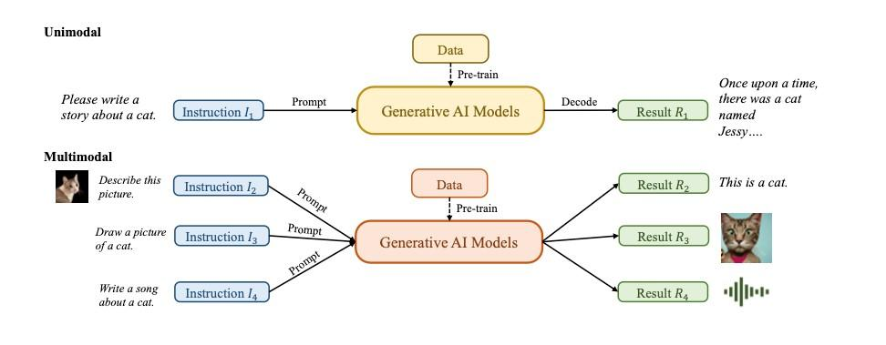{width="4.857123797025372in"
> height="1.893879046369204in"}
>
> Figure 1.2: Overview of AIGC model types. Image source
>
> *Transformer is the backbone architecture for many state-of-the-art
> models, such as GPT, DALL-E, Codex, and so on.*
>
> Transformer started out to address the limitations of traditional
> models like RNNs when dealing with variable-length sequences and
> context. The heart of the Transformer is its self-attention mechanism,
> allowing the model to focus on different parts of an input sequence.
> It comprises an encoder and a decoder. The encoder processes the input
> sequence to create hidden representations, while the decoder generates
> an output sequence. Each encoder and decoder layer includes multi-head
> attention and feed-forward neural networks. Multi-head attention, a
> key component, assigns weights to tokens based on relevance, enhancing
> the model's performance in various NLP tasks. The Transformer's
> inherent parallelizability minimizes inductive biases, making it ideal
> for large-scale pretraining and adaptability to different downstream
> tasks.
>
> Transformer architecture has dominated natural language processing,
> with two main types of pre-trained language models based on training
> tasks: masked language modeling (e.g., BERT) and autoregressive
> language modeling (e.g., GPT3). Masked language models predict masked
> tokens within a sentence, while autoregressive models focus on
> predicting the next token given previous ones, making them more
> suitable for generative tasks. RoBERTa and XL-Net are classic examples
> of masked language models and have further improved upon the BERT
> architecture with additional training data and techniques.
>
> 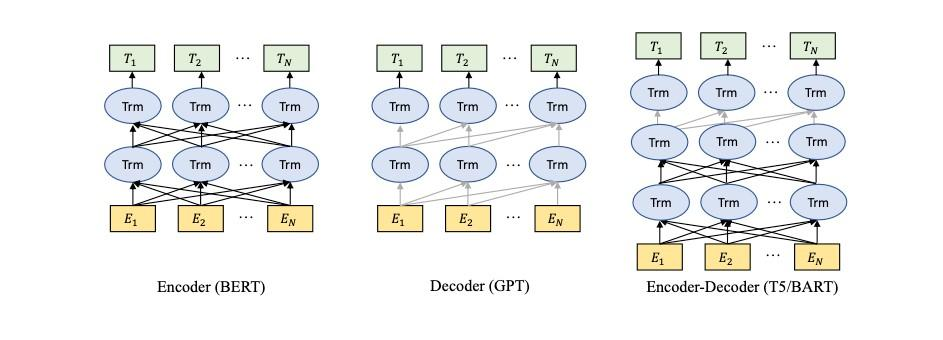{width="4.857099737532808in"
> height="1.7512346894138233in"}
>
> Figure 1.3: Categories of pre-trained LLMs. Image source
>
> In this graph, you can see two types of information flow indicated by
> lines: the black line represents bidirectional information flow, while
> the gray line represents left-to-right information flow. There are
> three main model categories:

1.  Encoder models like BERT, which are trained with context-aware
    objectives.

2.  Decoder models like GPT, which are trained with autoregressive
    objectives.

3.  Encoder-decoder models like T5 and BART, which merge both
    approaches. These models use context-aware structures as encoders
    and left-to-right structures as decoders.

### 1.4.2 Reinforcement Learning from Human Feedback

> To improve AI-generated content (AIGC) alignment with user intent,
> i.e., considerations in *usefulness* and *truthfulness*, reinforcement
> learning from human feedback (RLHF) has been applied in models like
> Sparrow, InstructGPT, and ChatGPT.
>
> The RLHF pipeline involves three steps: *pre-training*, *reward
> learning*, and *finetuning with reinforcement learning*. In reward
> learning, human feedback on diverse responses is used to create reward
> scalars. Fine-tuning is done through reinforcement learning with
> Proximal Policy Optimization (PPO), aiming to maximize the learned
> reward.
>
> However, the field lacks benchmarks and resources for RL, which is
> seen as a challenge. But this is changing day-by day. For example, an
> open-source library called RL4LMs was introduced to address this gap.
> Claude, a dialogue agent, uses *Constitutional AI*, where the reward
> model is learned via RL from AI feedback. The focus is on reducing
> harmful outputs, with guidance from a set of principles provided by
> humans. See more about the topic of *Constitutional AI* in one of our
> blog post here.

### 1.4.3 GAN

> Generative Adversarial Networks (GANs) are widely used for image
> generation. GANs consist of a generator and a discriminator. The
> generator creates new data, while the discriminator decides if the
> input is real or not.
>
> The design of the generator and discriminator influences GAN training
> and performance. Various GAN variants have been developed, including
> LAPGAN, DCGAN, Progressive GAN, SAGAN, BigGAN, StyleGAN, and methods
> addressing mode collapse like D2GAN and GMAN.
>
> The following graph illustrates some of the categories of vision
> generative models.
>
> Although GAN models are not the focus of our book, they are essential
> in powering multi-modality applications such as the diffusion models.

### 1.4.4 Applications

> Chatbots are probably one of the most popular applications for LLMs.
>
> 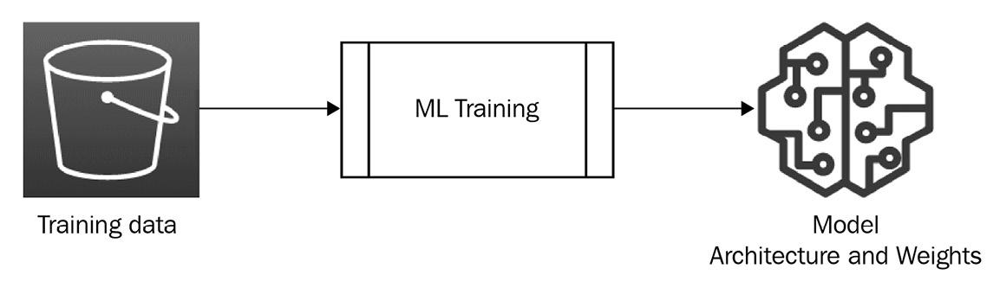{width="4.857048337707787in"
> height="2.4782884951881017in"}
>
> Figure 1.4: Categories of vision generative models. Image source
>
> Chatbots are computer programs that mimic human conversation through
> textbased interfaces. They use language models to understand and
> respond to user input. Chatbots have various use cases, like customer
> support and answering common questions. Our "*chat with your PDF
> documents*" is a up-and-coming use case!
>
> Other notable examples include Xiaoice, developed by Microsoft, which
> expresses empathy, and Google's Meena, an advanced chatbot.
> Microsoft's Bing now incorporates ChatGPT, opening up new
> possibilities for chatbot development.
>
> This graph illustrates the relationships among current research areas,
> applications, and related companies. Research areas are denoted by
> dark blue circles, applications by light blue circles, and companies
> by green circles.
>
> In addition, we have previously written about chatbots and now they
> are part of history, but still worth reviewing:

-   Blog post: What Does A Chatbot Look Like Under the Hood?

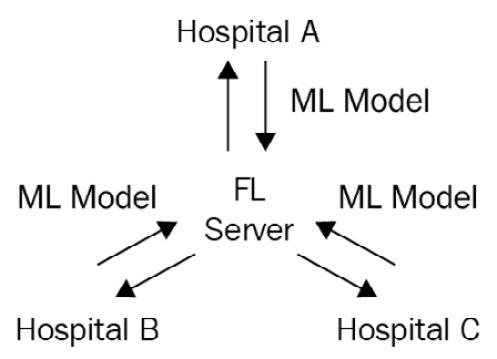{width="4.857147856517935in"
height="3.0453543307086615in"}

> Figure 1.5: Knowlege Graph for Applications. Image source

-   Blogpost: What Is Behind the Scene of A Chatbot NLU?

-   Blogpost: What More Can You Do with Chatbots?

> Of course, chatbots are not the only application. There are vast
> possibilities in arts and design, music generation, education
> technology, coding and beyond your imagination doesn't need to stop
> here.

### 1.4.5 Prompt Learning

Prompt learning is a new concept in language models. Instead of
predicting𝑥 𝑥^′^ 𝑃(𝑦\|𝑥^′^) 𝑦

given , it aims to find a template that predicts .

> *Normally, prompt learning will freeze the language model and directly
> perform few-shot or zero- shot learning on it. This enables the
> language models to be pre-trained on large amount of raw text data and
> be adapted to new domains without tuning it again. Hence, prompt
> learning could help save much time and efforts.*
>
> Traditionally, prompt learning involves prompting the model with a
> task, and it can be done in two stages: prompt engineering and answer
> engineering.
>
> **Prompt engineering:** This involves creating prompts, which can be
> either discrete (manually designed) or continuous (added to input
> embeddings) to convey task-specific information.
>
> **Answer engineering:** After reformulating the task, the generated
> answer must be mapped to the correct answer space.
>
> Besides single-prompt, *multi-prompt methods* combine multiple prompts
> for better predictions, and *prompt augmentation* basically beefs up
> the prompt to generate better results.
>
> Moreover, in-context learning, a subset of prompt learning, has gained
> popularity. It enhances model performance by incorporating a
> pre-trained language model and supplying input-label pairs and
> task-specific instructions to improve alignment with the task.
>
> Overall, in the dynamic landscape of language models, tooling and
> applications, the graph below illustrates to the evolution of language
> model engineering. With increasing flexibility along the x-axis and
> rising complexity along the yaxis, this graph offers a bird's-eye view
> of the choices and challenges faced by developers, researchers and
> companies.
>
> 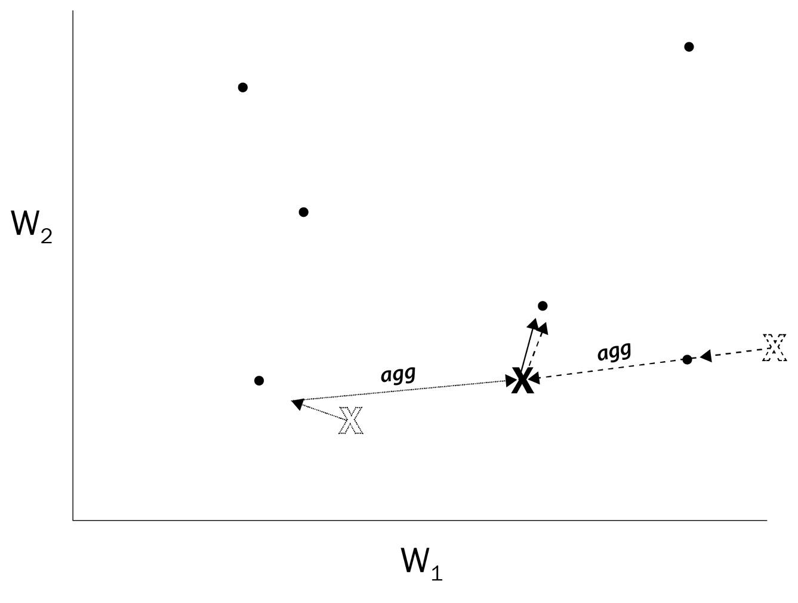{width="4.857174103237095in"
> height="2.8068908573928257in"}
>
> Figure 1.6: Emerging RAG & Prompt Engineering Architecture for LLMs.
> Image
>
> source
>
> In the top-right corner, you can see the complex, yet powerful tools
> like OpenAI, Cohere, and Anthropic (to-be-added), which have pushed
> the boundaries of what language models can achieve. Along the
> diagonal, the evolution of prompt engineering is displayed, from
> static prompts to templates, prompt chaining, RAG pipelines,
> autonomous agents, and prompt tuning. On the more flexible side,
> options like Haystack and LangChain have excelled, presenting broader
> horizons for those seeking to harness the versatility of language
> models.
>
> This graph serves as a snapshot of the ever-evolving landscape of
> toolings in the realm of language model and prompt engineering today,
> providing a roadmap for those navigating the exciting possibilities
> and complexities of this field. It is likely going to be changing
> every day, reflecting the continuous innovation and dynamism in the
> space.
>
> In the next Chapter we'll turn our focus to more details of Retrieval
> Augmented Generation (RAG) pipelines. We will break down their key
> components, architecture, and the key steps involved in building an
> efficient retrieval system.

# 2 Retrieval Augmented Generation (RAG)

> Generative AI, a subset of artificial intelligence, has revolutionized
> the field of text generation. It has paved the way for machines to
> generate human-like text, offering a myriad of benefits in various
> applications. From content creation and chatbots to language
> translation and natural language understanding, generative AI has
> proven to be a powerful tool in the world of natural language
> processing. However, it is essential to recognize that despite its
> remarkable capabilities, generative AI systems have limitations, one
> of which is their reliance on the data they have been trained on to
> generate responses.

## 2.1 The Limitation of Generative AI

> Generative AI models, such as GPT3 (Generative Pre-trained
> Transformer), have been trained on vast datasets containing text from
> the internet. While this training process equips them with a broad
> understanding of language and context, it also introduces limitations.
> These models can only generate text that aligns with the patterns and
> information present in their training data. As a result, their
> responses may not always be accurate or contextually relevant,
> especially when dealing with niche topics or recent developments that
> may not be adequately represented in their training data.

### 2.1.1 Example: Transforming Customer Support with RAG

> Imagine you're the owner of a thriving e-commerce platform, selling a
> wide range of products from electronics to fashion. You've recently
> integrated a chatbot to assist your customers with inquiries, but
> you're starting to see its limitations. Let's explore how
> Retrieval-Augmented Generation (RAG) can help overcome these
> limitations and enhance the customer support experience.
>
> **Limitations of a Traditional Large Language Model (LLM)**
>
> Your existing chatbot is built around a traditional Large Language
> Model (LLM). While it's knowledgeable about general product
> information, your customers are increasingly seeking more specific and
> real-time assistance. Here are some challenges you've encountered:
>
> **Product Availability:** Customers often inquire about the
> availability of specific items, especially during sales or promotions.
> The LLM can provide information based on its training data, but it
> doesn't have access to real-time inventory data.
>
> **Shipping and Delivery:** Customers frequently ask about shipping
> times, tracking information, and potential delays. The LLM can provide
> standard shipping policies, but it can't offer real-time updates on
> the status of an individual order.
>
> **Product Reviews:** Shoppers want to know about recent product
> reviews and ratings to make informed decisions. The LLM lacks access
> to the latest customer reviews and sentiment analysis.

**Promotions and Discounts:** Customers seek information about ongoing
promotions, discounts, and special offers. The LLM can only provide
details based on the data it was trained on, missing out on
time-sensitive deals.

2.2IntroducingRetrievalAugmentedGeneration(RAG)

### 2.1.2 How RAG Transforms Customer Support

> Now, let's introduce RAG into your e-commerce customer support system:
>
> Retrieval of Real-Time Data: With RAG, your chatbot can connect to
> your ecommerce platform's databases and data warehouses in real-time.
> It can retrieve the latest information about product availability,
> stock levels, and shipping status.
>
> **Incorporating User Reviews:** RAG can scrape and analyze customer
> reviews and ratings from your website, social media, and other
> sources. It can then generate responses that include recent reviews,
> helping customers make informed choices.

**Dynamic Promotions:** RAG can access your promotion database and
provide up-to-the-minute details about ongoing discounts, flash sales,
and limited-time offers. It can even suggest personalized promotions
based on a user's browsing history.

> **Order Tracking:** RAG can query your logistics system to provide
> customers with real-time tracking information for their orders. It can
> also proactively notify customers of any delays or issues.

## 2.2 Introducing Retrieval Augmented Generation (RAG)

> To address the limitation of generative AI, researchers and engineers
> have developed innovative approaches, one of which is the Retrieval
> Augmented Generation (RAG) approach. RAG initially caught the interest
> of generative AI developers following the release of a seminal paper
> titled "*Retrieval-Augmented Generation for Knowledge-Intensive NLP
> Tasks*" (Lewis et al. 2020) at Facebook AI Research. RAG combines the
> strengths of generative AI with retrieval techniques to enhance the
> quality and relevance of generated text. Unlike traditional generative
> models that rely solely on their internal knowledge, RAG incorporates
> an additional step where it retrieves information from external
> sources, such as databases, documents, or the web, before generating a
> response. This integration of retrieval mechanisms empowers RAG to
> access up-to-date information and context, making it particularly
> valuable for applications where accurate and current information is
> critical.
>
> In this chapter, we will delve deeper into the Retrieval Augmented
> Generation (RAG) approach, exploring its architecture, advantages, and
> real-world applications. By doing so, we will gain a better
> understanding of how RAG represents a significant step forward in
> improving the capabilities of generative AI and overcoming the
> limitations posed by reliance on static training data. Understanding
> the key concepts and components of this approach is essential for
> building an effective chat-to-PDF app.

### 2.2.1 Key Concepts and Components

> To grasp the essence of Retrieval-Augmented Generation, let's explore
> its key concepts and components:

1.  **Retrieval Component:** The retrieval component is responsible for
    searching and selecting relevant information from a database or
    corpus of documents. This component utilizes techniques like
    document indexing, query expansion, and ranking to identify the most
    suitable documents based on the user's query.

2.  **Generation Component:** Once the relevant documents are retrieved,
    the generation component takes over. It leverages Large Language
    Models (LLMs) such as GPT-3 to process the retrieved information and
    generate coherent and contextually accurate responses. This
    component is responsible for converting retrieved facts into
    human-readable answers.

3.  **Interaction Loop:** Retrieval-Augmented Generation often involves
    an interaction loop between the retrieval and generation components.
    The

2.2IntroducingRetrievalAugmentedGeneration(RAG)

> initial retrieval may not always return the perfect answer, so the
> generation component can refine and enhance the response iteratively
> by referring back to the retrieval results.

4.  **Fine-Tuning:** Successful implementation of this approach often
    requires fine-tuning LLMs on domain-specific data. Fine-tuning
    adapts the model to understand and generate content relevant to the
    specific knowledge domain, improving the quality of responses.

5.  **Latent Space Representations:** Retrieval models often convert
    documents and queries into latent space representations, making it
    easier to compare and rank documents based on their relevance to a
    query. These representations are crucial for efficient retrieval.

6.  **Attention Mechanisms:** Both the retrieval and generation
    components typically employ attention mechanisms. Attention
    mechanisms help the model focus on the most relevant parts of the
    input documents and queries, improving the accuracy of responses.

### 2.2.2 How It Improves Question Answering

> The Retrieval-Augmented Generation approach offers several advantages
> for question answering:

1.  **Access to a Wide Knowledge Base:** By integrating retrieval, the
    system can access a vast knowledge base, including large document
    collections. This enables the model to provide answers that may not
    be present in its pre-training data, making it highly informative.

2.  **Contextual Understanding:** The generation component uses the
    context provided by the retrieval results to generate answers that
    are not only factually accurate but also contextually relevant. This
    contextual understanding leads to more coherent and precise
    responses.

3.  **Iterative Refinement:** The interaction loop between retrieval and
    generation allows the system to iteratively refine its responses. If
    the initial response is incomplete or incorrect, the generation
    component can make further inquiries or clarifications based on the
    retrieval results, leading to improved answers.

4.  **Adaptability to Diverse Queries:** Retrieval-Augmented Generation
    can handle a wide range of user queries, including complex and
    multifaceted questions. It excels in scenarios where simple
    keyword-based search engines may fall short.

5.  **Fine-Tuning for Specific Domains:** By fine-tuning the model on
    domain-specific data, you can tailor it to excel in particular
    knowledge domains. This makes it a valuable tool for specialized
    question answering tasks, such as legal or medical consultations.

> In summary, Retrieval-Augmented Generation is a dynamic approach that
> combines the strengths of retrieval and generation to provide
> accurate, contextually relevant, and informative answers to user
> queries. Understanding its key components and advantages is essential
> as we move forward in building our chatto-PDF app, which will leverage
> this approach to enhance question answering over PDF documents.

## 2.3 RAG Architecture

> At its core, RAG is a framework that synergizes two vital components:
>
> **Retrieval Model:** This component specializes in searching and
> retrieving relevant information from extensive datasets, such as
> documents, articles, or databases. It identifies passages or documents
> that contain information related to a user's query.
>
> **Generation Model:** On the other hand, the generation model excels
> in crafting coherent and contextually rich responses to user queries.
> It's often based on large language models (LLMs) like GPT-3, which can
> generate human-like text.
>
> Figure 2.1 shows the RAG architecture.

2.3RAGArchitecture

{width="5.08923665791776in"
height="3.4895833333333335in"}

> Figure 2.1: RAG architechture

## 2.4 Building the Retrieval System

> In this section, we will focus on building the retrieval system, a
> critical component of the chat-to-PDF app that enables the extraction
> of relevant information from PDF documents. This section is essential
> for implementing the RetrievalAugmented Generation approach
> effectively.

### 2.4.1 Choosing a Retrieval Model

> Choosing the right retrieval model is a crucial decision when building
> your chat-to-PDF app. Retrieval models determine how efficiently and
> accurately the system can find and rank relevant documents in response
> to user queries. Here are some considerations when selecting a
> retrieval model:

-   **TF-IDF (Term Frequency-Inverse Document Frequency):** TF-IDF is a
    classical retrieval model that calculates the importance of terms in
    a document relative to a corpus. It's simple to implement and
    effective for certain tasks.

-   **BM25:** BM25 is an improved version of TF-IDF that accounts for
    document length and term saturation. It's often more effective in
    modern retrieval tasks.

-   **Vector Space Models:** These models represent documents and
    queries as vectors in a high-dimensional space. Cosine similarity or
    other distance metrics are used to rank documents. Implementations
    like Latent Semantic Analysis (LSA) and Word Embeddings (e.g.,
    Word2Vec) can be used.

-   **Neural Ranking Models:** Modern neural models, such as BERT-based
    models, are increasingly popular for retrieval tasks due to their
    ability to capture complex semantic relationships. They can be
    fine-tuned for specific tasks and domains.

-   **Hybrid Models:** Combining multiple retrieval models, such as a
    combination of TF-IDF and neural models, can offer the benefits of
    both approaches.

2.5EmbeddingsandVectorDatabasesforRetrievalinRAG

-   **Domain and Data Size:** Consider the specific requirements of your
    chatto-PDF app. Some retrieval models may be more suitable for small
    or specialized document collections, while others excel in handling
    large, diverse corpora.

-   **Scalability:** Ensure that the chosen retrieval model can scale to
    meet the needs of your application, especially if you anticipate
    handling a substantial volume of PDF documents.

## 2.5 Embeddings and Vector Databases for Retrieval in RAG

> In addition to selecting an appropriate retrieval model, leveraging
> embeddings and vector databases can significantly enhance the
> performance and efficiency of the retrieval component within your
> chat-to-PDF app. Vector embeddings are a fundamental concept in modern
> information retrieval and natural language processing. They transform
> textual data into numerical vectors, enabling computers to understand
> and manipulate text data in a mathematical, geometric space. These
> embeddings capture semantic and contextual relationships between
> words, documents, or other textual entities, making them highly
> valuable in various applications, including the retrieval component of
> Retrieval Augmented Generation (RAG).

### 2.5.1 Vector Embeddings: An Overview

> Vector embeddings represent words, phrases, sentences, or even entire
> documents as points in a high-dimensional vector space. The key idea
> is to map each textual element into a vector in such a way that
> semantically similar elements are located close to each other in this
> space, while dissimilar elements are further apart. This geometric
> representation facilitates similarity calculations, clustering, and
> other operations.
>
> Examples of Vector Embeddings:

1.  **Word Embeddings (Word2Vec, GloVe):** Word embeddings represent
    individual words as vectors. For example, "king" and "queen" may be
    represented as vectors that are close together in the vector space
    because they share similar semantic properties.

2.  **Document Embeddings (Doc2Vec, BERT):** Document embeddings map
    entire documents (such as PDFs) into vectors. Two documents
    discussing similar topics will have embeddings that are close in the
    vector space.

> There are abundent of tutorials and resources that can help you learn
> more about vector embeddings. Here are some resources that can help
> you get started:

-   Vector Embeddings Explained

-   Google Vector embeddings

-   What are vector embeddings

### 2.5.2 Vector Databases and Their Role in Enhancing Retrieval

> Vector databases, also known as similarity search engines or vector
> index databases, play a crucial role in the retrieval component of RAG
> by efficiently storing and retrieving these vector embeddings. They
> are specialized databases designed for retrieving vectors based on
> similarity, making them well-suited for scenarios where similarity
> between data points needs to be calculated quickly and accurately.
>
> How Vector Databases Enhance Retrieval in RAG:

1.  **Fast Retrieval:** Vector databases employ indexing structures
    optimized for similarity search. They use algorithms like
    approximate nearest neighbor (ANN) search to quickly locate the most
    similar vectors, even in large datasets containing numerous
    documents.

2.5EmbeddingsandVectorDatabasesforRetrievalinRAG

2.  **Scalability:** Vector databases can efficiently scale as the
    corpus of documents grows. This ensures that retrieval performance
    remains consistent, regardless of the dataset's size.

3.  **Advanced Similarity Scoring:** These databases offer a range of
    similarity metrics, such as cosine similarity or Jaccard index,
    allowing you to fine-tune the relevance ranking of retrieved
    documents based on your specific requirements.

4.  **Integration with Retrieval Models:** Vector databases can be
    seamlessly integrated into your retrieval system. They complement
    retrieval models like TF-IDF, BM25, or neural ranking models by
    providing an efficient means of candidate document selection based
    on vector similarity.

> All of these factors has resulted in numerous new vector databases.
> Selecting and depending on one of these databases can have
> long-lasting consequences and dependencies within your system.
> Ideally, we opt for a vector database that exhibits strong
> scalability, all while maintaining cost-efficiency and minimizing
> latency. Some of these vector databases are: Qdrant, Weaviate,
> Pinecone, pgvector, Milvus, and Chroma.
>
> {width="4.8567322834645665in"
> height="2.1673359580052494in"}
>
> Figure 2.2: Vector databases comparison. Image source

6.  **RAG Data Ingestion Pipeline**

> Before your Chat-to-PDF app can effectively retrieve information from
> a vector database, it's imperative to preprocess the PDF documents and
> create a structured and searchable index for the preprocessed data.
> This searchable index serves as the cornerstone of your application,
> akin to a meticulously organized library catalog. It empowers your
> system to swiftly and accurately locate relevant information within
> PDF documents, enhancing the efficiency and precision of the retrieval
> process.
>
> Figure 2.3 illustrates the RAG data ingestion pipeline. in Chapter 3,
> we will fully discuss how to prepare, index, and store the documents
> in a vector database.
>
> {width="4.857162073490814in"
> height="1.6858803587051618in"}
>
> Figure 2.3: RAG data ingestion pipeline

7.  **Challenges of Retrieval-Augmented Generation**

> The adoption of Retrieval-Augmented Generation (RAG) represents a
> significant advancement in natural language processing and information
> retrieval. However, like any complex AI system, RAG presents a set of
> challenges that must be addressed to fully harness its potential. In
> this section, we explore some of the key challenges associated with
> RAG.
>
> 2.7ChallengesofRetrieval-AugmentedGeneration
>
> **2.7.1 Data Quality and Relevance**
>
> RAG heavily relies on the availability of high-quality and relevant
> data for both retrieval and generation tasks. Challenges in this area
> include:

-   **Noisy Data:** Incomplete, outdated, or inaccurate data sources can
    lead to retrieval of irrelevant information, impacting the quality
    of generated responses.

-   **Bias and Fairness:** Biases present in training data may lead to
    biased retrieval and generation, perpetuating stereotypes or
    misinformation.

#### 2.7.2 Integration Complexity

> Integrating retrieval and generation components seamlessly is
> non-trivial, as it involves bridging different architectures and
> models. Challenges include:

-   **Model Compatibility:** Ensuring that the retrieval and generation
    models work harmoniously, especially when combining traditional
    methods (e.g., TF-IDF) with neural models (e.g., GPT-3).

-   **Latency and Efficiency:** Balancing the need for real-time
    responsiveness with the computational resources required for
    retrieval and generation.

#### 2.7.3 Scalability

> Scaling RAG systems to handle large volumes of data and user requests
> can be challenging:

-   **Indexing Efficiency:** As the document corpus grows, maintaining
    an efficient and up-to-date index becomes crucial for retrieval
    speed.

-   **Model Scaling:** Deploying large-scale neural models for both
    retrieval and generation may require substantial computational
    resources.

#### 2.7.4 Evaluation Metrics

> Evaluating the performance of RAG systems presents difficulties:

-   **Lack of Gold Standards:** In some cases, there may be no clear
    gold standard for evaluating the relevance and quality of retrieved
    documents.

-   **Diverse User Needs:** Users have diverse information needs, making
    it challenging to develop universal evaluation metrics.

#### 2.7.5 Domain Adaptation

> Adapting RAG systems to specific domains or industries can be complex:

-   **Domain-Specific Knowledge:** Incorporating domain-specific
    knowledge and jargon into retrieval and generation.

-   **Training Data Availability:** The availability of domain-specific
    training data for fine-tuning models.

> Addressing these challenges is essential to unlock the full potential
> of RAG in various applications, from question answering to content
> generation. As research and development in this field continue,
> finding innovative solutions to these challenges will be critical for
> building robust and reliable RAG systems that deliver accurate,
> relevant, and trustworthy information to users.
>
> As we conclude our exploration of the foundations and the retrieval
> component of Retrieval-Augmented Generation (RAG) systems in this
> Chapter, we now turn our attention to the practical implementation of
> RAG pipelines in Chapter 3. In this next chapter, we'll delve into the
> nitty-gritty details of how these systems come to life, starting with
> the preprocessing of PDF documents and the data ingestion pipeline.
> We'll also discuss the generation components that make RAG systems
> work. Further, Chapter 3 explores the impact of text splitting methods
> on RAG quality and the crucial role of metadata in enhancing the
> overall RAG experience.

3.  **RAG Pipeline Implementation**

> **3.1 Preprocessing PDF documents**
>
> Before we can harness the power of Large Language Models (LLMs) and
> particularly RAG method for question answering over PDF documents,
> it's essential to prepare our data. PDFs, while a common format for
> documents, pose unique challenges for text extraction and analysis. In
> this section, we'll explore the critical steps involved in
> preprocessing PDF documents to make them suitable for our Chat-to-PDF
> app. These steps are not only essential for PDFs but are also
> applicable to other types of files. However, our primary focus is on
> PDF documents due to their prevalence in various industries and
> applications.

#### 3.1.1 PDF Text Extraction

> PDFs may contain a mix of text, images, tables, and other elements. To
> enable text-based analysis and question answering, we need to extract
> the textual content from PDFs. Here's how you can accomplish this:

-   **TextExtraction Tools:** Explore available tools and libraries like
    PyPDF2, pdf2txt, or PDFMiner to extract text from PDF files
    programmatically.

-   **Handling Scanned Documents:** If your PDFs contain scanned images
    instead of selectable text, you may need Optical Character
    Recognition (OCR) software to convert images into machine-readable
    text.

-   **Quality Control:** Check the quality of extracted text and perform
    any necessary cleanup, such as removing extraneous characters or
    fixing formatting issues.

#### 3.1.2 Handling Multiple Pages

> PDF documents can span multiple pages, and maintaining context across
> pages is crucial for question answering. Here's how you can address
> this challenge:

-   **Page Segmentation:** Segment the document into logical units, such
    as paragraphs or sections, to ensure that context is preserved.

-   **Metadata Extraction:** Extract metadata such as document titles,
    authors, page numbers, and creation dates. This metadata can aid in
    improving searchability and answering user queries.

#### 3.1.3 Text Cleanup and Normalization

> PDFs may introduce artifacts or inconsistencies that can affect the
> quality of the extracted text. To ensure the accuracy of question
> answering, perform text cleanup and normalization:

-   **Whitespace and Punctuation:** Remove or replace excessive
    whitespace and special characters to enhance text readability.

-   **Formatting Removal:** Eliminate unnecessary formatting, such as
    font styles, sizes, and colors, which may not be relevant for
    question answering.

-   **Spellchecking:** Check and correct spelling errors that might
    occur during the extraction process.

#### 3.1.4 Language Detection

> If your PDF documents include text in multiple languages, it is a good
> idea to implement language detection algorithms to identify the
> language used in each section. This information can be useful when
> selecting appropriate LLM models for question answering.
>
> **3.2 Data Ingestion Pipeline Implementation**
>
> As it has been depicted in Figure 2.3 the first step of the data
> ingestion pipeline is *extracting and spliting text from the pdf
> documents*. There are several packages for this goal including:

-   PyPDF2

-   pdfminer.six

-   unstructured

> Additionally, there are data loaders hub like llamahub that contains
> tens of data loaders for reading and connecting a wide variety data
> sources to a Large Language Model (LLM).
>
> Finally, there are packages like llamaindex, and langchain. These are
> frameworks that faciliates developing applications powered by LLMs.
> Therefore, they have implemented many of these data loaders including
> extracting and spliting text from pdf files.
>
> **Step 1: Install necessary libraries**
>
> pip install llama-index pip install langchain
>
> **Step 2: Load the pdf file and extract the text from it**
>
> Code below will iterate over the pages of the pdf file, extract the
> text and add it to the documents list object, see Figure 3.1.
>
> {width="4.857147856517935in"
> height="2.36549321959755in"}
>
> Figure 3.1: Load pdf files
>
> Now every page has become a separate document that we can later *embed
> (vectorize)* and *store* in the vector database. However, some pages
> could be very lengthy and other ones could be very short as page
> length varies. This could signaficantly impact the quality of the
> document search and retrieval.
>
> Additionally, LLMs have a limited context window (token limit), i.e.
> they can handle certain number of tokens (a token roughly equals to a
> word). Therefore, we instead first concatenate all the pages into a
> long text document and then split that document into smaller
> reletively equal size chunks. We then embed each chunk of text and
> insert into the vector database.
>
> Nevertheless, since we are going to use llamaindex and langchain
> frameworks for the RAG pipeline, Let's utilize the features and
> functions these frameworks offer. They have data loaders and splitters
> that we can use to read and split pdf files. You can see the code in
> Figure 3.2.
>
> pdf_content\[0\] contains the entire content of pdf, and has s special
> structure. It is a Document object with some properties including
> page_content and metadata. page_content is the textual content and
> metadata contains some meta-
>
> {width="4.8570811461067365in"
> height="1.9640212160979877in"}
>
> Figure 3.2: Langchain data loader
>
> data about the pdf. Here's the partial output the Document object of
> our pdf in Figure 3.3.
>
> 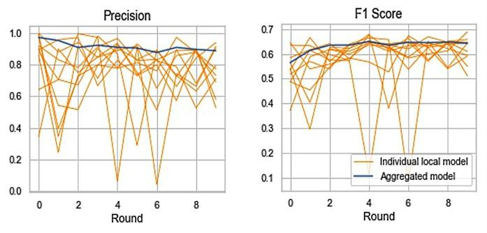{width="4.8570406824146986in"
> height="1.0407939632545933in"}
>
> Figure 3.3: Langchain data loader output
>
> A Document object is a generic class for storing a piece of
> unstructured text and its associated metadata. See here for more
> information. **Step 3: Split the text into smaller chunks**
>
> There are several different text splitters. For more information see
> langchain API, or llamaIndex documentation. Two common ones are:

i.  CharacterTextSplitter: Split text based on a certain number
    characters.

ii. TokenTextSplitter: Split text to tokens using model tokenizer.

> The following code in Figure 3.4 chunks the pdf content into sizes no
> greater than 1000, with a bit of overlap to allow for some continued
> context.
>
> 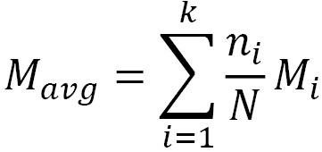{width="4.856896325459317in"
> height="1.5922495625546806in"}
>
> Figure 3.4: Langchain text split method
>
> Here's the number of chunks created from splitting the pdf file.
>
> \# Print the number of chunks (list of Document objects)
>
> print(len(docs))
>
> \# 30
>
> **Step 4: Embed and store the documents in the vector database**
>
> In this step we need to convert chunks of text into embedding vectors.
> There are plenty of embedding models we can use including OpenAI
> models, Huggingface models, and Cohere models. You can even define
> your own custom embedding model. Selecting an embedding model depnds
> on several factors:

-   **Cost:** Providers such as OpenAI or Cohere charge for embeddings,
    albeit it's cheap, when you scale to thusands of pdf files, it will
    become prohibitive.

-   **Latency and speed:** Hosting an embedding model on your server
    reduce the latency, whereas using vendors' API increases the
    latency.

-   **Convenience:** Using your own embedding model needs more compute
    resource and maintainance whereas using vendors APIs like OpenAI
    gives you a hassle-free experience.

> Similar to having several choices for embedding models, there are so
> many options for choosing a vector database, which is out the scope of
> this book.
>
> Figure 3.5 shows some of the most popular vector database vendors and
> some of the features of their hosting. This blog fully examines these
> vector databases from different perspective.
>
> {width="4.856864610673666in"
> height="3.24830927384077in"}
>
> Figure 3.5: Various vector databases. Image source
>
> We are going to use OpenAI models, particularly text-embedding-ada-002
> for embedding. Furthermore, we choose Qdrant as our vector database.
> It's open source, fast, very flexible, and offers a free clould-based
> tier.
>
> We first install the openai and qdrant package.
>
> pip install openai pip install qdrant-client
>
> We also require an API key that we can get it from here.
>
> If we set OPENAI_API_KEY environment variable to our API key, we can
> easily call the functions that needs it without getting any error.
> Otherwise we can pass the API key parameter to functions requiring it.
> Figure 3.6 shows how to do it.
>
> {width="4.856896325459317in"
> height="3.0135192475940507in"}
>
> Figure 3.6: Qdrant vector database setup via Langchain
>
> Please note that there are several different ways to achieve the same
> goal
>
> (embedding and storing in the vector database). You can use Qdrant
> client library directly instead of using the langchain wrapper for it.
> Also, you can first create embeddings separately and then store them
> in the Qdrant vector database. Here, we embedded the documents and
> stored them all by calling Qdrant.from_documents().
>
> In addition, you can use Qdrant cloud vector database to store the
> embeddings and use their REST API to interact with it, unlike this
> example where the index is stored locally in the /tmp/local_qdrant
> directory. This approach is suitable for testing and POC
> (Proof-Of-Concept), not for production environment.
>
> We can try and see how we can search and retrieve relevant documents
> from the vector database. For instance, let's see what the answer to
> the question *"what is knearest neighbor?"*. See the output in Figure
> 3.7.
>
> {width="4.856896325459317in"
> height="2.7089610673665794in"}
>
> Figure 3.7: Question answering example with output
>
> Awesome! The retrieved answer seems quite relevant.
>
> The entire code is displayed in Figure 3.8.

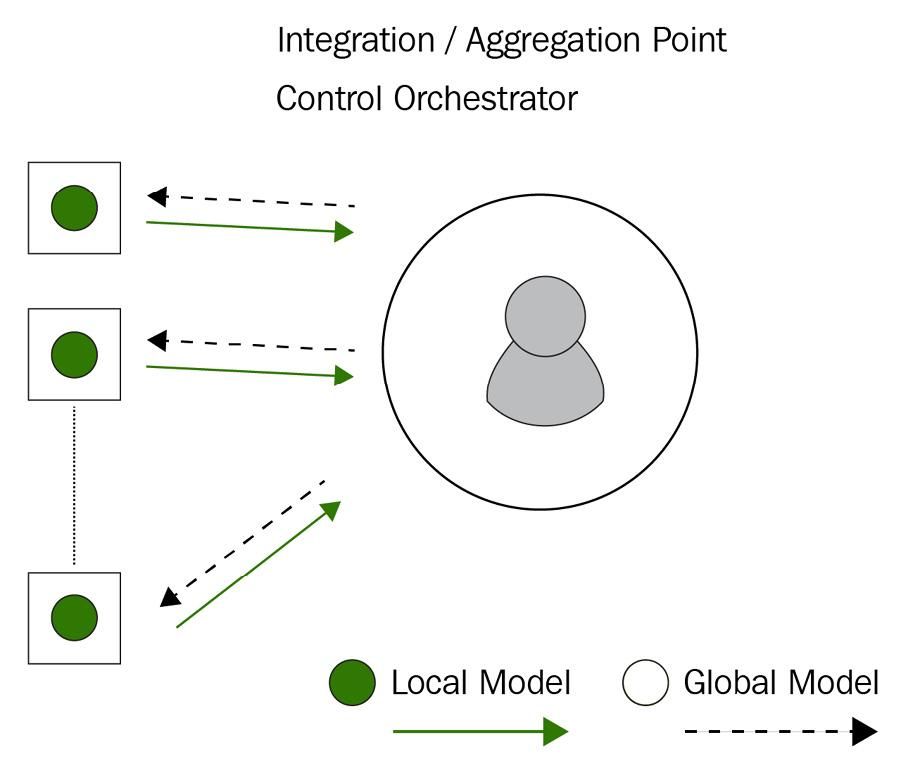{width="4.856896325459317in"
height="4.43478893263342in"}

> Figure 3.8: The entire code for retrieval component

3.3GenerationComponentImplementation

> **3.3 Generation Component Implementation**
>
> Figure 3.9 illustrates a simplified version of the RAG pipeline we saw
> in Chapter 2. So far our **Retrieval** component of the RAG is
> implemented. In the next section we will implement the **Generation**
> component.
>
> {width="4.85706583552056in"
> height="2.0912357830271215in"}
>
> Figure 3.9: RAG pipeline
>
> The steps for generating a response for a user's question are:

-   **Step 1:** Embed the user's query using the same model used for
    embedding documents

-   **Step 2:** Pass the query embedding to vector database, search and
    retrieve the top-k documents (i.e. context) from the vector database

-   **Step 3:** Create a "prompt" and include the user's query and
    context in it

-   **Step 4:** Call the LLM and pass the the prompt

-   **Step 5:** Get the generated response from LLM and display it to
    the user

> Again, we can follow each step one by one, or utilize the features
> langchain or llamaIndex provide. We are going to use langchain in this
> case.
>
> Langchain includes several kinds of built-in question-answering
> chains. A *chain* in LangChain refers to a sequence of calls to
> components, which can include other chains or external tools. In order
> to create a question answering chain, we use:

1.  **load_qa_chain:** load_qa_chain() is a function in Langchain that
    loads a pre-configured question answering chain. It takes in a
    language model like OpenAI, a chain type (e.g. "stuff" for
    extracting answers from text), and optionally a prompt template and
    memory object. The function returns a QuestionAnsweringChain
    instance that is ready to take in documents and questions to
    generate answers.

2.  **load_qa_with_sources_chain:** This is very similar to
    load_qa_chain except it contains sources/metadata along with the
    returned response.

3.  **RetrievalQA:** RetrievalQA is a class in Langchain that creates a
    question answering chain using retrieval. It combines a retriever,
    prompt template, and LLM together into an end-to-end QA pipeline.
    The prompt template formats the question and retrieved documents
    into a prompt for the LLM. This chain retrieves relevant documents
    from a vector database for a given query, and then generates an
    answer using those documents.

4.  **RetrievalQAWithSourcesChain:** It is a variant of RetrievalQA that
    returns relevant source documents used to generate the answer. This
    chain returns an AnswerWithSources object containing the answer
    string and a list of source IDs.

> Here's the code demonstraing the implementation, Figure 3.10:
>
> Figure 3.11 shows how to use load_qa_with_sources_chain:
>
> Similarly, if we use RetrievalQA, we will have Figure 3.12:
>
> And here's the code when we use RetrievalQAWithSourcesChain, Figure
> 3.13:
>
> As you can see, it's fairly straight forward to implement RAG (or say
> a prototype RAG application) using frameworks like langchain or
> llamaIndex. However, when it comes to deploying RAG to production and
> scaling the system, it becomes notoriously challenging. There are a
> lot of nuances that will affect

3.3GenerationComponentImplementation

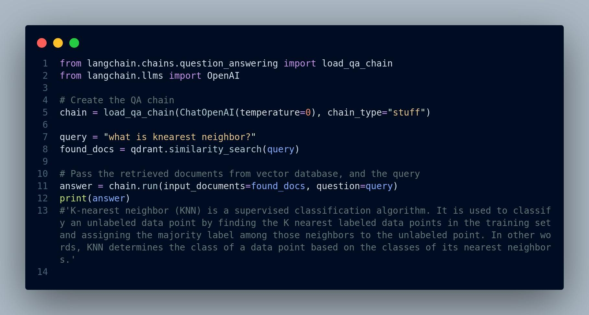{width="4.856896325459317in"
height="2.607442038495188in"}

> Figure 3.10: Response generation using Langchain chain

{width="4.856896325459317in"
height="2.302884951881015in"}

> Figure 3.11: Using load_qa_with_sources_chain chain for response
> generation

{width="4.856896325459317in"
height="1.9983267716535433in"}

> Figure 3.12: The usage of RetrievalQA chain

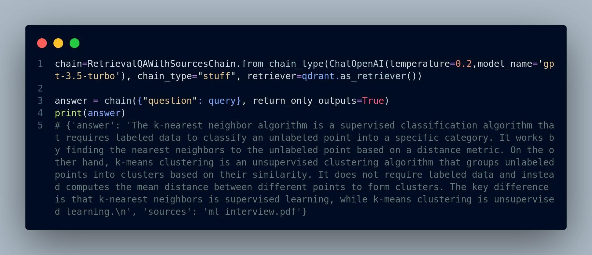{width="4.856896325459317in"
height="2.0998458005249345in"}

Figure 3.13: Code snippet for using Langchain RetrievalQAWith-

> SourcesChain for response generation
>
> 3.4ImpactofTextSplittingonRetrievalAugmentedGeneration(RAG)Quality

the quality of the RAG, and we need to take them into consideration. We
will discuss some of the main challenges and how to address them in the
next few sections.

> **3.4 Impact of Text Splitting on Retrieval Augmented**
>
> **Generation (RAG) Quality**
>
> In the context of building a Chat-to-PDF app using Large Language
> Models (LLMs), one critical aspect that significantly influences the
> quality of your Retrieval Augmented Generation (RAG) system is how you
> split text from PDF documents. Text splitting can be done at two
> levels: *splitting by character* and *splitting by token*. The choice
> you make between these methods can have a profound impact on the
> effectiveness of your RAG system. Let's delve into the implications of
> each approach.

#### 3.4.1 Splitting by Character

> **Advantages:**
>
> **Fine-Grained Context:** Splitting text by character retains the
> finest granularity of context within a document. Each character
> becomes a unit of input, allowing the model to capture minute details.
>
> **Challenges:**

-   **Long Sequences:** PDF documents often contain long paragraphs or
    sentences. Splitting by character can result in extremely long input
    sequences, which may surpass the model's maximum token limit, making
    it challenging to process and generate responses.

-   **Token Limitations:** Most LLMs, such as GPT-3, have token limits,
    often around 4,000 tokens. If a document exceeds this limit, you'll
    need to truncate or omit sections, potentially losing valuable
    context.

-   **Increased Inference Time:** Longer sequences require more
    inference time, which can lead to slower response times and
    increased computational costs.

#### 3.4.2 Splitting by Token

> **Advantages:**

-   **Token Efficiency:** Splitting text by token ensures that each
    input sequence remains within the model's token limit, allowing for
    efficient processing.

-   **Balanced Context:** Each token represents a meaningful unit,
    striking a balance between granularity and manageability.

-   **Scalability:** Splitting by token accommodates documents of
    varying lengths, making the system more scalable and adaptable.

> **Challenges:**

-   **Contextual Information:** Token-based splitting may not capture
    extremely fine-grained context, potentially missing nuances present
    in character-level splitting.

#### 3.4.3 Finding the Right Balance

> The choice between character-level and token-level splitting is not
> always straightforward and may depend on several factors:
>
> 3.5ImpactofMetadataintheVectorDatabaseonRetrievalAugmentedGeneration(RAG)

-   **Document Types:** Consider the types of PDF documents in your
    collection. Technical manuals with precise details may benefit from
    characterlevel splitting, while general documents could work well
    with token-level splitting.

-   **Model Limitations:** Take into account the token limits of your
    chosen LLM. If the model's limit is a significant constraint,
    token-level splitting becomes a necessity.

-   **User Experience:** Assess the trade-off between detailed context
    and response time. Character-level splitting might provide richer
    context but at the cost of slower responses.

#### 3.4.4 Hybrid Approaches

> In practice, you can also explore hybrid approaches to text splitting.
> For instance, you might use token-level splitting for most of the
> document and switch to character-level splitting when a specific
> question requires fine-grained context.
>
> The impact of text splitting on RAG quality cannot be overstated. It's
> a critical design consideration that requires a balance between
> capturing detailed context and ensuring system efficiency. Carefully
> assess the nature of your PDF documents, the capabilities of your
> chosen LLM, and user expectations to determine the most suitable text
> splitting strategy for your Chat-to-PDF app. Regular testing and user
> feedback can help refine this choice and optimize the overall quality
> of your RAG system.
>
> **3.5 Impact of Metadata in the Vector Database on Retrieval Augmented
> Generation (RAG)**
>
> The inclusion of metadata about the data stored in the vector database
> is another factor that can significantly enhance the quality and
> effectiveness of your

Retrieval Augmented Generation (RAG) system. Metadata provides valuable
contextual information about the PDF documents, making it easier for the
RAG model to retrieve relevant documents and generate accurate
responses. Here, we explore the ways in which metadata can enhance your
RAG system.

#### 3.5.1 Contextual Clues

> Metadata acts as contextual clues that help the RAG model better
> understand the content and context of each PDF document. Typical
> metadata includes information such as:

-   **Document Title:** The title often provides a high-level summary of
    the document's content.

-   **Author:** Knowing the author can offer insights into the
    document's perspective and expertise.

-   **Keywords and Tags:** Keywords and tags can highlight the main
    topics or themes of the document.

-   **Publication Date:** The date of publication provides a temporal
    context, which is crucial for understanding the relevance of the
    document.

-   **Document Type:** Differentiating between research papers, user
    manuals, and other types of documents can aid in tailoring responses
    appropriately.

#### 3.5.2 Improved Document Retrieval

> With metadata available in the vector database, the retrieval
> component of your RAG system can become more precise and efficient.
> Here's how metadata impacts document retrieval:

-   **Relevance Ranking:** Metadata, such as document titles, keywords,
    and tags, can be used to rank the documents based on relevance to a
    user query. Documents with metadata matching the query can be given
    higher priority during retrieval. For example, if a user asks a
    question related

> 3.5ImpactofMetadataintheVectorDatabaseonRetrievalAugmentedGeneration(RAG)
>
> to "machine learning," documents with "machine learning" in their
> keywords or tags might be given priority during retrieval.

-   **Filtering:** Metadata can be used to filter out irrelevant
    documents early in the retrieval process, reducing the computational
    load and improving response times. For instance, if a user asks
    about "biology," documents with metadata indicating they are
    engineering manuals can be excluded from consideration.

-   **Enhanced Query Understanding:** Metadata provides additional
    context for the user's query, allowing the RAG model to better
    understand the user's intent and retrieve documents that align with
    that intent. For example, if the metadata includes the publication
    date, the RAG model can consider the temporal context when
    retrieving documents.

#### 3.5.3 Contextual Response Generation

> Metadata can also play a crucial role in the generation component of
> your RAG system. Here's how metadata impacts response generation:

-   **Context Integration:** Metadata can be incorporated into the
    response generation process to provide more contextually relevant
    answers. For example, including the publication date when answering
    a historical question.

-   **Customization:** Metadata can enable response customization. For
    instance, the tone and style of responses can be adjusted based on
    the author's information.

-   **Enhanced Summarization:** Metadata can aid in the summarization of
    retrieved documents, allowing the RAG model to provide concise and
    informative responses. For instance, if the metadata includes the
    document type as "research paper," the RAG system can generate a
    summary that highlights the key findings or contributions of the
    paper.

#### 3.5.4 User Experience and Trust

> Including metadata in the RAG system not only enhances its technical
> capabilities but also improves the overall user experience. Users are
> more likely to trust and find value in a system that provides
> contextually relevant responses. Metadata can help build this trust by
> demonstrating that the system understands and respects the nuances of
> the user's queries.
>
> Overall, incorporating metadata about data in the vector database of
> your Chatto-PDF app's RAG system can significantly elevate its
> performance and user experience. Metadata acts as a bridge between the
> user's queries and the content of PDF documents, facilitating more
> accurate retrieval and generation of responses.
>
> As we conclude our exploration of the nuts and bolts of RAG pipelines
> in this Chapter, it's time to move on to more complex topics. In
> Chapter 4, we'll take a deep dive and try to address some of the
> retrieval and generation challenges that come with implementing
> advanced RAG systems.
>
> We'll discuss the optimal chunk size for efficient retrieval, consider
> the balance between context and efficiency, and introduce additional
> resources for evaluating RAG performance. Furthermore, we'll explore
> retrieval chunks versus synthesis chunks and ways to embed references
> to text chunks for better understanding.
>
> We'll also investigate how to rethink retrieval methods for
> heterogeneous document corpora, delve into hybrid document retrieval,
> and examine the role of query rewriting in enhancing RAG capabilities.

4.  **From Simple to Advanced RAG**

> **4.1 Introduction**
>
> As we traverse the path from development to production, the world of
> Retrieval Augmented Generation (RAG) applications unveils its
> potential to transform the way we interact with vast collections of
> information. In the preceding chapters, we've laid the groundwork for
> building RAG systems that can answer questions, provide insights, and
> deliver valuable content. However, the journey is far from over.
>
> *Please note that LlamaIndex framework has been used for several of
> the code implementations in this chapter. This framework also contains
> a lot of advanced tutorials about RAG that inspired the content of
> this chapter.*
>
> The transition from a well-crafted RAG system in the development
> environment to a real-world production application is a monumental
> step, one that demands careful consideration of a myriad of factors
> and deals with limitations of existing approaches. These
> considerations ensure your RAG application operates seamlessly in a
> real-world production environment. There are so many challenges and
> consideration for building *production-ready* RAG. Nevertheless, we
> will discuss some of the primary ones.
>
> RAG pipeline consists of two components: i) Retrieval and, ii)
> response generation (synthesis). Each component has its own
> challenges.

#### Retrieval Challenges

-   **Low precision:** When retrieving the top-k chunks, there's a risk
    of including irrelevant content, potentially leading to issues like
    hallucination and generating inaccurate responses.

-   **Low recall:** In certain cases, even when all the relevant chunks
    are retrieved, the text chunks might lack the necessary global
    context beyond the retrieved chunks to generate a coherent response.

-   **Obsolete information:** Ensuring the data remains up-to-date is
    critical to avoid reliance on obsolete information. Regular updates
    are essential to maintain data relevance and accuracy.

#### Generation Challenges

-   **Hallucination:** The model generates responses that include
    information not present in the context, potentially leading to
    inaccuracies or fictional details.

-   **Irrelevance:** The model produces answers that do not directly
    address the user's question, resulting in responses that lack
    relevance or coherence.

-   **Bias:** The model generates answers that contai n harmful or
    offensive content, potentially reflecting biases and undermining
    user trust and safety.

#### What Can be done

> In order to effectively tackle the challenges in Retrieval Augmented
> Generation (RAG) systems, several key strategies can be employed:

1.  **Data Augmentation:** Can we enrich our dataset by storing
    supplementary information beyond raw text chunks, such as metadata
    or structured data, to provide richer context for retrieval and
    generation processes?

2.  **Optimized Embeddings:** Can we refine and enhance our embedding
    representations to capture context more effectively, improve the
    relevance of retrieved information, and enable more coherent
    response generation?

3.  **Advanced Retrieval Techniques:** Can we go beyond basic top-k
    embedding lookup and implement advanced retrieval methods, such as
    semantic search, or hybrid search (keyword search + semantic search)
    to enhance the precision and recall of information retrieval?

4.  **Multi-Purpose Use of LLMs:** Can we leverage Large Language Models
    (LLMs) for tasks beyond text generation, such as question answering,
    summarization, or knowledge graph construction, to augment the
    capabilities of RAG systems and provide more comprehensive responses
    to user queries?

> Let's dive in a bit more deeply into aforementioned challenges and
> propose how to alleiviate each one.
>
> **4.2 Optimal Chunk Size for Efficient Retrieval**
>
> The chunk size in a RAG system is the size of the text passages that
> are extracted from the source text and used to generate the retrieval
> index. The chunk size has a significant impact on the system's
> efficiency and performance in several ways:

#### 4.2.1 Balance Between Context and Efficiency

> The chunk size should strike a balance between providing sufficient
> context for generating coherent responses (i.e. Relevance and
> Granularity) and ensuring efficient retrieval and processing (i.e
> Performance).
>
> A smaller chunk size results in more granular chunks, which can
> improve the relevance of the retrieved chunks. However, it is
> important to note that the most relevant information may not be
> contained in the top retrieved chunks, especially if the
> *similarity_top_k* setting is low (e.g. k=2). A smaller chunk size
> also results in more chunks, which can increase the system's memory
> and processing requirements.
>
> A larger chunk size can improve the system's performance by reducing
> the number of chunks that need to be processed. However, it is
> important to note that a larger chunk size can also reduce the
> relevance of the retrieved chunks.
>
> The optimal chunk size for a RAG system depends on a number of
> factors, including the size and complexity of the source text, the
> desired retrieval performance, and the available system resources.
> However, it is important to experiment with different chunk sizes to
> find the one that works best for your specific system. But, how do we
> know what works and what doesn't?
>
> **Question:** *How can we measure the performance of RAG?*
>
> **Answer:** We have to define evaluation metrics and then use
> evaluation tools to measure how the RAG performs considering the
> metrics. There are several tools to evaluate the RAG including
> LlamaIndex **Response Evaluation** module to test, evaluate and choose
> the right *chunk size*. It contains a few components, particularly:

1.  **Faithfulness Evaluator:** This tool assesses whether the response
    includes fabricated information and determines if the response
    aligns with any source nodes from the query engine.

2.  **Relevancy Evaluator:** This tool gauges whether the response
    effectively addresses the query and evaluates if the combined
    information from the response and source nodes corresponds to the
    query.

> The code below shows how to use *Evaluation module* and determine the
> optimal *chunk size* for retrieval. To read the full article, see this
> link.
>
> Figure 4.1 shows the data preparation for evaluation module.

{width="4.856896325459317in"
height="3.318076334208224in"}

> Figure 4.1: data preparation for response evaluation
>
> Figure 4.2 displays the criteria to set for evaluation.
>
> 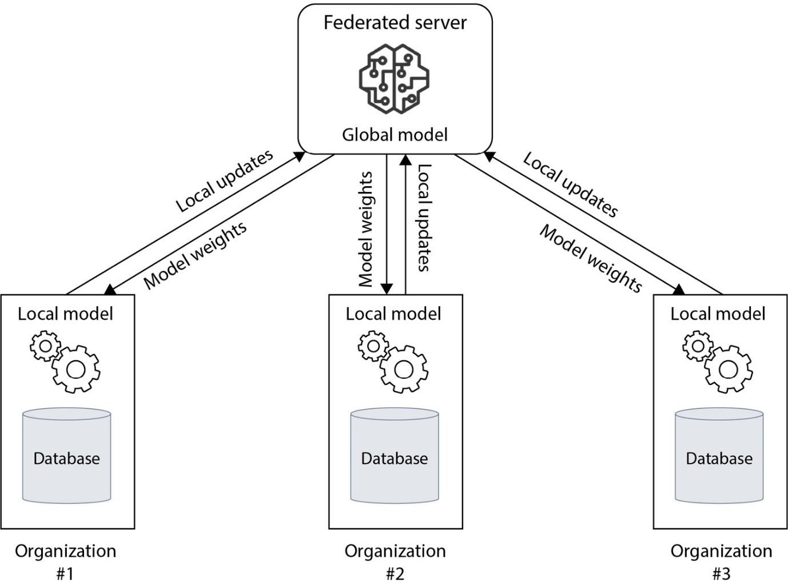{width="4.856896325459317in"
> height="2.302884951881015in"}
>
> Figure 4.2: Define criteria for evaluation
>
> Figure 4.3 shows the evaluation function definition.
>
> And Figure 4.4 demonstrates testing the evaluation function with
> different chunk sizes.
>
> They test across different chunk sizes and conclude (in this
> experiment) that chunk_size = 1024 results in peaking of *Average
> Faithfulness* and *Average Relevancy*.
>
> Here are summary of the tips for choosing the optimal chunk size for a
> RAG system:

-   Consider the size and complexity of the source text. Larger and more
    complex texts will require larger chunk sizes to ensure that all of
    the relevant information is captured.

-   Consider the desired retrieval performance. If you need to retrieve
    the most relevant chunks possible, you may want to use a smaller
    chunk size.

{width="4.856896325459317in"
height="4.536307961504812in"}

> Figure 4.3: Define a function to perform evaluation

{width="4.856896325459317in"
height="1.3892115048118985in"}

> Figure 4.4: Run the evaluation function with different parameters
>
> However, if you need to retrieve chunks quickly, you may want to use a
> larger chunk size.

-   Consider the available system resources. If you are limited on
    system resources, you may want to use a smaller chunk size. However,
    if you have ample system resources, you may want to use a larger
    chunk size. You can evaluate the optimal chunk size for your RAG
    system by using a variety of metrics, such as:

-   **Relevance:** The percentage of retrieved chunks that are relevant
    to the query.

-   **Faithfulness:** The percentage of retrieved chunks that are
    faithful to the source text.

-   **Response time:** The time it takes to retrieve chunks for a query.
    Once you have evaluated the performance of your RAG system for
    different chunk sizes, you can choose the chunk size that strikes
    the best balance between relevance, faithfulness, and response time.

#### 4.2.2 Additional Resources for RAG Evaluation

> Evaluation of RAG applications remains an unsolved problem today and
> is an active research area. Here are just a few references for
> practical evaluation of
>
> RAG: 1. This blog from Databricks has some best practices to evaluate
> RAG applications. Figure 4.5 illustrates what their experiment setup
> looks like.
>
> 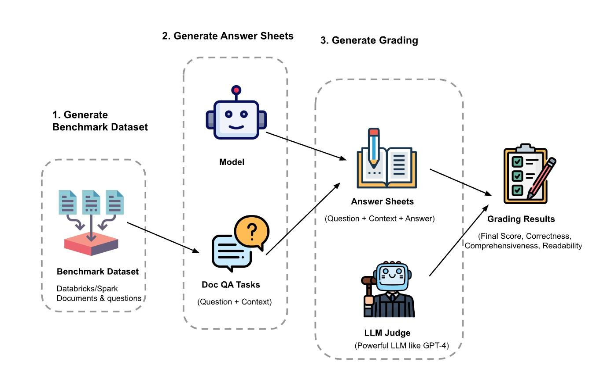{width="4.857096456692913in"
> height="3.0304363517060366in"}
>
> Figure 4.5: Databricks evaluation experiment setup. Image source

2.  Zheng et al. (2023) propose a strong LLMs as judges to evaluate
    these models on more open-ended questions.

3.  RAG Evaluation is another interesting blog that discuss how to use
    Langchain for evaluating RAG applications.

> **4.3 Retrieval Chunks vs. Synthesis Chunks**
>
> Another fundamental technique for enhancing retrieval in Retrieval
> Augmented Generation (RAG) systems is the *decoupling of chunks* used
> for retrieval from those used for synthesis (i.e. response
> generation). The main idea is optimal chunk representation for
> retrieval may not necessarily align with the requirements for
> effective synthesis. While a raw text chunk could contain essential
> details for the LLM to generate a comprehensive response, it might
> also contain filler words or information that could introduce biases
> into the embedding representation. Furthermore, it might lack the
> necessary global context, making it challenging to retrieve the chunk
> when a relevant query is received. To give an example, think about
> having a question answering system on emails. Emails often contain so
> much *fluff* (a big portion of the email is "looking forward", "great
> to hear from you", etc.) and so little information. Thus, retaining
> semantics in this context for better and more accurate question
> answering is very important.
>
> There are a few ways to implement this technique including:

1.  Embed references to text chunks

2.  Expand sentence-level context window

#### 4.3.1 Embed References to Text Chunks

> The main idea here is that, we create an index in the vector database
> for storing document summaries. When a query comes in, we first fetch
> relevant document(s) at the high-level (i.e. summaries) before
> retrieving smaller text chunks directly, because it might retrieve
> irrelavant chunks. Then we can retrieve smaller chunks from the
> fetched document(s). In other words, we store the data in a
> hierarchical fashion: summaries of documents and chunks for each
> document. We can consider this approach as *Dense Hierarchical
> Retrieval*, in which a document-level retriever (i.e. summary index)
> first identifies the relevant documents, and then a passage-level
> retriever finds the relevant passages/chunks. Y. Liu et al. (2021) and
> Zhao et al. (2022) gives you a deep understanding of this approach.
> Figure 4.6 shows how this technique works.
>
> We can choose different strategies based on the type of documents we
> are dealing with. For example, if we have a list of web pages, we can
> consider each page as a *document* that we summarize, and also we
> split each document into a set of

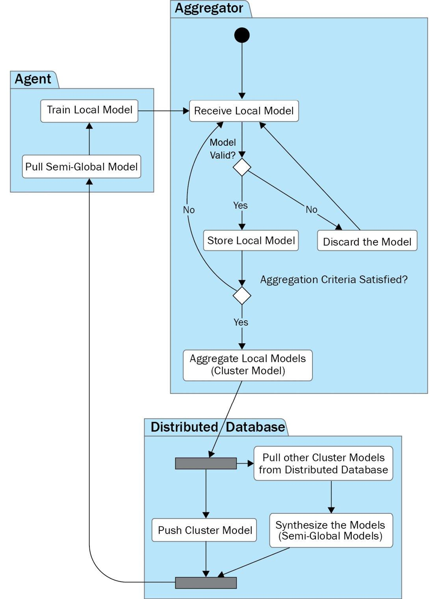{width="3.980129046369204in"
height="4.010131233595801in"}

> Figure 4.6: Document summary index
>
> smaller chunks as the second level of our data store strategy. When
> user asks a question, we first find the relevant page using the
> summary embeddings, and then we can retrieve the relevant chunks from
> that particular page.
>
> If we have a pdf document, we can consider each page of the pdf as a
> separate document, and then split each page into smaller chunks. If we
> have a list of pdf files, we can choose the entire content of each pdf
> to be a document and split the it into smaller chunks.
>
> Let's code it up for our pdf file.

#### Step 1: Read the PDF file

> We read the pdf file, Figure 4.7, and create a list of pages as later
> we will view each page as a separate document.
>
> 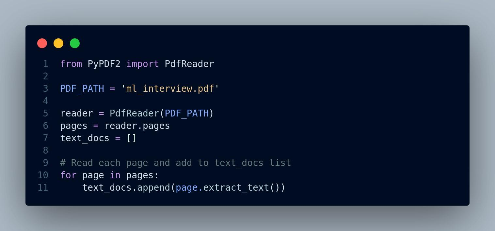{width="4.8571467629046365in"
> height="2.2747845581802273in"}
>
> Figure 4.7: Read a list of documents from each page of the pdf

#### Step 2: Create Document Summary Index

> In order to create an *index*, first we have to convert a list of
> texts into a list of *Document* that is compatible with LlamaIndex.
>
> **Definition:** A Document is a generic container around any data
> source, for instance, a PDF, an API output, or retrieved data from a
> database. It stores text along with some other properties such as
> *metadata* and *relationships (Links to other Documents/Nodes)*
>
> Figure 4.8 shows the code.
>
> We can use the summary index to get the summary of each page/document
> using the document id, for instanc, Figure 4.9 shows the output of a
> summary of a document.

#### Step 3: Retrieve and Generate Response using Document Summary Index

> In this step, when a query comes, we run a retrieval from the document
> summary index to find the relevant pages. Retrieved document has links
> to its corresponding chunks, that are used to generate the final
> response to the query.
>
> There are multiple ways to that in LlamaIndex:

-   High-level query execution

-   LLM based retrieval

-   Embedding based retrieval

> The high-level approach is depicted in Figure 4.10
>
> **LLM based retrieval:** This approach is low-level so we can view and
> change the parameters. Figure 4.11 below displays the code snippet:

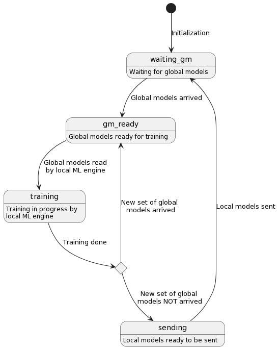{width="4.8571467629046365in"
height="5.196761811023622in"}

> Figure 4.8: Build a document summary index

{width="4.857145669291339in"
height="3.127027559055118in"}

> Figure 4.9: Example of a document summary

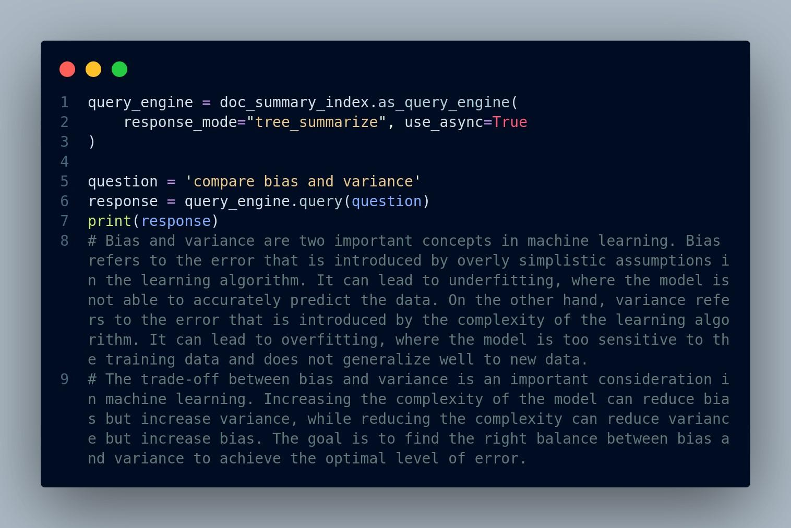{width="4.8571467629046365in"
height="3.24877624671916in"}

> Figure 4.10: High-level query execution approach (default approach)

{width="4.857145669291339in"
height="4.709764873140857in"}

> Figure 4.11: LLM based retrieval approach
>
> **Embedding based retrieval:** In this technique, we first define
> DocumentSummaryIndexEmbeddingRetriever retriever, and configure the
> response generator to use this retriever. We then, integrate these two
> components into a RetrieverQueryEngine and run that for the query.
> Figure 4.12 shows the code snippet for this approach.

{width="4.857020997375328in"
height="2.9709055118110235in"}

> Figure 4.12: Embedding based retrieval

#### 4.3.2 Expand sentence-level context window

> In this approach, we have split the text into sentence level chunks to
> be able to perform fine-grained retrieval. However, before passing the
> fetched sentences to LLM response generator, we include the sentences
> surrounding the retrieved sentence, to enlarge the context window for
> better accuaracy. Please be mindful of *lost in the middle* problem
> when splitting large textual content at a very finegrained level, such
> as sentence-level.
>
> Figure 4.13 illustrates this technique.
>
> 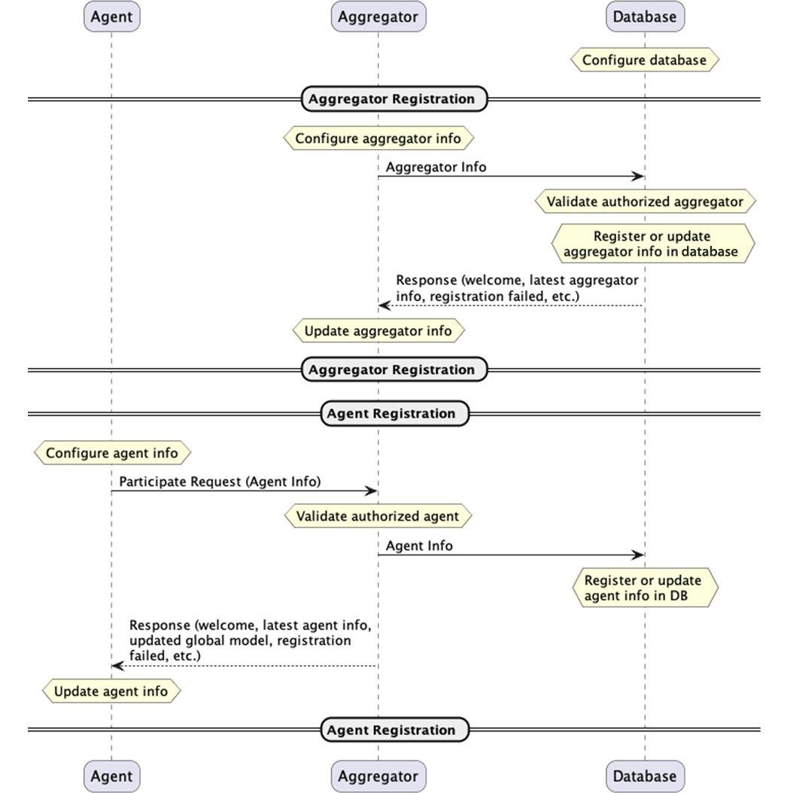{width="4.857282370953631in"
> height="3.0153171478565177in"}
>
> Figure 4.13: Expanding the sentence level context, so LLM has a bigger
> context to use to generate the response

#### Implementation

> Again, we rely on LlamaIndex to implement this technique. We use
> SentenceWindowNodeParser to split document into sentences and save
> each sentence in a node. Node contains a *window* property where we
> can adjust. During the retrieval step, each fetched sentence will be
> replaced with surrounding sentences depending on the window size via
> MetadataReplacementNodePostProcessor function.
>
> Figure 4.14 shows the basic setup such as importing necessary modules,
> reading the pdf file and initializing the LLM and embedding models.

{width="4.856916010498687in"
height="4.380162948381452in"}

> Figure 4.14: Basic setup for sentence window implementation Next, we
> have to define nodes that are going to be stored in the VectorIndex as
> well as sentence index. Then, we create a query engine and run the
> query. Figure 4.15 shows the steps.
>
> {width="4.857076771653543in"
> height="3.664109798775153in"}
>
> Figure 4.15: Build the sentence index, and run the query
>
> Figure 4.16 displays the response output.
>
> We can see the original sentence that is retrieved for each node (we
> show the first node below) and also the actual window of sentences in
> the Figure 4.17.
>
> {width="4.857071303587052in"
> height="2.07992782152231in"}
>
> Figure 4.16: Output of the window response

#### 4.3.3 Lost in the Middle Problem

> Retrieval process in a RAG based application is all about retrieving
> the right and most relevant documents for a given user's query. The
> way we find these documents is that retrieval method assigns a
> relevance score to each document based on their similarity to the
> query. Then, sorts them descendingly and returns them. Nevertheless,
> this approach might not work well when we are returning many documents
> such as top-k \>= 10. The reason is when we pass a very long context
> to LLM, it tend to ignore or overlook the documents in the middle.
> Consequently, putting the least relevant document to the bottom of the
> fetch documents is not the best strategy. A better way is to place the
> least relevant documents in the middle.
>
> N. F. Liu et al. (2023) in Lost in the Middle: How Language Models Use
> Long Contexts demonstrated interesting findings about LLMs behavior.
> They realized that performance of LLMs is typically at its peak when
> relevant information is located at the beginning or end of the input
> context. However, it notably deteriorates when models are required to
> access relevant information buried within the middle of lengthy
> contexts. Figure 4.18 demonstrates the results.

{width="4.8568864829396325in"
height="3.9800349956255467in"}

> Figure 4.17: Original sentence that was retrieved for each node, as
> well as the actual window of sentences

{width="4.857240813648294in"
height="4.51416447944007in"}

> Figure 4.18: Accuracy of the RAG based on the postions of the
> retrieved documents. Image source
>
> They also show that LLMs with longer context windows still face this
> problem and increasing the context window doesn't solve this issue.
> The following demonstrates this experiment.
>
> {width="4.857154418197725in"
> height="1.5026388888888889in"}
>
> Figure 4.19: Comparing LLM models with various context size and the
> impact of changing the position of relevant documents

**How can we alleviate this problem?** The answer is to reorder the
retrieved documents in such a way that most similar documents to the
query are placed at the top, the less similar documents at the bottom,
and the least similar documents in the middle.

> For implementation, we need a function to get the retrieved documents
> from the retriever and reorder them, i.e. place most relevant
> documents at the beginning and end. Figure 4.20 shows our code.
>
> We can instead utilize Langchain solution: LongContextReorder. It
> essentially implements a similar approach to Figure 4.20 function. You
> can read the documentation for more details.
>
> Figure 4.21 shows how to use Langchain solution to deal with this
> problem.
>
> We can also use Haystack to deal with this problem. Haystack is the
> open source framework for building custom NLP apps with large language
> models (LLMs) in an end-to-end fashion. It offers a few components
> that are building blocks for performing various tasks like document
> retrieval, and summarization. We can connect these components and
> create an end-to-end *pipeline*. The two very

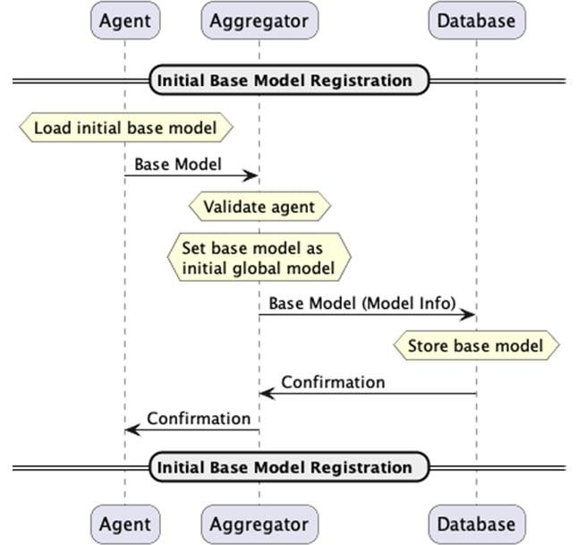{width="4.857168635170604in"
height="1.9304790026246719in"}

> Figure 4.20: Pseudocode of a function to solve lost in the middle
> problem

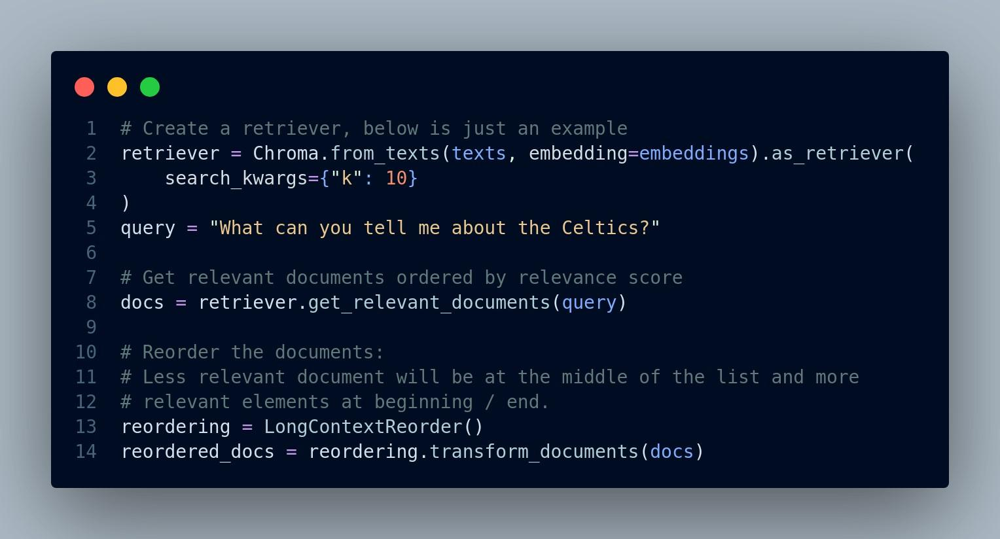{width="4.857057086614173in"
height="2.619251968503937in"}

> Figure 4.21: Langchain approach for solving lost in the middle problem
> useful components that we can utilize are *DiversityRanker* and
> *LostInTheMiddleRanker*.
>
> "**DiversityRanker** is designed to maximize the variety of given
> documents. It does so by selecting the most semantically similar
> document to the query, then selecting the least similar one, and
> continuing this process with the remaining documents until a diverse
> set is formed. It operates on the principle that a diverse set of
> documents can increase the LLM's ability to generate answers with more
> breadth and depth."
>
> "**LostInTheMiddleRanker** sorts the documents based on the
>
> "Lost in the Middle" order. The ranker positions the most relevant
> documents at the beginning and at the end of the resulting list while
> placing the least relevant documents in the middle."
>
> Please check their documentation for more details.

#### 4.3.4 Embedding Optimization

> Optimizing embeddings can have a significant impact on the results of
> your use cases. There are various APIs and providers of embedding
> models, each catering to different objectives:

-   Some are best suited for coding tasks.

-   Others are designed specifically for the English language.

-   And there are also embedding models that excel in handling
    multilingual datasets (e.g., Multilingual BERT/mBERT).

> However, determining which embedding model is the best fit for your
> dataset requires an effective evaluation method.

**So which embedding models should we use?**

> One approach is to rely on existing academic benchmarks. However, it's
> important to note that these benchmarks may not fully capture the
> real-world usage of retrieval systems in AI use cases. They are often
> synthetic benchmarks specifically designed for information retrieval
> problems.
>
> For example, there is a benchmark called MTEB (Massive Text Embedding
> Benchmark). MTEB's leaderboard showcases embedding models across 8
> tasks, including multilingual tasks, and currently features 132
> models. You can compare the performance, speed, or both for these
> models (refer to the graph below: Figure 4.22).

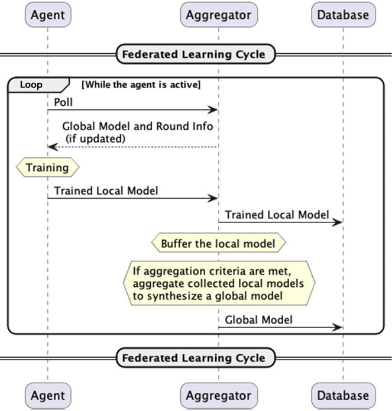{width="4.857319553805774in"
height="2.803472222222222in"}

> Figure 4.22: Models by average English MTEB score (y) vs speed (x) vs
> embedding size (circle size). Image source
>
> For better results, you can still utilize open-source tools by
> applying them to your specific data and use case. Additionally, you
> can enhance relevance by incorporating human feedback through a simple
> relevance feedback endpoint.
>
> Constructing your own datasets is also important as you have a deep
> understanding of your production data, relevant metrics, and what
> truly matters to you. This allows you to tailor the training and
> evaluation process to your specific needs.
>
> In terms of evaluating the performance of embedding models, there are
> excellent evaluation tools available in the market. These tools can
> help you assess the effectiveness of different models and make
> informed decisions.
>
> It is worth noting that recent research and experiments have shown
> that embedding models with the same training objective and similar
> data tend to learn very similar representations, up to an affine
> linear transform. This means that it is possible to project one
> model's embedding space into another model's embedding space using a
> simple linear transform.
>
> By understanding and leveraging linear identifiability, you can
> explore ways to transfer knowledge between embedding models and
> potentially improve their performance in specific tasks."
>
> This is called linear identifiability, and it was discussed in the
> 2020 paper by Roeder and Kingma (2021) On Linear Identifiability of
> Learned Representations from Google Brain. The paper states,
>
> *"We demonstrate that as one increases the representational capacity
> of the model and dataset size, learned representations indeed tend
> towards solutions that are equal up to only a linear transformation."*
>
> See an example below:
>
> Therefore, the selection of a particular embedding model may not be
> that important if you are able to discover and implement a suitable
> transformation from your own dataset.
>
> {width="4.857165354330709in"
> height="2.475216535433071in"}
>
> Figure 4.23: Linear Identifiability. Image source
>
> **4.4 Rethinking Retrieval Methods for Heterogeneous**
>
> **Document Corpora**
>
> Retrieval-augmented generation (RAG) applications, especially when
> dealing with a substantial volume of documents (e.g. having many pdf
> files), often face challenges related to performance, relevance, and
> latency.
>
> **Example:** Assume a user asks a question and the answer to user's
> question only involves two pdf files, we would rather first get those
> two relevant pdf documents and then find the actual answer from their
> chunks, instead of searching through thusands of text chunks. But how
> to do that?
>
> There are multiple ways to achieve that goal:

-   Have multi-level embeddings, i.e. embed document summaries, where
    each document summary is related to its text chunks. This approach
    is implemented in Section 4.3.1.

-   Add metadata about each document and store that along with the
    document in the vector database.

#### 4.4.1 How metadata can help

> Including metadata in the indexing process can be a powerful strategy
> to address these challenges and significantly enhance the overall
> system's efficiency. By narrowing down the search scope using metadata
> filters, the system can reduce the number of documents to be
> considered, resulting in faster retrieval times.
>
> Figure 4.24 shows how metadata filtering can help the retrieval
> process. *When user asks a question, they can explicitly give metadata
> for instance by specifying filters such as dropdown list, etc., or we
> can use LLM to determine the metadata filters from the query and
> search the vector database using the filters. Vector database utilizes
> the filters to narrow down search to the documents that match with the
> filters, and then finds the most similar chunks from documents and
> returns the top-k chunks.*
>
> Please note that although we can add metadata to the text chunks after
> they are stored in the vector database, we should do that in the
> preprocessing step while we are splitting and embedding the documents,
> because if the vector database index becomes very large (i.e. we
> already have a great deal of embeddings in vector database), updating
> it will be significantly time consuming.
>
> **Use Langchain for Metadata Filtering**
>
> Figure 4.25 shows how to define new metadata for text chunks, and how
> to use filters to perform retrieval.
>
> In this example, we load two pdf files, one file is about machine
> learning interview questions, and the other file is a research paper.
> We would like to add a topic or category of each file as metadata, so
> later we can restrict our search to

{width="4.857317366579178in"
height="2.5449617235345583in"}

> Figure 4.24: How metadata filtering can improve retrieval process
>
> the category. Therefore, we update the initial metadata field by
> adding a category property to each text chunk and then store them in
> the vector database.
>
> If we print out the metadata of documents, we can see the category
> property has been added, shown in Figure 4.26.
>
> Now, we define the index and use it to perform search and retrieval,
> which is shown in Figure 4.27.
>
> **Use LlamaIndex for Metadata Filtering**
>
> Figure 4.28 shows how to use LlamaIndex for metadata filtering.
>
> **How to let LLM infer the metadata from user question**
>
> In both of the previous techniques, we have to explicitly define the
> metadata/filters while doing the retrieval. However, the questions is:
> *Can we ask*

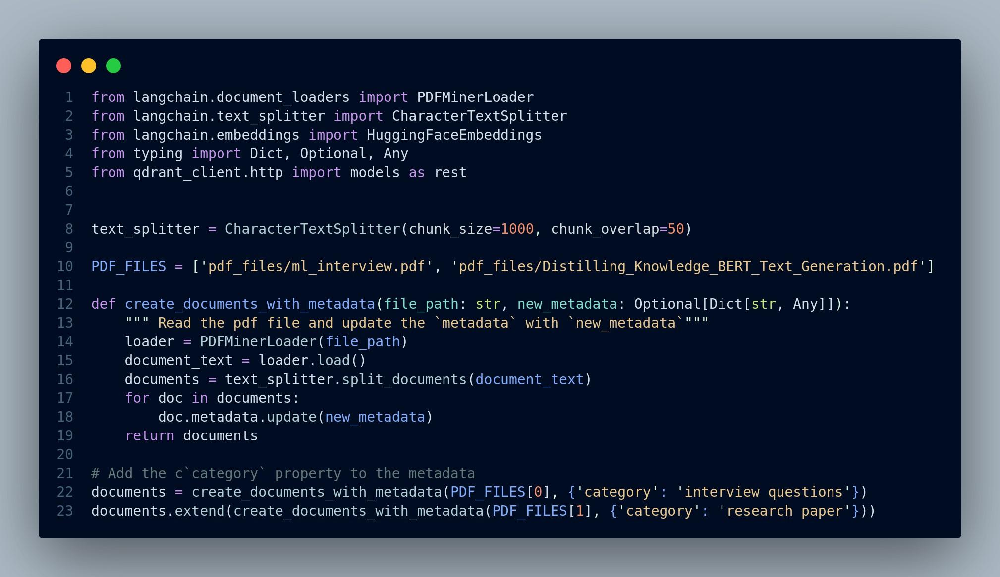{width="4.857047244094488in"
height="2.8064020122484687in"}

> Figure 4.25: Read the files and update the metadata property

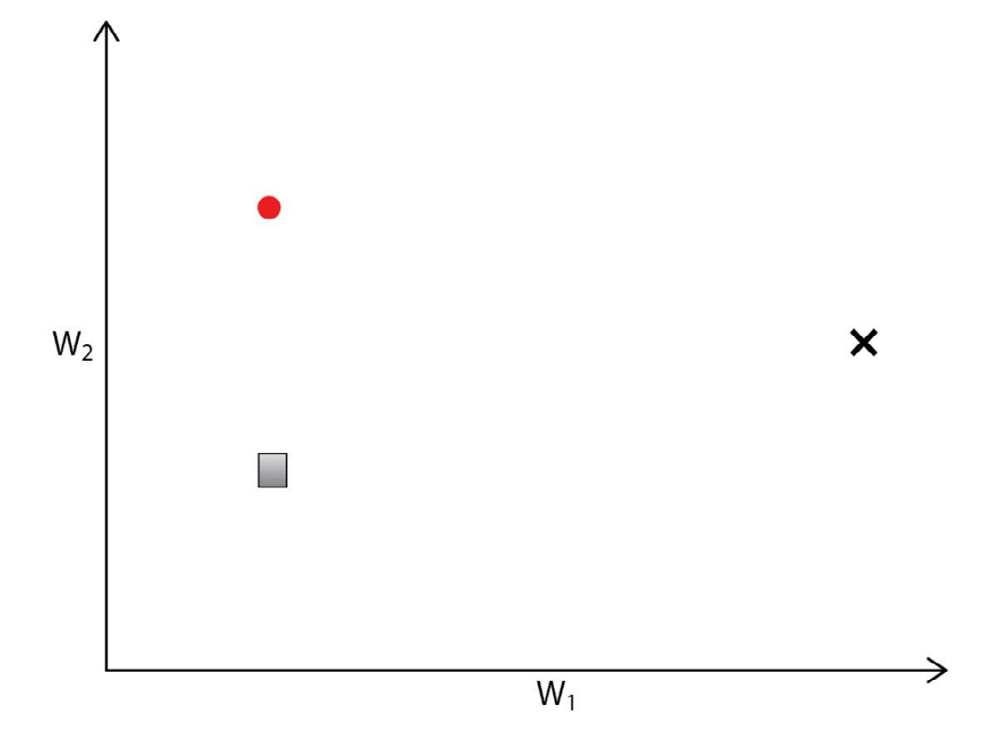{width="4.857147856517935in"
height="1.261596675415573in"}

> Figure 4.26: Output example of metadata for text chunks
>
> {width="4.857123797025372in"
> height="2.5413429571303587in"}
>
> Figure 4.27: Insert text chunks into the vector database and perform
> retrieval *LLM to infer the metadata from user query?* The short
> answer is: *Yes*.
>
> Therefore, the general approach is we need to define a particular
> prompt for LLM, so it can use that to extract entities or metadata
> from the user query, map them to the existing metadata stored with
> text chunks in the vector database, and then perform the retrieval.
>
> That said, LlamaIndex provides us an implemented version of this
> approach.
>
> The following code is from the LlamaIndex documentation here. For this
> technique, we define the metadata (in this example category and
> country) along with each text chunk. Figure 4.29 shows the code
> snippet for this step.
>
> Figure 4.30 shows the retrieval process including how to define vector
> index, vector store, and VectorIndexAutoRetriever object.

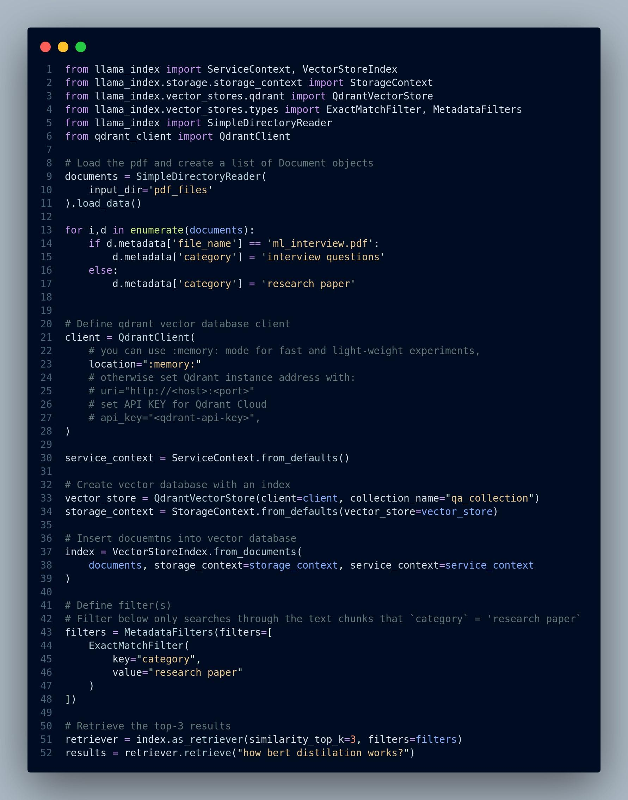{width="4.857020997375328in"
height="6.18166447944007in"}

> Figure 4.28: Metadata filtering in LlamaIndex for document retrieval

{width="4.857147856517935in"
height="4.225661636045494in"}

> Figure 4.29: Define text node and metadata for auto retrieval

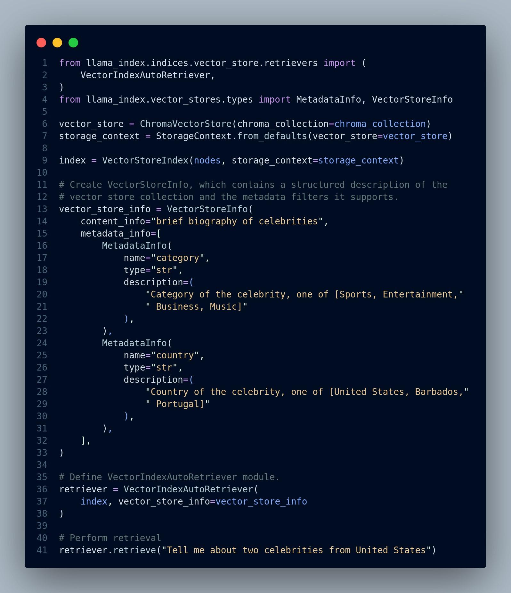{width="4.857076771653543in"
height="5.630069991251093in"}

> Figure 4.30: Define VectorIndexAutoRetriever retriever and
> VectorStoreInfo, which contains a structured description of the vector
> store collection and the metadata filters it supports.
>
> **4.5 Hybrid Document Retrieval**
>
> Hybrid document retrieval is an approach that combines traditional
> keywordbased search like BM25 with semantic (dense) search using
> embeddings, such as BERT or word2vec. Integrating this technique to
> Retrieval-Augmented Generation (RAG) applications can significantly
> enhance the effectiveness of document retrieval. It addresses
> scenarios where a basic keyword-based approach can outperform semantic
> search and demonstrates how combining these methods improves retrieval
> in RAG applications.
>
> In addition, often times a complete migration to a semantic-based
> search using RAG is challenging for most companies. They might already
> have a keywordbased search system and have been using it for quite a
> long time. Performing an overhaul to the company's information
> architecture, and migrating to a vector database is just infeasible.

**Scenarios Favoring Keyword-Based Search:**

1.  **Highly Specific Queries:** In cases where a user's query is highly
    specific and focuses on precise terms or phrases, a keyword-based
    approach can outperform semantic search. Keyword matching excels at
    finding exact matches within documents.

2.  **Niche Domains:** In specialized domains with industry-specific
    jargon or acronyms, keyword search can be more effective as it
    directly matches terminology without requiring extensive semantic
    understanding.

3.  **Short Documents:** When dealing with very short documents, such as
    tweets or headlines, keyword-based search can be more efficient.
    Semantic models often require longer text to derive meaningful
    embeddings.

4.  **Low Resource Usage:** Keyword search typically requires fewer
    computational resources compared to semantic search. This can be
    advantageous when resource efficiency is a critical concern.

4.5HybridDocumentRetrieval

> **Combining Keyword and Semantic Approaches for Improved Retrieval:**
>
> To harness the strengths of both keyword-based and semantic (dense)
> retrievers effectively, a pragmatic approach is to integrate two
> retrievers into the pipeline and merge their outputs. This two-pronged
> strategy capitalizes on the unique advantages of each retriever,
> resulting in more comprehensive and accurate retrieval in
> Retrieval-Augmented Generation (RAG) applications.
>
> The process begins by employing both **keyword-based** as well as
> **dense** retrievers within the RAG pipeline. However, the challenge
> lies in merging the results obtained from these two retrievers, each
> of which returns ranked lists of results with relevance scores
> assigned to each document. Figure 4.31 illustrates the hybrid
> retrieval pipeline.
>
> {width="4.857107392825896in"
> height="2.7311526684164478in"}
>
> Figure 4.31: Hybrid retrieval pipeline
>
> Merging the results from keyword-based and semantic retrievers can be
> approached in several ways, depending on the nature of the RAG
> application:

1.  **Concatenation:** This method involves simply appending all
    documents from both retrievers (excluding duplicates) to create the
    final list of results. Concatenation is suitable when you intend to
    use all retrieved documents and the order of the results is not
    crucial. This approach can be valuable in extractive
    question-answering pipelines, where you aim to extract information
    from multiple sources and are less concerned about ranking.

2.  **Reciprocal Rank Fusion (RRF):** RRF operates with a formula that
    reranks documents from both retrievers, giving priority to those
    that appear in both results lists. Its purpose is to elevate the
    most relevant documents to the top of the list, thereby enhancing
    the overall relevance of the results. RRF is particularly useful
    when the order of the results is important or when you intend to
    pass on only a subset of results to the subsequent processing
    stages.

3.  **Merging by Scoring:** In this approach, documents are ranked based
    on the scores assigned by the individual retrievers. This method is
    suitable when you aim to prioritize results from one retriever over
    the other. If the relevance scores assigned by the two retrievers
    are comparable and you wish to emphasize results from a particular
    retriever, this method can be employed. For instance, if you're
    using dense retrievers from different sources that return documents
    from various document stores, this method allows you to choose one
    retriever's output over another.

**Advantages of Hybrid Retrieval:**

-   **Enhanced Relevance:** Hybrid retrieval leverages the strengths of
    both keyword and semantic approaches, increasing the chances of
    returning highly relevant documents.

-   **Coverage:** It addresses scenarios where purely keyword or purely
    semantic approaches might fail, providing a broader scope of
    relevant documents.

-   **Resource Efficiency:** By initially narrowing the search with
    keywordbased filtering, the system conserves computational
    resources, making the retrieval process more efficient.

-   **Adaptability:** Hybrid retrieval allows for adaptability to
    different user queries and document types, striking a balance
    between precision and recall.

> There are frameworks which support hybrid retrieval out of the box
> such as ElasticSearch, Haystack, Weaviate, and Cohere Rerank. Let's
> find out how to implement this approach using Haystack. The following
> code is from Haystack documentation, you can see all the
> implementation details here. The documents that are used for this
> example are abstracts of papers from PubMed. You can find and download
> the dataset here.
>
> pip install datasets\>=2.6.1 pip install farm-haystack\[inference\]
>
> **Step 1:** We load the dataset and initialize the document store
> (i.e. vector database). Figure 4.32 shows this step.
>
> **Step 2:** Define the retrievers, insert the documents and embeddings
> into the document store and choose the *join document* strategy. You
> can see this step in Figure 4.33.
>
> **Step 3:** Create an end-to-end pipeline in Haystack and perform the
> hybrid retrieval for a query. This step is depicted in Figure 4.34.
>
> **4.6 Query Rewriting for Retrieval-Augmented Large**
>
> **Language Models**
>
> Query rewriting is a sophisticated technique that plays a pivotal role
> in enhancing the performance of Retrieval-Augmented Large Language
> Models (RAG). The fundamental idea behind query rewriting is to
> optimize and fine-tune the

{width="4.857020997375328in"
height="4.213779527559055in"}

> Figure 4.32: Load documents and initialize document store
>
> 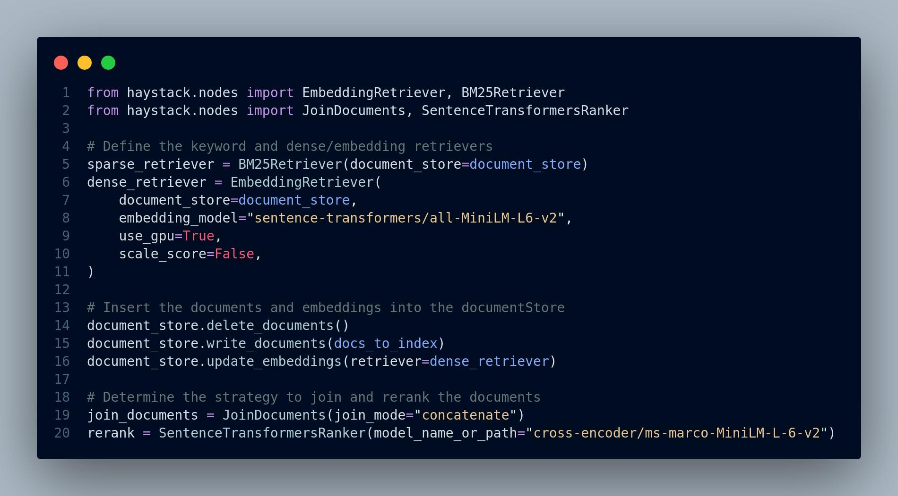{width="4.85691491688539in"
> height="2.6891972878390202in"}
>
> Figure 4.33: Define keyword and embedding based retrievers
>
> queries presented to the retrieval component of RAG systems,
> ultimately leading to more accurate and contextually relevant results.
>
> The core concept is to transform the initial user query into an
> improved form that effectively captures the user's intent and aligns
> with the document retrieval phase. This often involves various steps
> and considerations, including:

1.  **Expanding User Queries**: Query rewriting can involve expanding
    the initial user query by adding synonyms, related terms, or
    concepts that might improve the retrieval of relevant documents.
    This expansion can be based on linguistic analysis or external
    knowledge sources.

2.  **Rephrasing for Clarity**: Queries are often rewritten to improve
    their clarity and conciseness. Ambiguous or complex phrasings can be
    simplified to make the user's intent more explicit.

3.  **Contextual Adaptation**: The rewriting process may take into
    account the specific context of the documents available for
    retrieval. It can adapt

{width="4.856963035870516in"
height="3.0972583114610672in"}

> Figure 4.34: Create end-to-end pipeline and run the retrievers the
> query to the characteristics of the document corpus, which is
> particularly valuable in domain-specific applications.
>
> Query rewriting is closely tied to the document retrieval phase in RAG
> systems. It contributes to better retrieval rankings, which, in turn,
> leads to more informative and contextually relevant answers generated
> by the language model. The goal is to ensure that the retrieved
> documents align closely with the user's intent and cover a wide
> spectrum of relevant information.

**4.6.1 Leveraging Large Language Models (LLMs) for Query**

#### Rewriting in RAGs

> **Question:** *With the advent of Large Language Models (LLMs) that
> have revolutionized natural language understanding and generation
> tasks, can we use them for query rewriting?* The answer is: *Yes*.
> They can help in two primary ways: query expansion and generating
> better prompts. Figure 4.36 shows how query rewriting works. We can
> use LLM to either expand (enhance) a query or generate multiple
> (sub)queries for better retreival process.

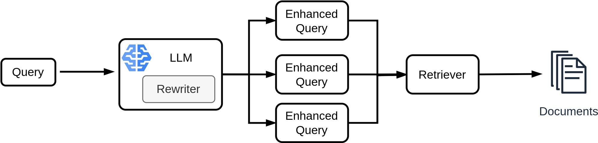{width="4.857413604549431in"
height="1.1704615048118985in"}

> Figure 4.35: Query re-writing using LLMs. LLM can expand the query or
> create multiple sub-queries.
>
> **4.6.1.1 Query Expansion with LLMs**
>
> LLMs possess an extensive understanding of language and vast knowledge
> repositories, which makes them ideal for query expansion. Here's how
> LLMs can aid in query expansion:
>
> **Synonym Generation:** LLMs can identify synonyms and related terms
> for words in the user's query. By expanding the query with synonyms,
> it increases the chances of retrieving documents that may use
> different terminology but are contextually relevant.
>
> **Example:** *User Query:* "Renewable energy sources". *LLM Query
> Expansion:* "Renewable energy sources" -\> "Green energy sources,"
> "Sustainable energy sources," "Eco-friendly energy sources".
>
> By suggesting synonyms for "renewable," the LLM broadens the query's
> scope to retrieve documents that may use alternative terminology.
>
> **Conceptual Expansion:** LLMs can identify concepts and entities
> related to the query. They can suggest adding relevant concepts,
> entities, or phrases that can lead to more comprehensive results. For
> instance, if a user queries about "climate change," the LLM might
> suggest adding "global warming" to ensure a broader document
> retrieval.
>
> **Example:** *User Query:* "Mars exploration". *LLM Query Expansion:*
> "Mars exploration" -\> "Mars mission," "Red planet research," "Space
> exploration of Mars".
>
> **Multilingual Query Expansion:** For multilingual queries, LLMs can
> assist in translating and expanding the query into multiple languages,
> broadening the search scope and retrieving documents in various
> languages.
>
> **4.6.1.2 Generating Better Prompts with LLMs**
>
> LLMs can assist in generating more effective prompts for retrieval,
> especially when a prompt-based retrieval mechanism is employed. Here's
> how LLMs contribute to prompt generation.
>
> **Query Refinement:** LLMs can refine a user query by making it more
> concise, unambiguous, and contextually relevant. The refined query can
> then serve as a prompt for the retrieval component, ensuring a more
> focused search.
>
> **Example:** *User Query:* "How does photosynthesis work?"
> *LLM-Generated Prompt:* "Explain the process of photosynthesis."
>
> **Multi-step Prompts:** In complex queries, LLMs can generate
> multi-step prompts that guide the retrieval component through a series
> of sub-queries. This can help break down intricate requests into more
> manageable retrieval tasks.
>
> **Example:** *User Query:* "Market trends for electric cars in 2021".
> *LLM-Generated Multi-Step Prompts:*

-   "Retrieve market trends for electric cars."

-   "Filter results to focus on trends in 2021."

> The LLM generates sequential prompts to guide the retrieval component
> in finding documents related to market trends for electric cars in
> 2021.
>
> **Context-Aware Prompts:** LLMs can consider the context of the
> available document corpus and generate prompts that align with the
> characteristics of the documents. They can adapt prompts for specific
> domains or industries, ensuring that the retrieval phase retrieves
> contextually relevant documents.
>
> **Example:** *User Query:* "Legal documents for the healthcare
> industry". *LLMGenerated Domain-Specific Prompt:* "Retrieve legal
> documents relevant to the healthcare industry."
>
> Understanding the context, the LLM generates a prompt tailored to the
> healthcare industry, ensuring documents retrieved are pertinent to
> that domain.
>
> Query rerwriting for RAGs is an active research area, and new
> approaches are suggested regularly. One recent research is Ma et al.
> (2023), where they propose a new framework for query generation. See
> here to learn more about their method.
>
> **4.7 Query Routing in RAG**
>
> Query routing in RAG, often facilitated by a router, is the process of
> automatically selecting and invoking the most suitable retrieval
> technique or tool for a given user query. It enables a dynamic,
> adaptive approach to choose how to retrieve information based on the
> specific requirements of each query.
>
> Rather than relying on a fixed retrieval method, query routing
> empowers the system to intelligently assess the user's query and
> select the appropriate retrieval mechanism. This approach is
> particularly powerful in scenarios where a diverse range of retrieval
> techniques or tools can be employed to answer different types of
> queries. The following shows the generate architecture of this
> approach.

**How Query Routing Works:**

1.  **User Query Input**:

> A user enters a query into the RAG system. This query could encompass
> various types of information needs, such as fact-based lookup,
> summarization, translation, question answering, etc.

2.  **Query Analysis**:

> The router or the query routing component first performs an analysis
> of the user's query. This analysis involves understanding the nature
> of the query, its intent, and the type of information required.

3.  **Detection of Retrieval Technique Requirement**:

> Based on the analysis, the router detects the retrieval technique or
> tool that best matches the query's requirements. This detection is
> often driven by heuristics, pre-defined rules, machine learning
> models, or a combination of these methods.

4.7QueryRoutinginRAG

{width="3.1388495188101486in"
height="6.362533902012249in"}

> Figure 4.36: Query router architecture

4.  **Selection of Retrieval Technique**:

> The router selects the most appropriate retrieval technique from a
> predefined set, which can include methods like fact-based lookup in a
> vector store, summarization, document retrieval, question answering,
> or translation, among others.

5.  **Invoke the Retrieval Component**:

> The router then calls the relevant retrieval component or "tool" that
> specializes in the chosen retrieval technique. This component may be a
> vector store interface, a summarization tool, a translation service,
> or any other retrieval method.

6.  **Information Retrieval**:

> The selected retrieval component performs the necessary information
> retrieval or processing based on the chosen technique. For example, if
> factbased lookup is required, it retrieves facts from a vector store.
> If summarization is needed, it generates a concise summary. If
> translation is the goal, it translates the content.

7.  **Generation of Output**:

> The retrieved or processed information is then used by the generation
> component in the RAG system to compose a response, which is presented
> to the user.
>
> There are multiple ways to implement query routing in
> Retrieval-Augmented Generation (RAG) systems:

1.  **Intent Classification Model:**

    -   **Use a Classifier**: Employ a pre-trained classifier model that
        can categorize user queries based on their intent. This
        classifier can have predefined categories such as fact-based
        lookup, summarization, translation, question answering, etc. The
        selected category then dictates the retrieval method to be used.

4.7QueryRoutinginRAG

-   **Machine Learning**: Train a custom intent classification model on
    labeled query data to predict the query's intent. This model can be
    fine-tuned on specific intent detection tasks relevant to the RAG
    system.

> Figure 4.37 shows how to use a zero-shot classifer to categorize user
> queries.

{width="4.857191601049869in"
height="3.4578444881889765in"}

> Figure 4.37: Using a zero-shot classifier to categorize and route user
> queries

2.  **Prompt-Based Routing**:

    -   **Leverage LLMs**: Utilize Large Language Models (LLMs), such as
        GPT-4 or similar models, to perform query classification. A
        prompt can be designed to guide the LLM in classifying the query
        based on its intent.

    -   **Template Prompts**: Create a set of template prompts that are
        specifically designed to categorize queries. These templates can
        include leading questions or cues to elicit the intent of the
        query.

> The code in Figure 4.38 shows how to use a LLM text-davinci-002 for
> query routing.
>
> 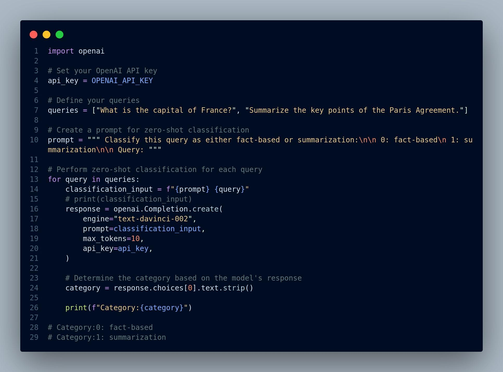{width="4.8570352143482065in"
> height="3.592600612423447in"}
>
> Figure 4.38: Using a LLM to categorize and route user queries

3.  **Rule-Based Routing**:

    -   **Rule-Based System**: Develop a rule-based system that consists
        of predefined rules or conditions to categorize queries. For
        example, if a query starts with "Translate," it is routed to a
        translation retrieval method.

    -   **Regular Expressions**: Use regular expressions to match query
        patterns and automatically route queries based on predefined
        patterns, keywords, or structures.

> The choice of implementation depends on the complexity of the RAG
> system, the available resources, and the specific requirements of the
> application. Implementing a combination of these methods can provide a
> robust and adaptive query routing mechanism that enhances the overall
> performance of RAG systems.
>
> Let's take a look at an example where we use LlamaIndex framework for
> routing queries between a *summarization route* and *fact-based
> route*. LlamaIndex has a concept called RouterQueryEngine which
> accepts a set of query engines QueryEngineTool objects as input. A
> QueryEngineTool is essentially an index used for retrieving documents
> from vector database. First step is to load the documents and define
> the summary index and fact-based index, which is displayed in Figure
> 4.39.
>
> Then, we create QueryEngine objects for each index and add them to the
> RouterQueryEngine object. Figure 4.40 shows this step.
>
> By dynamically routing queries to the most suitable retrieval
> techniques, query routing enhances RAG by ensuring that the system
> adapts to the specific requirements of each user query, providing more
> accurate and context-aware responses. It overcomes the challenge of
> needing to know in advance which retrieval technique to apply and
> optimizes the retrieval process for different types of information
> needs.
>
> **4.8 Leveraging User History to Enhance RAG Performance**
>
> Retrieval-Augmented Generation (RAG) systems have gained prominence in
> natural language processing applications due to their ability to
> combine the

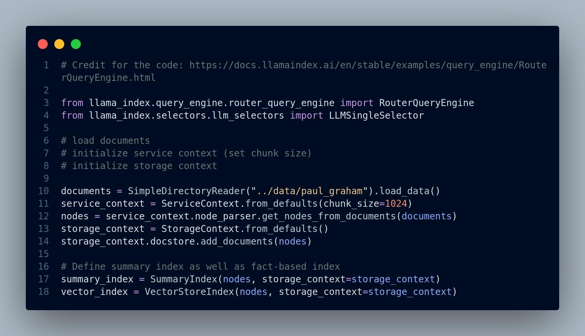{width="4.857200349956256in"
height="2.7889031058617673in"}

> Figure 4.39: Query routing example in LlamaIndex. First we load
> documents and create different indecies.

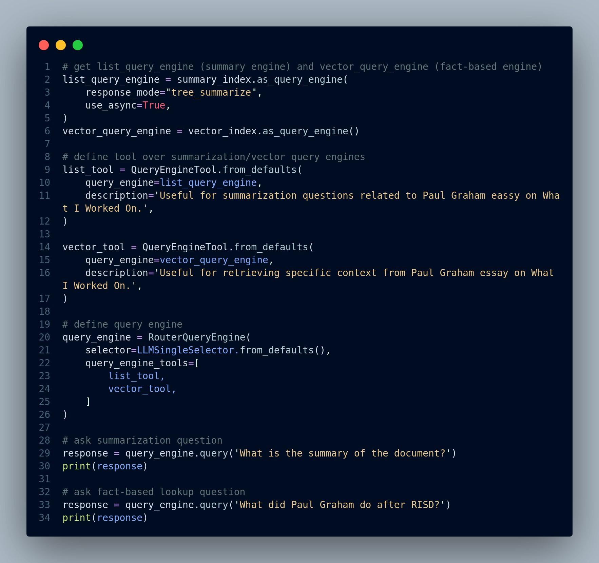{width="4.857200349956256in"
height="4.565658355205599in"}

> Figure 4.40: Define QueryEngine and RouterQueryEngine objects, and run
> the engine for user queries.
>
> strengths of information retrieval and language generation. However,
> RAG applications often involve significant computational and financial
> costs due to the necessity of embeddings, retrievals and even response
> generation. When dealing with recurrent user queries or similar
> questions, these costs can be optimized by leveraging the memory of
> previously asked questions.

#### 4.8.1 Challenge

> In many real-world applications, users tend to ask similar or nearly
> identical questions repeatedly. For instance, in a customer support
> chatbot, users may have common queries related to product information
> or troubleshooting procedures. While the RAG framework excels at
> generating relevant responses based on retrieval, it may not be
> efficient to re-embed and retrieve information for the same questions
> each time they are asked. This is where the concept of leveraging user
> history comes into play.

#### 4.8.2 How User History Enhances RAG Performance

> Leveraging user history to enhance RAG performance involves building a
> memory or cache of previously asked questions and their corresponding
> responses. When a user query is received, instead of immediately
> triggering an embedding and retrieval process, the system can check
> the user history to see if it has encountered a similar or identical
> query before. This approach offers several advantages:

1.  **Faster Response Times (i.e. reduced latency):** By comparing the
    new query to the user history, the system can identify duplicate or
    closely related questions. In such cases, it can bypass the
    embedding and retrieval steps, significantly reducing response
    times.

2.  **Cost Reduction:** Skipping the resource-intensive retrieval
    process for recurrent queries leads to a notable reduction in
    computational and financial costs, as the need for additional API
    calls or data processing diminishes.

3.  **Consistency and Accuracy:** Responses to repeated questions can
    remain consistent and accurate over time. The use of cached
    responses from the user history ensures that users receive reliable
    information without relying on new retrievals. Additionally, by
    keeping track of user history, RAG can learn to better understand
    the user's intent and context. This can lead to more accurate
    answers to questions, even if the questions are not perfectly
    phrased.

#### 4.8.3 How Memory/User History Works

> A simple RAG memory can be implemented as follows: We need to maintain
> a log of user queries and their corresponding answers. Therefore, we
> can define the memory as a key-value store, where the keys are
> questions and the values are answers. When a user asks a question, RAG
> first checks its memory to see if it has already answered a similar
> question. If it has, then it simply retrieves the answer from its
> memory and returns it to the user. If it has not already answered a
> similar question, then it performs the embedding and retrieval process
> as usual.
>
> We need to have a mechanism that constantly updates the RAG's memory
> with new questions and answers. As a user asks more questions, RAG's
> memory grows and it becomes better able to answer future questions
> accurately and efficiently.
>
> **Implementation:** The snippet code in Figure 4.41 shows a very basic
> implementation of memory for RAG.
>
> While a simple in-memory dictionary, as shown in the previous example,
> can be effective for maintaining recent user history, it might not be
> sufficient for handling a large-scale conversation history or
> long-term memory. To address

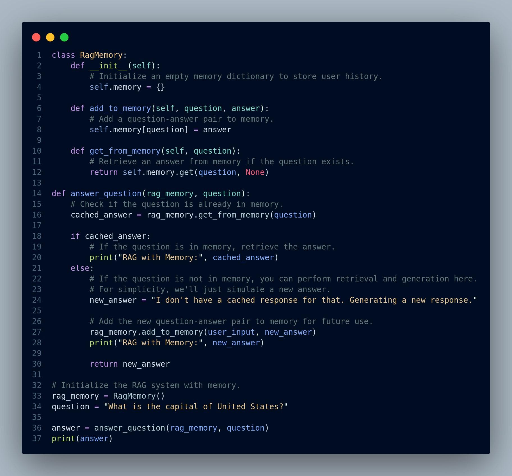{width="4.857076771653543in"
height="4.521554024496938in"}

> Figure 4.41: A basic key-value implementation of memory for RAG. these
> challenges, RAG systems can benefit from using a vector database for
> memory.
>
> The implementation of a vector database for memory in a RAG system
> involves several key steps:

1.  **Data Ingestion:** Store historical question-answer pairs along
    with their corresponding embeddings in the vector database. This
    process typically involves a batch or incremental data ingestion
    pipeline.

2.  **Retrieval:** When a user poses a question, retrieve the most
    relevant historical answers by calculating the similarity between
    the question's embedding and the embeddings in the vector database.

3.  **Updating Memory:** Periodically update the vector database with
    new question-answer pairs and their embeddings to keep the memory up
    to date.

4.  **Caching:** Implement a caching mechanism to enhance retrieval
    speed by temporarily storing frequently accessed data in memory.

5.  **Query Optimization:** Use efficient indexing and search algorithms
    to optimize the retrieval process, reducing query response times.

> Incorporating a vector database for memory in a RAG system enhances
> its ability to provide contextually relevant and coherent responses by
> efficiently managing and retrieving historical information. This
> approach is particularly valuable in scenarios where extensive
> conversation histories or long-term memory are essential for the
> application's success.
>
> As we wrap up our exploration of advanced RAG systems in this Chapter,
> we are on the cusp of a new frontier. In Chapter 5 - "Observability
> Tools for RAG," we will discuss various observability tools tailored
> for RAG systems. We will explore their integration with LlamaIndex,
> including Weights & Biases, Phoenix, and HoneyHive. These tools will
> not only help us monitor and evaluate the performance of our RAG
> systems but also provide valuable insights for continuous improvement.

5.  **Observability Tools for RAG**

> An observability tool is a software or platform designed to help
> monitor, analyze, and gain insights into the performance, behavior,
> and health of a complex system, such as a machine learning model, a
> RAG system, or a software application. These tools provide visibility
> into various aspects of a system, allowing operators, administrators,
> and developers to understand how the system operates and to detect and
> troubleshoot issues.
>
> Key components and features of an observability tool typically
> include:

1.  **Data Collection:** Observability tools collect data from various
    sources within the system. This data can include metrics (e.g., CPU
    usage, memory usage), logs, traces, events, and more. The broader
    the range of data collected, the more comprehensive the
    observability.

2.  **Storage:** Data collected by the tool is stored for analysis and
    historical reference. The storage can be in the form of time-series
    databases, log repositories, or other storage solutions designed to
    handle large volumes of data.

3.  **Analysis:** Observability tools provide analytical capabilities to
    process and make sense of the collected data. This includes querying
    data, aggregating metrics, and identifying patterns or anomalies.

4.  **Visualization:** The tools offer visualization capabilities to
    create graphs, charts, dashboards, and reports that make it easier
    for users to interpret data. Visualizations help spot trends,
    issues, and performance bottlenecks.

5.  **Alerting:** Many observability tools allow users to define
    alerting rules. When certain conditions are met, the tool sends
    notifications, enabling operators to respond to issues promptly.

6.  **Tracing:** For distributed systems, tracing is important.
    Observability tools often provide tracing features to track requests
    as they move through various services or components of a system.
    This helps pinpoint performance bottlenecks and issues.

7.  **User Interface:** A user-friendly interface is essential for
    interacting with the data and insights generated by the
    observability tool. It should allow users to explore data, set up
    alerts, and visualize information.

8.  **Integration:** Observability tools should integrate with various
    components of the system, such as applications, databases,
    containers, and cloud services, to capture relevant data.

9.  **Scalability:** The tool should be able to scale with the system it
    monitors. It needs to handle growing data volumes and provide
    insights without compromising performance.

10. **Customization:** Users should be able to customize the tool to
    meet the specific needs of their system. This includes defining
    custom dashboards, alerts, and data collection methods.

> There are several observability tools for RAG based systems.
> Frameworks like LlamaIndex also provides an easy way to integrate some
> of these tools with RAG application. This enable us to:

-   View LLM prompt inputs and outputs

-   Make sure that all the components such as embedding models, LLMs and
    vector databases are working as expected • View indexing and
    querying traces

> In order to integrate observability tools with LlamaIndex, we simply
> need to do the following, Figure 5.1:

5.1Weights&BiasesIntegrationwithLlamaIndex

> {width="4.857076771653543in"
> height="1.1823140857392826in"}
>
> Figure 5.1: General pattern for integrating observability tools into
> LlamaIndex

1.  **Weights & Biases Integration with LlamaIndex**

> Weights & Biases is a machine learning platform that empowers
> developers to enhance their models efficiently. It provides versatile
> tools for experiment tracking, dataset versioning, model evaluation,
> result visualization, regression identification, and seamless
> collaboration with peers.
>
> The code depicted in Figure 5.2 shows how to integrate W&B with
> LlamaIndex. For complete example, please see here.
>
> We can even see the logs as shown in Figure 5.3.
>
> If we go the W&B website and login, we can see all the details, Figure
> 5.4 displays our project including charts, artifacts, logs, and
> traces.

2.  **Phoenix Integration with LlamaIndex**

> Phoenix is an observability tool designed for LLM applications,
> offering insight into their inner workings. It provides a visual
> representation of query engine calls and highlights problematic
> execution spans based on factors like latency and token count, aiding
> in performance evaluation and optimization.
>
> Figure 5.5 shows the general usage pattern to use Phoenix.

{width="4.857076771653543in"
height="3.9144192913385827in"}

> Figure 5.2: W&B integration with LlamaIndex

{width="4.857156605424322in"
height="0.8855588363954505in"}

> Figure 5.3: W&B logs at different steps

5.2PhoenixIntegrationwithLlamaIndex

{width="4.8569378827646545in"
height="1.6475831146106736in"}

> Figure 5.4: W&B dashboard

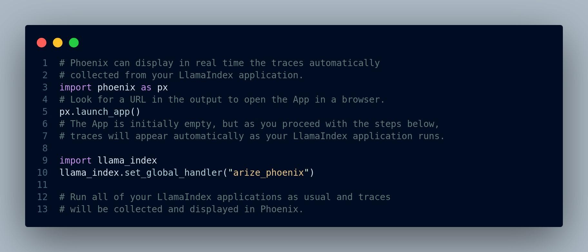{width="4.857076771653543in"
height="2.093017279090114in"}

> Figure 5.5: Phoenix integration with LlamaIndex RAG applications
>
> When we run queries, we can see the traces in real time in the Phoenix
> UI. Figure 5.6 illustrates the Phoenix UI for a RAG application.
>
> 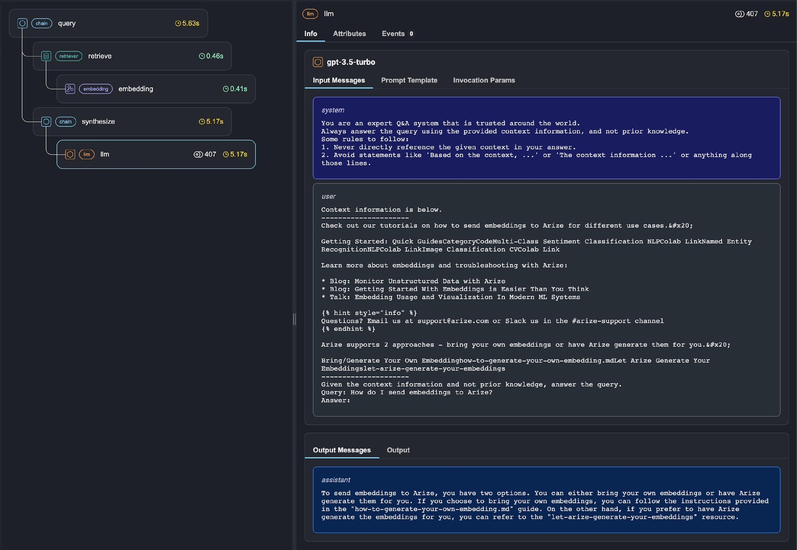{width="4.856912729658792in"
> height="3.359212598425197in"}
>
> Figure 5.6: Phoenix UI that shows traces of queries in real time.
>
> A complete example of tracing a LlamaIndex RAG application using
> Phoenix is available at this link.
>
> **5.3 HoneyHive Integration with LlamaIndex**
>
> HoneyHive is a framework that can be used to test and evaluate,
> monitor and debug LLM applications. It can be seamlessly integrated as
> displayed in Figure 5.7 into LlamaIndex applications.
>
> The HoneyHive dashaboard looks like Figure 5.8 below:

5.3HoneyHiveIntegrationwithLlamaIndex

{width="4.857076771653543in"
height="1.4858814523184602in"}

> Figure 5.7: HoneyHive integration with LlamaIndex

{width="4.857031933508312in"
height="2.549229002624672in"}

> Figure 5.8: HoneyHive dashboard
>
> For a complete guide, see this tutorial.
>
> Other observability tools we can use include Truera, databricks, and
> Elastic observability among many other tools that are available.

6.  **Ending Note**

> In concluding our journey through the pages of "**A Practical Approach
> to Retrieval Augmented Generation Systems**," we hope you have gained
> valuable insights into the world of Retrieval-Augmented Generation. As
> the landscape of AI continues to evolve, RAG systems present an
> exciting intersection of retrieval and generation technologies, with
> immense potential across a multitude of industries and applications.
> With each chapter, we've delved deeper into the core principles,
> strategies, and techniques that underpin the development and
> implementation of RAG systems.
>
> Remember that the field of AI is dynamic and ever-changing. While this
> book has aimed to provide a comprehensive understanding of RAG, new
> developments and possibilities are always on the horizon. We encourage
> you to continue exploring, experimenting, and innovating in the realm
> of Retrieval-Augmented Generation. Your journey doesn't end here; it's
> just the beginning.
>
> Thank you for joining us on this transformative adventure into the
> heart of AI's future.
>
> **6.1 Acknowledgements**
>
> We would like to express our gratitude to the teams behind LlamaIndex,
>
> LangChain, and Haystack for their invaluable contributions to the
> field of Retrieval-Augmented Generation (RAG). Their comprehensive
> documentations and tutorials have been instrumental in our journey,
> allowing us to learn from their expertise and leverage the fascinating
> tools they have built.
>
> **References**

Lewis, Patrick, Ethan Perez, Aleksandra Piktus, Fabio Petroni, Vladimir

Karpukhin, Naman Goyal, Heinrich Küttler, et al. 2020. "Retrieval-

> Augmented Generation for Knowledge-Intensive Nlp Tasks." *Advances in
> Neural Information Processing Systems* 33: 9459--74.
>
> Liu, Nelson F, Kevin Lin, John Hewitt, Ashwin Paranjape, Michele
> Bevilacqua, Fabio Petroni, and Percy Liang. 2023. "Lost in the Middle:
> How Language Models Use Long Contexts." *arXiv Preprint
> arXiv:2307.03172*.
>
> Liu, Ye, Kazuma Hashimoto, Yingbo Zhou, Semih Yavuz, Caiming Xiong,
> and
>
> Philip S Yu. 2021. "Dense Hierarchical Retrieval for Open-Domain
> Question Answering." *arXiv Preprint arXiv:2110.15439*.
>
> Ma, Xinbei, Yeyun Gong, Pengcheng He, Hai Zhao, and Nan Duan. 2023.
> "Query Rewriting for Retrieval-Augmented Large Language Models."
> *arXiv Preprint arXiv:2305.14283*.
>
> Roeder, Luke Metz, Geoffrey, and Durk Kingma. 2021. "On Linear
> Identifiability of Learned Representations." *arXiv Preprint
> arXiv:2007.00810*.

Zhao, Wayne Xin, Jing Liu, Ruiyang Ren, and Ji-Rong Wen. 2022. "Dense
Text Retrieval Based on Pretrained Language Models: A Survey." *arXiv
Preprint arXiv:2211.14876*.

> Zheng, Lianmin, Wei-Lin Chiang, Ying Sheng, Siyuan Zhuang, Zhanghao
> Wu, Yonghao Zhuang, Zi Lin, et al. 2023. "Judging LLM-as-a-Judge with
> MTBench and Chatbot Arena." *arXiv Preprint arXiv:2306.05685*.

121
